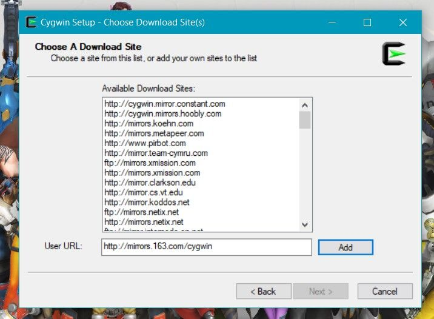
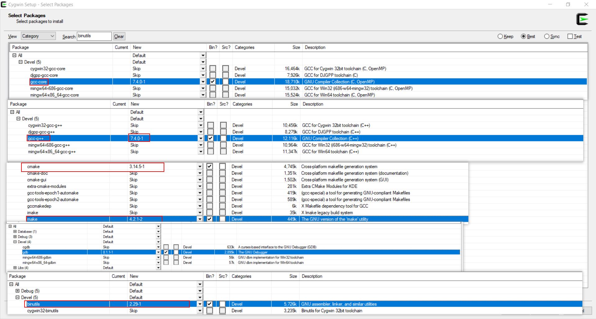
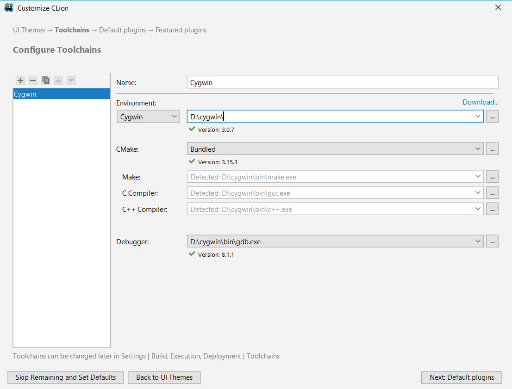

:::warning
一步到位cygwin！
:::
<!-- more -->
Clion下载安装不用我说  
去<a href="https://cygwin.com/install.html">官网</a>下载一个包，1.7M很小,打开，一路下一步，到这一步的时候填入网易的镜像源`http://mirrors.163.com/cygwin`,add，下一步。

  
继续下一步，安装模块是最重要的一步，我们只用基本的GCC写写C/c++，依次搜索  
gcc-core，gcc-g++，make，gdb，binutils，cmake。详细操作看下图。
   

  

之后无脑下一步。  
安完之后进Clion
- 进入设置 Build, Execution, Deployment -> Toolchians
- 点击添加， Environment处选择Cygwin，然后选择刚才安装的路径

  
大功告成~  
参考资料

- <a href="https://blog.csdn.net/amoscn/article/details/88656010">clion以及cygwin的安装与配置</a>