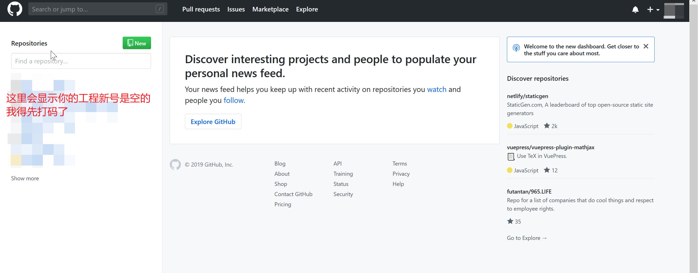
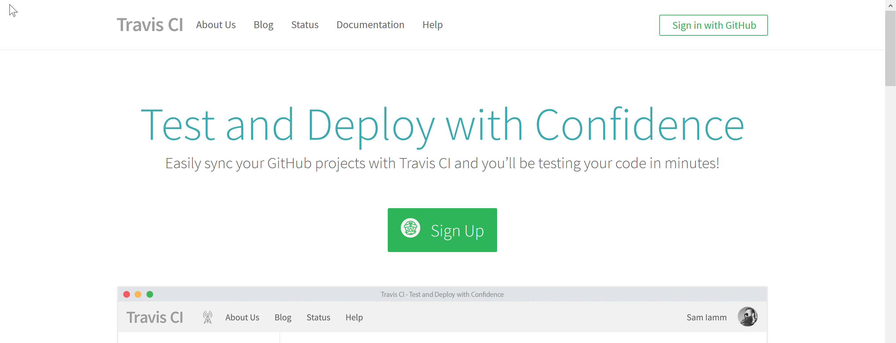
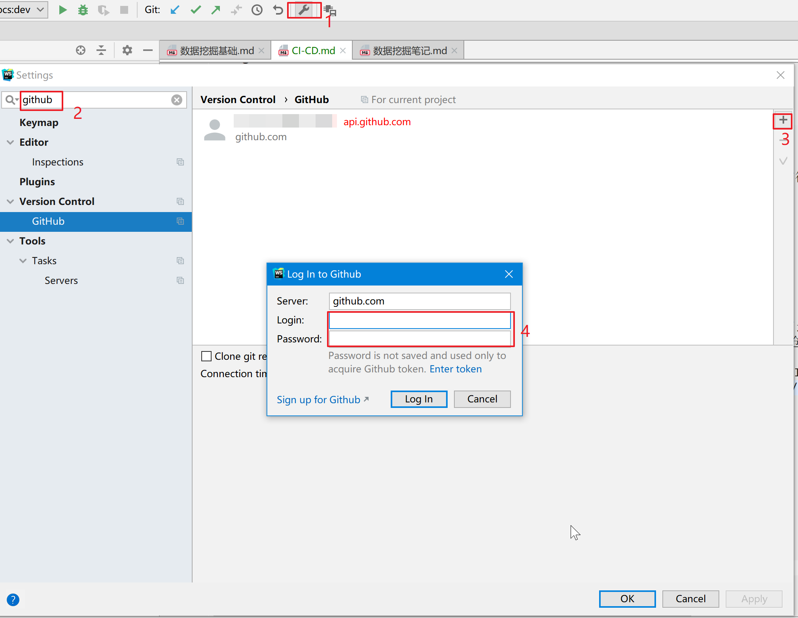
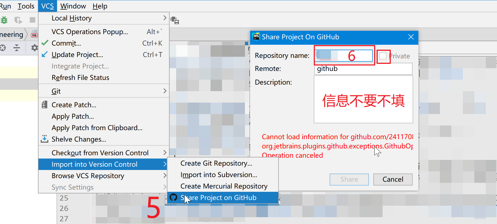
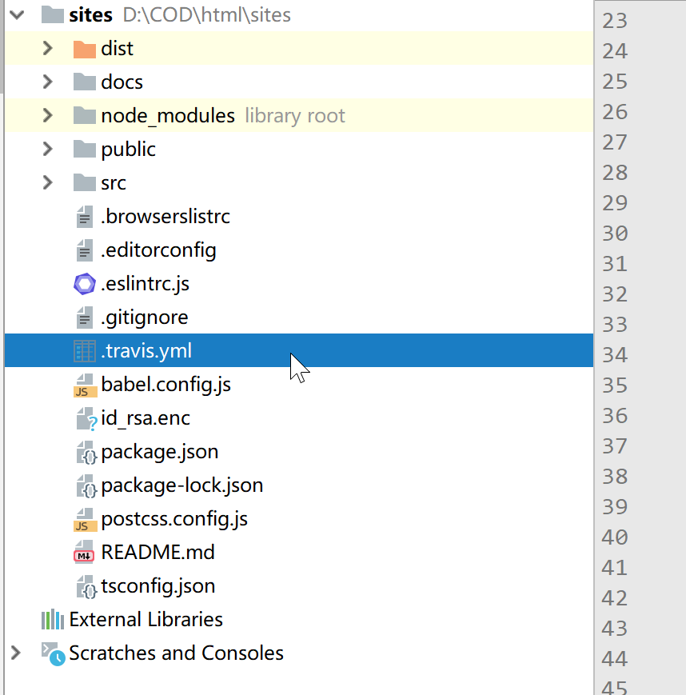
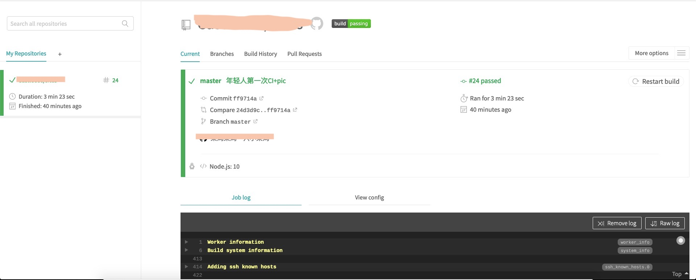

## travisCI
### 概念
<a href='https://www.redhat.com/zh/topics/devops/what-is-ci-cd'>看这里</a>,CI工具有很多，不过我不是devops，用的也很少，这里因为博客一直是写在vuepress上
<br/>每次发布提交的流程：npm build->提交到git->然后使用ftp传到blog目录下。<br/>
每次都这样很麻烦，而且必须攒攒一大块更新才发，有了CI就方便多了。<br/>
常用工具:
- <a href='https://about.gitlab.com/product/continuous-integration/'>GitLabCI</a>
    - 标准企业级CI/CD,不过需要gitlab，后面再学现在用不到
- <a href='https://circleci.com/'>CircleCI</a>
    - 对github支持很友好的CI，而且功能很强支持自定义的CI，如果有更高的需求可以试一下
- <a href='https://travis-ci.org/'>travisCI</a>
    - 我所使用的CI
- <a href='https://jenkins.io/'>jenkins</a>
    - 重量级的CI，java写的插件丰富。不过我好像也用不到
    
工具选择上我的需要是我提交代码之后让他不用再本机上就能自动build，然后复制到我服务器的blog目录下。<br/>
travisCI已经完全满足我的需求，对公有仓库免费，私有收费。因为是博客也没什么好隐藏的，直接把仓库弄成公有的。<br/>
### 代码之外的配置
假设你现在有一个本地的(vuepress)工程并且受git控制，你的发布流程应该和我是差不多的。要使用CI接下来要做的这么几件事
- 注册一个<a href="https://github.com/">Github</a>账号,并使用账号登录<a href='https://travis-ci.org/'>travisCI</a>
- 通过webstorm在Github创建你的工程
- 添加文件，让travisCI监听该repo
在这里点击右上角登陆，按照提示注册一个账号，登进来应该是这样的。
<div align=center ></div> 
然后进入CircleCI再sing in with Github
<div align=center ></div> 
在webstorm打开本地工程，配置一下github
<div align=center ></div> 
<div align=center ></div> 
我的已经发布过了所以会报错，没发布过的不会报错不要紧。别点private。<br/>
一会就发布完了，现在登陆github和travisCI会发现自己多了工程。<br/>
这时候试一下能不能正常的push，pull，commit。如果不能，在github的sshkey管理中<a href="https://blog.csdn.net/fenghuibian/article/details/73350890">添加公钥</a>
然后工程根目录下新建一个空的`.travis.yml`文件，commit，push<br/>
<div align=center ></div> 
在travisCI中打开监听，然后点进去
<div align=center ></div> 
这时候我们已经完成了代码托管，travisCI监听，当你push到GitHub，travisCI就会自动按照`.travis.yml`的规则给你构建。
接下来我们就要自定义规则和推送到服务器
### 自定义规则
`.travis.yml`有默认的语法和选项，不过我们要配置一下才能适应自己的工程。

```yaml
language: #node_js#使用node环境
node_js: #node大版本
- '10'
branchs: #监听哪个分支
  only:
  - master
addons: #额外的嘱咐，添加下面的ip可以第一次登录不需要你输入yes
  ssh_known_hosts:
  - 你的.服务.器的.地址
before_install: #这个先不要管他怎么来的
- openssl aes-256-cbc -K $encrypted_xxxxxxxx_key -iv $encrypted_xxxxxxxx_iv
  -in id_rsa.enc -out ~/.ssh/id_rsa -d
- chmod -R 600 ~/.ssh/id_rsa #注意改权限
script: #你平时怎么build的
- npm run docs:build
notifications: #邮件提醒，太他妈人性化了
  email:
    recipients:
    - xxxxxx@qq.com
    on_success: always
    on_failure: always
after_success: #构建成功后的动作
- chmod -R 600 ~/.ssh/id_rsa#权限
- scp -o StrictHostKeyChecking=no -v -r docs/.vuepress/dist/* travis@你的.服务.器的.地址:/你的/博客目录 #一会着重讲解scp命令，先不说

```
需要其他语句自己去查，阮一峰的blog和官网上有<br/>


先试一下这个脚本看看监听构建成功不
```yaml

language: node_js#使用node环境
node_js:
- '10'
branchs:
  only:
  - master
addons:
  ssh_known_hosts:
  - 你的.服务.器的.地址
script:
- npm run docs:build
notifications:
  email:
    recipients:
    - xxxxxx@qq.com
    on_success: always
    on_failure: always
after_success:
- ls docs/.vuepress/dist

```
把这个复制到你的yyy里，过几分钟（监听有延迟）刷新travisCI那个页面应该就出日志了，最后应该给passing了就可以了。
<div align=center ></div> 


现在我们已经可以提交到git之后自己build了，但是我们需要上传到自己服务器。前面可能很好做，下面会有坑。
### 上传到服务器指定目录
<h3>登陆原理</h3>

mv和cp是在本机上操作文件，scp是用ssh连接远程传输文件，上传必定要登陆，但是在自动化构建过程中不允许交互，
ssh和scp都需要<a href='https://blog.csdn.net/mmd0308/article/details/73825953'>免密登陆</a>。 <br/><br/>
传统免密登陆过程`ssh-keygen`互相交换公钥，放到`authorized_keys` 中，客户端发起连接请求时，服务器发送一个字符串给客户端，
客户端用本地的私钥对字符串进行加密然后发送给服务器，服务器将收到的加密字符串用公钥解密，如果能解密成功就登陆成功。
下次登陆直接`ssh username@ip`就可以了。 <br/> <br/> 但是我们无法控制travis的主机，自然就无法交换，
况且这也是不安全的暴露在公网上。这时候就需要让Travis伪装成一个受信的客户端去连接。也就是我们
需要有一对公钥/私钥对，公钥已经保存在我们的Linux服务器中，私钥保存在某个Travis能访问到的地方，在必要的时候
用这个私钥去连接服务器，这里我们可以把私钥放在Git代码仓库中，但是直接把私钥放代码中不安全，
所以Travis提供了对私钥进行加密的功能，我们可以把私钥加密之后放在代码仓库，在登陆的时候Travis解密该私钥用于连接。
<h3>服务器操作</h3>

公钥私钥是成对的，直接在服务器上操作就可以。我们要做的：
- 新建用户，改权限
- 服务器生成公钥和私钥
- 将公钥添加进`authorized_keys` 中
- 私钥用`两个特殊字符串`加密放到`reponsity`的`id_rsa.enc`中让travis可以通过保存在网站后台的`两个特殊字符串`拿到私钥
- 在脚本中测试能不能免密登陆
- 上传文件

1. 新建用户，修改权限
```js
先看
```
2. b
## 参考资料
- travis-ci的
  - <a href='https://blog.csdn.net/nahancy/article/details/79059135'>Linux安全之SSH 密钥创建及密钥登录</a>
  - <a href='https://juejin.im/post/5a9e1a5751882555712bd8e1'>Travis-CI自动化测试并部署至自己的CentOS服务器</a>这篇好
  - <a href='https://blog.csdn.net/u014374031/article/details/80268514'>travis自动化部署续篇</a>
  - <a href='http://www.ruanyifeng.com/blog/2017/12/travis_ci_tutorial.html'>持续集成服务 Travis CI 教程</a>阮一峰的
  - <a href='https://blog.gunxueqiu.site/2018/06/02/2018-06-02-travis%E8%87%AA%E5%8A%A8%E9%83%A8%E7%BD%B2%E9%98%BF%E9%87%8C%E4%BA%91/'>travis阿里云自动部署</a>
  - <a href='https://juejin.im/post/5c9b3934f265da60d429046d'>用 Travis CI 打造大前端持续集成和自动化部署</a>
  - <a href='没有脑子:-）'>丢失的智力</a>
- gitlab-ci的
    - 咕咕咕咕咕～
<Valine></Valine>
