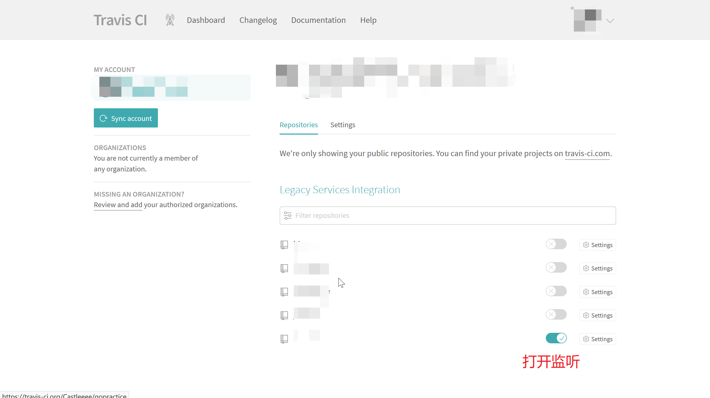
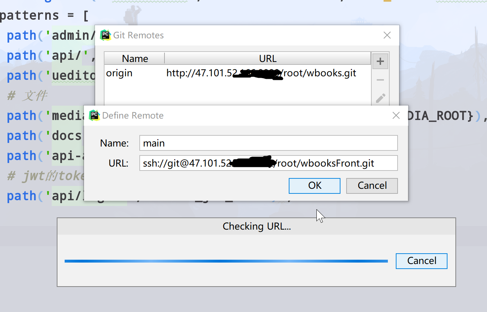

## travisCI
### 概念
<a href='https://www.redhat.com/zh/topics/devops/what-is-ci-cd'>看这里</a>,CI工具有很多，不过我不是devops，用的也很少，这里因为博客一直是写在vuepress上
<br/>每次发布提交的流程：npm build->提交到git->然后使用ftp传到blog目录下。<br/>
每次都这样很麻烦，而且必须攒攒一大块更新才发，有了CI就方便多了。<br/>
常用工具:
- <a href='https://about.gitlab.com/product/continuous-integration/'>GitLabCI</a>
    - 标准企业级CI/CD,不过需要gitlab，后面再学现在用不到
- <a href='https://circleci.com/'>CircleCI</a>
    - 对github支持很友好的CI，而且功能很强支持自定义的CI，如果有更高的需求可以试一下
- <a href='https://travis-ci.org/'>travisCI</a>
    - 我所使用的CI
- <a href='https://jenkins.io/'>jenkins</a>
    - 重量级的CI，java写的插件丰富。不过我好像也用不到
    
工具选择上我的需要是我提交代码之后让他不用再本机上就能自动build，然后复制到我服务器的blog目录下。<br/>
travisCI已经完全满足我的需求，对公有仓库免费，私有收费。因为是博客也没什么好隐藏的，直接把仓库弄成公有的。<br/>
### 代码之外的配置
假设你现在有一个本地的(vuepress)工程并且受git控制，你的发布流程应该和我是差不多的。要使用CI接下来要做的这么几件事
- 注册一个<a href="https://github.com/">Github</a>账号,并使用账号登录<a href='https://travis-ci.org/'>travisCI</a>
- 通过webstorm在Github创建你的工程
- 添加文件，让travisCI监听该repo

在这里点击右上角登陆，按照提示注册一个账号，登进来应该是这样的。
<div align=center ></div> 
然后进入CircleCI再sing in with Github
<div align=center ></div> 
在webstorm打开本地工程，配置一下github
<div align=center ></div> 
<div align=center ></div> 
我的已经发布过了所以会报错，没发布过的不会报错不要紧。别点private。<br/>
一会就发布完了，现在登陆github和travisCI会发现自己多了工程。<br/>
这时候试一下能不能正常的push，pull，commit。如果不能，在github的sshkey管理中<a href="https://blog.csdn.net/fenghuibian/article/details/73350890">添加公钥</a>
然后工程根目录下新建一个空的`.travis.yml`文件，commit，push<br/>
<div align=center ></div> 
在travisCI中打开监听，然后点进去
<div align=center ></div> 
这时候我们已经完成了代码托管，travisCI监听，当你push到GitHub，travisCI就会自动按照`.travis.yml`的规则给你构建。
接下来我们就要自定义规则和推送到服务器
### 自定义规则
`.travis.yml`有默认的语法和选项，不过我们要配置一下才能适应自己的工程。

```yaml
language: #node_js#使用node环境
node_js: #node大版本
- '10'
branchs: #监听哪个分支
  only:
  - master
addons: #额外的嘱咐，添加下面的ip可以第一次登录不需要你输入yes
  ssh_known_hosts:
  - 你的.服务.器的.地址
before_install: #这个先不要管他怎么来的
- openssl aes-256-cbc -K $encrypted_xxxxxxxx_key -iv $encrypted_xxxxxxxx_iv
  -in id_rsa.enc -out ~/.ssh/id_rsa -d
- chmod -R 600 ~/.ssh/id_rsa #注意改权限
script: #你平时怎么build的
- npm run docs:build
notifications: #邮件提醒，太他妈人性化了
  email:
    recipients:
    - xxxxxx@qq.com
    on_success: always
    on_failure: always
after_success: #构建成功后的动作
- chmod -R 600 ~/.ssh/id_rsa#权限
- scp -o StrictHostKeyChecking=no -v -r docs/.vuepress/dist/* travis@你的.服务.器的.地址:/你的/博客目录 #一会着重讲解scp命令，先不说

```
需要其他语句自己去查，阮一峰的blog和官网上有<br/>


先试一下这个脚本看看监听构建成功不
```yaml

language: node_js#使用node环境
node_js:
- '10'
branchs:
  only:
  - master
addons:
  ssh_known_hosts:
  - 你的.服务.器的.地址
script:
- npm run docs:build
notifications:
  email:
    recipients:
    - xxxxxx@qq.com
    on_success: always
    on_failure: always
after_success:
- ls docs/.vuepress/dist

```
把这个复制到你的`.travis.yml`里，过几分钟（监听有延迟）刷新travisCI那个页面应该就出日志了，最后应该给passing了就可以了。
<div align=center ></div> 

现在我们已经可以提交到git之后自己build了，但是我们需要上传到自己服务器。前面可能很好做，下面会有坑。
### 上传到服务器指定目录

<h3>登陆原理</h3>

mv和cp是在本机上操作文件，scp是用ssh连接远程传输文件，上传必定要登陆，但是在自动化构建过程中不允许交互，
ssh和scp都需要<a href='https://blog.csdn.net/mmd0308/article/details/73825953'>免密登陆</a>。 <br/><br/>
传统免密登陆过程`ssh-keygen`互相交换公钥，放到`authorized_keys` 中，客户端发起连接请求时，服务器发送一个字符串给客户端，
客户端用本地的私钥对字符串进行加密然后发送给服务器，服务器将收到的加密字符串用公钥解密，如果能解密成功就登陆成功。
下次登陆直接`ssh username@ip`就可以了。 <br/> <br/> 但是我们无法控制travis的主机，自然就无法交换，
况且这也是不安全的暴露在公网上。这时候就需要让Travis伪装成一个受信的客户端去连接。也就是我们
需要有一对公钥/私钥对，公钥已经保存在我们的Linux服务器中，私钥保存在某个Travis能访问到的地方，在必要的时候
用这个私钥去连接服务器，这里我们可以把私钥放在Git代码仓库中，但是直接把私钥放代码中不安全，
所以Travis提供了对私钥进行加密的功能，我们可以把私钥加密之后放在代码仓库，在登陆的时候Travis解密该私钥用于连接。
<h3>服务器操作</h3>

公钥私钥是成对的，直接在服务器上操作就可以。我们要做的：
- 新建用户，改权限
- 服务器生成公钥和私钥
- 将公钥添加进`authorized_keys` 中
- 私钥用`两个特殊字符串`加密放到`repository`的`id_rsa.enc`中让travis可以通过保存在网站后台的`两个特殊字符串`拿到私钥
- 在脚本中测试能不能免密登陆
- 上传文件

1. 新建用户，修改权限
```shell
#新建用户
useradd travis
#修改密码,按照提示设置密码。
passwd travis
#为用户添加添加权限
vim /etc/sudoers
#找到#Allow root to run any commands anywhere这一段注释，在下面新增一行：

travis  ALL=(ALL)   ALL
#切换到travis用户
su travis
```

2. 在travis用户下，～目录生成rsa密钥对，passphase留空
<div align=center ></div> 
更改ssh文件夹的权限，.ssh目录设置为700权限，.ssh目录下面的所有文件设置为600权限

```shell
chmod -R 700 ~/.ssh/

chmod 600 ~/.ssh/*

#看一下改成功了没
ls -al

ls ~/.ssh/ -al

总用量 28
drwx------  2 travis travis 4096 4月   4 16:15 .
drwx------ 11 travis travis 4096 4月   4 16:21 ..
-rw-------  1 travis travis  412 4月   4 16:12 authorized_keys
-rw-------  1 travis travis  135 4月   3 18:41 config
-rw-------  1 travis travis 1679 4月   3 18:28 id_rsa
-rw-------  1 travis travis  412 4月   3 18:28 id_rsa.pub
-rw-------  1 travis travis 1372 4月   3 20:11 known_hosts

```

3. 在～/.ssh目录下把公钥添加进信任列表`authorized_keys`里面

```shell
cd .ssh/
#将公钥内容输出到authorized_keys中
cat id_rsa.pub >> authorized_keys
cat authorized_keys 
```
这样我们就能以travis用户身份用私钥登陆服务器了<br/>
测试一下能否免密登陆
```shell
cd ~/.ssh

vim config

#config文件中的内容

Host test
HostName 你的.服务.器的.地址
#登陆的用户名
User travis
IdentitiesOnly yes
#登陆使用的密钥
IdentityFile ~/.ssh/id_rsa

#config文件中的内容结束，下面回到shell

#一定要更该权限
chmod -R 600 config 
chmod -R 600 authorized_keys 

#测试
ssh test
```

<div align=center ></div> 


接下来我们要把加密的私钥`id_rsa.enc`放到`repository`

4. 安装rvm->ruby->gem->travis客户端工具，真够麻烦的，为了用这个工具必须用gem和ruby
```
#安装rvm
curl -sSL https://get.rvm.io | bash -s stable
#测试一下
rvm version
#rvm 1.29.3 (master) by Michal Papis, Piotr Kuczynski, Wayne E. Seguin [https://rvm.io]

#安装ruby，我看的博客上不成功换了root，我的成功了
rvm install ruby
#测试一下

ruby --version
#ruby 2.6.0p0 (2018-12-25 revision 66547) [x86_64-linux]

gem
#RubyGems is a sophisticated package manager for Ruby.  This is a
#basic help message containing pointers to more information.
#
#  Usage:
#    gem -h/--help
#    gem -v/--version
#    gem comma....(输出太长了不写

#查看gem的源
gem sources -l
# *** CURRENT SOURCES ***


# 啥也没有，添加一个国内源
gem sources --add https://gems.ruby-china.org/ --remove https://rubygems.org/
gem sources -l

# *** CURRENT SOURCES ***
# https://rubygems.org/

```

rvm安完了我们来安装和配置travis客户端，客户端走的git服务，不用担心泄露
```
# 安装客户端，没权限就用root
gem install travis

# 完事看一下能用吗
travis
# Usage: travis COMMAND ...
# 
# Available commands:
#   accoout....
```


5. 在travis用户下从git拉下你的`repository`，放在～目录下 `git clone xxxx.git`<br/>

进入你刚下载的repo里面(现在你的目录应该是～/你的repo)

```shell
travis login
# We need your GitHub login to identify you.
# This information will not be sent to Travis CI, only to api.github.com.
# The password will not be displayed.
# 
# Try running with --github-token or --auto if you dont want to enter your password anyway.
# 
# Username: 241****18@qq.com
# Password for 241****18@qq.com: ******
# Successfully logged in as Ca****le

travis encrypt-file ~/.ssh/id_rsa --add

# 让你填yes你就填，不要乱按以免生成一些奇怪的文件

```

运行完就已经生成好了id_rsa.enc，并且你的`.travis.yml`已经被更改了
它会自动添上,手动chmod一下，然后把 *自动添加的2* 前面的`\` 去掉，`~\/.ssh/id_rsa -d`->`~/.ssh/id_rsa -d`(不去掉可能会找不到目录等等的奇怪问题)
```yaml
...

before_install: 
- openssl aes-256-cbc -K $encrypted_xxxxxxxx_key -iv $encrypted_xxxxxxxx_iv # 自动添加的1
  -in id_rsa.enc -out ~\/.ssh/id_rsa -d # 自动添加的2
- chmod -R 600 ~/.ssh/id_rsa # 注意改权限

...
```

解释下解密命令中 -in 和 -out 参数:

- -in 参数指定待解密的文件，位于仓库的根目录(Travis执行任务时会先把代码拉到Travis自己的服务器上，并进入仓库更目录)
- -out 参数指定解密后的密钥存放在Travis服务器的~/.ssh/id_rsa，如果你的后面需要的话可以取这个路径，我看到网上有的SSH登陆方式用到了这个文件

<small>-----from掘金listener</small>

<br/>之后把这两个文件添加进git，commit，push。
:::tip
git提交信息最好每次都不同，这样travis容易检测会更快构建
:::

6. 使用<a href='http://www.runoob.com/linux/linux-comm-scp.html'>scp命令</a>免密登陆传输文件。先测试下密钥对能正常使用不<br/>
构建成功后先使用ssh看能登陆不
```yaml
...
after_success: #构建成功后的动作
- chmod -R 600 ~/.ssh/id_rsa#权限
- ssh travis@你的.服务.器的.地址 -o StrictHostKeyChecking=no -i ~/.ssh/id_rsa
...
```
等待自动构建一次，这时候ssh应该不会输出任何日志才对，如果要你输入密码，说明密钥没登陆成功

<div align=center ></div> 


如果要求输入密码的话那么你需要重新生成密钥对，重新加密，然后添加到git commit push<br/>
如果ssh登陆成功了，将ssh替换成scp命令，你可以在本机上先把scp命令写好，确保这条命令能从目录A传送文件到远程目录B，中间输入密码没关系，因为没有私钥。<br/>
然后将`.travis.yaml`的ssh替换成scp。

```yaml
...
after_success: #构建成功后的动作
- chmod -R 600 ~/.ssh/id_rsa#权限
- scp -o StrictHostKeyChecking=no -v -r docs/.vuepress/dist/* travis@你的.服务.器的.地址:/你的/博客目录 #一会着重讲解scp命令，先不说
...
```
提交上去试试就可以了。,**千万别忘了加`chmod -R 600 ~/.ssh/id_rsa`**<br/>
ssh命令别忘了删掉，我在做的时候先ssh然后scp一块用发现scp需要输入密码，ssh不需要。

<div align=center ></div> 

遇到这种情况就再重新生成密钥对。

:::warning 
- nginx读取文件夹内的静态文件，如果该文件夹被删除，然后重新上传了一个同名文件夹，有时会报403，最好不要动。
<br/>替换掉文件夹里的静态文件就可以了。
- rvm默认是不启用的，gem和ruby不能直接在命令行中使用。使用`source ~/.bash_profile`激活当前ssh窗口的rvm在当前的session可以使用。也就是关闭了窗口重新启动想要使用travis工具就要运行这个命令
:::

### 奖励
打开`travis这个工程的页面`，有个小绿标，点一下复制`那个网址`

<div align=center ></div> 

在你的项目的（不是vuepress的）`README.md`里面第一行最加入

```markdown
[](travis这个工程的页面地址)
```

之后你的repo上会出现一个passing的小绿标
像这样:

<div align=center ></div> 

爽到～


## gitea

### 安装
直接docker省时省力简单。  
```
docker run -d --name=gitea -p 2222:22 -p 8000:3000 -v $PWD/giteastore:/data gitea/gitea:latest
```
我在~目录下运行的，所以直接把/data映射到了~/giteastore。8000是外部访问端口，相当于访问内部的3000，就是主要页面，2222是ssh，用作ssh传输repo的。  
按完之后访问public address:8000 就可以看到首页了  

<div align=center ></div>

点登陆或者注册第一次会有个设置向导，能设置的设置一下，集的smtp要带端口号465，QQ邮箱的密码在网页版qq邮箱账户中开启smtp和pop3之后获取授权码作为密码而不是单纯用密码，推荐sqlite备份好备份  

### 自定义  

<br/>
自定义包括自定义配置->自定义html页面->在idea中使用。  <br/>

我只放我改动的配置,目录在`~/giteastore/gitea/conf/app.ini`。  <br/>

`APP_NAME = 年轻人的代码库`<br/>
这是显示在首页上最大的文字和html标签上面的文字<br/>
`SSH_DOMAIN       = 47.101.52.xxx`<br/>
显示在ssh的地址 *ssh://git@47.101.52.xxx:2222/root/wbooks.git* <br/>
`ROOT_URL         = http://git.ooowl.fun/`<br/>
HTTP传输的域名或地址，我直接分了个二级域名所以没加端口 *http://git.ooowl.fun/root/wbooks.git* <br/>
`SSH_PORT         = 2222`<br/>
ssh传输时的端口<br/>
`DOMAIN           = git.ooowl.fun`<br/>
主域名<br/>
`HOST    = smtp.qq.com:465`<br/>
qq的smtp地址，别忘了端口<br/>

-------------------

其实不仅能自定义html页面，啥都可以自定义。  
- 进入容器中，输入 $GITEA_CUSTOM一般没被脚本改动的就指向/data被映射到外面(/giteastore)去了.
- 这个目录/gitea文件夹下面有些文件,自带的不用管。
- 文件使用的是<a href="https://github.com/go-gitea/gitea">gitea的repo</a>里默认的.比如我想改动首页(在templates/home.tmpl)，我就在这repo下载templates文件夹，改动完home.tmpl把这个文件夹放到gitea文件夹下，读取的时候就优先读取本地的templates，就生效了
- 不用全下载整个repo想改哪个改完对应的放到目录下重启docker就生效
- <a href="https://docs.gitea.io/zh-cn/">官方文档</a>给出了支持的UI以及更多信息
<br/>
放一张我的首页
<div align=center ></div>

---------------------
在idea中，使用这个东西要先设置。顶上的工具栏->VCS->git->remotes添加。然后add，commit，push不能直接githubshare，也不能添加账户，只能在push的时候输入账号密码。
<div align=center ></div>
:::tip
一开始总是验证失败 ，后来发现除了pycharm其他的海龟或者gitbash都可以。  
把时设置->git里的ssh从native改为build-in就好了，应该是pycharm自带的ssh问题。
:::
应该能正常push，pull，clone了，简单的团队协作应该还不错，除了CI没有之外其他的没什么了。
### 备份
备份非常见简单，昨天一个群里讨论这个事来着，我拿这个做了个实验。  
- 首先把正在运行的gitea容器停下(因为两个容器不能同时写一个文件夹)
- ***docker run -d --name=gitea -p 2300:22 -p 8100:3000 -v $PWD/giteastore/code:/data --name TEST  gitea/gitea***
	- 重新运行了一个容器，挂载已有的外部data文件夹，访问8100
	- 完整的还原了回来数据也没丢，如果重新改了端口记得改配置和域名。
<br/>
这样只要这个文件夹不丢所有东西就都有，可以写个shell备份。

## GitLabCI

### 有时间再看
Gitlab吃内存太疯狂了8G才够看，工具又重，不是很想弄。最近找到了一个Gitea。一个开源的github项目，原先有个类似的项目Gogs，但是作者不想让别人维护，只允许自己管控整个项目，导致处理速度太慢然后一些人不满意又创立了gitea  


## 参考资料
- travis-ci的
  - <a href='https://blog.csdn.net/nahancy/article/details/79059135'>Linux安全之SSH 密钥创建及密钥登录</a>
  - <a href='https://juejin.im/post/5a9e1a5751882555712bd8e1'>Travis-CI自动化测试并部署至自己的CentOS服务器</a>这篇好
  - <a href='https://blog.csdn.net/u014374031/article/details/80268514'>travis自动化部署续篇</a>
  - <a href='http://www.ruanyifeng.com/blog/2017/12/travis_ci_tutorial.html'>持续集成服务 Travis CI 教程</a>阮一峰的
  - <a href='https://blog.gunxueqiu.site/2018/06/02/2018-06-02-travis%E8%87%AA%E5%8A%A8%E9%83%A8%E7%BD%B2%E9%98%BF%E9%87%8C%E4%BA%91/'>travis阿里云自动部署</a>
  - <a href='https://juejin.im/post/5c9b3934f265da60d429046d'>用 Travis CI 打造大前端持续集成和自动化部署</a>
  - <a href='没有脑子:-）'>丢失的智力</a>
- gitlab-ci的
    - 咕咕咕咕咕～
<Valine></Valine>
