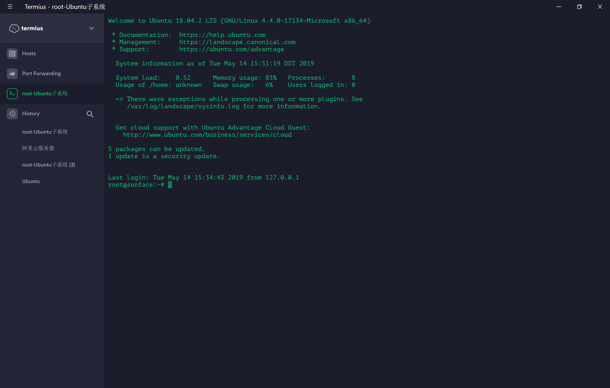

## 安装
MS商店直接就能安装，简单无脑。  
安装完之后第一次使用会等待一段时间，有长有短根据你机器配置来的。等待足够长时间之后就会让你设置用户名和密码，先填写一个，记住这个不要忘了。  
在你没有动root用户名之前，这个最小子系统的root密码每次开机都会重置一个随机密码，直到你输入命令
```
su passwd
```
然后就会让你输入一次当前用户名密码，两次root(UNIX)密码,这样就成功的设置了root密码，别给忘了，很麻烦。
## 配置ssh
设置完用户名和密码之后我们来设置ssh，windows的cmd很难用而且还有不停的提示音耳朵简直爆炸  
设置ssh之后就可以使用外部的Termius，xshell，putty连接啦。  
- 顺手更新下阿里云软件源  
备份
```
sudo cp /etc/apt/sources.list /etc/apt/sources.list.bak
```
编辑
```
sudo vim /etc/apt/sources.list
```
把所有内容注释掉，把下面这些地址粘贴进去
<details>
  <summary><B><I style="cursor:pointer; color: #0e5870">Click to See More</I></B></summary>

```
deb http://mirrors.aliyun.com/ubuntu/ bionic main restricted universe multiverse

deb-src http://mirrors.aliyun.com/ubuntu/ bionic main restricted universe multiverse

deb http://mirrors.aliyun.com/ubuntu/ bionic-security main restricted universe multiverse

deb-src http://mirrors.aliyun.com/ubuntu/ bionic-security main restricted universe multiverse

deb http://mirrors.aliyun.com/ubuntu/ bionic-updates main restricted universe multiverse

deb-src http://mirrors.aliyun.com/ubuntu/ bionic-updates main restricted universe multiverse

deb http://mirrors.aliyun.com/ubuntu/ bionic-backports main restricted universe multiverse

deb-src http://mirrors.aliyun.com/ubuntu/ bionic-backports main restricted universe multiverse

deb http://mirrors.aliyun.com/ubuntu/ bionic-proposed main restricted universe multiverse

deb-src http://mirrors.aliyun.com/ubuntu/ bionic-proposed main restricted universe multiverse
```

</details>

保存退出，然后更新apt
```
sudo apt-get update
sudo apt-get upgrade
```

- 重装自带的ssh  
自带的可能不稳定，重新装一下就好了

```
sudo apt-get remove openssh-server
sudo apt-get install openssh-server
```
- 编辑sshd_config文件,允许用户连接  
```
sudo vim /etc/ssh/sshd_config
```
`Port 23`端口最好不要用22，可能和windows冲突  
`PasswordAuthentication yes`允许用户名密码登录
`PermitRootLogin yes`允许root登录
`PubkeyAuthentication no`不校验公钥
- 重启ssh服务
不能用systemctl,因为init进程pid并不是1
```
sudo service ssh restart
```
- 测试一下  
cmd输入命令
```
ssh  -o StrictHostKeyChecking=no root@127.0.0.1
```
然后会让你输入密码，能登陆进去就成功了。ssh配置就完了    
在xshell中和termius中设置好就可以用了🎉
- 开机启动
每次开机都要先启动一下Ubuntu才能进行ssh，作为一个懒人，当然要用脚本了。  
WSL貌似很早就支持后台驻留进程，非常方便，只有一个init和sshd进程占资源也很少  
root编辑
```
sudo vim /etc/init.wsl
```
写入并保存
```
#! /bin/sh
/etc/init.d/cron $1
/etc/init.d/ssh $1
/etc/init.d/supervisor $1
```
之后我们就可以通过sudo /etc/init.wsl [start|stop|restart]停止启动我们的服务，但是还需要root密码  
编辑`sudo vim /etc/sudoers`添加
```
%sudo ALL=NOPASSWD: /etc/init.wsl
```
linux部分大功告成！  
在windows下新建一个文本文档，写入下面内容，保存为随便一个名字后缀 **.vbs**文件
```
Set ws = CreateObject("Wscript.Shell")
ws.run "ubuntu1804 run sudo /etc/init.wsl start", vbhide
```
扔到开机自启文件夹   
`[C:\Users\你当前的用户\AppData\Roaming\Microsoft\Windows\Start Menu\Programs\Startup]`里就会开机自启   
重启开机直接连接试试。
:::tip
可以在windows控制面板->程序->更改或关闭windows设置->适用于windows的最小linux子系统  
控制是否启用系统中的该功能，如果不启用就不会开始init进程也不会耗电。
:::

## 注意事项

**文件读写**  
<br/>
windows下的磁盘文件都挂载到了/mnt，盘符对应win的盘符，不过外置驱动器是不会自动挂载的  

**Docker**   
<br/>
docker本身是深入系统服务的软件，开启docker必须要访问windows上面的docker进程。  
但是既然这样为什么不直接使用windows上的docker呢？还不会有性能损耗。  
Docker无法在win10家庭版运行，使用toolbox可以试试不过我一个surface可以，但没必要。  
<br/>
**服务管理**   
<br/>

:::danger
不能使用systemctl,因为init进程pid并不是1。这个本质上是windows开起了一个进程通过MINGW64运行linux命令，所以系统的最高进程和普通的linux不一样，无法电泳systemctl。  
建议使用service
:::

**密钥**   
<br/>
密钥和Windows中的密钥匙不互通的，ssh-keygen会生成一个新的存储在WSL的~/.ssh里面。  
软件使用密钥的时候(git)要注意。
<br/>

<div align=center ><br/>完成之后</div>

## 参考

<a href='https://unix.stackexchange.com/questions/229124/how-do-i-run-the-ssh-command-to-set-stricthostkeychecking-no'>ssh登录免验证</a>  
<a href='https://zhuanlan.zhihu.com/p/47733615'>WSL开机启动ssh</a>  
<a href='https://blog.csdn.net/zhangjiahao14/article/details/80554616'>Ubuntu修改阿里源</a>   
<a href='https://blog.csdn.net/raoweijian/article/details/65661302 '>WSL配置ssh</a>   


<Valine></Valine>
