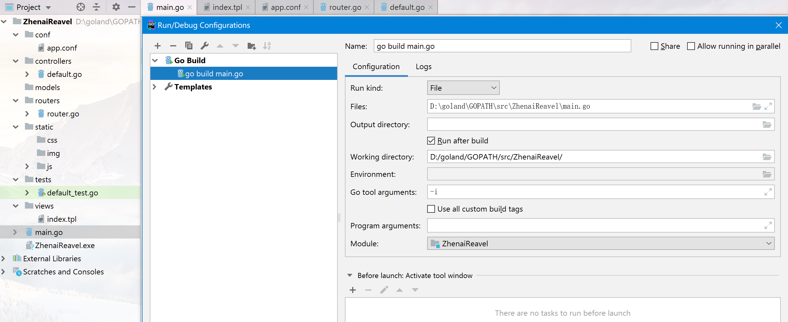

:::warning 技术选型
虽然beego的性能很强，但是处理静态文件的能力却一般，有大佬分析是因为没有做缓存，相较于nginx差了一些。推荐用来开发前后分离的项目
:::

<!-- more -->
## 安装
结合着学的vue和vux，iview,还有<a href="/blog/distribute/分布式爬虫代码梳理.html">分布式爬虫</a>拿下来的数据，我想构建一个前端页面展示搜索这些数据，用beego读取筛选然后用vue和iview展示 
安装还和其他包一样下载源码包，放到src下引入就可以了。手动创建工程很麻烦，有bee，go get 就能下载。*之后需要把gopath/bin和gobin(没有就自己指定一个并加入环境变量*并且需要把git加入环境变量
保证在cmd可以直接调用bee和git。之后就可以用了
 
## 命令和目录结构
经典的mvc
      

  目录结构看也能看出来各个包是干啥的。
  
 看一下bee的命令`bee+`(打对号的是用的最多的
- `version`     打印版本号✔
- `migrate`     Runs database migrations
- `api`+`name`         生成后端服务工程模板✔
- `bale`        Transforms non-Go files to Go source files
- `fix`         兼容性修复，适配更高版本的beego
- `dlv`         Start a debugging session using Delve
- `dockerize`   将你的beego生成一个dockerfile
- `generate`    生成源代码
- `hprose`      Creates an RPC application based on Hprose and Beego frameworks
- `new`+`name`         生成web工程模板✔
- `pack`        Compresses a Beego application into a single file
- `rs`          Run customized scripts
- `run`         本地开发者模式运行✔
- `server`      生产模式开始监听指定端口✔

web和API模板差别还挺大的。
## 配置文件
<h3>系统配置</h3>

config下面有app.conf,一开始的三个变量应该都认识。 
配置文件中可以启用模式比如

>[dev] 
httpport = 8080 
[prod] 
httpport = 8080 
[test] 
httpport = 8080 

<h3>应用配置</h3>

## 路由和视图
路由文件routers/router.go 
>func init(){ 
beego.Router("/路由", &controllers.MainController{跳转的结构体指针}) 
}

上面的路由代表的是访问MainController默认访问Get方法
<Valine></Valine>