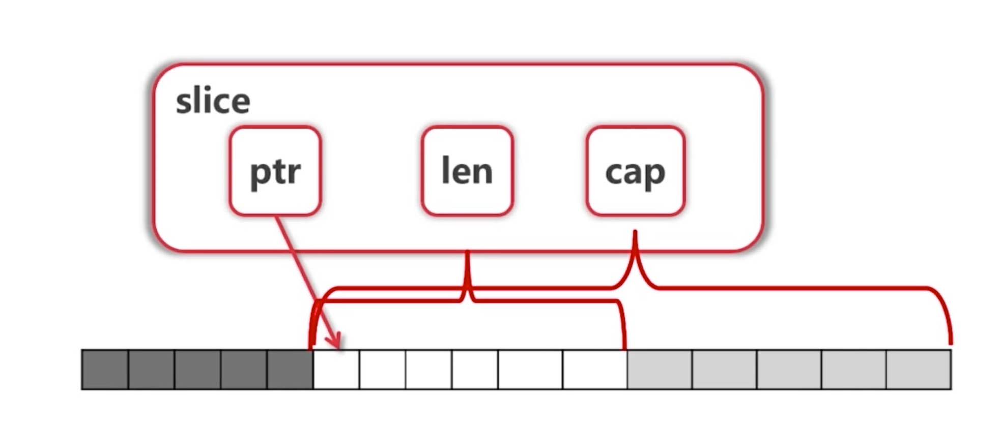

<div align= center><h1>GO 🐳</h1></div>

## 包和环境
- go所有的文件都是package(和java很像)，独立运行的一定要有*main函数*并且package必须为 main!
- 不用的变量和包不要定义和引入，会直接报错!
- 注释双斜线//和/* */
- 函数和结构后面必须紧跟{


      func A{
        ...
      }


- 引入要用字符串


      import (
           xx "fmt"//别名
           . "io/ioutil"//省略调用
      )

- fmt包在<a href='http://www.cnblogs.com/golove/p/3286303.html'>这里</a>
- <a href='https://studygolang.com/articles/10523'>环境包管理</a>

## 命令

在命令行或终端输入go即可查看所有支持的命令

Go常用命令简介:

- go get：获取远程包（需 提前安装 git或hg）
- go run：直接运行程序
- go build：测试编译，检查是否有编译错误
- go fmt：格式化源码（部分IDE在保存时自动调用）
- go install：编译包文件并编译整个程序
- go test：运行测试文件
- go doc：查看文档（CHM手册）<br/>
内置关键字:

|break      |  default          | func   |     interface     |   select|
| ---- |:---:|:---:|:---:| -----:|
|case      |    defer          |    go    |       map       |        struct|
|chan        |  else          |      goto  |     package   |     switch|
|const        | fallthrough  |  if          |   range     |        type|
|continue  | for     |             import |   return     |        var|

顺序:
内置包,自定义包,常量,全局非内置变量,全局内置变量,结构体,接口,main
## 变量
变量的定义都是var name type 名字在前，类型在后。有确定的初值(c和java中式不确定的)，int默认0，string默认为""空
可以var a,b int =2,3
<br/>
占位符由fmt提供，看<a href="https://studygolang.com/articles/2644">这里</a>
<br/>类型不是强制的，基本数据类型可以直接var a =2 自动判断<br/>
初次定义直接可以var d,e,f,g = 1,"ss",true,5或者d,e,f,g := 1,"ss",true,5<br/>
包内变量(不在一个函数体结构体内的变量)必须要用var a = xx,不能用:但仍然是不强制指定类型
:::tip 包内变量
go 中没有全局变量一说，只有包内变量，在本包内起作用
:::
### 类型
基本类型有

| 类型      | 含义          |
| ------------- | -----:|
|bool                |true,false处置默认为false|
|string       |字符串，初值是""空,|
|[u]int[8,16,32,64]       |初值为0，加u是无符号整数，不加是有符号整数，后面的数字可以直接规定长度，不填直接根据系统字长规定没有long，longlong等|
|uintptr             |是一种无符号的整数类型，没有指定具体的bit大小但是足以容纳指针。 uintptr类型只有在底层编程是才需要，特别是Go语言和C语言函数库或操作系统接口相交互的地方。|
|byte             |8个bit的一子节|
|rune | Unicode 字符类型，和 int32 类型等价，通常用于表示一个 Unicode 字符。rune 和 int32 可以互换使用|
|float[32,64]             |不能表示0！|
|complex[64,128]         |用i=√￣-1表示 3+4i就是个复数|
| <a href='https://studygolang.com/articles/9506'>nil</a>|一个特殊的值，代表无，零值。一般用作判断有没有出错if err !=nil {...}如果出错就。。。|

:::warning 转换
其他语言有默认的类型转换，但是golang只有强制类型转换！<br/>
int、uint和uintptr是不同类型的兄弟类型。其中int和int32也是 不同的类型， 即使int的大小也是32bit，在需要将int当作int32类型的地方需要一个显式 的类型转换操作，反之亦然
:::
需要传入什么类型的就要强制类型转换成什么类型的在传入，显式声名了的变量返回值不能直接赋予，要进行强制类型转换才能复制<br/>代码
```go
func trangle(){
    var a,b int =3,4
    var c int
    c =int(math.Sqrt(float64(a*a+b*b)))
    fmt.Println(c)
}
```
这里，c式int型的，但是Sqrt返回的是float，强制类型转换一次才能复制！<br/>
Sqrt(x float64 )float64 接受 float64 返回float64 ，ab的平方和返回的是int型，先转换成float64才能传入！
### 常量const
用const定义的变量不可更改，可以不声名类型，系统会自动判断并*替换文本*，需要int就认为是int需要float就说是folat
如果c要进行赋值操作那么一定要之前定义c的类型
```go
func consta(){
    const a,b  =3,4
    //等价于
    const(
    a,b=3,4
    filename="abc.txt"
    )
    var  c int
    c =int(math.Sqrt(a*a+b*b))
    fmt.Println(c)
```
### 枚举iota
自增的枚举
代码
```go
func ConstsandEnum(){
    const(
        a =iota
        b
        c
        _
        d
    )
    const(
        a =0
        b//也是0
        c =1
        d//也是1
        e//也是1
        )
    fmt.Println(a,b,c,d)
}
```
从0开始自增，_可以直接跳过
结果0 1 2 4
<br/>
小技巧自增出bit,iota可参与表达式
```go
func ConstsandEnum(){
    const(
        b =1<<(10*iota)左移两个二进制位变成了1，1024 。。。
        kb
        mb
        gb
    )
    fmt.Println(a,b,c,d)
}
```
### 条件分支
if不需要括号,可以进行赋值,但作用域只在if的block中。
```go
func testif(){

    if contents,err:=ioutil.ReadFile("a.txt");err!=nil{
        fmt.Println(err)
    }else{
        fmt.Println(string(contents))
    }
    //另一种方法
    var content,errors=ioutil.ReadFile("a.txt")
    if  errors!=nil{
        fmt.Println(errors)
    }else{
        fmt.Println(content)
    }

}
```
switch的分支语句会自动break，如果需要执行后不退出，那么就需要加fallthrough
```go
func testswitch(a,b int,op string) int {
    fmt.Println(a,b,op)
    var result int
    switch op {
    case "+":
        result=a+b
    case "-":
        result=a-b
        fallthrough
    default:
        fmt.Println(a,b,"unknow operator")
    }
    //也可以这样
    switch {
    case op=="+":
        result=a+b
    case op=="-":
        result=a-b
        fallthrough
    default:
        fmt.Println(a,b,"unknow operator")
    }
    return result
}
```
### 循环for
for 初始条件;递增条件;结束条件{<br/>
  。。。<br/>
}<br/>
三个条件可以省略，只有一个条件的时候默认为结束体条件for x {...}，如果全省略直接for{...}是个死循环
<br/>
```go
func testfor(n int) string {

    result:=""
    for ;n>0;n/=2{
        lsb:=n%2
        result=strconv.Itoa(lsb)+result
    }
    return result

}
```

三个语法都可以配合标签使用，
标签名区分大小写，若定义但不使用会造成编译错误，
Break与continue配合标签可用于多层循环的跳出，goto则是直接跳转(不稳定)

## 函数
func关键字<br/>
命名规范和其它语言一样，参数必须要声名类型，返回值可以有多个，可以直接起名，return默认啥也不返回，如果返回的名字在函数内定义过了，return就可以直接返回
:::tip
经常把panic和err配合把错误传递到外面
:::
```go
func functest(a,b int) (q,r int){
    q=a/b
    r=a%b
    return
}
func functest2(a,b int) (int,int){
    q:=a/b
    r:=a%b
    return q,r
}

```
函数的结果参数函数体内都能有函数，可以在函数参数里搞一个匿名函数

```go
func apply(op func(int, int) int,a,b int) int{
    p:=reflect.ValueOf(op).Pointer()
    opName:=runtime.FuncForPC(p).Name()//反射来一下
    fmt.Printf("Calling function %s with args"+ "(%d,%d)", opName,a,b)
    return op(a,b)
}

func pow (a,b int ) int {
    return int(math.Pow(float64(a),float64(b)))
}
...
fmt.Println(apply(pow,a,b))
//也可匿名函数
fmt.Println(apply(func(a int,b int)int{return int(math.Pow(float64(a),float64(b)))},a,b))
```
### defer
即使函数发生严重错误也会执行<br/>
支持匿名函数的调用<br/>
常用于资源清理、文件关闭、解锁以及记录时间等操作<br/>
通过与匿名函数配合可在return之后修改函数计算结果<br/>
如果函数体内某个变量作为defer时匿名函数的参数，则在定义defer<br/>
时即已经获得了拷贝，否则则是引用某个变量的地址<br/>
Go 没有异常机制，但有 panic/recover 模式来处理错误<br/>
Panic 可以在任何地方引发，但recover只有在defer调用的函数中有效<br/>
:::danger defer 执行顺序
defer是先压栈后执行的，for a:=0;a<10;a++{fmt.Println(a)}打印出来是987654321
:::
## 指针
go的指针不能加减
- &a拿到指针
- *pointa拿到值
```go
func pointertester(){
    a:=3
    pointa:=&a
    fmt.Println(*pointa)
}
```
:::danger STRONG DANGER
GO语言传参只有值传递!更改外部变量需要指针传入<br/>
:::
自定义的类型默认封装为指针类型，func a (cache Cache)直接传就行
<br>也可以自定义封装为指针类型还是值类型
## 容器
### 数组
var可以不用赋值会使用初值<br/>
定义用:=定义的时候必须要有初值，和多少个元素<br/>
array3:=[...]int{1,2,3}自己不想数的时候用省略号
<br/>
```go
    var array1 [5]int
    arrar2:=[3]int{1,2,3}
    array3:=[...]int{1,2,3}
    var grid[4][5]bool//四行五列
```
遍历的方法
```go
    for i:=0;i<len(array3);i++{
        fmt.Println(array3[i])
    }
    //只要值的写法
    for i:=range array3{
        fmt.Println(i)
    }
    //下标和值都要
    for i,v:=range array3 {
        fmt.Println(i, v)
    }
    //只要值
    for _,v:=range array3{
        fmt.Println(v)
    }
```
list是值类型传递。函数内改变不影响外界(需要使用*指针&引用*)，[5]int和[3]int不是一个类型！go不喜欢直接使用数组🤔
<br/>
### Slice(切片)
a:=[...]int{0,1,2,3,4,5}(这玩意只是个语法糖，编译器只是帮你数好了，而不是动态的，你带定义完了是相当于a [6]int的)<br/>
a[3:4]同样是有头没尾
:::warning
slice实际上是对列表的一个视图(view)对他的改变会影响到原数组，他没有实体。
:::
slice上面可以再次slice
<h4>reslice会出现一个情况</h4>

```go
    a:=[...]int{0,1,2,3,4,5,6,7,8}
    fmt.Println(a)
    s1:=a[2:6]
    s2:=a[3:5]
    fmt.Println(s1,s2,s2[4])
```

结果
```go
[0 1 2 3 4 5 6 7 8]
[2 3 4 5] [3 4]
panic: runtime error: index out of range

goroutine 1 [running]:
main.main()
	D:/COD/go/helloworld/pointer.go:45 +0x701
```
发现了吗，通过slice(view)可以取出本应该溢出的值，而直接下标取就会溢出<br/>
为什么呢🙄<br/>
slice由三部分组成
<br>
- ptr-首指针<br/>
- len-长度<br/>
- capacity-容量<br/>

<div align= center></div>

你直接拿的时候超过了长度不允许，而re slice的时候实际上是在(capacity)原数组的上面再切片就拿到了
但是不可向前扩展👀因为capacity只有后面的容量，超过这个容量也会报溢出<br/>
- 对这个切片进行添加元素的时候超过了capacity的大小，系统会重新分配一个匿名数组给这个视图，原来的底层数组不变，如果引用没了，原数组就会被回收(引用计数)

<h4>操作</h4>

s=append(list or slice, 要添加的东西)要用一个新的来接收这个新slice<br/>
声明一个未指定长度的数组var a []int有初值nil没有长度直接往里填值他的slice的时候capacity的扩展是按照平方增加的
<br>利用make建立一个slice----make([]int,x,y)数组类型，slice的长度，capacity的长度初值全为0
<br/>
copy(s2,s1)会把s1的元素加到s2中去如果2是空的且长于1，就会产生前几个元素是1的而后面的是0
<br/>
s2=append(s2[:2],s2[4:]...)去除了下标为3的元素重新赋值给s2<br>(这里append后面接受一个可变参数，用 *序列...* 可以直接把序列的每个元素传入)
<br/>
:::tip 查看类型
fmt.Println(reflect.TypeOf(sn[1:3]))<br>
fmt.Printf("%T",sn)
:::

### map映射类型

- 类似其它语言中的哈希表或字典，以key-value形式存储数据，是无序的
- Map查找比线性搜索快很多，但比使用索引访问数据的类型慢很多
- 超出容量时会自动扩容，但尽量提供一个合理的初始值
- 使用len()获取元素个数
- 键值对不存在时自动添加，使用delete()删除某键值对
- map使用哈希表，必须可以比较相等
- 除了slice，map，function的内建类型都可以作为key
- Struct类型如果不包含上述字段，也可作为key
三种声名方式:
```go
    func maptest(){
        m:=map[string]string{
            "a":"A",
            "b":"B",
            "c":"C",
        }
        m1:=make(map[string]int)
        var m2 map[int]string
        fmt.Println(m,m1,m2)
        for k,v := range m{
            fmt.Println(k,v)
        }
    }

```
也使用range遍历<br/>
只有一个值默认为k，俩就是k v,_,v是只拿值<br/>
通过m["xx"]拿值，可以直接看这个K是否在字典里（删除也在）如下
```go
    if name,exist:=m["k"];exist{
        fmt.Println(name)
    }else {
        fmt.Println(exist)
    }
    delete(m,"a")//删除a:A
```
:::danger default
如果键没有的话也能拿出来，是个定义类型的初值string就是""
:::
判断字符传是否存在于另一个字符串<a href="https://studygolang.com/articles/15886?fr=sidebar">这里</a><br/>
### 运算符优先级

- ^     &nbsp;&nbsp;&nbsp; !                                               （一元运算符）
- &nbsp;*    &nbsp;&nbsp;&nbsp;   /   &nbsp;&nbsp;&nbsp; %   &nbsp;&nbsp;&nbsp; << &nbsp;&nbsp;&nbsp;   >> &nbsp;&nbsp;&nbsp;   &      &^
- &nbsp;-   &nbsp;&nbsp;&nbsp;  |   &nbsp;&nbsp;&nbsp;   ^     &nbsp; &nbsp;&nbsp;                          （二元运算符）
- == &nbsp;&nbsp;&nbsp;  !=  &nbsp;&nbsp;&nbsp; <  &nbsp;&nbsp;&nbsp;  <= &nbsp;&nbsp;&nbsp;   >=  &nbsp;&nbsp;&nbsp;  >
- <-     &nbsp;&nbsp;&nbsp;（专门用于channel）
- &&
- ||<br/>

++ 与 -- 是作为语句而并不是作为表达式

### 字符串的处理

strings.Index(k,string(i))如果在就会返回位置，否则就返回-1
rune相当于char,单个字符，string和rune都是用编码表示的，可以直接和数字类型进行加减不过结果很可能变成锟斤拷
```go
func main() {
    s:="利维亚的杰日天 me！"//utf-8编码
    for v,b :=range []byte(s){
        fmt.Printf("%X",b)
        fmt.Println("|",v)
    }
    fmt.Println()
}
```
[]byte(x)返回i,b下标和字节，utf-8的编码用三个字节表示一个字符byte和int8进行转换<br/>
rune是个int32的16进制表示，可以和int32直接转换，
```go
for i,ch :=range str
```
ch就是一个rune
<h4>strings包</h4>

- Fields
- Split
- Join
- Contains
- Index
- ToLower
- ToUpper
- Trim
- TrimRight
- TrimLeft


## 面向'对象'
go语言仅支持封装，不支持继承和多态;go语言没有class，只有struct;面向接口的编程
<br/>
### 定义(struct)

```go
type treeNode struct{
    value int
    left,right *treeNode
}
```
<strong>工厂函数</strong>

```go
func createNode(value int) *treeNode{
    return &treeNode{value:value}
}
```

:::tip
这里工厂函数直接引用了函数内的treeNode指针，在静态语言中不允许但是go编译器会自己决定定义在堆还是栈上，所以直接返回完全没问题
:::

<strong>绑定函数</strong>
两种方式，推荐第一种
```go
func (node *treeNode)printv(a int)int{
    fmt.Println(node.value)
    return a
}
...
root.printv(5)
```
```go
func printv(node treeNode,a int)int{
    fmt.Println(node.value)
    return a
}
...
printv(root,5)
```
通用也是值传递，printv接受了一个node的copy，我们需要把指针直接传入像方法receiver。他就直接解析为外面的对象不需要什么花里胡哨的->*之类的。
结构过大或者想要改变外界的值就传入指针给receiver

### 封装
- 使用CamelCase
- 首字母大写Public
- 首字母小写private
<br/>每个目录一个*包*(不一定要和目录同名),main一定含有main函数(可执行入口),定义的方法一定要在同一个包内，但不一定要在同一个文件内
因为Go对导入但是未使用的包，会报编译错误。因此可以使用如下的方式。在包名称之前使用一个下划线”_”来表示。这样仍然会执行所import包中的init函数。<br>
```go
package lib1

import (
    "fmt"
    _ "lib2"
)
```
直接import "这个目录"那么相当于这个目录下的包(package)都被引入了


## 闭包
函数内返回函数就是闭包,在go中函数是一种类型，他可以被当作参数返回值变量等等。
一个函数返回一个函数的时候，是会读取外部变量的。

## 反射
强推<a href='https://studygolang.com/articles/12348?fr=sidebar'>这一篇</a>一开始可能会有点难懂，啃完之后是真的强

```go
/* author:owl date:2019/2/1 description:nil */
package main

import (
    "fmt"
    "reflect"
)
type User struct{
    Id int
    Name string
    Age int
}
func (u User )hello() {
    fmt.Println("hello")
}

func main() {
    fmt.Printf("a")
    user:=User{2,"xiaoming",15}
    info(user)

}
func info (o interface{}){
    t:=reflect.TypeOf(o)
    fmt.Println(t.Name())
    f:=reflect.ValueOf(o)

    for i:=0;i<t.NumField();i++{
        x:=t.Field(i)
        y:=f.Field(i).Interface()
        fmt.Println(x.Name,x.Type,y)
    }
    for i:=0;i<t.NumMethod();i++{
        fmt.Println(t.Method(i))
    }
}
```


## 错误处理
### panic
panic会直接把这个程序退出，推出之前执行defer，可以用recover捕获
### recover

## 接口
接口里面只有函数在定义了之后不需要在接口实现，由使用者定义是否实现。一个结构体实现了相应的函数就说他实现了对应接口，不用显示的声名。有接口就可以被调用实现鸭子类型

### 类型断言
判断一个变量的类型的时候会用到类型断言
a.(A)判断a是不是A类型，a是一个接口类型，A可以是接口类型也可以是其他的<br/>
如果A是一个具体类型，那么会判断a是不是和他一个类型的不是会panic是就拿a值，如果A是个接口，那就判断满足接口吗
:::tip
a是个nil的时候断言啥都不会成功
:::
### type的作用
看<a href="https://blog.csdn.net/hzwy23/article/details/79890778">这里</a>
定义结构体
定义接口
类型定义
类型别名
类型查询

<div align= center><h1>🐱‍💻 Let's GO</h1></div>

## 并发
go最小化了并发的开销，只有goroutine，一个轻量级的线程+协程，不设置runtime.GOMAXPROCS(4)就只会有一个核设置了就会多核高并发资源吃得很厉害不会浪费。
### goroutine
只要在函数前面加了go关键字，那么这个函数就会自动的协程并发(py进阶里面写了)，切换点IO/select，函数调用(有时)，channel，runtime.GOsched()，等待锁

### channl
### select
### 锁

<a href="">PPT</a>挺全的，我直接贴一下吧


<Valine></Valine>

