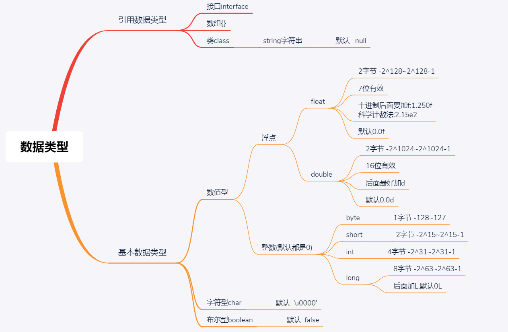
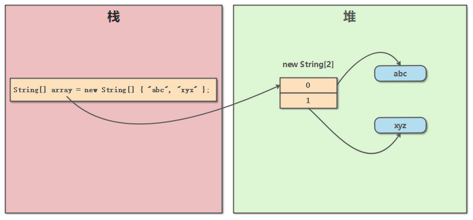

:::tip   惭愧<br/>
身为CS专业学生JAVA却没怎么学 <B style='font-size:45px'>☕️</B><br/>
语法网上到处都是，我就整理一下自己的所想所学吧<br/>

:::


<!-- more -->
其实对J2EE没什么要求，学完语法深入jvm，搞hadoop去，要写也用kotlin。

## 特性
- 概述:
  - 易学 语法与C语言和C++接近
  - 强制面向对象 Java语言提供类、接口和继承等原语，只支持的单继承，但支持接口之间的多继承，并支持类与接口之间的实现机制（关键字为implements）。
  - 分布式 基本的Java应用编程接口中有一个网络应用编程接口（java net），它提供了用于网络应用编程的类库，包括URLConnestion、Socket、Serversocket等。Java的RMI（远程方法激活）机制也是开发分布式应用的重要手段。
  - 健壮 Java的强类型机制、异常处理、垃圾的自动收集等是Java程序健壮性的重要保证。丢弃指针
  - 安全 Java通常被用在网络环境中，因此Java提供了一个安全机制以防恶意代码的攻击如：安全防范机制（类C1aa8基oader），如分配不同的名字空间以防替代本地的同名类、字节代码检查。
  - 体系结构中立 Java程序（.java文件）在Java平台上被编译为体系结构中立的字节码格式（后缀为class的文件），一次编译到处运行
  - 性能略高 相比解释型的高级脚本语言性能还可以。
  - 原生支持多线程 Thread类或其子类来创建
- 特点
  - 面向对象
  - 健壮完善
  - jvm跨平台 一次编译到处运行
  - 核心机制:JVM和GC  
   
:::tip
JVM是一个虚拟的计算机，具有指令集并使用不同的存储区域。负责执行指令，管理数据、内存、寄存器。
对于不同的平台，有不同的虚拟机。  
Java虚拟机机制屏蔽了底层运行平台的差别，实现“一次编译，到处运行”。  
C和C++需要程序员手动垃圾回收,可以快速回收,但是忘了就完蛋  
Java会开一个系统级线程自动回收**不需要也不能**干预,效率慢.
:::

配置环境前面有不说了
### JRE和JDK
JDK(Java Development Kit Java开发工具包)  
>JDK是提供给Java开发人员使用的，其中包含了java的开发工具，也包括了JRE。开发工具：编译工具(javac.exe)打包工具(jar.exe)等<br/>

JRE(Java Runtime Environment Java运行环境)  
>包括Java虚拟机(JVM Java Virtual Machine)和Java程序所需的核心类库等，如果想要运行一个开发好的Java程序，计算机中只需要安装JRE即可。
JDK的开发工具完成java程序，JRE去运行。  

### 文件
`.java`-javac.exe->`.calss`-java.exe->结果  

相关的后缀名:
- .java文件,存放源代码
- .calss文件
  - java,scala,groovy等等跨平台需要先编译成class文件,然后让jvm执行
  - class文件是一种8位字节的二进制流文件， 各个数据项按顺序紧密的从前向后排列， 相邻的项之间没有间隙， 这样可以使得class文件非常紧凑， 体积轻巧， 可以被JVM快速的加载至内存， 并且占据较少的内存空间。 我们的Java源文件， 在被编译之后， 每个类（或者接口）都单独占据一个class文件， 并且类中的所有信息都会在class文件中有相应的描述， 由于class文件很灵活， 它甚至比Java源文件有着更强的描述能力。详细信息看<a href="https://blog.csdn.net/zhangjg_blog/article/details/21486985">这里</a>
- JAR文件（Java归档，英语：Java ARchive）
  - 以ZIP格式构建,通常用于聚合大量的Java类文件、相关的元数据和资源（文本、图片等）文件到一个文件，以便分发Java平台应用软件或库
  - 可执行的JAR文件中的Manifest文件用代码Main-Class: myPrograms.MyClass指定了入口点类，注意要指明该类的路径（-cp参数将被忽略）。有些操作系统可以在点击后直接运行可执行JAR文件
- WAR文件（Web应用程序归档，英语：Web application ARchive[1]）
  - 是一种JAR文件，其中包含用来分发的JSP、Java Servlet、Java类、XML文件、标签库、静态网页（HTML和相关文件），以及构成Web应用程序的其他资源。 
  - 可能会以与JAR文件相同的方式进行数字签名，以便他人确定哪些源代码来自哪一个JAR文件

:::tip
1. 编译后产生的`.class`文件个数：有多少个类，产生多少个`.class`文件
 
2. `.class`文件命名规则：
     - 2.1普通内部类<br>
           外部类名 + $ + 内部类名 [+ $ + 内部类名 + ...]+ .class，类名之间使用符号$隔开<br>
           例如：`ClassD$ClassDd$ClassDdd.class`，这里ClassDdd是对底层的普通内部类，它的父类ClassDd，而ClassDd的父类也是最外层的外部类ClassD
     - 2.2匿名内部类<br>
           外部类名 + $ + 数字 [+ $ + 数字 + ...]+ .class，类名之间使用符号$隔开，数字根据在外部类中定义的顺序决定,例如：`ClassE$1$1.class`
 
3. 同一个`.java`文件中定义的其他非public声明的类，都遵循以上2点规范
 
4. 继承、或者接口实现，不影响编译产生的`.class`文件个数和命名规则
:::
大小写敏感
源文件名：源文件名必须和类名相同。当保存文件的时候，你应该使用类名作为文件名保存（切记 Java 是大小写敏感的），文件名的后缀为 .java。（如果文件名和类名不相同则会导致编译错误）
类名：对于所有的类来说，类名的首字母应该大写。如果类名由若干单词组成，那么每个单词的首字母应该大写，例如 MyFirstJavaClass 
程序入口固定
```java
public class Main {

    public static void main(String[] args) { //入口
        System.out.println("hello world");
	// write your code here
    }
}

```
## 语法总结
仅涉及到SE,网上有的不po过来了,不大会得不熟的放过来  
### 注释

```java
//单行

/*
 * 多行
 */

/**
 * 文档注释:文档注释允许你在程序中嵌入关于程序的信息。
 * 你可以使用 javadoc 工具软件来生成信息，并输出到HTML文件中 
 * 从javadoc 1.4之后，除第一行和最后一行外，可以省略其他行的前导星号(*)，但是一般不这么做
 */
```


java的`文档注释`由`描述性注释`和`标记部分`组成   

:::warning
文档注释只负责描述类(class)、接口(interface)、方法(method)、构造器(constructor)、成员字段(field)   
文档注释必须写在类、接口、方法、构造器、成员字段前面，而写在其他位置，比如函数内部，是无效的文档注释。
:::

<h3>描述性注释(Description)</h3>

1. 描述部分的第一行应该是一句对类、接口、方法等的简单描述，这句话最后会被javadoc工具提取并放在索引目录中,跟在**第一个句号（英文标点）之后的tab、空行或行终结符规定了第一句的结尾**  
2. 在描述段落和标记段落之间空一行，描述段落和标记段落必须分开，不能揉在一起，描述段落必须在标记段落之前
3. 每一行注释都应该跟后面描述的类、方法等保持同样距离的缩进
4. 除了普通的文本之外，描述部分可以使用：
   - HTML语法标签，例如 `<b>xxx</b>`
   - javadoc规定的特殊标签，例如 `{ @link xxx}` 。标签的语法规则是：`{@标签名 标签内容}`
   - **javadoc识别一些特殊的描述性注释,详细看<a href="https://www.runoob.com/java/ava-documentation.html">这里</a>**
  
**注意:**

> 1. 标签在有javadoc工具生成文档时会转化成特殊的内容，比如 `{ @link URL}` 标签会被转化成指向URL类的超链接
>2. 如果注释包含多段内容，段与段之间需要用 `<p>` 分隔，空行是没用的
>3. 最后结尾行 */ 和起始行不同，这里只有一个星号
>4. 为了避免一行过长影响阅读效果，务必将每行的长度限制在80个字符以内
>5. 善用javadoc工具的复制机制避免不必要的注释:  如果一个方法覆盖了父类的方法或实现了接口种的方法，那么javadoc工具会在该注释里添加指向原始方法的链接，此外如果新方法没有注释，那么javadoc会把原始方法的注释复制一份作为其注释，但是如果新方法有注释了，就不会复制了。

**风格**
1. 使用 `<code>关键字</code>` 来强调关键字，建议强调的内容有：java关键字、包名、类名、方法名、接口名、字段名、参数名等
2. 控制 `{@link xxx}` 的数量，太多的链接会使文档的可读性很差，因为读者总是跳来跳去。不要出现相同的链接，同样的链接只保留第一个；不要为java自带的内容或是常识性的内容提供链接
3. 描述一个方法时，应当只保留方法名字，不要附带方法的参数。比如有个方法是`add(Object obj)`，那么用`add`指代该方法即可，而不是`add(Object obj)`
4. 英文注释可以是短语也可以是句子。如果是`句子`，首字母要`大写`，如果是`短语`，首字母`小写`。
5. 英文注释使用`第三人称`，而不是第二人称。比如：
6. 方法的注释应该以动词或动词词组开头，因为方法是一个`动作`。
7. 当描述类、接口、方法这类的概念时，可以`不用指名`"类"、"接口"、"方法"这些词语
8. 英文使用`this`而不是`the`指代当前类，比如
9. API名应该是能够简单自我说明的，如果文档注释只是简单重复API的名称还不如没有文档，所以文档注释应该至少提供一些`额外信息`，否则干脆不要注释
10. 英文注释`避免拉丁风格的缩写`。比如使用"also knwon as"而不是"aka"， 使用"that is"或"to be specific"而不是"i.e."，使用"for example"而不是"e.g."，使用"in other words"或"namely"而不是"viz."
  

<h3>标记部分(Tag)</h3>

**标记部分跟在描述部分之后，且前面必须有一个空行间隔**
1. `@author`  作者，没有特殊格式要求，名字或组织名称都可以
2. `@version`  软件版本号（注意不是java版本号），没有特殊格式要求
3. `@param`  方法参数，格式为： `@param` 参数名称 参数描述 
    - 可以在参数描述中说明参数的类型
    - 可以在参数名称和参数描述之间添加额外的空格来对齐
    - 破折号或其他标点符号不能出现在参数描述之外的地方
4. `@return`  方法返回值，格式为： `@return` 返回值描述 ，如果方法没有返回值就不要写`@return`
5. `@deprecated` 应该告诉用户这个API被哪个新方法替代了，随后用 `@see` 标记或 `{@link}` 标记指向新
6. `@throws` （或 `@exception` ）包含方法显式抛出的检查异常(`Checked Exception`)，至于非显示抛出的其他异常(`Unchecked Exception`)，除非特别有必要，否则就别写了。一个原则就是，只记录可控的问题，对于不可控的或不可预测的问题，不要往上面写。
7. 按照如下顺序提供标记
    - `@author`（只出现在类和接口的文档中）
    - `@version`（只出现在类和接口的文档中）
    - `@param`（只出现在方法或构造器的文档中）
    - `@return`（只出现在方法中）
    - `@exception`（从java1.2之后也可以使用`@thrown`替代）
    - `@see`
    - `@since`
    - `@serial`（也可以使用`@serialField`或`@serialData`替代）
    - `@deprecated`
8. 如果有多个相同标记，也要注意顺序
   - 多个`@author`标记，应该按照`时间顺序`排列，即`原作者`应该排在`第一个`位置
   - 多个`@param`标记，应该按照`参数定义的顺序`排列
   - 多个`@exception`（或是`@thrown`）应该按照异常的`字母顺序`排列
   - 多个`@see`标记，应该按照注释的`逻辑顺序排列`，即从`最近的到最远`的，从最`具体的到最一般`的  
9. 有参数，`@param`标记必须包含，且每个对应一个参数,有返回值，`@return`标记必须包含
    

<h3>其他部分(Other)</h3>

1. **包级别**的文档注释<br/>从java1.2起允许包级别的文档注释，用以描述包信息。每个包都可以有自己的包文档注释，这些注释被写在叫`package.html`的单独文件中，并且放至于与源码(`*.java`)相同的路径下，**一定不能单独放置在其他路径。**
- `javadoc`工具按照以下流程处理`package.html`:    
    - 把主要内容复制到最终生成的`package-summary.html`文件中
    - 处理`@see`, `@since`, 或`{@link}`标记
    - 把`第一句话`复制到javadoc的索引中  
 
在包注释主要介绍一下这个包大致是做什么用的、背景信息、在使用方面需要注意的地方等等信息

2. **匿名、内部类**的文档注释  
    - javadoc不会提取内部类的文档注释，所以如果想要在最终生成的文档中包含内部类的信息，方法就是——写在外部类的文档注释里。。  


<details>
  <summary><B><I style="cursor:pointer; color: #0e5870">复杂注释的示例</I></B></summary>

```java
/**
 * Graphics is the abstract base class for all graphics contexts
 * which allow an application to draw onto components realized on
 * various devices or onto off-screen images.
 * A Graphics object encapsulates the state information needed
 * for the various rendering operations that Java supports. This
 * state information includes:
 * <ul>
 * <li>The Component to draw on
 * <li>A translation origin for rendering and clipping coordinates
 * <li>The current clip
 * <li>The current color
 * <li>The current font
 * <li>The current logical pixel operation function (XOR or Paint)
 * <li>The current XOR alternation color
 * (see <a href="#setXORMode">setXORMode</a>)
 * </ul>
 * <p>
 * Coordinates are infinitely thin and lie between the pixels of the
 * output device.
 * Operations which draw the outline of a figure operate by traversing
 * along the infinitely thin path with a pixel-sized pen that hangs
 * down and to the right of the anchor point on the path.
 * Operations which fill a figure operate by filling the interior
 * of the infinitely thin path.
 * Operations which render horizontal text render the ascending
 * portion of the characters entirely above the baseline coordinate.
 * <p>
 * Some important points to consider are that drawing a figure that
 * covers a given rectangle will occupy one extra row of pixels on
 * the right and bottom edges compared to filling a figure that is
 * bounded by that same rectangle.
 * Also, drawing a horizontal line along the same y coordinate as
 * the baseline of a line of text will draw the line entirely below
 * the text except for any descenders.
 * Both of these properties are due to the pen hanging down and to
 * the right from the path that it traverses.
 * <p>
 * All coordinates which appear as arguments to the methods of this
 * Graphics object are considered relative to the translation origin
 * of this Graphics object prior to the invocation of the method.
 * All rendering operations modify only pixels which lie within the
 * area bounded by both the current clip of the graphics context
 * and the extents of the Component used to create the Graphics object.
 * 
 * @author Sami Shaio
 * @author Arthur van Hoff
 * @version %I%, %G%
 * @since 1.0
 */
public abstract class Graphics {

    /** 
     * Draws as much of the specified image as is currently available
     * with its northwest corner at the specified coordinate (x, y).
     * This method will return immediately in all cases, even if the
     * entire image has not yet been scaled, dithered and converted
     * for the current output device.
     * <p>
     * If the current output representation is not yet complete then
     * the method will return false and the indicated 
     * {@link ImageObserver} object will be notified as the
     * conversion process progresses.
     *
     * @param img the image to be drawn
     * @param x the x-coordinate of the northwest corner
     * of the destination rectangle in pixels
     * @param y the y-coordinate of the northwest corner
     * of the destination rectangle in pixels
     * @param observer the image observer to be notified as more
     * of the image is converted. May be 
     * <code>null</code>
     * @return <code>true</code> if the image is completely 
     * loaded and was painted successfully; 
     * <code>false</code> otherwise.
     * @see Image
     * @see ImageObserver
     * @since 1.0
     */
    public abstract boolean drawImage(Image img, int x, int y, 
                                      ImageObserver observer);


    /**
     * Dispose of the system resources used by this graphics context.
     * The Graphics context cannot be used after being disposed of.
     * While the finalization process of the garbage collector will
     * also dispose of the same system resources, due to the number
     * of Graphics objects that can be created in short time frames
     * it is preferable to manually free the associated resources
     * using this method rather than to rely on a finalization
     * process which may not happen for a long period of time.
     * <p>
     * Graphics objects which are provided as arguments to the paint
     * and update methods of Components are automatically disposed
     * by the system when those methods return. Programmers should,
     * for efficiency, call the dispose method when finished using
     * a Graphics object only if it was created directly from a
     * Component or another Graphics object.
     *
     * @see #create(int, int, int, int)
     * @see #finalize()
     * @see Component#getGraphics()
     * @see Component#paint(Graphics)
     * @see Component#update(Graphics)
     * @since 1.0
     */
    public abstract void dispose();

    /**
     * Disposes of this graphics context once it is no longer 
     * referenced.
     *
     * @see #dispose()
     * @since 1.0
     */
    public void finalize() {
        dispose();
    }
}
```

</details> 

### 关键字
关键字全都小写,菜鸟上有,保留字尚未使用但是后面可能会用到.  
标识符区分大小写长度不限制,字母数字下划线,数字不开头无空格,尽量有意义  
**基本**的Java中的名称命名规范：
- `包名`:多单词组成时所有字母都小写：xxxzzz
- `类`名、`接`口名:多单词组成时，所有单词的`首字母大写`：xxxYyZzz
- `变量`名、`方法`名:多单词组成时，第一个单词首字母小写，第二个单词开始每个单词首字母大写：xxxYyVZzZ(驼峰)
- `常量`名：所有字母都`大写`。多单词时每个单词用`下划线`连接：XXX_YYY_ZZZ
  
:::warning
***int i=0;byte j=i;***  
这种错误只有在javac的时候才能发现,编译期异常
:::
### 变量内存分配
java基本的数据类型详情看<a href="https://www.runoob.com/java/java-basic-datatypes.html">菜鸟</a>大致有这么些
<div align=center ></div>


引用类型都可以用`null`作为值  


<h3>内存分配</h3>  

一般Java在内存分配时会涉及到以下区域：
- 寄存器：在程序中无法控制,在操作系统层下,自动分配
- 栈：存放基本类型的数据和对象的引用，但对象本身不存放在栈中，而是存放在堆中（new 出来的对象）
- 堆：存放用new产生的数据
- 静态域：存放在对象中用static定义的静态成员
- 常量池：存放常量
- 非RAM存储：硬盘等永久存储空间 
   
**堆**
  
　　堆内存用来存放由new创建的对象和数组。 在堆中分配的内存，由Java虚拟机的自动垃圾回收器来管理  

　　在堆中产生了一个数组或对象后，还可以 在栈中定义一个特殊的变量，让栈中这个变量的取值等于数组或对象在堆内存中的首地址，栈中的这个变量就成了数组或对象的引用变量。  引用变量就相当于是 为数组或对象起的一个名称，以后就可以在程序中使用栈中的引用变量来访问堆中的数组或对象。引用变量就相当于是为数组或者对象起的一个名称。  


**栈**  
  
　　在函数中定义的一些基本类型的变量数据和对象的引用变量都在函数的栈内存中分配。
　　当在一段代码块定义一个变量时，Java就在栈中 为这个变量分配内存空间，当该变量退出该作用域后，Java会自动释放掉为该变量所分配的内存空间，该内存空间可以立即被另作他用。栈中的数据大小和生命周期是可以确定的，当没有引用指向数据时，这个数据就会消失。  
Java的方法运行在栈中
　　引用变量也存放在栈中,引用变量是普通的变量，定义时在栈中分配，引用变量在程序运行到其作用域之外后被释放。而数组和对象本身在堆中分配，即使程序 运行到使用 new 产生数组或者对象的语句所在的代码块之外，数组和对象本身占据的内存不会被释放，数组和对象在没有引用变量指向它的时候，才变为垃圾，不能在被使用，但仍 然占据内存空间不放，在随后的一个不确定的时间被垃圾回收器收走（释放掉）。这也是 Java 比较占内存的原因。
　　实际上，栈中的变量指向堆内存中的变量，这就是Java中的指针！  

**堆和栈**  
  

堆是一个运行时数据区,类的(对象从中分配空间。这些对象通过new、newarray、 anewarray和multianewarray等指令建立，它们不需要程序代码来显式的释放。堆是由垃圾回收来负责的，堆的优势是可以动态地分配内存 大小，生存期也不必事先告诉编译器，因为它是在运行时动态分配内存的，Java的垃圾收集器会自动收走这些不再使用的数据。但缺点是，由于要在运行时动态 分配内存，存取速度较慢。  
  
栈的优势是，存取速度比堆要快，仅次于寄存器，栈数据可以共享。但缺点是，存在栈中的数据大小与生存期必须是 确定的，缺乏灵活性。栈中主要存放一些基本类型的变量数据（int, short, long, byte, float, double, boolean, char）和对象句柄(引用)。  
栈有一个很重要的特殊性，就是存在栈中的数据可以共享

```
int a = 3;
int b = 3;
```
编译器先处理int a = 3；首先它会在栈中创建一个变量为a的引用，然后查找栈中是否有3这个值，如果没找到，就将3存放进来，然后将a指向3。接着处理int b = 3；在创建完b的引用变量后，因为在栈中已经有3这个值，便将b直接指向3。这样，就出现了a与b同时均指向3的情况。

这时，如果再令 a=4；那么编译器会重新搜索栈中是否有4值，如果没有，则将4存放进来，并令a指向4；如果已经有了，则直接将a指向这个地址。因此a值的改变不会影响 到b的值。

　　要注意这种数据的共享与两个对象的引用同时指向一个对象的这种共享是不同的，因为这种情况a的修改并不会影响到b, 它是由编译器完成的，它有利于节省空间。而一个对象引用变量修改了这个对象的内部状态，会影响到另一个对象引用变量。

对于成员变量和局部变量：成员变量就是方法外部，类的内部定义的变量；局部变量就是方法或语句块内部定义的变量。局部变量必须初始化。
形式参数是局部变量，局部变量的数据存在于栈内存中。栈内存中的局部变量随着方法的消失而消失。
成员变量存储在堆中的对象里面，由垃圾回收器负责回收。 

**常量池**  
在堆中

用new String() 创建的字符串不是常量，不能在编译期就确定，所以new String() 创建的字符串不放入常量池中，它们有自己的地址空间。  
JVM对于字符串常量的"+"号连接，将程序编译期，JVM就将常量字符串的"+"连接优化为连接后的值，拿"a" + 1来说，经编译器优化后在class中就已经是a1。在编译期其字符串常量的值就确定下来.  

final只对引用的"值"(即内存地址)有效，它迫使引用只能指向初始指向的那个对象，改变它的指向会导致编译期错误。至于它所指向的对象 的变化，final是不负责的。
### String类创建为例
字面量省内存


留坑:整理

### 类型转换
 
**隐式类型转换**  

- 混合运算时,小类型会先转成大类型,反向报错<br/> `byte`,`char`,`short`->`int`->`long`->`float`->`double`
- `byte`,`char`,`short`不会相互转换,计算前会先转换成`int`
- 把其他类型和`String`直接进行+连接时,其他类型会转为`String`
- `char`和数字类型进行运算时,会先转为ascii
- 1+2+"a"最后是3a,表达式不是预转义的,而是按照优先级分别运算的  

**强制类型转换**  

```java
int k=7;
byte b=(byte)k;// 类型 变量= (类型)原变量
```


- bool不能转其他
- 大转小会损失精度
- 字符串不能直接转换为其他类型,但是基本的包装类可以转换
### 运算符
- 优先级和C++中一样
- 取模数为负无所谓,浮点取模还是浮点
- 全整数除法会舍弃小数部分
- `char`互相加减会转换为`ascii`
```
s=（short）（s+3）;//变量参与运算时候，java程序不知道具体的这个变量在做完运算后会不会查重当前变量的范围，所以会先把变量转换为一个更大长度的变量，这个例子中，short是一个短整形数据，会转化为默认的int
s+=3;//在使用扩展赋值运算符时，变量在参与运算时会把结果自强制预为当前变量的类型
```
优先级也和C一样  
**位运算符**
Java定义了位运算符，应用于整数类型(int)，长整型(long)，短整型(short)，字符型(char)，和字节型(byte)等类型。  
- 逻辑运算符用于连接布尔型表达式，在java中不可以写成`3<x<6`，应该写成`x>3&x<6`。
- `&`和`&&`的区别：
    - 单&时，左边无论真假，右边都进行运算；
    - 双&时，如果左边为真，右边参与运算，如果左边为假，那么右边不参与运算。
- `|`和`||`的区别同理，`|`表示：当左边为真，右边不参与运算,或位运算与。
- 在不需要逻辑运算两边都参与运算的时候，尽量使用`&&`和`||`
- 异或（^）与或（|）的不同之处是：当左右都为true时，结果为false。


### 数组
申请一维数组:  
`type var[]` 或 `type[] var`  
动态初始化`int a[]=new int[4];`  
静态初始化`int a[]=new int[4]{1,2,3,4}`  
`a.length`可以获取数组长度  

:::tip
- 指定数组维度
  - 为数组开辟指定大小的数组维度。
  - 如果数组元素是基础数据类型，会将每个元素设为默认值；如果是引用类型，元素值为 null。
- 不指定数组维度
  - 用花括号中的实际元素初始化数组，数组大小与元素数相同。
:::


<br/>

申请多维数组:  

`int a[][]=new int[2][3]{ { {1},{2},{3}} 1,{{1},{2},{3} } 2 } `
只初始化第一维不初始化第二维`int a[][]=[2][]`  
动态初始化`int a[][]=new int[3][2]`  
<br/>
数组对象（这里可以看成一个指针）存储在栈中。  
数组元素存储在堆中。  
如下图所示：只有当 JVM 执行 `new String[]` 时，才会在堆中开辟相应的内存区域。数组对象 array 可以视为一个指针，指向这块内存的存储地址。  
<div align=center ></div>


:::warning
>Exception in thread "main" java.lang.NullPointerException  
>	at com.company.Main.main(Main.java:50)  

注意这个错误,数组越界和空指针,经常出现
:::

当指定的数组维度是**字符**时，Java 会将其转为**整数**。如字符 a 的 ASCII 码是 97。  
综上，Java 数组的数组维度可以是**常量**、**变量**、**表达式**，只要转换为**整数**即可。  
请留意，有些编程语言则不支持这点，如 C/C++ 语言，只允许数组维度是**常量**  
数组维度并非没有**上限**的，如果数值过大，编译时会**报错**,数组过大可能会导致**栈溢出**  
Java中数组类型是一种**引用类型**。它可以作为引用，被 Java 函数作为函数入参或返回值  

## 引用参考
- https://www.cnblogs.com/itmanxgl/p/605b4b093bd8abf5b60ef65749a0857d.html
- https://zh.wikipedia.org/wiki/JAR_(%E6%96%87%E4%BB%B6%E6%A0%BC%E5%BC%8F)
- https://blog.csdn.net/zhangjg_blog/article/details/21486985
- https://www.cnblogs.com/boring09/p/4274893.html
- https://www.cnblogs.com/jing99/p/6092153.html
- https://juejin.im/post/5c88e75fe51d4520a700b9f3

<Valine></Valine>
java的src下多个package,每个package能互相通信吗,怎么引入?  
jvm的内存分配是怎么分配的,直接有一个系统线程常驻读写内存吗?  
编译产生的各级目录是什么意思?  
String str="xxx" 这个String包是哪里的,还有什么包  
1+2+"a"最后是3a,加号是怎么编译的,不会先预转义吗  
基本数据类型包放哪里?  
string args[]是干嘛的,还能在这里干嘛,怎么解析的main函数  
不同长度数组被放到同一个一维数组中怎么开辟的空间呢  
我删掉的Main.class是个什么?源码是完整的,目录是空的为什么无法构建就不能运行了  
数组作为参数的出入过程  
