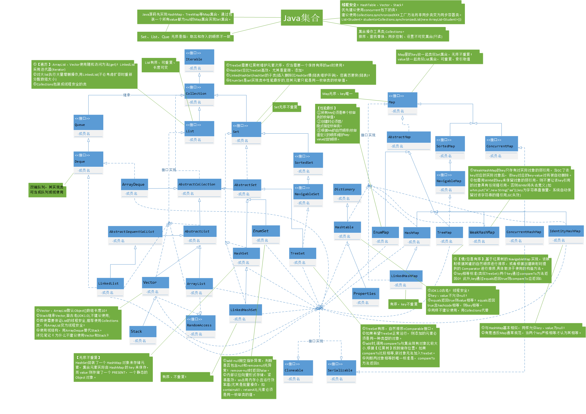

:::tip   快了快了!!<br/>
java是全世界最好的语言吗?
:::

<!-- more -->

## 异常机制
### 异常概览
编译期能捕获异常最好,但是很多错误都是在运行时暴露的  
- Error:JVM系统内部错误、资源耗尽等严重情况
- Exception：其它因编程错误或偶然的外在因素导致的一般性问题，例如：
    - 空指针访问
    - 试图读取不存在的文件
    - 网络连接中断
<div align=center >
</div>

<div align=center >
</div>

:::tip
常见的四个眼熟一下  
- 空指针
- 栈溢出
- 数组越界
- 内存不足
:::
### 异常捕获
不知道捕获什么异常的时候就直接捕获最终父类`Exception`,捕获异常越具体越好  
- addSuppressed(Throwable exception)void  
- fillInStackTrace()Throwable  
- ⭐`getcause()Throwable` 打印出错误原因  
- getLocalizedMessage()String  
- ⭐`getMessage()String` 返回这个错误的信息  
- getstackTrace()StackTraceElement[]  
- getSuppressed()Throwable[]  
- initCause(Throwable cause)Throwable  
- ⭐`printStackTrace()void` 不终止程序打印出错误栈  
- setStackTrace(StackTraceElement[]..)void   


try-cache-finally,可多错误捕获
```java
package exceptionpractice;

class A{}
public class test {
    public static void main(String args[]){
        String s0[]=new String[]{"1","2"};
        A a=null;
        try{
            System.out.print(s0[3]);
            System.out.print(a.i);//idea直接不给你运行,教程上用eclipse可以复现错误
        }catch (NullPointerException e){
                e.printStackTrace();
                System.out.print(e.getMessage());
        }catch (ArrayIndexOutOfBoundsException e){
                e.printStackTrace();
                System.out.print(e.getMessage());
        }finally {
                System.out.print("最后一定执行的!");
        }
    }
}

```
:::warning 注意  
try{}中的代码块在一次异常被捕获后,后面的代码都不会执行,多个catch能捕获可能的异常
:::
[异常列表和解释](https://www.runoob.com/java/java-exceptions.html)

### 抛出异常
函数后面加上`throw Exception`,函数内必须抛出异常,异常会向上层层传递,最后到main会直接抛给JVM这样就无法处理了  
```java
package exceptionpractice;

class B{
    int an[]=new int[2];
    public void test() throws Exception{
        System.out.print(an[3]);
    }
}


public class exception1 {
    public static void main(String args[]){
        B b=new B();
        try {
            b.test();
        }catch (Exception e){
            e.printStackTrace();
            System.out.print(e.getMessage());
        }

    }

}
```
子类重写父类的方法时，子类不能抛出比父类方法更大范围的异常
```java
package exceptionpractice;
class C {
    int an[]=new int[2];
    public void test() throws Exception{//函数声明了抛出异常但是没有抛出的没什么事情,但是在其他地方全都会被认为抛出异常
            System.out.println("xxx");
    }
}
class B extends C{

    @Override
    public void test () throws ArrayIndexOutOfBoundsException {
        //super.test();//idea里直接检测出来了,写不了
        System.out.print(an[3]);//异常只能更具体,不能范围更大
    }

}
```
当然你也可以手动抛出异常,但是throw只能抛出Throwable或其子类的异常  
自定义异常类
```java
class Test01{
    public void regeist (int num) throws MyException{
        if (num<0){
            throw new MyException("人数不能为负数",num);
        }else {
            System.out.print("登记人数"+num);
        }
    }
    public void manager(){
        try {
            regeist(-100);
        }catch (MyException e){
            System.out.print("登记失败,出错种类为"+e.getId());
        }
        System.out.print("结束");
    }
}
```
## 集合
存放在`java.util`包中,集合是用来存放引用类型的容器
- 只能存放对象,如果存放了基本数据类型会自动装箱
- 集合中存放的还是数据的引用,数据仍然被存放堆里
- 可以存放不限类型不限数量的对象
- 三大体系Map,Set,List,JDK5 之后集合可以记住对像的类型


<div align=center ></div>
[菜鸟讲的](https://www.runoob.com/java/java-collections.html)  
[廖雪峰讲的多一些](https://www.liaoxuefeng.com/wiki/1252599548343744/1265109905179456)  
[文档](https://docs.oracle.com/javase/8/docs/api/java/util/Collection.html)

collection中通用的接口  
- `add(Element e)`添加一个元素,返回bool
- `addAll(collection E)` 把一个collection添加到里面
- `clear()`清除这个collection里面的元素
- `isEmpty()`是不是空
- `iterator()`返回一个迭代器副本
- `remove(Object o)`移除某个元素
- `removeAll(Collection c)`移除c里面已有的元素
- `size()`长度
- `toArray()`返回一个数组副本

### Set
**HashSet**  
典型实现,一般提到set都是HashSet
- 无序
- 不重复
  - 插入前调用对象的`hashCode()`,根据哈希值决定存储位置
  - 即使用equals比较为True,HashCode不相等存储位置也不会一样
  - 只有equals和HashCode都相等才会判定相等,注意`String`等包装类的`HashCode`
- 不保证线程安全
- 可以存null  

继承链是`HashSet`->`set`->`Collection`  '

:::tip 注意
好像Guava是个更好的替代品,collection能学多少算多少,接下来学Guava
:::
**TreeSet**  
- 有序
  - 确保元素处在排序状态
  - 自然排序(默认)和定制排序
- 使用`compareTo`比较
  - this > obj return 1
  - this < obj return -1
  - this0 = obj return 0
- 一定要放入**类型相同**的数据,因为要比较  

自定义比较的时候需要自己实现`class type implements Comparato< classType >`  
然后重写`public int compare(type 1,type 2)`  
必须有一个无参构造,传入类型的时候用;
```java
public class TreeSetMain {
    public static void main(String args[]){
        TreeSet <Integer> tr = new TreeSet<Integer>();
        tr.add(3);
        tr.add(3);
        tr.add(new Integer(3));//为什么
        tr.add(5);
        tr.add(1);//按照自然排序

        for (Integer i:tr){
            System.out.print(i.intValue());//se
        }
        TreeSet <Person> tp=new TreeSet<Person>(new Person());
        for (int i =5;i>=0;i--){
            tp.add(new Person(i,"x"+i));//逆序放进去
        }
        for (Person p:tp){
            System.out.println(p.age+p.name);//读出来是正序
        }
    }

}
class Person implements Comparator<Person>{//按照age排序
    String name;
    int age;
    public Person(){}
    public Person(int age, String name){
        this.age=age;
        this.name=name;
    }

    @Override
    public int compare(Person o1, Person o2) {//重写这个函数
        if (o1.age > o2.age) {
            return 1;
        } else if (o1.age < o2.age) {
            return -1;
        } else if (o1.age == o2.age) {
            return 0;
        }
        return 2;//这里不应该有返回,idea会报错不让编译通过,教程上eclipse能通过
    }
}

```

### List
主要是Array  
- 是一个元素有序,可重复的集合，集合中的每个元素都有对应的顺序索引
- 允许重复元素，可以通过索引来访问指定位置的元素
- 默认按元素的添加顺序设置元素的索引
- 集合里添加了一些根据索引来操作集合元素的方法  

```java
public class ListMain {
    public static void main(String args[]){
        List <String> l = new ArrayList<String>();
        List <String> l1 = new ArrayList<String>();
        l.add("11");
        l.add("12");
        l.add("134");
        l1.add("22");
        l1.add("234");
        l.addAll(1,l);//添加自己就会把自己原先的元素再放进去一遍
        l.addAll(1,l1);
        for (String s:l){
            System.out.println(s);
        }
        l.size(); //大小
        l.set(2,"xx");// 把某下标置为xx
        l.get(3);// 拿到下标元素
        List <String>sublist=l.subList(2,4);// 有头没尾取子列
        l.indexOf("22");// 获取元素下标,没有返回-1
        l.lastIndexOf("22");// 获取元素最后一次出现的下标
    }
}
```
主要方法们
- `add(int index,String element)void`在某个位置添加元素,可以指定位置
- `set(index,xx)`把某下标置为xx
- `get(index);`拿到下标元素
- `l.subList(from,to);`有头没尾取子列
- `indexOf(o);`获取元素第一次出现下标,没有返回-1
- `lastIndexOf(o);`获取元素最后一次出现的下标
- `size()`大小

::: warning `ArrayList` 和`Vector`区别
`ArrayList` 和`Vector` 是**List 接口**的两个典型**实现**
`Vector`是一个**古老**的集合，通常建议使用`ArrayList`
`ArrayList`是**线程不安全**的，而`Vector` 是**线程安全**的
即使为保证`List` 集合线程安全，也**不推荐**使用`Vector`
:::

### Map
K-V结构
**HashMap**  
Map中的key和value都可以是**任何引用类型**的数据Map 中的**Key 不允许重复**，即同一个Map对象的任何两个Key 通过 **equals 方法**比较中返回 false  
**Map没有实现iterator接口.**  

```java

```
HashMap 和Hashtable是Map接口的两个典型实现类
::: warning 区别:
- Hashtable是一个古老的Map实现类，不建议使用
- Hashtable 是一个线程安全的Map实现，但HashMap是线程不安全的。
- Hashtable不允许使用null作为key和value，而HashMap可以  
- Hashtable同样也不能保证其中key-value对的顺序
- 判断两个Key相等的标准是：**两个Key 通过equals方法返回true，hashCode值也相等**。
- Values相等的标准是：两个Value通过equalHashMap 判断两个Values 方法返回 true
:::


**TreeMap**  
- TreeMap的Key保持有序
    - 自然排序：TreeMap的所有的Key必须实现`Comparable`接口，而且所有的Key 应该是同一个类的对象，否则将会抛出`ClasssCastException`,默认用**字典和数字**排序
    - 定制排序（了解）：创建 TreeMap时，传入一个`Comparator`对象，该对象负责对TreeMap中的所有key 进行排序。此时不需要Map的Key 实现`Comparable `接口

```java
import java.util.HashMap;
import java.util.Map;
import java.util.Set;
import java.util.TreeMap;

public class MapMain {
        public static void main(String args[]) {
            Map<String, Integer> m = new HashMap<String, Integer>();
            m.put("b", 1);
            m.put("c", 2);
            m.put("e", 9);
            m.put("k", 6);
            m.put("a", 0);
            System.out.println(m);
            System.out.print(m.get("a"));
            m.remove("k");
            System.out.println(m.containsKey("k"));
            System.out.println(m.containsValue(9));
            System.out.println(m);
            System.out.print(m.keySet());
            System.out.print(m.values());

            Map <String,String>m1=new TreeMap<String, String>();

            m1.put("sdsa","sdsa");
            m1.put("vdsa","sdsa");
            m1.put("gdsa","sdsa");
            m1.put("hdsa","sdsa");
            m1.put("pdsa","sdsa");
            System.out.println(m1);// TreeMap 是字典有序的

            for (String k:m.keySet()){//遍历方法1
                System.out.print("k is"+k+m.get(k));
            }
            Set<Map.Entry<String, Integer>> e = m.entrySet();//遍历方法2
            for (Map.Entry<String,Integer> kv:e){
                System.out.println("K:"+kv.getKey()+",v:"+kv.getValue());
            }
        }
}
```
:::danger 同步控制
留坑 等学了多线程再回来填坑
:::


### Collection
这是可以操作上面三种数据类型的工具类,一些通用的方法  

- 排序操作
  - `reverse(List)`反转List中元素的顺序
  - `shuffle(List)`对List 集合元素进行随机排序
  - `sort(List)`根据元素的自然顺序对指定 List 集合元素按升序排序
  - `sort(List，Comparator)`根据指定的 Comparator 产生的顺序对List集合元素进行排序
  - `swap(List，int，int)`将指定list集合中的i处元素和j处元素进行交换
- 查找和替换
  - `max()`可以只传入List使用自然排序,也可以传入一个Comparator,使用自定排序
  - `min()`同max
  - `int frequency(l,Obj)`返回Obj的出现频次
  - `boolean replaceAll(l,old,new)`使用新值替换所有的旧值
```java
import java.util.ArrayList;
import java.util.Collections;
import java.util.Comparator;
import java.util.List;

public class ListMain {
    public static void main(String args[]){
        List <String> l = new ArrayList<String>();
        List <String> l1 = new ArrayList<String>();
        l.add("11");
        l.add("12");
        l.add("134");
        l1.add("22");
        l1.add("234");
        l.addAll(1,l);//添加自己就会把自己原先的元素再放进去一遍
        l.addAll(1,l1);
        for (String s:l){
            System.out.println(s);
        }
        l.size(); //大小
        l.set(2,"xx");// 把某下标置为xx
        l.get(3);// 拿到下标元素
        List <String>sublist=l.subList(2,4);// 有头没尾取子列
        l.indexOf("22");// 获取元素下标,没有返回-1
        l.lastIndexOf("22");// 获取元素最后一次出现的下标

        System.out.println(l);
        Collections.reverse(l);
        System.out.println(l);
        Collections.shuffle(l);
        System.out.println(l);
        Collections.sort(l);
        System.out.println(l);
        Collections.swap(l,1,3);
        System.out.println(l);

        List<Person1> px= new ArrayList<Person1>();//为啥TreeSet需要这个就不需要?
        px.add(new Person1(5,"x"));
        px.add(new Person1(6,"g"));
        px.add(new Person1(1,"d"));
        px.add(new Person1(4,"h"));
        for (Person1 i:px){
            System.out.println(i.age);
        }
        Collections.sort(px,new Person1());
        for (Person1 i:px){
            System.out.println(i.age);
        }
        System.out.println(Collections.max(l)+"是l最大");
        System.out.println(Collections.max(px,new Person1()).age+"-"+Collections.max(px,new Person1()).name);
        System.out.println(Collections.min(px,new Person1()).age+"-"+Collections.min(px,new Person1()).name);
        System.out.println(Collections.frequency(l,"11")+"在l中出现频次");
        Collections.replaceAll(l,"11","gg");
        System.out.print(l);
    }
}
class Person1 implements Comparator<Person1> {
    int age;
    String name;
    public Person1(){}

    public Person1(int age,String name){
        this.age=age;
        this.name=name;
    }

    @Override
    public int compare(Person1 o1, Person1 o2) {
        if (o1.age > o2.age) {
            return 1;
        } else if (o1.age < o2.age) {
            return -1;
        } else if (o1.age == o2.age) {
            return 0;
        }
        return 2;//这里不应该有返回,idea会报错不让编译通过,教程上eclipse能通过
    }

}
```

|方法名|详细描述|
|:---:|:---:|
|valueOfe|传递枚举类型的Class对象和枚举常量名称给静态方法valueOf，会得到与参数匹配的枚举常量。|
|toString|得到当前枚举常量的名称。你可以通过重写这个方法来使得到的结果更易读。|
|equals()|在枚举类型中可以直接使用“==来比较两个枚举常量是否相等。Enum提供的这个equals()方法，也是直接使用==实现的。它的存在是为了在Set、List和Map中使用。注意，equals() 是不可变的。”|
hashCode|Enum实现了 hashCode0来和equals0保持一。它也是不可变的。|
getDeclaringClasse|得到枚举常量所属枚举类型的Class对象。可以用它来判断两个枚举常量是否属于同一个枚举类型。|
|name|得到当前枚举常量的名称。建议优先使用toString()|
|ordinal|得到当前枚举常量的次序。|
|compareTo|枚举类型实现了Comparable 接口，这样可以比较两个枚举常量的大小（按照声明的顺序排列）。|
|clone|枚举类型不能被 Clone,为了防止子类实现克隆方法，Enum实现了一个仅抛出CloneNotSupportedException 异常的不变Clone0。|

## Guava
谷歌开源的代替java核心类库的一个东西.  
[易百不错](https://www.yiibai.com/guava/)  


## 泛型(模板)
### 集合中的泛型
前面已经演示了.集合中的泛型会检查集合数据类型,保证数据类型一致  
Java中的泛型，只在**编译阶段有效**。在编译过程中，正确检验泛型结果后，会将泛型的相关信息**擦除**，并且在对象进入和离开方法的边界处添加类型检查和类型转换的方法。泛型信息**不会进入到运行时**阶段。
### 泛型类
参考C++里面的函数模板,定义一个泛型,之后类型可以声明变更.  
不同类型的泛型类不能互相赋值  
不指定泛型就用Object  
```java
package Enumm;

public class templateT {
    public static void main(String args[]) {
        A <Integer> a1=new A<Integer>();
        a1.SetKey(0);
        System.out.println(a1.getKey());
        A<String> a2=new A<String>();
        a2.SetKey("sadas");
        System.out.println(a2.getKey());
    }
}

class A<T>{
    private T key;
    public void SetKey(T key){
        this.key=key;
    }
    public T getKey (){
        return this.key;
    }
}
```
### 泛型方法
泛型方法，在调用之前没有固定的数据类型,在调用时，传入的参数是什么类型，就会把泛型改成什么类型,泛型函数必须要有参数,根据参数来决声明类型

```java
package Enumm;

import java.util.ArrayList;
import java.util.List;

public class templateFunction {
    public static void main(String args[]) {
        Cc <String> c=new Cc<String >();
        c.test1("xx");
        c.test2(1);
        List a=new ArrayList<Integer>();
        a.add(1);
        a.add(5);
        a.add(8);
        c.test3(a);
        Cc.ex("sdasdas");
    }
}
class Cc<E>{//类泛型和函数不一样没问题
    private E e;
    public <T> void test1(T s){//普通模板函数
        T t=s;
        System.out.println("you are using function ");
    }
    public <T> T test2(T s){//返回值模板函数
        return s;
    }
    public <T> void test3(T... s){//不定参模板函数
        for(T ss:s){
            System.out.println(ss);
        }
    }
    public static <E> E ex (E eo){
        System.out.println(eo);
        return eo;
    }
}
```

### 泛型接口
也是指定一个接口为泛型接口,如果在实现该接口的时候声明了类型就不用再声明了,如果没声明那类就成了一个泛型类
```java
package Enumm;

public class templateT {
    public static void main(String args[]) {
        B1<Integer> b1=new B1<Integer>();
        B2 b2=new B2();
        System.out.println(b1.test(5));
        System.out.println(b2.test("huhuh"));

    }
}
interface IB<T>{
    T test(T t);
}
class B1<T> implements IB<T>{
    @Override
    public T test(T t) {
        System.out.println("you are calling template class's function");
        return t;
    }
}
class B2 implements IB<String>{
    @Override
    public String test(String s) {
        System.out.println("you are calling <String> calss's function"+s);
        return s;
    }
}

```
### 泛型通配符
**作通配类型**  
这个list(collection)不确定会传入什么类型,可以先用 **?**代替,里面而已使用Object
```java
import java.util.ArrayList;
import java.util.List;

public class testlast {
    public static void main(String args[]) {
        ArrayList <String> a1= new ArrayList<String>();
        a1.add("sdas");
        a1.add("dfgfd");
        a1.add("reygh");
        T1 t1 = new T1();
        t1.Xxx(a1);
        ArrayList <Integer> a2= new ArrayList<Integer>();
        a2.add(1);
        a2.add(5);
        t1.Xxx(a2);
    }
}
class T1{
    public void Xxx(List<?> l){
        for (Object i:l) {
            System.out.println(i);
        }
    }
}
```

**子类限制通配符**  

使用 `List<? extends C> list` 这种形式，表示 list 可以引用一个 ArrayList ( 或者其它 List 的 子类 ) 的对象，这个对象包含的元素类型是 C 的子类型 ( 包含 C 本身）的一种。只允许泛型为**Person及Person子类**的引用调用

**父类限制通配符**  

使用 `List<? super C> list` 这种形式，表示 list 可以引用一个 ArrayList ( 或者其它 List 的 子类 ) 的对象，这个对象包含的元素就类型是 C 的超类型 ( 包含 C 本身 ) 的一种。只允许泛型为**Person及Person父类**的引用调用

**接口限制通配符**  

`<? extends Interface>`只有实现了interface的才能传入.  
```java
import java.util.ArrayList;
import java.util.List;


interface I{}
class A{}
class B extends A{}
class C extends B{}
class D implements I{}

class Test{
    public void test1(List<? super B> l){}//List 对象是B及其父类才能传入
    public void test2(List<? extends B> l){}//List 对象是B及其子类才能传入
    public void test3(List<? extends I> l){}//List 只有实现了接口I的才能传入
}

public class tongpei {
    public static void main(String args[]) {
        System.out.println("hello world");
        List <A> a=new ArrayList<A>();
        List <B> b=new ArrayList<B>();
        List <C> c=new ArrayList<C>();
        List <D> d=new ArrayList<D>();
        Test t=new Test();
        t.test1(a);//只有a b可以传入
        t.test2(c);//只有b c可以传入
        t.test3(d);//只有d可以传入
    }
}
```


## 引用参考

- [菜鸟异常类](https://www.runoob.com/java/java-exceptions.html)
- [菜鸟讲的](https://www.runoob.com/java/java-collections.html)  
- [廖雪峰讲的多一些](https://www.liaoxuefeng.com/wiki/1252599548343744/1265109905179456)  
- [文档](https://docs.oracle.com/javase/8/docs/api/java/util/Collection.html)  
  
<Valine></Valine>

