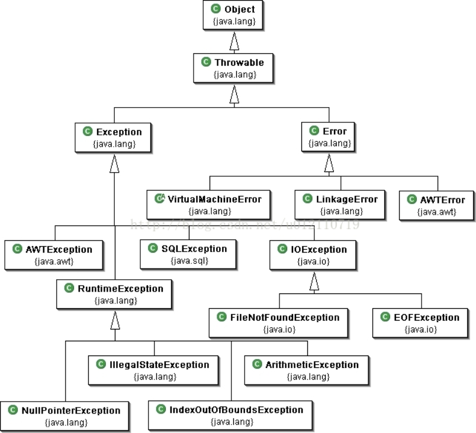
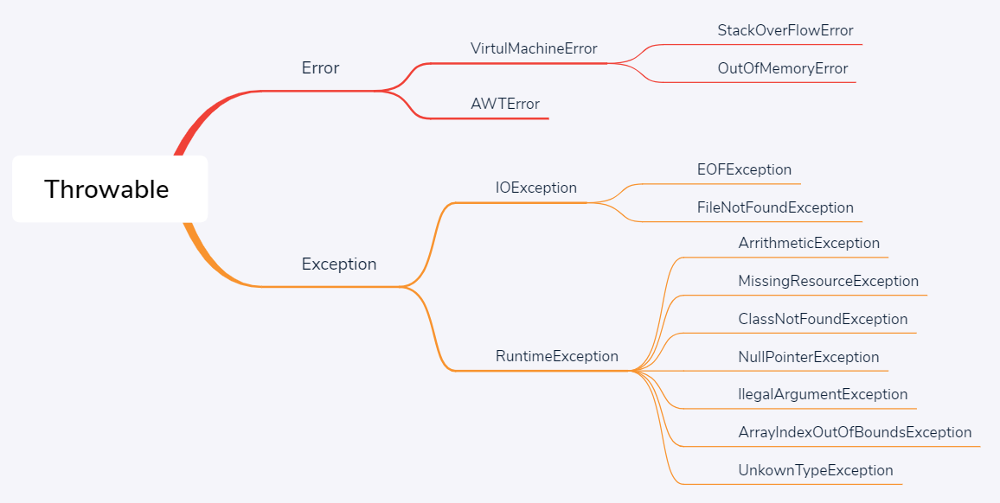
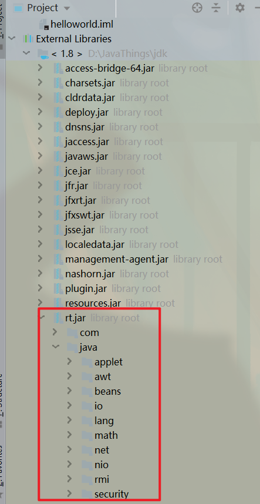

:::tip   快了快了!!<br/>
java是全世界最好的语言吗?
:::

<!-- more -->

## 异常机制
### 异常概览
编译期能捕获异常最好,但是很多错误都是在运行时暴露的  
- Error:JVM系统内部错误、资源耗尽等严重情况
- Exception：其它因编程错误或偶然的外在因素导致的一般性问题，例如：
    - 空指针访问
    - 试图读取不存在的文件
    - 网络连接中断
<div align=center >
</div>

<div align=center >
</div>

:::tip
常见的四个眼熟一下  
- 空指针
- 栈溢出
- 数组越界
- 内存不足
:::
### 异常捕获
不知道捕获什么异常的时候就直接捕获最终父类`Exception`,捕获异常越具体越好  
- addSuppressed(Throwable exception)void  
- fillInStackTrace()Throwable  
- ⭐`getcause()Throwable` 打印出错误原因  
- getLocalizedMessage()String  
- ⭐`getMessage()String` 返回这个错误的信息  
- getstackTrace()StackTraceElement[]  
- getSuppressed()Throwable[]  
- initCause(Throwable cause)Throwable  
- ⭐`printStackTrace()void` 不终止程序打印出错误栈  
- setStackTrace(StackTraceElement[]..)void   


try-cache-finally,可多错误捕获
```java
package exceptionpractice;

class A{}
public class test {
    public static void main(String args[]){
        String s0[]=new String[]{"1","2"};
        A a=null;
        try{
            System.out.print(s0[3]);
            System.out.print(a.i);//idea直接不给你运行,教程上用eclipse可以复现错误
        }catch (NullPointerException e){
                e.printStackTrace();
                System.out.print(e.getMessage());
        }catch (ArrayIndexOutOfBoundsException e){
                e.printStackTrace();
                System.out.print(e.getMessage());
        }finally {
                System.out.print("最后一定执行的!");
        }
    }
}

```
:::warning 注意  
try{}中的代码块在一次异常被捕获后,后面的代码都不会执行,多个catch能捕获可能的异常
:::
[异常列表和解释](https://www.runoob.com/java/java-exceptions.html)
### 抛出异常
函数后面加上`throw Exception`,函数内必须抛出异常,异常会向上层层传递,最后到main会直接抛给JVM这样就无法处理了  
```java
package exceptionpractice;

class B{
    int an[]=new int[2];
    public void test() throws Exception{
        System.out.print(an[3]);
    }
}


public class exception1 {
    public static void main(String args[]){
        B b=new B();
        try {
            b.test();
        }catch (Exception e){
            e.printStackTrace();
            System.out.print(e.getMessage());
        }

    }

}
```
子类重写父类的方法时，子类不能抛出比父类方法更大范围的异常
```java
package exceptionpractice;
class C {
    int an[]=new int[2];
    public void test() throws Exception{//函数声明了抛出异常但是没有抛出的没什么事情,但是在其他地方全都会被认为抛出异常
            System.out.println("xxx");
    }
}
class B extends C{

    @Override
    public void test () throws ArrayIndexOutOfBoundsException {
        //super.test();//idea里直接检测出来了,写不了
        System.out.print(an[3]);//异常只能更具体,不能范围更大
    }

}
```
当然你也可以手动抛出异常,但是throw只能抛出Throwable或其子类的异常  
自定义异常类
```java
class Test01{
    public void regeist (int num) throws MyException{
        if (num<0){
            throw new MyException("人数不能为负数",num);
        }else {
            System.out.print("登记人数"+num);
        }
    }
    public void manager(){
        try {
            regeist(-100);
        }catch (MyException e){
            System.out.print("登记失败,出错种类为"+e.getId());
        }
        System.out.print("结束");
    }
}
```
## 集合
存放在`java.util`包中,集合是用来存放引用类型的容器
- 只能存放对象,如果存放了基本数据类型会自动装箱
- 集合中存放的还是数据的引用,数据仍然被存放堆里
- 可以存放不限类型不限数量的对象
- 三大体系Map,Set,List,JDK5 之后集合可以记住对像的类型
### Set
**HashSet**  
典型实现,一般提到set都是HashSet
- 无序
- 不重复
  - 插入前调用对象的`hashCode()`,根据哈希值决定存储位置
  - 即使用equals比较为True,HashCode不相等存储位置也不会一样
  - 只有equals和HashCode都相等才会判定相等,注意`String`等包装类的`HashCode`
- 不保证线程安全
- 可以存null  

继承链是`HashSet`->`set`->`Collection`  


## 泛型和枚举
### 集合中的泛型
前面已经演示了.集合中的泛型会检查集合数据类型,保证数据类型一致  
Java中的泛型，只在编译阶段有效。在编译过程中，正确检验泛型结果后，会将泛型的相关信息擦出，并且在对象进入和离开方法的边界处添加类型检查和类型转换的方法。泛型信息不会进入到运行时阶段。
### 泛型类
### 泛型方法
### 泛型接口

## 注解
## Java的IO
## 啊
## 内置包详解
1. java.lang---包含一些Java语言的核心类，如String、Math、Integer、System和Thread，提供常用功能。
2. java.net---包含执行与网络相关的操作的类和接口。
3. java.io---包含能提供多种输入/输出功能的类。
4. java.util---包含一些实用工具类，如定义系统特性、接口的集合框架类、使用与日期日历相关的函数。
5. java.text---包含了一些java格式化相关的类6.iava.sql---包含了java进行JDBC数据库编程的相关类/接口7. java.awt---包含了j构成抽象窗口工具集（abstract window toolkits）的多个类，这些类被用来构建和管理应用程序的图形用户界面（GUI）
8. java.applet---包含applet运行所需的一些类。  

<div align=center >
</div>


## 引用参考

- [菜鸟异常类](https://www.runoob.com/java/java-exceptions.html)
<Valine></Valine>


throw的异常必须先在函数上声明然后再函数里面抛出吗?如果函数里面不抛出怎样
