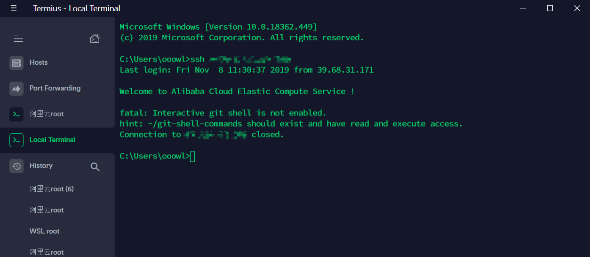
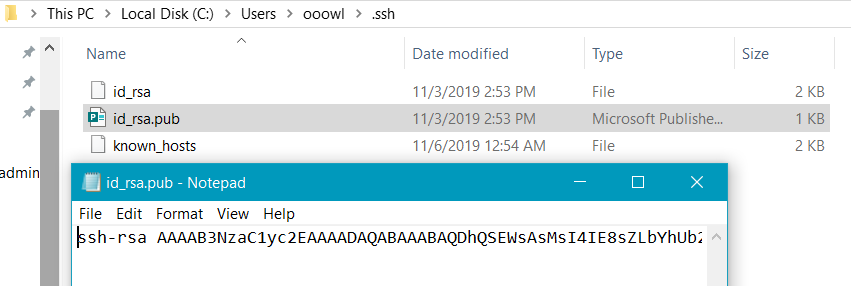
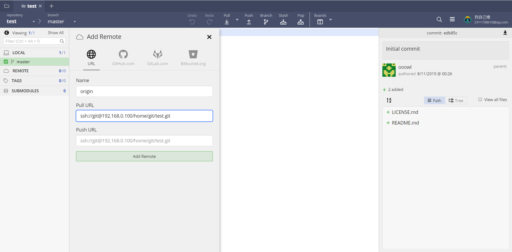

## 工具测评
**gitkraken**  
基本功能齐全，还能追踪issue，支持本地仓库部署，不支持私仓库，付费可以单号基本功能都有，没必要付费。  
**tortoiseGit**  
超级好用，右键直接启用，占用资源小，有中文，有点复古不过还好，实用性抵消了不好看。  
**GitGUI**  
自带的没怎么用过。  
**SourceTree**  
免费，基本功能齐全，好用，不过不好看。  
**GitDesktop**  
不大好用，不是很习惯，而且每次打开还要安装  
## Git操作
### 初始化
这是<a href="https://rogerdudler.github.io/git-guide/index.zh.html">简单指南</a>，可以放在收藏夹想不起来了拿起来看看.  
装好之后先配置一下账户。  
**`git config --global user.name "ooowl" `**  
**`git config --global user.email "2411708618aqq.com"`**  
**`git config --global core.editor vim`**  
作者是谁，仓库commit会有你的名字，名字和email(名字可以重复但email一般唯一)并不作为身份标识，只是一个标记而已所有的独立提交不记名只验证公钥或github账号,你可以通过这样来查看  
**`git config user.name `**  
**`git config user.email`**  
进入到你想建立的目录下，用git init就会在该目录下生成一个.git文件夹，想知道这个文件夹里面是什么就自己去搜。  
### 查看
**`git status`** 看看自己目前仓库里未跟踪的文件，修改未提交的文件  
**`git log (--oneline --all --graph ) `** 查看所有的提交记录，回滚需要至少7位id，-p查看提交具体干了啥,--all查看所有的分支，--graph 尽可能用图形表示。  
**`git reflog `** 查看命令历史，以便确定要回到未来的哪个版本  
**`git remote -v`** 查看你的远程仓库的路径  
<div align=center ></div>

### 基本的操作
**`git clone Address `** 克隆项目  
**`git add (.) `** 把文件添加到暂存区，未跟踪的文件可以直接添加为跟踪  
**`git restore`**   
**`git push -u origin master`** 推送到 远程的master分支  
**`git fetch`** 从分支获取  
**`git pull`** 获取分支  
**`git commit -m "你的提交信息"`**  
**`git checkout (id or -)(/path/file)`** 回到(某个or上一个)提交点，可以直接用tag名,跟文件名可以直接修改单独某个文件  
**`git tag (-a 标签名 -m "标签信息") (id)`** 默认加在最近的commit上，如果想加其他commit 后面跟上id  
**`git remote add Name RemoteAddress.git`** 添加一个远程仓库地址。  
:::tip
https是无状态的，使用https提交每次都要输入用户名和密码，SSH url克隆需要在克隆之前先配置和添加好SSH key，ssh默认是每次fetch和push代码都不需要输入账号和密码，如果你想要每次都输入账号密码才能进行fetch和push也可以另外进行设置。
:::
**`git rm --cached 文件名`** 停止对git已跟踪的文件跟踪，但保留之前该文件的跟踪状态
> 在一个分支下开发，这种做法是没有问题的。即在 master 分支里，使用如上操作之后，config.js 就从 git 管理中剔除了，但是仍然存在于硬盘上。并不会影响到本地开发环境的正常调试。<br/>
>如果同时满足以下条件的情况下就会出问题<br/>
>&nbsp;&nbsp;&nbsp;&nbsp;1 多分支同时存在 config.php 文件。例如，master 分支，dev 分支都有 config.php 文件<br/>
>&nbsp;&nbsp;&nbsp;&nbsp;2 一个分支删除了该文件，然后在另一个分支，merge 了该提交<br/>
>这时候dev和master分支的config.js就全消失了。  


**`git update-index --assume-unchanged 文件名`** 暂时让git忽略已跟踪的文件,具体看<a href='https://segmentfault.com/q/1010000000430426'>这一篇</a>  

> 虽然能达到（暂时的）目的，但并非最正确的做法，这样做是误解了 git update-index 的含义，而且这样做带来的最直接（不良）后果是这样的：  
> <br/>
>&nbsp;&nbsp;&nbsp;&nbsp;1 所有的团队成员都必须对目标文件执行：git update-index --assume-unchanged PATH。这是因为即使你让 Git 假装看不见目标文件的改变，但文件本身还是在 Git 的历史记录里的，所以团队的每个人在 fetch 的时候都会拉到目标文件的变更。（但实际上目标文件是根本不想被 Git 记录的，而不是假装看不见它发生了改变）  
> <br/>
>&nbsp;&nbsp;&nbsp;&nbsp;2 一旦有人改变目标文件之后没有 git update-index --assume-unchanged PATH 就直接 push 了，那么接下来所有拉取了最新代码的成员必须重新执行 update-index，否则 Git 又会开始记录目标文件的变化。这一点实际上很常见的，比如说某成员换了机器或者硬盘，重新 clone 了一份代码库，由于目标文件还在 Git 的历史记录里，所以他／她很可能会忘记 update-index。

> **git update-index --assume-unchanged** 的真正用法是这样的：  
> &nbsp;&nbsp;&nbsp;&nbsp;1 你正在修改一个巨大的文件，你先对其 `git update-index --assume-unchanged`，这样 Git 暂时不会理睬你对文件做的修改；  
> &nbsp;&nbsp;&nbsp;&nbsp;2 当你的工作告一段落决定可以提交的时候，重置改标识：  
> `git update-index --no-assume-unchanged`，于是 Git 只需要做一次更新，这是完全可以接受的了；  
> &nbsp;&nbsp;&nbsp;&nbsp;3 提交＋推送。

### 分支和合并
**`git branch xxx`**  产生一个新分支，想回到某个点获取分支可以先checkout  
**`git merge  xxx`** 将xxx合并到master，出现confilct的时候，大于号小于号和等号之间分别是两个分支不同的内容，最后需要在commit一次  
**`it rebase `** 和mrege的作用是一样的，不过结果不同。  

:::warning
merge会在head后面紧接着提交，合并后自动提交一次作为标记，worktree会有一个分支记录。  
rebase会在分支根提交点处接着提交，之后再跟上master该节点之后的的提交，worktree不会有分支记录。
:::

**`git show (id or tag)`** 查看这次id和tag的详细信息，包括提交时间作者提交了啥等等  

图解（源水印）  
<div align=center ></div>  

### ignore语法
史上最全的<a href='https://github.com/github/gitignore'>gitignore语法</a>模板  
1：`#` 此为注释  
2：`*.a` 忽略所有.a结尾的文件  
3：`!lib.a` 但lib.a除外  
4：`/todo` 仅仅忽略项目根目录下的todo文件，不包括subdir/todo  
5：`build/*` 忽略build/目录下的所有文件  
6：`doc/*.txt`忽略doc/notes.txt(只忽略doc下本身的文件)，但不包括doc/server/arch.txt(子目录下的文件)  
7：原来已经被跟踪的文件是无效的，必须先取消跟踪git rm --cache，下次提交就不会生效了  
8：`.idea/**/*` 忽略某个(idea)文件夹下所有的文件和子文件夹(递归忽略所有)  
## 服务器部署
常见的几种方案  
- 带宽足够人少的时候建立一个文件共享，然后挂载目录，一块开发(人多不好用，坏了风险高)
- 建立Git服务器，首先你需要一个能ssh的服务器主机，安装git  
### 申请用户
申请用户并设置密码
```shell
groupadd git //申请组,把用到的用户都啊计入到这个组里
useradd git -g git
passwd git
``` 
每个用户单独的ssh K,这样就可以一个用户对应一个工程互不影响,多个工程只要申请多个用户,放到git用户组更管理就可以了.  
设置用户只能使用git禁止登陆ssh,编辑`/etc/passwd`
```
git:x:502:504::/home/git:/bin/bash //找到这一行
git:x:502:504::/home/git:/bin/git-shell//改为这个
```
<div align=center ></div>

### 添加公钥
你也可以不添加直接ssh克隆,但是这样会每次都让你输入密码,只把开发记得公钥添加就行了  
首先在你的客户机上cmd运行
```
ssh-keygen -t rsa -C "xxxxx@mail.com" 
//最后的又像是公钥里面显示的名字,自己开心就行
```
这样在下就得到了一对公钥和私钥  
<div align=center ></div>

编辑`id_rsa.pub`里面就是你的公钥复制下来  

在服务器上进入`/etc/ssh` 目录，编辑 `sshd_config`，打开以下三个配置的注释：
```
RSAAuthentication yes
PubkeyAuthentication yes
AuthorizedKeysFile .ssh/authorized_keys
/etc/rc.d/init.d/sshd restart //重启ssh
mkdir -p /home/git/.ssh
touch /home/git/.ssh/authorized_keys //新建了信任公钥
```
然后将客户机们的公钥`id_rsa.pub`里面的内容复制到git用户的`authorized_keys`里面  
### 修改权限并创建仓库
在home下建立对应的工程最好,每个用管理自己的工程  
```
sudo git init --bare /home/git/project1/test.git
```

**一定要修改权限!!!**  
免密登录也是这个权限,本身就是免密登录ssh传送的文件.  
:::warning
修改 .ssh 目录的权限为 700  
修改 .ssh/authorized_keys 文件的权限为 600  
仓库,.ssh目录和authorized_keys都要修改所有者
:::
```
chmod 700  /home/git/.ssh
chmod 600  /home/git/.ssh/authorized_keys 
chown -R git:git /home/git/.ssh 
chown -R git:git /home/git/.ssh/authorized_keys 
chown -R git:git /home/git/project1/test.git  //chown -R 所有者:组
```

### 推送到远端

这时候应该可以clone了,url有两种写法(推荐ssh)
```
git@192.168.0.100:/home/git/project1/test.git //SCP写法
ssh://git@192.168.0.100/home/git/project1/test.git //SSH写法
//Https的写法没有配置,而且每次都要输密码,团队协作不好用
```
<div align=center ></div>


## 工作流
### gitflow
gitflow<a href="https://www.atlassian.com/git/tutorials/comparing-workflows/gitflow-workflow">工作流</a>，团队开发的范例。  
<div align=center ></div>  

中小型团队协作时候很重要  
**大致注意下面这么几点**  
鸽了鸽了  

bitbucket提供免费私人5人无限制的私有仓库，gitlab和bitbucket提供精确到分支的权限控制,但bitbucket仍然是云托管，Gitlab占资源太大需要一个好服务器才行。
### github工作流

<div align=center ></div>

主要流程为:
- 新建分支（Create a branch）
- 提交修改（Add commits）
- 创建PR（Open a Pull Request）
- 代码评审（Discuss and review your code）
- 部署（Deploy）
- 合并（Merge）   
:::tip
保持自己的fork最新 鸽了🕊
:::

部署（Deploy）发生在合并（Merge）之前，这就是 GitHub flow 的核心，非阻塞式集成----在产生任何副作用之前得知当前修改的所有集成效果，达到真正的持续集成  
体验一下Github开源软件如何PR和fork的工作模式<a href="https://help.github.com/en/github/getting-started-with-github/fork-a-repo">链接1</a> <a href="https://help.github.com/en/github/collaborating-with-issues-and-pull-requests/about-pull-requests">链接2</a>
### gitolite
这个是用来管理的，可以精确控制分支读写权限，各种粒度都可以  
不进行身份验证，仅是授权(官方原话)。  

先鸽了

## 参考资料

- <a href='https://www.cnblogs.com/dee0912/p/5815267.html#_label8'>1 参 考</a>
- <a href='https://segmentfault.com/q/1010000000430426'>2 参 考</a>
- <a href='https://biaoyansu.com'>3 表严肃的课程</a>
- <a href='https://git-scm.com/book/zh/v1/%E6%9C%8D%E5%8A%A1%E5%99%A8%E4%B8%8A%E7%9A%84-Git-Gitolite'>4 参 考</a>
- <a href='https://www.jianshu.com/p/5aa4123b2322'>5 参 考</a>


<Valine></Valine>