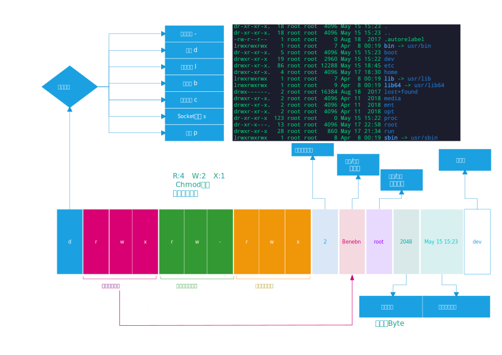

:::tip 思考
拿到linux一般要干嘛: <br/>
apt换源，ssh允许远程登陆，装上docker oh my zsh🤔还有呢？
:::
<!-- more -->
## 快捷键&命令
不全，用哪算哪，最熟的肯定是最常用的，学了又不是为了考试，用得顺手为准。   
命令行有很多种unix用的shell，linux的bash林纳斯Linus Benedict Torvalds这吊人发明的。本质上是找到对应的程序去执行(命令解析器)。
另外有很多衍生出来的tash，dash之类的不常用，暂时不用管   
<br/>
<details>

  <summary><B><I style="cursor:pointer; color: #0e5870">Click to See More！</I></B></summary>

<h3>快捷键</h3>

:::tip
linux光标很宽，光标盖住的那个字符就是后面的字符
:::

- ctrl+p/n 上一条命令↑/下一条命令↓  
- ctrl+f/b →后←前移动光标  
- ctrl+h/d  backspace删除前面的字符/del删除后面的字符
- **ctrl+u/k 删除光标前/后面的**u失效了🙃
- **ctrl+a 命令头部**
- **ctrl+e 命令尾部**  
- **ctrl+l 清屏**
- Ctrl+c 终止当前执行程序
- Ctrl+d 相当于exit命令，退出当前shell
- Ctrl+s 挂起当前shell，你可以理解为冻结
- Ctrl+q 解冻挂起的shell，解不开就重新连接打开一个终端，reboot linux 或 kill 相关进程。

<br/>
<br/>


<h3>命令</h3>


:::tip 
查看内核  
`cat /proc/version` 
`uname -a` 
`lsb_release -a` 
`cat /etc/issue` 
`cat /etc/redhat-release` 

:::


### 文件和目录
- 查看linux版本和内核
    - **cat /etc/issue** 配置文件中存储的版本号
    - **uname -a** 使用命令从proc获得版本号，-a输出详细信息
    - **cat /proc/version** 直接查看proc里面的文件获得版本号
- **history**历史
- **date**当前日期
    - Fri May 17 15:10:45 CST 2019   
- **clear**清屏
- **pwd**查看当前目录  
- 直接用-可以在两个相邻的目录切换
- 安了autojump之后可使用j跳转。 
- **tree**树结构贼好用(apt-get install tree)
- **mkdir** -p aa/bb/cc 递归的创建嵌套目录
- **rmdir** 删除一个 **空**目录！
- **rm** 删除一个文件或非空目录
    - -r 是递归遍历，就能删除非空的目录和下面所有的东西了
    - -i 向你确认每个要删除的文件
    - -f 强制删除
    - -d 直接把欲删除的目录的硬连接数据删除成0，删除该目录；
    - -v 详细执行日志
- **touch** xxx.xx如果不存在就创建一个文件，存在则会更新修改时间(已存在的目录只会更新时间)
- **cp** a b copy一份a名字为b，**如果b已存在则会覆盖b**
    - -r 递归copy目录，目录不存在就相当于复制了一个文件夹。如果已经存在相当于复制a文件夹到b文件夹里面    
- 查看文件
    - **cat** xxx 查看xxx的内容，太长了显示不全。
    - **head**/tail -n xxx 产看头/尾的前n行内容，默认10 
    - **more** xxx 查看更多的内容，回车下一行，只能向下空格翻页 ，Q或Ctrl+C退出
    - **less** xxx 查看更少内容，回车下一行，空格翻页 ，Q或Ctrl+C退出。ctrl+B↑向上翻页和ctrl+F↓向下翻页  
- **mv** a b移动文件或改名
    - b是个不存在的文件，就会改名；已存在的文建会被覆盖
    - b是个目录，则会移动过去
- **ln** -s ~/aa/xxx xxx.xx 
    - 文件/目录创建软连接，只存储位置信息调用会连接到原来的文件，大小是路径长度存储的大小
    - 使用相对路径的时候链接文件移动位置无法使用找不到文件，请使用绝对路径
    - 不加-s可以创建硬连接源文件硬连接数+1，硬连接是一个块文件的inode节点的映射上的名字，不会额外占用存储空间，修改任何硬链接的内容都会导致块文件上的内容修改，所有相关的硬连接内容也被修改。
    - 不必一定要用绝对路径    
- **wc** xxx 查看文本文件属性
    - 行数 单词数(空格计数) 字节大小 名字
    - 1 1 9 xsd
- **od** 查看二进制文件的属性
    - -t指定数据的显示格式
        - c ASCII字符
        - d 有符号十进制数
        - f 浮点数
        - o 八进制数
        - u -无符号十进制数
        - x 十六进制数    
- **.**/xx/excute 执行xx目录下的execute可执行文件。
- **du**（disk use）+文件夹/df（disk free）  
    - 查看文件夹(递归)/磁盘的使用情况 
    - -h 以人类能够读懂的方式输出
- **which** +某个外部命令
    - 内建的命令cp等等不需要去磁盘查找，which不会管
    - 在/bin/下的命令或自己安装的软件的命令，which 可以帮你找到它在哪     
- **x** 直接解压 (需要oh my zhs 开启extract插件
- **j** +随便什么 超级跳转(需要oh my zhs 安装并开启autojump插件
- **chmod** 见下面文件权限        
### 磁盘设备操作        


磁盘设备都保存在/dev中，不同类型的设备前面名字不一样，一般会sda，b，c..
- sd->SCSI Device 
- hd->Hard Disk 
- fd->Floppy Disk 

<br/>

每个设备的不同分区回用数字命名，主分区最多支持4个  

- 主分区1：sda1
- 主分区2：sda2
- 主分区3：sda3
- 主分区4：sda4  
<br/>

逻辑分区从sda5开始
- 逻辑分区1：sda5
- 逻错分区2：sda6
- 逻辑分区3：sda7

<br/>

使用**fdisk -l**查看当前系统中的所有设备。存放在了/dev 下面  
默认硬盘能识别类型的会挂载到/media下，其他的一般手动挂载到mnt下，如果你非要不挂载到mnt目录下，那么你挂载的目录内容会被暂时覆盖，卸载之后才可以查看。自己还在mnt目录下的时候不能卸载挂载，

- unmount /mnt/c 从mnt卸载某个u盘目录。
- mount /dev/vda1 /mnt/vda1 挂在某个硬盘分区到mnt下的vda1
<br/>    
    
    
</details>

## 目录结构
linux文件系统是树状结构，每个磁盘，文件，文件夹，驱动全都是文件，也没有后缀名一说。  
:::danger
<B style="color:red;font-size:25px">If you don't know what it is, please don't modify it</B>
鲁迅曾经说过:如果不你不知道这个东西是干嘛的，不要修改它。下面打勾的都是。
:::

<details>
<summary><B><I style="cursor:pointer; color: #0e5870">Click to See More！</I></B></summary>

- **bin**(<B style="color:red">√</B>)
    - Binary常用的一些命令都放在了这里面
    - ls /bin/就可以看到所有命令
- **boot**(<B style="color:red">√</B>)
    - 存放是启动Linux时使用的一些核心文件，包括一些连接文件以及镜像文件。
- **dev**(<B style="color:red">√</B>)
    - dev就是Device，存放的是Linux的外部设备，在Linux中访问设备和驱动当成文件一样访问
- **etc**
    - 存放所有的系统管理和自己的安装文件的配置文件和其子目录
- **home**
    - 用户的主目录，宿主目录，在Linux中，每个用户都有一个自己的目录，一般该目录名是用户的账号名
    - 有几个文件夹就有几个用户，不要闲的没事去创建
- **lib**(<B style="color:red">√</B>)
    - 存放共享库和动态链接库，如果你不知道这是干嘛的，不要动这个
- **lib64**(<B style="color:red">√</B>)
    - 同lib
- **lost+found**
    - 一般是空的，非法关机就会在里面留下点什么
- **media**
    - 系统会自动识别外设，u盘，光驱，硬盘之类的，挂载到media里面
- **mnt**
    - 如果无法自动识别外设，需要手动挂载，就放这里面了
- **opt**
    - 默认为空，你想安装额外的软件就可以扔到这里面
- **proc**(<B style="color:red">√</B>)
    - 虚拟目录，实质上是一些内存映射。可以直接通过访问这个文件夹里的东西来修改内存
- **root**
    - root用户的~目录，别人都没权限哒
- **sbin**(<B style="color:red">√</B>)
    - SuperUser缩写，root用户专用的bin
- **run**(<B style="color:red">√</B>)
    - 存储了进程信息，一大堆.pid文件
    - 能不能删除呢，咱也不知道咱也不敢问
- **srv**
    - 主要用来存储本机或本服务器提供的服务或数据。（用户主动生产的数据、对外提供服务）
- **sys**
    - 这是linux2.6内核之后的一个很大的变化。该目录下安装了2.6内核中新出现的一个文件系统sysfs，sysfs文件系统集成了下面3种文件系统的信息：针对进程信息的proc文件系统、针对设备的devis文件系统以及针对伪终宾的devpts文件系统。该文件系统是内核设备树的一个直观反映。当一个内核对象被创建的时候，对应的文件和目录也在内核对象子系统种波创建。
- **tmp**
    - 保存在使用完毕后可随时销毁的缓存文件。（有可能是由系统或程序产生、也有可能是用户主动放入的临时数据、系统会自动清理）
- **usr**
    - UserSoftwareResource用户软件资源
    - 大部分的软件按这里面，一些会安到opt
    - /usr/bin用户软件启动目录(<B style="color:red">√</B>)
    - /usr/sbin超级用户(root)软件启动目录 (<B style="color:red">√</B>)
- **var**(<B style="color:red">√</B>)
    - 经常修改和扩充的文件都放在这里
    - 系统产生的不可自动销毁的缓存文件、日志记录。（系统和程序运行后产生的数据、不对外提供服务、只能用户手动清理）（包括mail、数据库文件、日志文件）
    - mali的预设？？？
     
:::warning
~ 代表是home目录，也就是家目录， / 代表的是根目录。  
用户登录后在~目录 普通用户为 /home/用户名，root用户单独在/root  
家目录用户才有权限操作，权限可分配，root可以操作所有人的~
:::

</details>

## 文件

### 类型

<div align= center>

默认的终端颜色，更改过的终端可能不一样

|颜色|类型|
|:------:|:----:|
|白色|普通文件|
|蓝色|目录文件|
|绿色|可执行文|
|红色|压缩文件|
|浅蓝色|链接文件(软硬连接)|
|黄色|设备文件{块(硬盘)，字符(键盘)，管道}|
|灰色|其他文件|
|.开头|隐藏文件目录，ls/tree的时候需要 -a|  


ls -al查看所有文件(-a)详细信息(-l)


<div align=center ></div>

</div>

### 文件权限

**文字设定法**：  
- chmod [who] [+|-|=] [mode] file
    - who 
        - u 文件所有者
        - g 文件同组用户
        - o 其他人
        - a 所有用户（不写默认）
    - 加减
        - + 增加权限
        - - 减少权限
        - = 覆盖原来的权限（会把所有的权限都清除）
    - mode
        - r 读 
        - w 写
        - x 执行


**数组设定法**:
- chmod 777 file
    - r 读 4
    - w 写 2
    - x 执行 1
    - 可以进行加减操作chomd -r -001 x 其他用户的权限-1（执行）  

    
额外的必须的参数:  
-c 当发生改变时，报告处理信息  
-f 错误信息不输出  
-R 处理指定目录以及其子目录下的所有文件  
-v 运行时显示详细处理信息    

<br/>

**更改所有者和所属组**  
chgrp lisi file   
修改file的所有组为李四  
chown lisi flie   
修改file的所有者为李四  
chown lisi:zhangsan file  
修改file的所有者尾李四，所属组为张三  

:::warning 
linux文件创建后默认所有者就是所有组，修改时所有者可以不在所有组中。  
目录没有执行权限的话无法查看进入
:::

### 查找文件

名字:find 目录 -name "文件名"(支持*和?通配符)  
大小:find 目录 -size 文件大小(-/+10k)小于10kb的(b,k,M,G,T) -size 10M(两遍就是选取范围)  
类型:find 目录 -type 类型(d/f/b/c/s/p/l)    

<br/>

**按照字符串检索**  
grep -r (递归) "查找的string" 查找的dir  
### 软件安装
**apt**是用得最多
- 安装:sudo apt-get install tree在线下载安装
- 移除:sudo apt-get remove tree卸载
- 更新:sudo apt-get update更新软件列表
- 智能更新软件和软件的依赖:sudo apt-get upgrade一般和上一条连用
- 清理所有软件安装包缓存sudo apt-get clean实际清理的是/var/cache/apt/archives目录下的.deb 文件  

<br/>

**aptitude**不咋用  
- 安装:sudo aptitude install tree
- 重新安装:sudo aptitude reinstall tree
- 更新:sudo apt-get update
- 移除:sudo aptitude renove tree
- 显示状态:sudo aptitude show tree  

<br/>  


:::tip
ubuntu上会存在一个软件列表-地址，当你apt-get install 的时候就会查找这个列表然后去地址下载。  
列表从服务器获取加后缀为.deb存放在/var/cache/apt/archives 下
:::
**已经下载的deb安装**   
- 安装 sudo dpkg -i xxx.deb
- 删除 sudo dpkg -r xxx

<br/>  

**编译安装**(麻烦死了这个，能用上面的就用上面的)  
- 解压缩源代码包
- 进入到安装目录：cd dir
- 检测文件是否缺失，创建Makefile，检测编译环境：./configure
- 编译源码，生成库和可执行程序：make
- 把库和可执行程序，安装到系统目录下：sudo make install
- 删除和卸载软件：sudo make distclean
- 上述安装步骤并不是绝对的，应该先查看附带的README  


### 压缩
linux压缩解压提供.gz和.bz2，压缩后解压命令这俩原生的其实不常用，gzip和bz2会把文件单独压缩成一份，不保留源文件,不能压缩目录，解压缩也是。但bz2的压缩率更高耗时更长。  
一般使用tar
- **tar** 不使用z/j参数，该命令只能对文件或目录打包：
    - c 创建-压缩
    - x 释放-解压缩
    - v 显示提示信息--压缩解压缩-可以省暗 
    - f 指定压缩文件的名字
    - z 使用gzip的方式压缩文件.gz 
    - j 使用bizp2的方式压缩文件.bz2

<br/>
    
- **tar zcvf** 生成的压缩包的名字（xxx.tar.gz）files/dir  使用gz方式压缩文件
- **tar jcvf** 生成的压缩包的名字（xxx.tar.bz2）files/dir  带个tar可以让别人知道这是tar打包的

<br/>

- **tar** j/zxvf 要解压的bz2/gz(默认直接把东西堆在本目录下) **-C** destinationDir
- **x** 会把文件堆当前目录下  

win和linux通用的是rar和zip  
rar不开源还要编译安装。用到再说。   
zip通过apt和yum都能安装  
- **zip** -r 压缩包的名字 压缩的文件或目录 (-r会递归压缩)
- **unzip**压缩包的名字I
- **unzip** 压缩包的名字-d解压目录

## 用户
### sudo和su
使用su +用户名字可以切换用户，不填就是root用户。  
普通用户的bash后面是$而root的bash后面是#  

sudo由`/etc/sudoer`控制，只有在这里允许了用户才能使用sudo，在sudoer文件中添加(最好和自带的放一块且对齐)`[user]    ALL=(ALL:ALL) ALL`.sudoer只能同时被一个用户编辑。  
sudo是使用root的身份运行，让你输入当前用户的密码，sudo 默认在输入一次密码后 15 分钟内不会再次要求密码。    
`Defaults env_reset`改为`Defaults env_reset,timestamp_timeout=[new-value]`
- 控制在几分钟内不用输密码
    - 0每次输入都要输
    - -1会永久维持会话（sudo -s之后本次会话就一直sudo了，和su一样）。  

`Defaults env_reset`改为,`Defaults env_reset,pwfeedback`在输密码的时候会有星号。


<br/> 

****who**** 查看当前所有在线的用户
:::tip
tty7 pts/0图形桌面终端  
tty1-6 命令终端
:::

**ps** 查看所有用户
- -a 显示所有用户的所有应用程序
- -u 显示用户详情和资源占用pid等等
- -x 显示不需要和用户交互的所有进程

<br/>

**管道**   
指令1 **|** 指令2 
- 指令1的输出作为指令2的输入  
- 指令2处理完毕，将信息输出到屏幕，指令1不输出  
- grep查询是需要占用一个进程的，结果>2才能说明查询结果存在,如果结果有一条，表示没有查询到（现在好像已经优化掉了  
- 进程查询结果中PID表示进程ID  

<br/>

- **grep** 是检索，会把符合的行拿出来  
- **kill** -l 查看信号   
- **kill** -9(SIGKILL) PID 杀死进程。  
- **env** 查看当前进程的环境变量  
- **top** 任务管理器只能看不能动
 
:::tip
linux 下的环境变量是键值对形式的，可以多个，K=V1:V2:V3..
比如PATH  
`PATH=/root/.autojump/bin:/usr/local/sbin:/usr/local/bin:/usr/sbin:/usr/bin:/root/bin`
:::

### 用户管理
- adduser xxx
    - 实际上是个内置的脚本，里面是useradd，useradd超麻烦用不到就不要碰了吧。
    - 一般要sudo权限
    - 填完信息就完事了简单无脑
- useradd 
    - s /bin/bash 使用啥shell
    - g xxx 所属的组，组必须提前存在，groupadd xxx 
    - d /home/xxx 用户目录
    - m home下要没有用户目录就创建一个
    - xxx 最后加上用户名   
- su xxx可以切换用户    
- su passwd xxx 修改用户xxx密码
- deluser xxx 不会删除/home/xxx的
- userdel -r xxx会把home下的用户目录也一起删掉  

:::tip
在/etc/passwd中存储着linux所有用户
:::


## 网络

- ifconfig  本机的mac，ip，gateway网关等等
- ping -c 4 IP or Address
    - windows 下ping4条结束
    - linux 不按Ctrl+c不退出-c参数可以让他ping几条之后结束
- nslookup Address 会返回这个网关所对应的所有IP

### ftp服务器
一般使用vsftpd，文件上传下载功能，`apt-get install vsftpd`    
编辑配置文件`vim /etc/vsftpd.conf`  
```
listen=NO
anonymous_enable=NO
local_enable=YES
write_enable=YES
write_enable=YES
local_umask=022
anon_upload_enable=YES
anon_mkdir_write_enable=YES
```
**service vsftpd restart**重启服务完成，端口21。<a href='https://blog.csdn.net/qq_24038207/article/details/68489791'>这里</a>有详细配置，官网也能查。
失败了...屮，后面再说背单词去

### ssh服务器
终端操作`apt-get install openssh-server`   
`ssh 用户名@IP`之后就会让你填写密码,确认登陆填写yes，退出logout   
ssh命令有一些参数。 


<h3>scp远程拷贝</h3>  

super copy -> scp,必须要openssh-server  
命令:`scp -r username@IP:远程机器的绝对路径 本机文件的绝对路径`  
-r 递归，有时候会让你确认填yes。需要密码，其实就是基于ssh跨主机传输。

<h3>免密登陆</h3>   

scp和ssh的免密登陆在CI中部署的时候常用  
免密登录思想很简单,双方互有公钥的情况下,连接过来时会互相校验私钥,确定身份之后就可以连接了  
1. 假设a想要免密登录b
2. 在a中运行`ssh-keygen -t rsa`一路回车
3. cat `~/.ssh/id_rsa.pub`就是你的公钥
4. 在b中`vim ~/.ssh/authorized_keys`复制进去
5. b中`service sshd restart`,此时a `ssh root@b.ip.address -p 22`应该就可以直接连接了


## 进程


