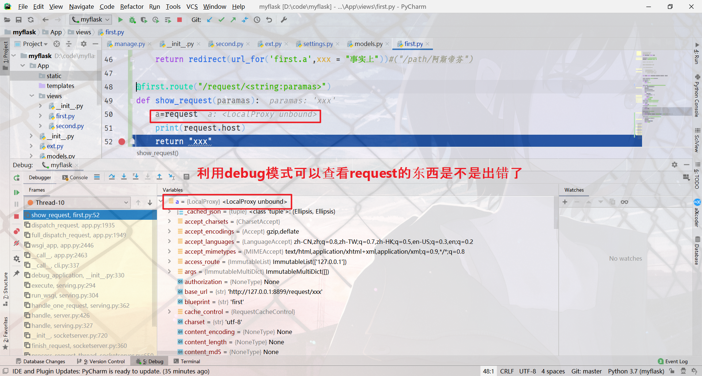

<font color=#53abe2 size=5>前言:</font>   
学习flask用来开发一些小的快速的只有几个接口的东西，而且也可以扩充自己的技术栈，我不会深挖原理持续学flask，编程扳手能用就行，因此也不会记的很详细。jinja2除外，因为这个东西可以直接在Django里代替Django原先的模板，一次学习，到处使用。Django作为主力的单机框架，大的web还得用java，没啥要求就用Django，odoo看情况学不学。主要还是想学习大数据方向的东西，有机会搞搞知识图谱和软件工程理论，精力集中在数据层上。  
我搜集的千峰笔记 <a href='https://flaskdoc.ooowl.fun'>https://flaskdoc.ooowl.fun</a> 我直接挂这儿了v.1.0.2。有兴趣的可以直接<a href='https://pan.baidu.com/s/1tfOdUCxlDAleDtTlhpUsDw'>拿去用</a>，密码`1xid`   

## 项目结构
hello world 程序详解
```py
from flask import Flask # 引入主程序

app=Flask(__name__) # 生成对象并以参数形式获得当前目录

@app.route('/') # 规定路由
def hello_world(): # 处理函数
    return 'hello world'

if __name__ == '__main__':
    app.debug = False # 禁止debug模式 
    app.run(host=None, port=None, debug=Boolean,threaded=True,processes=3) # 运行,多线程进程
```
返回值可以直接写html,不过不推荐你这样做因为很蠢.  
Debug模式只有在develop环境才能使用,默认应该是develop,如果不是,在你的环境变量里面添加"FLASK_ENV".  
Debug可以`app.debug=Bool` or `app.run(debug=False/True)` or 环境变量"FLASK_DEBUG".我的现在好像只有环境变量才管用,不知道为啥.

:::tip Linux环境变量   
- 系统级
    - `/etc/envirtonment`
    - `/etc/profile`
- 用户级:`~/.bashrc`
- 临时级:`在窗口中直接export`  
依次生效顺序覆盖,windows可以直接在pycharm中设置
:::

```  
 * Serving Flask app "app.py" (lazy loading)
 * Environment: development #这里显示是不是生产环境
 * Debug mode: on # 这里显示是否是调试模式
 * Restarting with stat
 * Debugger is active!
 * Debugger PIN: 235-170-085 # 这是pin
 * Running on http://127.0.0.1:5000/ (Press CTRL+C to quit)
```
flask可以直接在网页控制台控制调试,但是需要输入pin码    
<br/>
到这里基本上很小的逻辑都能够解决了,但是如果拓展那就不好办,整个代码耦合在一个文件.  

### Flask-script拆分
用这个可以把app拆分,渐渐的从一个微型文件变成了django.  
首先pip安装这个拓
展,<a href="https://flask-script.readthedocs.io/en/latest/">官网</a>  

```py
from flask import Flask
from flask_script import Manager

app = Flask(__name__)

manager = Manager(app)
@app.route('/') # 规定路由
def hello_world(): # 处理函数
    return 'hello world'

if __name__ == '__main__':
    #app.run() # 运行
    manager.run()
```
文件名改名为manage.py,使用cmd中python manage.py runserver 可django一样  
参数如下  
>  -?, --help  show this help message and exitM<br>
>  -h HOST, --host HOST 指定主机M<br>
>  --threaded 是否启用多线程M<br>
>  --processes PROCESSES 是否启用多进程 M<br>
>  --passthrough-errors 忽略错误不报告M<br>
>  -d, --debug   调试模式  enable the Werkzeug debugger (DO NOT use in production code)M<br>
>  -D, --no-debug  不调试模式  disable the Werkzeug debuggerM<br>
>  -r, --reload 自动重新加载 monitor Python files for changes (not 100% safe for production use)M<br>
>  -R, --no-reload       do not monitor Python files for changesM<br>
>  --ssl-crt SSL_CRT     Path to ssl certificateM<br>
>  --ssl-key SSL_KEY     Path to ssl keyM<br>

### 独立view和拓展SQL
安装`flask-blueprint`,`flask_sqlalchemy`,把view和拓展都独立出去,方便管理
拆分view的基本思路是
每个文件是一组view，然后在每一个view.py文件里面初始化一个blueprint
```py
from flask import Blueprint

first= Blueprint("first",__name__)
@first.route("/")
def index():
    return "我是主页"
```
在views的__init__里引入其他文件的blueprint，声明函数init_view，然后函数接收app，注册blueprint
```py
from .first import first
from .second import second

def init_view(app):
    app.register_blueprint(first)
    app.register_blueprint(second)
```
App中包含views(文件夹)，models，先把这三个引入，ext。在App的__init__中主要任务是生成app，引入view的init_view，ext的init_ext。
```py
from flask import Flask
from App.views import init_view
from App.ext import init_ext
def create_app():
    app=Flask(__name__)

    app.config["SQLALCHEMY_DATABASE_URI"]="sqlite:///sqlite.db"
    app.config["SQLALCHEMY_TRACK_MODIFICATIONS"]=False
    init_view(app)
    init_ext(app)
    return app
```
ext的思路也是一样的，用函数接收app初始化，因为整个app是以一个对象的形式传递的
```py
#import your model here
from flask_sqlalchemy import SQLAlchemy
#your class&function here
models=SQLAlchemy()
migrate=Migrate()# 安装migrate后使用
def init_ext(app):
    models.init_app(app)
    migrate.init_app(app,models)# 安装migrate后使用
```
数据库url写法`数据库+驱动://用户名:密码@主机:端口/具体哪一个库`  
最后在`manage.py`里面引入这个app，然后运行就可以了
```py
from flask_script import Manager

from App import create_app

app = create_app()

manager = Manager(app)

if __name__ == '__main__':
    #App.run() # 运行
    manager.run()
```
组后工程结构图
<div align=center ></div>

### 管理环境
建立`settings.py`,或者直接改ini为py
测试，开发，演示，生产四个环境,传入对象的格式是固定的,记住以后就这么写,模仿django的配置.
<details>
  <summary><B><I style="cursor:pointer; color: #0e5870">Click to See More Code</I></B></summary>

```py
def get_db_url(dbinfo):#将配置组合成url
    engine = dbinfo.get("ENGINE") or "sqlite"
    driver = dbinfo.get("DRIVER") or "sqlite"
    user = dbinfo.get("USER") or ""
    password = dbinfo.get("PASSWORD") or ""
    host = dbinfo.get("HOST") or ""
    port = dbinfo.get("PORT") or ""
    table = dbinfo.get("TABLE") or ""

    return "{}+{}://{}:{}@{}:{}/{}".format(engine, driver, user, password,host, port, table)

class Config:
    DEBUG = False
    TESTING = False
    SQLALCHEMY_TRACK_MODIFICATIONS=False

class DevConfig(Config):
    DEBUG = True
    dbinfo={
        "ENGINE":"mysql",
        "DRIVER":"pymysql",
        "USER":"root",
        "PASSWORD":"1118",
        "HOST":"mysql.ooowl.fun",
        "PORT":"3306",
        "TABLE":"flaskStudy",
    }
    SQLALCHEMY_DATABASE_URI=get_db_url(dbinfo)

class TestConfig(Config):
    DEBUG = True
    dbinfo={
        "ENGINE":"mysql",
        "DRIVER":"pymysql",
        "USER":"root",
        "PASSWORD":"1118",
        "HOST":"mysql.ooowl.fun",
        "PORT":"3306",
        "TABLE":"flaskStudy",
    }
    SQLALCHEMY_DATABASE_URI=get_db_url(dbinfo)


class StageConfig(Config):
    DEBUG = True
    dbinfo = {
        "ENGINE": "mysql",
        "DRIVER": "pymysql",
        "USER": "root",
        "PASSWORD": "1118",
        "HOST": "mysql.ooowl.fun",
        "PORT": "3306",
        "TABLE": "flaskStudy",
    }
    SQLALCHEMY_DATABASE_URI = get_db_url(dbinfo)

class ProductConfig(Config):
    DEBUG = True
    dbinfo={
        "ENGINE":"mysql",
        "DRIVER":"pymysql",
        "USER":"root",
        "PASSWORD":"1118",
        "HOST":"mysql.ooowl.fun",
        "PORT":"3306",
        "TABLE":"flaskStudy",
    }
    SQLALCHEMY_DATABASE_URI=get_db_url(dbinfo)

#包装成一个对象，便于manage引入
envs={
"dev":DevConfig,
"test":TestConfig,
"stage":StageConfig,
"prod":ProductConfig,
"default":DevConfig
}
```

</details>


在App的init中`app.config.from_object(envs.get("dev"))#相当于字典，拿到里面的对象`  

### Migrate数据库表迁移
`pip install flask-Migrate`  
在ext中添加`migrate=Migrate()` `migrate.init_app(app,models)`上面有.  
在manage.py中添加`manager.add_command("db",MigrateCommand)`少啥引入啥  

```py
这里是以后拿笔画结构图的地方
```
flask可以通过各种插件拓展功能,你可以把她变得和django一样,也可以一个文件搭建很小的服务,真正大小可变轻量级,想拆成社么规模都行.
## 路由
### 获取参数
**限定方法**  
`@app.route('/demo2', methods=['GET','POST','DELETE','PUT','HEAD','Options'])`
**参数**有 
<div align= center>

|Type  |  example|
|:----|:----:|
|&lt;string:para&gt;| 默认接收没有斜杠的,如果你的url有"/",那你的访问地址也要带,否则会报错|
|&lt;int:para&gt;| 整型|
|&lt;float:para&gt;| 浮点型|
|&lt;path:para&gt;|接收路径,可接收斜线.如果你url带了斜线,那么访问地址最后的斜线就会被忽略|
|&lt;uuid:para&gt;| 只接受uuid字符串|
|&lt;any(a,b):para&gt;| 可以同时指定多路径,访问a,b都可以使用处理函数,默认string|

</div>

自带converter,默认为string  
可以叠加,一个函数使用多个装饰器  

```py
@first.route("/number/<string:xxx>")
@first.route("/path/<path:xxx>")
def a(xxx):
    return xxx
```

###  重定向和request
硬编码
```py
@first.route("/redirect/")
def redirectx():
    return redirect("/path/阿斯帝芬")
```  
函数带参数反向解析
```py
@first.route("/redirect/")
def redirectx():
    return redirect(url_for('first.a',xxx = "事实上"))
```  

request对象由flask自己生成(需要引入),携带了各种各样的信息,看不懂的去补HTTP的知识  

<div align=center ></div>

常用参数

<div align= center>

|属性|说明|类型|
|:----:|:----:|:----:|
|data|记录请求的数据，并转换为字符串,比如json,xml|*|
|form|记录请求中的表单数据|MultiDict|
|args(request.args.get("city"))|获取请求中的查询参数(?city="x")|MultiDict |
|cookies|记录请求中的cookie信息|Dict |
|headers|记录请求中的报文头|EnvironHeaders |
|method|记录请求使用的HTTP方法|GET/POST等 |
|url|记录请求的URL地址|string |
|base_url|去掉GET参数的URL||
|host_url|只有主机和端口号的URL||
|remote_addr|请求的客户端地址||
|files|记录请求上传的文件|*|
</div>

### 响应Response
- return "xxx",状态码-直接返回响应字符串
- return render_template("testfile.html")-直接渲染html
- return make_response(" &lt;h1&gt; sdsadasd &lt;/h1&gt; ")-调用函数构建
- return Response()-自己构建,debug去看具体参数
- abort(404)/abort(Response("xxx"))-返回**错误** 响应码并终止响应  
- return redirect(url_for('first.a',xxx = "事实上")) 函数带参反向解析

可以使用装饰器直接拦截错误响应,最常用的是5xx和4xx的   
```py
@first.route("/request/<string:paramas>")
def show_request(paramas):
    a=request
    print(request.host)
    abort(401)
    return Response()

@first.errorhandler(401)
def handle_401(error):
    print(error,type(error))
    return "what,you're wrong"
```  
blueprint的处理机制和原生的flask不大一样,原生也有要用原生地去查  

### 会话
session cookie 持久化

## jinja2模板
官网<a href="http://docs.jinkan.org/docs/jinja2/">在这</a>,记不住了去瞅瞅  
### flask-bootstrap
### 
<Valine></Valine>
