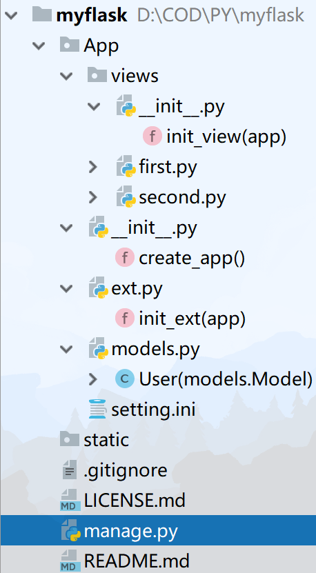

<font color=#53abe2 size=5>前言:</font>   
学习flask用来开发一些小的快速的只有几个接口的东西，而且也可以扩充自己的技术栈，我不会深挖原理持续学flask，编程扳手能用就行，因此也不会记的很详细。jinja2除外，因为这个东西可以直接在Django里代替Django原先的模板，一次学习，到处使用。Django作为主力的单机框架，大的web还得用java，没啥要求就用Django，odoo看情况学不学。主要还是想学习大数据方向的东西，有机会搞搞知识图谱和软件工程理论，精力集中在数据层上。  
我搜集的千峰笔记 <a href='https://flaskdoc.ooowl.fun'>https://flaskdoc.ooowl.fun</a> 我直接挂这儿了v.1.0.2。有兴趣的可以直接<a href='https://pan.baidu.com/s/1tfOdUCxlDAleDtTlhpUsDw'>拿去用</a>，密码`1xid`   

## 基础
hello world 程序详解
```py
from flask import Flask # 引入主程序

app=Flask(__name__) # 生成对象并以参数形式获得当前目录

@app.route('/') # 规定路由
def hello_world(): # 处理函数
    return 'hello world'

if __name__ == '__main__':
    app.debug = False # 禁止debug模式 
    app.run(host=None, port=None, debug=Boolean,threaded=True,processes=3) # 运行,多线程进程
```
返回值可以直接写html,不过不推荐你这样做因为很蠢.  
Debug模式只有在develop环境才能使用,默认应该是develop,如果不是,在你的环境变量里面添加"FLASK_ENV".  
Debug可以`app.debug=Bool` or `app.run(debug=False/True)` or 环境变量"FLASK_DEBUG".我的现在好像只有环境变量才管用,不知道为啥.

:::tip Linux环境变量   
- 系统级
    - `/etc/envirtonment`
    - `/etc/profile`
- 用户级:`~/.bashrc`
- 临时级:`在窗口中直接export`  
依次生效顺序覆盖,windows可以直接在pycharm中设置
:::

```  
 * Serving Flask app "app.py" (lazy loading)
 * Environment: development #这里显示是不是生产环境
 * Debug mode: on # 这里显示是否是调试模式
 * Restarting with stat
 * Debugger is active!
 * Debugger PIN: 235-170-085 # 这是pin
 * Running on http://127.0.0.1:5000/ (Press CTRL+C to quit)
```
flask可以直接在网页控制台控制调试,但是需要输入pin码    
<br/>
到这里基本上很小的逻辑都能够解决了,但是如果拓展那就不好办,整个代码耦合在一个文件.  

### Flask-script拆分
用这个可以把app拆分,渐渐的从一个微型文件变成了django.  
首先pip安装这个拓展,<a href="https://flask-script.readthedocs.io/en/latest/">官网</a>  

```py
from flask import Flask
from flask_script import Manager

app = Flask(__name__)

manager = Manager(app)
@app.route('/') # 规定路由
def hello_world(): # 处理函数
    return 'hello world'

if __name__ == '__main__':
    #app.run() # 运行
    manager.run()
```
文件名改名为manage.py,使用cmd中python manage.py runserver 可django一样  
参数如下  
>  -?, --help  show this help message and exit
>  -h HOST, --host HOST 指定主机
>  -p PORT, --port PORT 指定端口
>  --threaded 是否启用多线程
>  --processes PROCESSES 是否启用多进程 
>  --passthrough-errors 忽略错误不报告
>  -d, --debug   调试模式  enable the Werkzeug debugger (DO NOT use in production code)
>  -D, --no-debug  不调试模式  disable the Werkzeug debugger
>  -r, --reload 自动重新加载 monitor Python files for changes (not 100% safe for production use)
>  -R, --no-reload       do not monitor Python files for changes
>  --ssl-crt SSL_CRT     Path to ssl certificate
>  --ssl-key SSL_KEY     Path to ssl key
## jinja2模板
### A
拆分view的基本思路是
每个文件是一组view，然后在每一个view.py文件里面初始化一个blueprint
```py
from flask import Blueprint

first= Blueprint("first",__name__)
@first.route("/")
def index():
    return "我是主页"
```
在views的__init__里引入其他文件的blueprint，声明函数init_view，然后函数接收app，注册blueprint
```py
from .first import first
from .second import second

def init_view(app):
    app.register_blueprint(first)
    app.register_blueprint(second)
```
App中包含views(文件夹)，models，先把这三个引入，ext。在App的__init__中主要任务是生成app，引入view的init_view，ext的init_ext。
```py
from flask import Flask
from App.views import init_view
from App.ext import init_ext
def create_app():
    app=Flask(__name__)

    app.config["SQLALCHEMY_DATABASE_URI"]="sqlite:///sqlite.db"
    app.config["SQLALCHEMY_TRACK_MODIFICATIONS"]=False
    init_view(app)
    init_ext(app)
    return app
```
ext的思路也是一样的，用函数接收app初始化，因为整个app是以一个对象的形式传递的
```py
from flask_sqlalchemy import SQLAlchemy
#your class&function here
models=SQLAlchemy()
def init_ext(app):
    models.init_app(app)
```
数据库url写法`数据库+驱动://用户名:密码@主机:端口/具体哪一个库`  
最后在`manage.py`里面引入这个app，然后运行就可以了
```py
from flask_script import Manager

from App import create_app

app = create_app()

manager = Manager(app)

if __name__ == '__main__':
    #App.run() # 运行
    manager.run()
```
组后工程结构图
<div align=center ></div>

### B配置不同环境
建立`settings.py`,或者直接改ini为py
测试，开发，演示，生产四个环境
<Valine></Valine>
