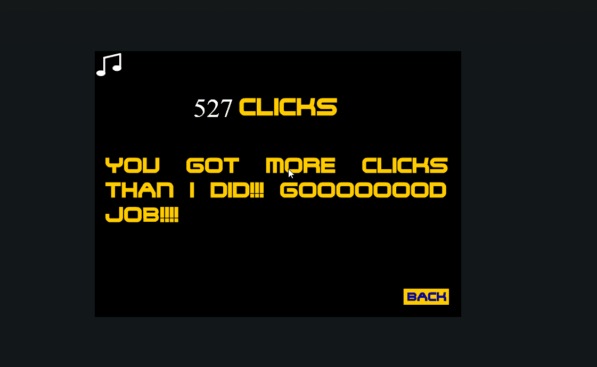

---

title: pyautoGUI+pyHook
date: 2019-1-1 20:37:45
categories: backEnd
tags:
- python🐍
- 第三方库
- 后端
- 所有文章

---

## 复习 PyAutoGUI 的函数

本章介绍了许多不同函数，下面是快速的汇总参考<br/>
:::warning 注意
pyautogui.FAILSAFE=False#关闭文件安全
记得引入pythoncom
:::
### 速览
获取当前屏幕分辨率<br/>

screenWidth, screenHeight = pyautogui.size()<br/>

获取当前鼠标位置<br/>

currentMouseX, currentMouseY = pyautogui.position()<br/>

鼠标双击<br/>

pyautogui.doubleClick()<br/>

moveTo（x，y）将鼠标移动到指定的 x、y 坐标。最左上角为0，0<br/>

moveRel （xOffset，yOffset）相对于当前位置移动鼠标。<br/>

dragTo（x，y）按下左键移动鼠标。<br/>

dragRel （xOffset，yOffset）按下左键，相对于当前位置移动鼠标。<br/>

click（x，y，button）模拟点击（默认是左键）。<br/>

rightClick() 模拟右键点击。<br/>

middleClick() 模拟中键点击。<br/>

doubleClick() 模拟左键双击。<br/>

mouseDown（x，y，button）模拟在 x、y 处按下指定鼠标按键。<br/>

mouseUp（x，y，button）模拟在 x、y 处释放指定键。<br/>

scroll （units）模拟滚动滚轮。正参数表示向上滚动，负参数表示向下滚动。<br/>

## 控制鼠标

import pyautogui

pyautogui.PAUSE=1　　　　　　#将 pyautogui.PAUSE 设置为 1，即每次函数调用后暂停一秒。<br/>

pyautogui.FAILSAFE=True　　　　#启动自动防故障功能。<br/>

### 控制鼠标移动

|>>> import pyautogui<br/>

|>>> pyautogui.size()<br/>

(1920, 1080)　　　　　　　　#分辨率为 1920 × 1080 的计算机<br/>

|>>> width, height = pyautogui.size()<br/>

### 移动鼠标
|>>> import pyautogui<br/>

|>>> for i in range(10):<br/>

pyautogui.moveTo(100, 100, duration=0.25)<br/>

pyautogui.moveTo(200, 100, duration=0.25)<br/>

pyautogui.moveTo(200, 200, duration=0.25)<br/>

pyautogui.moveTo(100, 200, duration=0.25)　　　　#根据提供的坐标，以正方形的模式顺时针移动鼠标，移动了 10 次。每次移动耗时 0.25 秒，<br/>


|>>> import pyautogui<br/>

|>>> for i in range(10):<br/>

pyautogui.moveRel(100, 0, duration=0.25)<br/>

pyautogui.moveRel(0, 100, duration=0.25)<br/>

pyautogui.moveRel(-100, 0, duration=0.25)<br/>

pyautogui.moveRel(0, -100, duration=0.25)<br/>

#pyautogui.moveRel() 也接受 3 个参数：向右水平移动多少个像素，向下垂直移动多少个像素，以及（可选的）花多少时间完成移动。为第一第二个参数提供负整数，鼠标将向左或向上移动。<br/>

|>>> import pyautogui<br/>

|>>> pyautogui.click(10, 5)<br/>
## 键盘
typewrite（message）键入给定消息字符串中的字符。<br/>

typewrite（[key1，key2，key3]）键入给定键字符串。<br/>

press（key）按下并释放给定键。<br/>

keyDown（key）模拟按下给定键。<br/>

keyUp（key）模拟释放给定键。<br/>

hotkey（[key1，key2，key3]）模拟按顺序按下给定键字符串，然后以相反的顺序释放。<br/>

screenshot() 返回屏幕快照的 Image 对象（参见第 17 章关于 Image 对象的信息）。<br/>


<div align= center></div>

:::danger 注意
pyautogui并不能输入中文,他的输入只能模拟某个按键
:::

## 使用pyperclip输入中文
### 简单的API
```python
pyperclip.copy("你好呀")  # 先复制
pyautogui.hotkey('ctrl', 'v')  # 再粘贴
```
## PyHook
:::warning 注意环境
一般使用pyhook3但是pyhook并不支持python3<br/>
会出现错误，python3使用扩展库pyhook_py3k<br/>
hook不支持python3，pyhook_3k也只支持32位<br/>
建议用QT
:::
### API
舰艇鼠标键盘配合pyautogui使用事半功倍
```python
# -*-coding:utf-8 -*-
import pythoncom
import pyHook
def onMouseEvent(event):

    # 监听鼠标事件
    print "MessageName:",event.MessageName
    print "Message:", event.Message
    print "Time:", event.Time
    print "Window:", event.Window
    print "WindowName:", event.WindowName
    print "Position:", event.Position
    print "Wheel:", event.Wheelkkk9
    print "Injected:", event.Injected
    print"---"

    # 返回 True 以便将事件传给其它处理程序
    # 注意，这儿如果返回 False ，则鼠标事件将被全部拦截
    # 也就是说你的鼠标看起来会僵在那儿，似乎失去响应了
    return True

def onKeyboardEvent(event):
 # 监听键盘事件
  print "MessageName:", event.MessageName
  print "Message:", event.Message
  print "Time:", event.Time
  print "Window:", event.Window
  print "WindowName:", event.WindowName
  print "Ascii:", event.Ascii, chr(event.Ascii)
  print "Key:", event.Key
  print "KeyID:", event.KeyID
  print "ScanCode:", event.ScanCode
  print "Extended:", event.Extended
  print "Injected:", event.Injected
  print "Alt", event.Alt
  print "Transition", event.Transition
  print "---"
  # 同鼠标事件监听函数的返回值
  return True

def main():
  # 创建一个“钩子”管理对象
  hm = pyHook.HookManager()
  # 监听所有键盘事件
  hm.KeyDown = onKeyboardEvent
  # 设置键盘“钩子”
  hm.HookKeyboard()
  # 监听所有鼠标事件
  hm.MouseAll = onMouseEvent
  # 设置鼠标“钩子”
  hm.HookMouse()
  # 进入循环，如不手动关闭，程序将一直处于监听状态
  pythoncom.PumpMessages()

if __name__ == "__main__":
  main()
```
:::tip 其他方式
PyQt5对鼠标键盘进行监听看<a href=''>这里</a>
:::
<Valine></Valine>