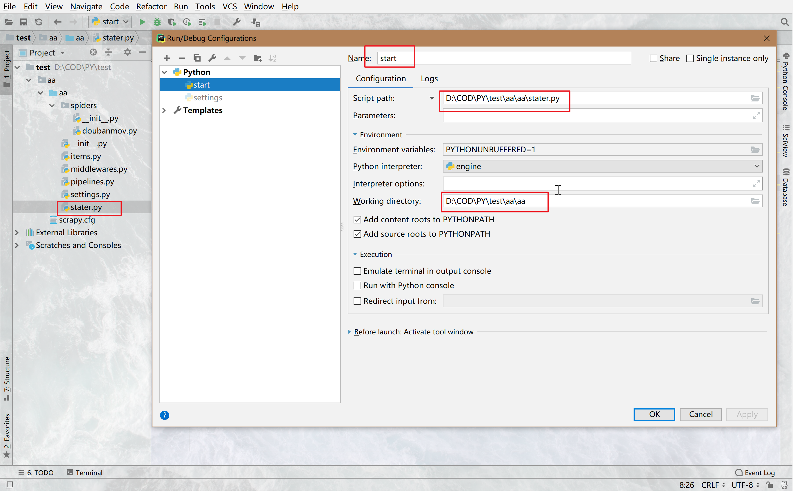
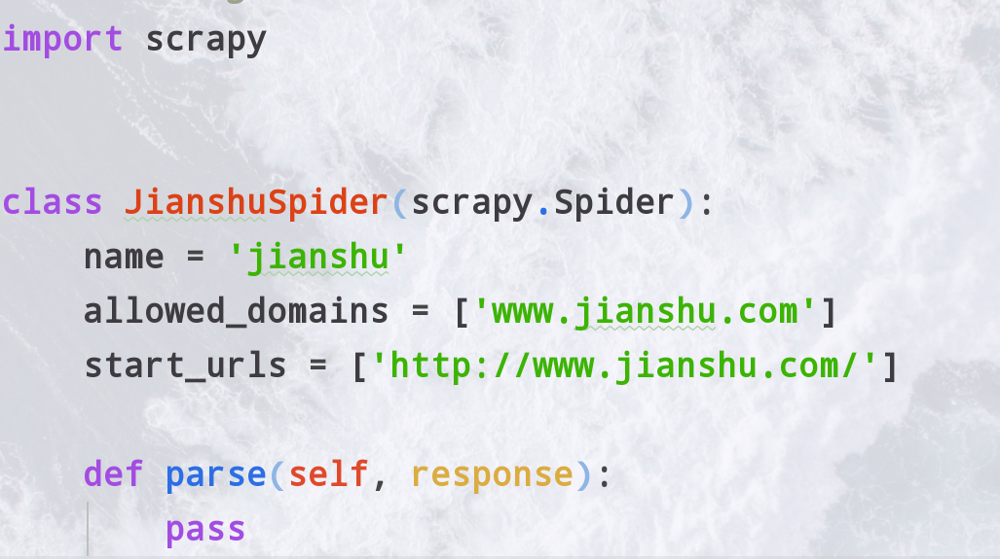
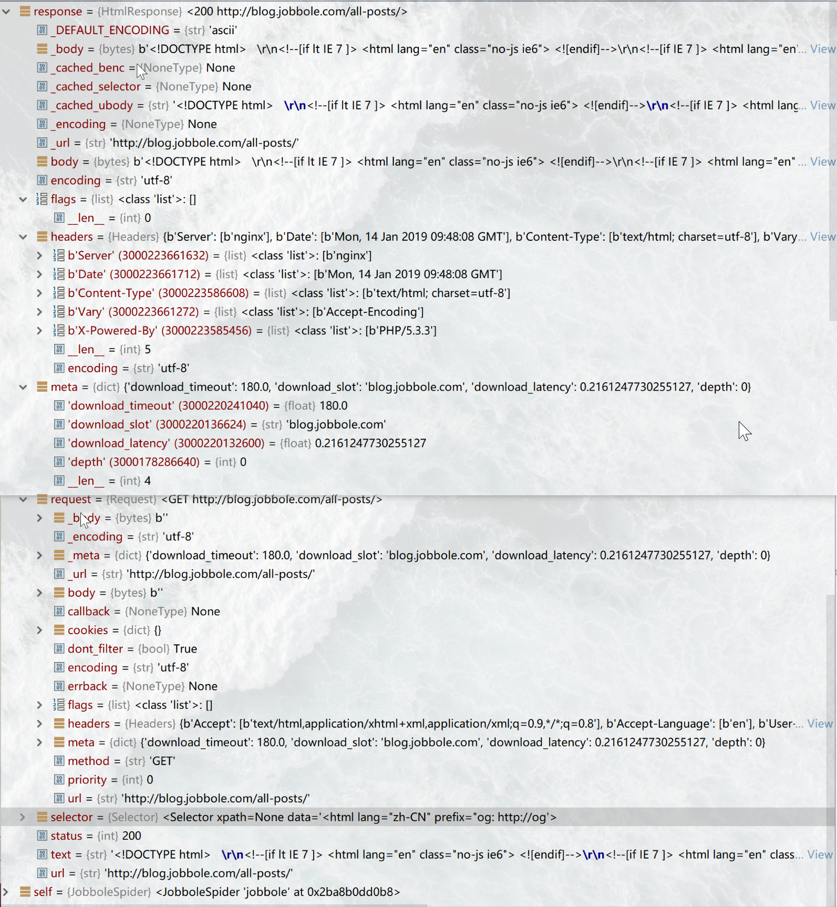
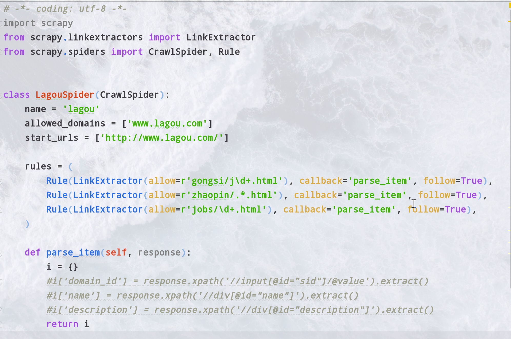
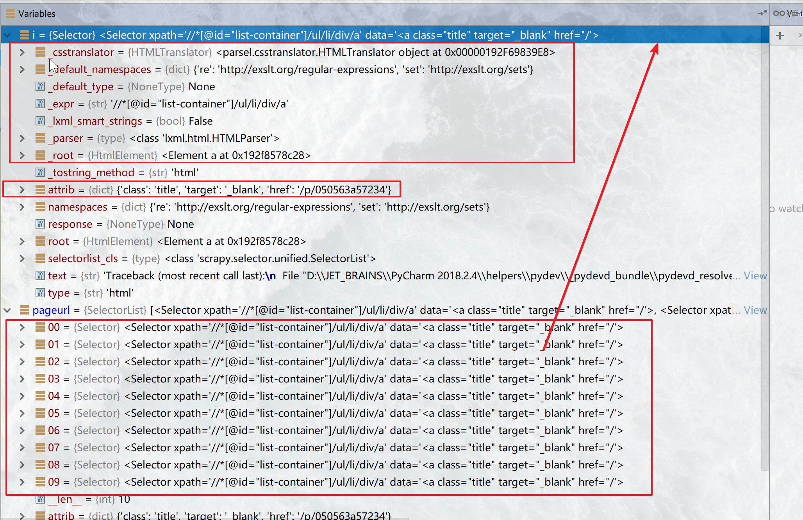
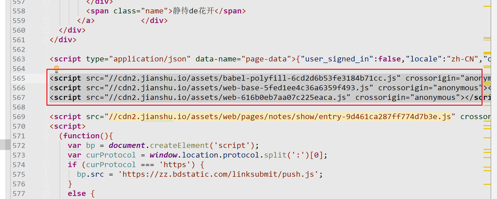
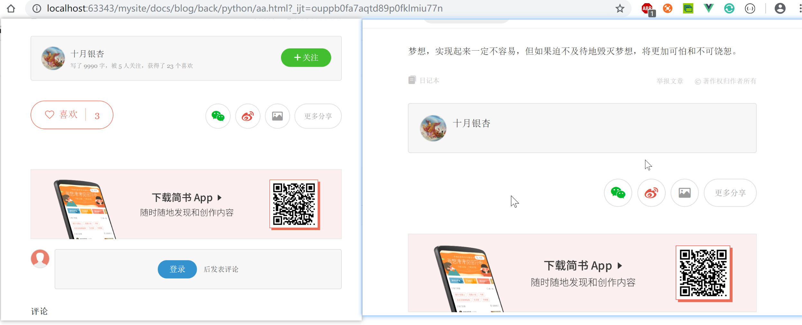
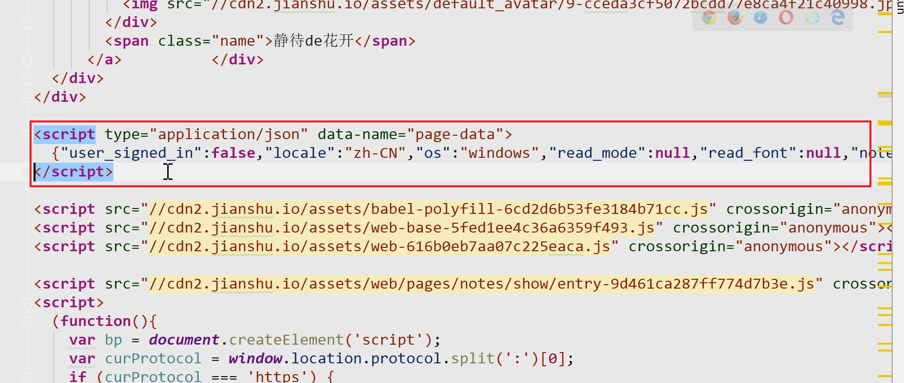
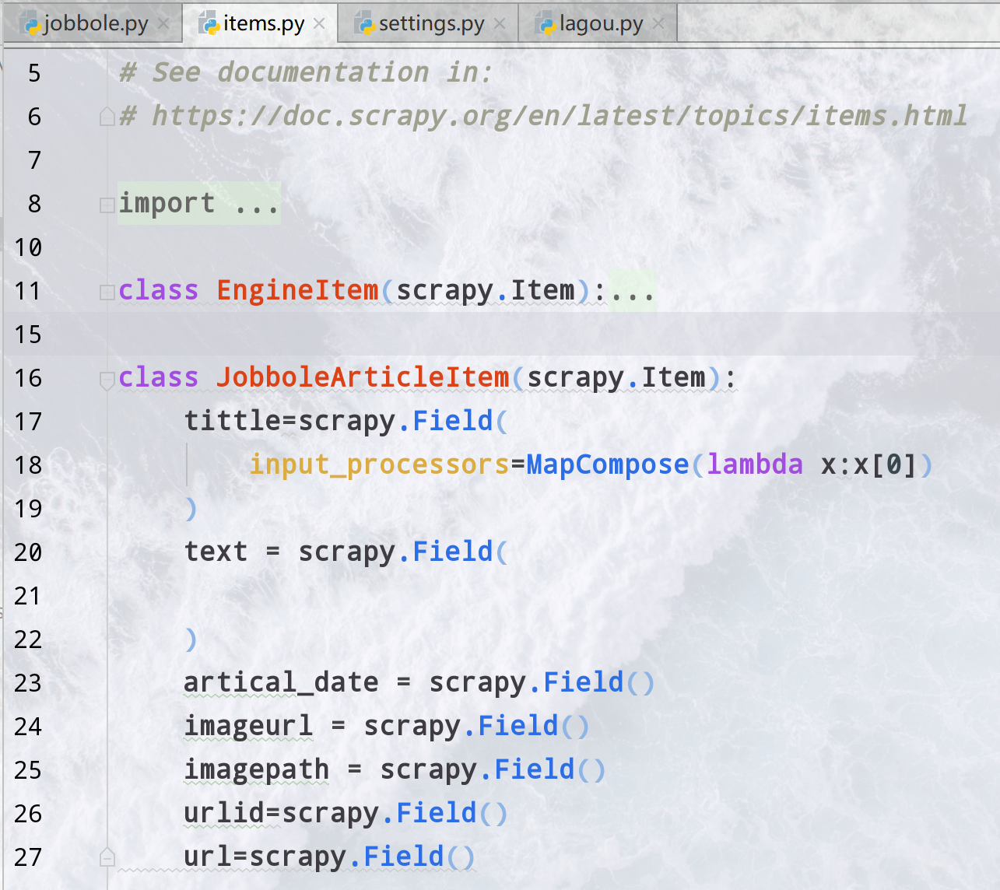
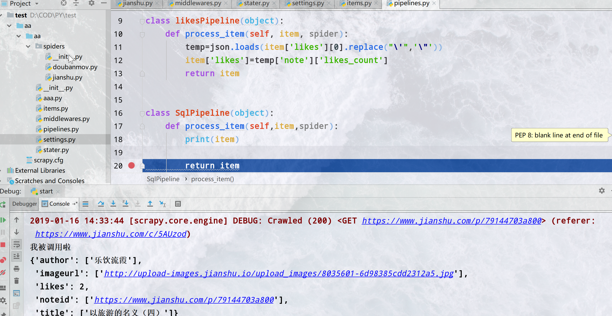

<div align= center><h1>Scrapy介绍</h1></div>
<div align= center><h3>异步</h3>
engine异步调用缩短事件
<h3>事件循环</h3>
对象传递+事件循环<br/>
spider—>item—>pipline
<h3>定制化</h3>
定制的pipline集中存储<br/>
selector+xpath定位爬取
</div>

## Setting&命令
<h3>环境</h3>

设置好环境python路径等等<br/>
从wheel找
- pywin32
- pillow
- tiwsted
:::danger
不能只装pymysql需要MYSQLdb<br/>
安装MYSQLdb也就是mydqlclient和pymysql<br/>
如果失败apt-get install python-devel mysql-devel
:::

<h3>http状态码</h3>


          code说明
          200请求被成功处理
          301/302永久性重定向/临时性重定向
          403没有权限访问
          404表示没有对应的资源
          500服务器错误
          503服务器停机或正在维护

<h3>命令行</h3>


          scrapy startproject name
          #新建一个工程,并cd 进目录中去
          scrapy genspider [-t crawl] name xxx.com
          #生成一个xxx爬虫，注意域名只需要www.xxx.com就行二级域名直接填
          不填写就是默认的 spider 填写最常用的就是crawl
          scrapy crawl spidername
          #命令行运行spidername爬虫


:::warning
你新建的爬虫名字不能与网站名字，项目名字相同，你的名字会在spider中有一个变量表示
:::

<h3>pycharm启动</h3>
新建一个py文件写入如下内容，在pycharm中作如下设置

```py
#import your model here
from scrapy import cmdline
#your class&function here

if __name__ == "__main__":
    cmdline.execute(["scrapy", "crawl", "爬虫名字"])

```
<div align= center></div>

这样直接F5就可以运行整个程序了
<h3>修改setting</h3>

```py
import os,sys
project_dir=os.path.abspath(os.path.dirname(__file__))#获取了当前文件也就是setting的目录
IMAGES_STORE = os.path.join(project_dir,"images")#设置image的存储文件夹为当前目录下的image
```

:::tip (oﾟvﾟ)ノ
把setting中的ROBOTSTXT_OBEY = True设置为False不然会很蠢
:::
更多设置的作用在<a href='#setting的一些常用'>这里</a>
## Spider
### 普通spider
新建了一个spider是这样的<br/>
<div align= center ></div>

这个类接继承了Spider
- name就是爬虫名字
- allow_domins就是允许爬哪个域名的范围
- start_urls是一个开始爬取那些url的列表

parse1()->parse2()->...->trans()
一开始会初始的url，然后把response传给parse1，parse1进行处理在传给parse2最后给一个函数(trans)形成item传给pipline
<h4>parse函数</h4>
定义parse函数，默认接受一个response对象<br/>
response对象:<br/>

<div align= center></div>
这个对象的基本的url，text，status，encoding，headers是基本属性。重点说一下meta，selector和request
<br/>request是一个Request对象，是一个完整的请求信息，解析去重模块中将要使用的就是这个request中的信息。<br/>
在*异步代码*中不要使用同步代码，会导致阻塞性能下降严重。<br/>
自动往下爬取<br/>

从这个response中提取出还有需要爬取的url我们需要继续访问，这时候我们要用Request函数<br/>
```py
from scrapy import Request
def func(self, response):
  response.meta[k]#这样就和字典一样取出了v
  process...
  yield Request(url='localhost',meta={k:v},callback=self.func)
```
这时候会yield一个Request对象出去，请求一下传入的url，把本次process解析的东西作为一个*字典*传给meta,这样就实现了解析内容的传递
:::tip
可以直接指向self,这样这个请求还会回来调用自身，形成一个隐式递归。<br/>
注意递归的边界条件即url爬取到什么时候要传入trans函数存入<br/>
否则就会一直执行下去直到所有的url都访问过了
:::
最常见的情况即解析一个页面，拿一些内容在meta中传递给trans函数或下一个parse，然后再这个页面里的某些url(比如下一页等)继续Request调用自身
<br/>Request的参数
- url是请求的地址
- callback 请求完之后的回调，传入一个response
- method='GET' 请求方法Get/Post
- headers 请求头
- body 请求body
- cookies 使用哪个cookie
- meta meta用来传递值
- encoding='utf-8' 编码
- priority=0 在scheduler中的优先级
- dont_filter=False 要不要被scheduler去重
:::tip
header，cookie，UA可以在这里加也可以在middleware集中加在这里加只会对这个Request发起的请求有效其他Request使用middleware的
:::


<h4>形成Item传递给pipline</h4>

trans()<br/>
定义一个解析函数,这个函数接受一个response,它会解析response中的内容，利用Xpath或者CssSelector选择自己想要的内容
最后形成一些变量，将这些变量通过item\['k']或Itemloader赋值给item最后yield出去
<h3>使用item</h3>

```py
#文件顶部引入
from engine.items import MyItem
...
item=MyItem()
item['x']=变量a
item['y']=变量b
yield item

```
这个item会传到pipline中去

### CrawlSpider
全站爬虫需要注意的地方有去重，url处理，Request转发<br/>
不再需要自己寻找url，scrapy会自己处理通过*Rule*进行筛选，符合allow_domins和rule的就会自动抓取，然后解析该页面所有包含的url
,符合条件的继续递归Rule使用正则进行定义
新建一个之后是这样的(为了便于讲解我改过了)
<div align= center></div>
这里rule是一个LinkExtractor定义的类

- allow(正则匹配符合的就请求)
- callback(请求之后传入哪个函数,一般是传入要进行解析的函数)
- follow(符合本规则的页面是否继续往下爬)
- unique（boolean）是否去重
- attrs（list）在查找要提取的链接时应该考虑的属性或属性列表（仅适用于参数中指定的那些标签tags ）。默认为('href',)

### Xpath和Css选择器
<h3>语法看<a href='/爬虫.html#xpath-cssselector'>这里</a></h3>
<BR/>

从网页源代码中提取自己想要的字段就要用scrapy中的提取器(scrapy的提取器速度快，异步操作友好)selector
<br/>
- selector=response.css('css selector')<br/>
- selector=response.xpath('xpath')<br/>

拿出来的是一selector对象或者是SelectorList(在由多个节点情况下),调用selector.extract[0],获取内容
这个方法等价于selector.extract_first()
这里是再爬简书的时候，拿到这个ul的列表之后xpath得到的是下面所有的元素节点的SelectorList对象，包含子节点的seector,可以先调用
属性像这样<br/>

<div align= center></div>
上面的下划线开头的是meta属性最好不要进行操作，selector的attr['pros']直接获取对象的属性
<div align= center></div>
selector可以继续调用css和xpath如上图

:::tip
urllib.parse import urljoin<br/>
pageurl=urljoin(base="https://www.jianshu.com",url=i.attrib["href"])<br/>
urljoin可以把url和域名连接起来，保证不会出错
:::


### 使用Itemloader
<h4>使用itemloader便于维护</h4>

from scrapy.loader import ItemLoader<br/>
同样，你需要实例化一个Item
item=ItemLoader(item=JianshuItem(),response=response)<br/>
把自己导入的item和函数接受得到的response传给它
接下来你可以添加属性
主要用
- item.add_xpath('FieldName','一个xpath')
- item.add_css('FieldName','一个cssselector')
- item.add_value('FieldName',随便什么变量)
最后记得return item.load_load()出去
```py
def parse_item(self,response):
    item=ItemLoader(item=JianshuItem(),response=response)
    item.add_xpath('title','/html/body/div[1]/div[2]/div[1]/h1/text()')
    item.add_value('likes',re.findall('<script type="application/json" data-name="page-data">(.*?)</script>',response.body.decode('utf-8')))
    item.add_css('author','body > div.note > div.post > div.article > div.author > div > span > a::text')
    item.add_value('noteid',response.url)
    item.add_value('imageurl',response.meta['imageurl'])
    return item.load_item()


```
:::danger 注意
item_loader和extract默认吧item赋值都是以list的形式
:::
<h3>简书分析</h3>

简书这样的网站文章是html里面直接存在的，而下面的作者，评论，喜欢打赏是js加载出来的
直接获取xpath和cssselector是不行的
<div align= center></div>
<h4>去掉这几个js后会这样</h4>

<div align= center></div>

数据是随着html中的一个\<script type="application/json" data-name="page-data">来的

<div align= center></div>

用正则匹配到这个字符串，在pipline中拿出我们想要的数据即可
## Item

### 定义item的Filed
Item定义在items.py里面一般这个字段是你想对应到db里面的字段,用scrapy.Field()来定义,在spider中赋值的时候就可以像给字典赋值一样直接赋值
只有被定义的字段才可以被赋值。
可以做一些处理处理过后才放到piplines中去<br/>


<div align= center></div>


### 输入输出处理器


在Field中可以定义输入处理和输出处理器(就是生命周期钩子)，指定一个函数，
当item被return的时候先调用输入再调用输出处理对字段加工然后给pipline
是在return的时候才会进行<br/>
默认的有几种processor，可以定义一个函数用MapCompose自己添加<br/>
SelectJmes，Identity，TakeFirst，Compose，MapCompose
<br/>

input_processor=MapCompose(一个匿名函数),<br/>
output_processor=TakeFirst(),<br/>
这里的值没有变，用一个匿名函数初步处理一下想要直接处理清楚可以直接用pipline


```py

def callme(value):
    print("我被调用啦")
    return value

class JianshuItem(scrapy.Item):

    title=scrapy.Field()
    likes=scrapy.Field(
        output_processor=MapCompose(callme))#把这个里面的东西出来
    author=scrapy.Field()
    imageurl=scrapy.Field(
        input_processor=MapCompose(lambda x: "http:"+x.split("?")[0])
    )
    noteid=scrapy.Field()

```

### django scrapy item
:::danger 留坑
写简书的时候试试
:::
## Pipline

首先在setting中开启pipline取消ITEM_PIPELINES的注释
这个字典一样的结构是流经顺序,数字越小这个pipline会先流经,item就像流经管道一样一个一个流过pipline会取下或者修改item的字段,存入sql或whatever然后return出去
让他流经下一个pipline像这样
```py
ITEM_PIPELINES = {
   'aa.pipelines.likesPipeline': 1,
   'aa.pipelines.SqlPipeline': 2,
}

```


<h3>定义process_item</h3>

默认接受一个item和一个spider，item就是你在item中定义的,像调用字典一样调用item
按照上面说的顺序最后别忘了return出去给下一个pipeline用

```py
class MyPipline(object):
    process_item(self, item, spider):
      ...
      return item
```
像取字典一样直接取然后赋值就可以了
先经过了likespipeline，拿出这个字符串我们想要的部分(做处理)，然后流到了SqlPipeline被打印了出来
<div align= center></div>

### 图片Pipeline
很多情况下是三种最常用的media,file,image有对应写好的pipline内置引入
```py
#piplines文件中引入
from scrapy.pipelines.images import ImagesPipeline

setting中指明两个变量
IMAGES_URLS_FIELD = "imageurl"#哪个字段是image的url
IMAGES_STORE = os.path.join(project_dir,"image")#存在哪个路径下
添加进piplines中
ITEM_PIPELINES = {
'scrapy.pipelines.images.ImagesPipeline':1,#普通的图片pipeline
                  }
```
:::warning
这个imageurl应该是个列表形式,不要取出来会报错
:::
<h4>自定义存放路径的imagepipline</h4>

<br>

首先引入并继承ImagesPipeline
重写def item_completed(self, results, item, info)
<br>自己打断点看里面的变量,改变想要的变量即可
```py
class JobboleImagePipline(ImagesPipeline):#自定义的管道进行路径存放
    def item_completed(self, results, item, info):
        for status,p in results:
            try:
                item["imagepath"]=p["path"]
                item["imageurl"]=item["imageurl"][0]
            except TypeError:
                item["imageurl"]="None"
                item["imagepath"] = "None"
        return item
 ```

### 插入sql数据库
在这个函数里取出值然后存进去例子
```py
class SqlPipeline(object):#构造sql语句并执行即可
    def process_item(self,item,spider):
        '''item={'author': ['城北听雪'],
        'imageurl': ['http://upload-images.jianshu.io/upload_images/14074951-f700da6a9b168924.jpg'],
        'likes': ['33'],
        'noteid': ['https://www.jianshu.com/p/3e652aafb69b'],
        'title': ['5天流浪加德满都，给你看一个不一样的真实尼泊尔']}'''
        a={ k:v[0] for k,v in item.items()}#构造字符串
        str1 = ",".join([i for i in a.keys()])
        str2 = "','".join([i for i in a.values()])
        sql="INSERT INTO jianshu ({0}) VALUES ('{1}')".format(str1,str2)#构造sql
        conn=pymysql.connect(host='127.0.0.1',port=3306,user='root',db='jobol',password='不告诉你',charset='utf8mb4')
        cur=conn.cursor()
        try:
            cur.execute(sql)
            conn.commit()
        except Exception as e:
            conn.rollback()
            print(e)
        finally:
            cur.close()
            conn.close()
        return item

```

打印出来的sql应该像这样


      INSERT INTO jianshu
      (author,imageurl,likes,noteid,title)
      VALUES
      ('城北听雪','http://upload-images.jianshu.io/upload_images/14074951-f700da6a9b168924.jpg','33','https://www.jianshu.com/p/3e652aafb69b','5天流浪加德满都，给你看一个不一样的真实尼泊尔')


### 异步插入sql
首先定义新的pipline，然后开始编写异步插入的pipline
需要pywin32,twisted<br/>
<h4>写法很固定，记住怎么写理解这是做什么的</h4>

```py
import pymysql
from twisted.enterprise import adbapi
import pymysql.cursors
#先引入

class asyPipeline(object):
    def __init__(self,dbpool):#默认传入一个连接池
        self.dbpool=dbpool

    @classmethod#声明一个类方法
    def from_settings(cls,settings):
    #注意是settings有S这个类方法和实例没有关系,接受一个setting也就是我们的配置文件
    #把变量拿过来，传入adbpool里面定义一个dbpool
        dbpool=adbapi.ConnectionPool('pymysql',
                                     host=settings['MYSQL_HOST'],
                                     db=settings['DB_NAME'],
                                     user=settings['MYSQL_USER'],
                                     password=settings['MYSQL_PASSWOED'],
                                     charset=settings['CHARSET'],
                                     cursorclass=pymysql.cursors.DictCursor,
                                     use_unicode=True)
    #这里可以写死也可以用这个方法读取setting里面的配置信息(建议)
        return cls(dbpool=dbpool)

    def process_item(self,item,spider):

        query=self.dbpool.runInteraction(self.do_insert, item)
        #执行，相当于loop启动，定义一个变量来代表
        query.addErrback(self.handler)
        #制定错误处理函数

    def do_insert(self,cursor,item):
        '''执行查询的函数'''
        a = {k: v[0] for k, v in item.items()}  # 构造字符串
        str1 = ",".join([i for i in a.keys()])
        str2 = "','".join([i for i in a.values()])
        sql = "INSERT INTO jianshu ({0}) VALUES ('{1}')".format(str1, str2)  # 构造sql
        cursor.execute(sql)

        #不能用try异步没有try
    def handler(self,failure):#定义错误处理
        print(failure)#打印错误


```
:::danger 注意
不能用try，异步里面没有try
:::

### 插入mongo
### 保存为json
```py

class JsonPipeline(object):
    def process_item(self,item,spider):
        a = {k: v[0] for k, v in item.items()}#格式化一下
        with open(r'jianshu.json','a',encoding='utf-8') as f:
            json.dump(a,f,ensure_ascii=False)
            f.write('\n')
```

<div align= center></div>


## Middleware

是一个钩子系统，注入到生命周期中可扩展性好
donwloader middlewaer用得最多，
spidermiddleware没怎么用
每次爬的时候经过一次中间件,像pipline一样流过最后在进行请求<br/>
主要作用更换代理IP，更换Cookies，更换User-Agent，自动重试
<h4>重写process_request</h4>(self,request,spider):

### 随机User-Agent
可以在setting里面制定UA<br/>
*USER_AGENT = 'Mozilla/5.0 (Windows NT 6.1) AppleWebKit/537.36 (KHTML, like Gecko) Chrome/41.0.2228.0 Safari/537.36'*
所有的都会用这个UA<br/>
```py
import fake_useragent
class RandomUAMiddleware(object):
    def process_request(self,request,spider):
        ua=fake_useragent.UserAgent()
        request.headers.setdefault('User-Agent',ua.random)
```
网上很多用UAlist的，基本就是import一下，然后random取一下<br/>

<h4>fake_ua了解一下？</h4>
git搜所第一个就是，可以直接pip安装<br/>

基本使用
```py
from fake_useragent import UserAgent
ua = UserAgent()
ua.random#直接随机返回一个头
ua.ie#返回ie的头
```
:::tip 可用的头
ie,msie,opera,chrome,google,firefox,ff,safari
:::

### IP代理
同样是操作reuest的meta信息

```py
import random
#from settings import IPpool
class IPproxyMiddleware(object):
    def process_request(self,request):
        '''引入一个ip池或请求一次(购买的)接口,随机选择一个ip就可以'''
        request.meta["proxy"] = random.choice(["https://222.223.115.30:51618"])
```

### 使用cookie

```py
class cookieMiddleware(object):
    def process_request(self,request,spider):
        request.cookies ='通过接口或什么方式拿到你的cookie'

    def process_response(self, request, response, spider):
        '''
        对此次响应进行处理
        如果请求不成功怎么处理
        如果cookie失效怎么办
        '''
        pass
```

:::tip TIP
最好自己搭建代理池和cookie池，用的时候直接调用接口
<br>后续我在出这个
:::

:::warning
请求头携带的Cookie必须是一个字典，不能直接设置成字符串
:::

### 自动重试中间件
setting的dowloadermiddlware中<br/>
*scrapy.downloadermiddlewares.retry.RetryMiddleware:6*
<h4>相关设置</h4><br/>
- RETRY_ENABLED: 是否开启retry(True)

- RETRY_TIMES: 重试次数(3)

- RETRY_HTTP_CODECS: 默认[500,502,503,504,408]


### 集成selenium
selenium可以直接在中间件直接写
```py
class seleniumMiddleware(object):
    def __init__(self):
        self.broswer = webdriver.Chrome(executable_path=r'D:\57635\chromedriver.exe')
        super().__init__()
    def process_request(self,request,spider):
        if spider.name=='jianshu':
            self.broswer.get(request.url)
            time.sleep(2)
            print('selenium访问{}'.format(request.url))

            return HtmlResponse(url=self.broswer.current_url,
                                body=self.broswer.page_source,
                                encoding='utf-8',
                                request=request)

```
但是当一个spider结束的时候浏览器也不会退出，这样导致消耗资源
<h4>在spider中是直接写</h4>
在spider中添加

```py
from selenium import webdriver
from scrapy.xlib.pydispatch import dispatcher
from scrapy import signals

...
    def __init__(self):
        self.broswer = webdriver.Chrome(executable_path=r'D:\57635\chromedriver.exe')
        super().__init__()
        dispatcher.connect(self.spider_closed,signals.spider_closed)#信号量

    def spider_closed(self,spider):
        print("完成")
        self.broswer.quit()#退出

...

middlware:
import time
from scrapy.http import HtmlResponse
class seleniumMiddleware(object):

    def process_request(self,request,spider):
        if spider.name=='jianshu':
            spider.broswer.get(request.url)
            time.sleep(2)
            print('selenium访问{}'.format(request.url))

            return HtmlResponse(url=spider.broswer.current_url,
                                body=spider.broswer.page_source,
                                encoding='utf-8',
                                request=request)

```
解释一下，这里引入的是dispatch和信号signal，signal是scrapy各种对象生命周期信号，我们在这里写的是当一个爬虫结束的时候执行self.spider_closed函数，和信号绑上，这里和django里面的信号很像
后面再讲
这样在一个spider结束的时候就会退出浏览器

## Schduler&Other

### Schduler去重机制

Schduler是一个调度器，这里面是一些队列存放了所有待爬的已经爬了的等等，整个框架的队列都在这里面,去重和分布式开发插件开发的时候会用到
利用set去重

:::danger 留坑
看源码之后再写
:::
### 生命周期信号量

## 分布式开发留坑

<Valine></Valine>

