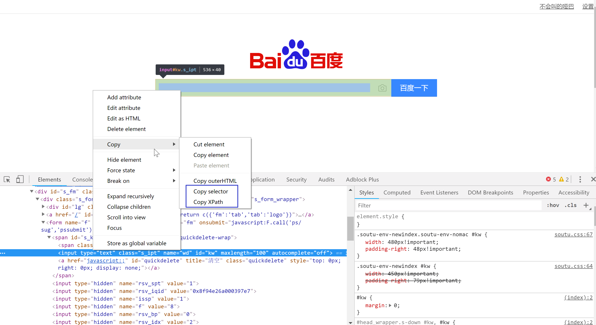
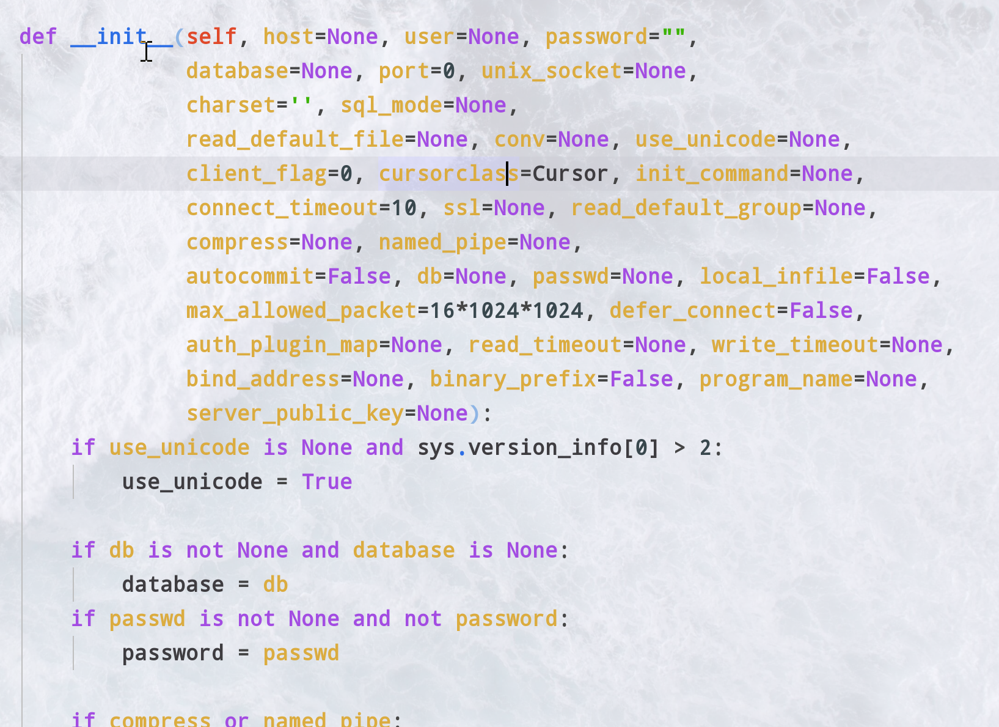

:::tip 基本知道的爬虫
好多自己看吧
:::
<!-- more -->

## 爬虫的基本原理
基本就是三部分
### 请求
请求就是http，把网页的源码下载到本地(内存)进行访问的，经常用的有urlib(太老一般只用到urljoin)，requests，scrapy(框架)，twisted(异步事件驱动)，aiohttp(异步)
请求一般用get(直接获取资源)post(表单验证)set等后面不常用<br/>这里会涉及到反爬<br/>
- 对网站感兴趣,分析网络请求，用scrapy写爬虫爬取数据<br/>
监控发现某个时间段访问陡增，ip相同，userag-ent都是python，直接限制访问（不能封ip）
- User-agen模拟firefox，获取ip代理<br/>
发现ip变化，直接要求登录才能访问
- 注册账号，每次请求带cookie或者token<br/>
健全账号体系，即A只能访问好友的信息
- 注册多个账号，多个账号联合爬取<br/>
请求过于频繁，进一步加剧ip访问频率限制
- 模仿人请求，限制请求速度<br/>
弹出验证码，让识别验证码
- 通过各种手段识别验证码<br/>
增加动态网站，数据通过js动态加载，增加网络分析复杂度，发现大量请求只请求html，不请求image和CSS
- 通过selenium和phantomjs完全模拟浏览器操作<br/>
12成本太高，放弃了！！！！
### 处理
BS4,pyQuery,lxml等解析DOM和文件涉及到寻找属性定位xpath,seletor,css定位
最后产生一个自己想要的数据结构
### 存储
拿到这个结构的时候，存到数据库。<br/>
pymysql(推荐),aiomysql(异步),存为文件(FileIO)scrapy的pipline,推送消息等等
twisted+pymysql(手动异步)while+eventloop驱动

### 去重
爬虫去重策略
1. 将访问过的url保存到数据库中
2. 将访问过的url保存到set中，只需要*O*(1)的代价就可以查询url极限100000000\*2byte*50个字符/1024/1024/1024=9G
3. url经过md5等方法哈希后保存到set中
4. 用bitmap方法，将访问过的url通过hash函数映射到某一
5. bloomfilter方法对bitmap进行改进，多重hash函数降低冲突
:::danger 留坑
布隆过滤器
:::
## 请求
### requests
request的基本使用<br/>
返回的是一个
一般post之前要查看一下正常的post有没有加密，要不要重写，
:::danger 留坑
js断点调试fiddler抓包
:::
#### get()&post()
1. get(url,参数),写图片
返回的是一个response对象，包含状态码请求成功与否等等
```py
    data={
        "name":"zhizhi",
        "age":20
    }
    files={"files":open("baidu.png","rb")}
    res=requests.get("http://www.httpbin.org/get",params=data)#构造一个参数并传进去
    print(res.text)#直接返回字符串
    print(res.json())#直接解析json
    print(res.contnet)#返回网页原始内容
    print(res0.status_code)#请求的状态码
    res0.encoding="utf-8"#把网页的编码转换
    res1=requests.get("https://www.baidu.com/img/bd_logo1.png")
    len(res1.content)#图片的二进制
    with open("baidu.png","wb") as f:#写二进制图片
        f.write(res1.content)
```
2. 使用header
```py
headers={"Referer": "https://www.zhihu.com/signup?next=%2F","User-Agent":"Mozilla/5.0 (Windows NT 10.0; WOW64) AppleWebKit/537.36 (KHTML, like Gecko) Chrome/70.0.3538.102 Safari/537.36"}
res3=requests.get("https://www.zhihu.com",headers=headers)#添加headers,像某呼这种不加header就不给访问
print(res3.text)

```
3. 传入文件并使用cookie
<br/>data被传入了cookie中可以访问了
```py
res4 = requests.post("http://www.httpbin.org/post", data=data,headers=headers, files=files)
 # 构造一个form并传进去
pprint(res4.text)
print(res4.cookies)
for k,v in res4.cookies:
    print(k,":",v)
```
4. session维持会话，一般session会很久
```py
s=requests.session()#维持会话
s.get("http://www.httpbin.org/cookies/set/abc/svsvdhasb",verify=False)
# 不进行证书验证，可使用cert=("path/server.crt","path/ket")进行证书验证
res5=s.get("http://www.httpbin.org/cookies")
print(res5.text)
```
5. 使用ip代理
常用的代理有西刺也可以自己买
```py
proxies={"https":"127.0.0.1:9900"}#使用代理
res6=requests.get("http://www.httpbin.org/get",proxies=proxies)
print(res6.content)
```
### selenium
selenium浏览器驱动。<br/>当某些网页动态加载js的时候(淘宝)我们需要程序去执行js，(效率自然会低一些)这就是selenium的作用
phantomjs(无界面浏览器)也行但是在多进程的情况下性能下降严重。
<br/>
使用之前先下载一个driver<a href='https://npm.taobao.org/mirrors/chromedriver/2.34/'>淘宝镜像</a>
```py
from selenium import webdriver
broswer.get('http://www.baidu.com')#打开
print(broswer.page_source) # 拿到F12的代码(经过渲染的)
broswer.maximize_window()#最大化窗口
broswer.set_window_size(600,800)#设置窗口大小
broswer.back()#后退一步
broswer.forward()#前进一步
broswer.refresh()#刷新
print(broswer.title)#拿到浏览器的标题
print(broswer.current_url)#拿到url
broswer.get_cookies()#拿到cookie
broswer.delete_all_cookies()#删除所有的cookie
broswer.add_cookie({k-v})#增加cookie
```
:::tip 可用的驱动
webdriver.Firefox<br/>
webdriver.FirefoxProfile<br/>
webdriver.Chrome<br/>
webdriver.ChromeOptions<br/>
webdriver.Ie<br/>
webdriver.Opera<br/>
webdriver.PhantomJS<br/>
webdriver.Remote<br/>
webdriver.DesiredCapabilities<br/>
webdriver.ActionChains<br/>
webdriver.TouchActions<br/>
:::
#### 查找元素
不建议使用自带的，因为会拖慢速度，性能会变差。<br/>
可以用其他的包lxml bs等代替，不过有时候不能代替
```py
print(broswer.find_element_by_id(id_="lg"))
```
1. id定位：find_element_by_id()
2. name定位：find_element_by_name()
3. class定位：find_element_by_class()
4. tag定位：find_element_by_tag_name()
5. link定位：find_element_by_link_text()
6. partial link 定位： find_element_by_partial_link_text()
7. Xpath定位:<br/>
    - 绝对路径：find_element_by_xpath("绝对路径")
    - 元素属性：find_element_by_xpath("//unput[@id='kw']")
    - 层级与属性结合：find_element_by_xpath("//form[@id='loginForm']/ul/input[1]")
    - 逻辑运算符：find_element_by_xpath("//input[@id='kw' and@class='s_ipt']")
8. CSS定位：find_element_by_css_selector()
#### 通过selenium模拟登陆微博
:::danger 失败了 留坑
后面再试，填值的时候填不上
:::
<h4> 往元素中填值并登陆</h4>

```py
ele0=broswer.find_element_by_id(id_="lg")
ele=broswer.find_element_by_id(id_="kw")
ele.send_keys(u"qwe")#模拟按键输入：
ele.clear()#清除文本：
ele.send_keys(u"abc")#模拟按键输入：
ele1=broswer.find_element_by_class_name("bg s_btn")
ele1.click()#单击元素
ele1.submit()#提交表单（相当于"回车"）
broswer.execute_script('alert("123");')#执行js
```
加载的时候不加载图片(节省性能)，如下设置

```py
from selenium import webdriver

chrome_options = webdriver.ChromeOptions()
prefs = {"profile.managed_default_content_settings.images":2}
chrome_options.add_experimental_option("prefs",prefs)

driver = webdriver.Chrome(chrome_options=chrome_options)

```
### aiohttp
异步请求的http库
:::danger 留坑
异步等过一两天再整理
:::
## 处理
数据处理就是把DOM的元素内容拿出来
### BeautifulSoup
对dom进行解析<br/>
from bs4 import BeautifulSoup as BS <br/>
dom例子

          <li id="note-36396362" data-note-id="36396362" class="have-img">
              <a class="wrap-img" href="www.baidu.com" target="_blank">
                
              </a>
            <div class="content">
              <a class="title" target="_blank" href="www.baidu.com">罗永浩最爱的“软件”下凡了！ 让你体验高效记录的感觉</a>
              <p class="abstract">
                听说锤子又发布了新产品！ 锤子科技不是一个卖手机的好公司，却是一个搞软件的领头军，旗下的闪念胶囊和BigBang一直被赞扬，网友戏称： 锤子有三...
              </p>
              <div class="meta">
                <a class="nickname" target="_blank" href="/u/00385c37e5de">Tools指南</a>
                  <a target="_blank" href="www.baidu.com#comments">
                    <i class="iconfont ic-list-comments"></i> 3
          </a>      <span><i class="iconfont ic-list-like"></i> 46</span>
              </div>
            </div>
          </li>


```py
from bs4 import BeautifulSoup as BS
soup=BS(dom,'lxml')#生成了一个soup对象使用unicode编码
```
:::tip 注意指定编码
默认lxml<br/>
BeautifulSoup(markup, "lxml")速度快<br/>
BeautifulSoup(markup, "html.parser")系统自带<br/>
BeautifulSoup(markup, "xml")唯一支持xml<br/>
BeautifulSoup(markup, "html5lib")生成h5浏览器方式解析
:::
tag.name标签名称可嵌套soup.head.tittle<br/>
tag.attributes标签后面的属性,可添加或者修改,和字典一样<br/>
多值属性,class最多,每个tag可能用多个css<br/>
其他的rel , rev , accept-charset , headers , accesskey返回一个list非多值属性会返回str<br/>
将tag转换为str的时候多值属性会自动合为由空格隔开的字符串,xml没有多值
```py
print(soup.name,soup.attrs)#获取名字和属性
print(soup.find(class_="meta"),#获取了class为meta的第一个元素
soup.find_all_next(class_="meta"),#获这也元素的下一个邻居
soup.find_all(class_="meta"))#列表获取所有meta的元素
tag.parent#获得父节点beautifulsoup父节点为None
tag.descendants#子孙节点的递归迭代对象
tag.chlidren#是包含子节点对象对象对象的可迭代对象
```

| 方法      | 参数          | 返回  |
| ------------- |:-------------:| -----:|
| find     | (self, name, attrs, recursive, text,.… Tag | 1 |
| find_all      |   (self, name, attrs, recursive, te.. Tag   |   2 |
| find_all_previous |   (self, name, att.. PageElement    |    3 |
|find_next   |  (self, name, attrs, text.. PageElement| 4 |
| find_next_sibling     |   (self, name, att.. PageElement   |   5 |
| find_next_siblings |   (self, name, at.. PageElement    |    6 |
| find_parent    | (self, name, attrs, kw.. PageElement |7|
| find_parents      |  (self, name, attrs,1.. PageElement   |   8 |
| find_previous |   (self, name, attrs,.. PageElement   |   9 |
| find_previous_sibling     |  (self, name,.… PageElement    |   10 |
| find previous siblings |   (self, name.. PageElement   |   11 |

这是节点的一些属性，可以获取内容

:::warning
注意顿号以及换行也算节点<br/>
class_用来标识css可以部分匹配也可全匹配,全匹配的时候注意顺序若不一样无法匹配
:::


```py
print(soup.find(class_="meta"),#获取了class为meta的第一个元素
soup.find_all_next(class_="meta"),#获这也元素的下一个邻居
soup.find_all(class_="meta"),)
soup1=soup.find(name='p',class_="abstract")#获取标签为p，class="abstract"的元素
print(soup.string)#没有子节点的情况下得到字符串
print(soup1.strings)#得到多个字符串 列表
soup1=soup.find(name="div",class_="content")
print(soup1.contents)#节点的元素，是个列表
soup.get_text()#返回所有的及其孩子的文本
soup.prettify()#自动对齐补全html
```

### pyQuery
pip安装pyQuery

<h3>打开</h3>

pq=PyQuery("http://www.baidu.com")#也可以直接打开文件pq=PyQuery("aa.html")


| 类型      | 形式          | 含义  |
| ------------- |:-------------:| -----:|
| .class     | .color | 选择class="color”的所有元素 |
| #id      |   #info   |   选择id="info”的所有元素 |
| *|   *    |    选择所有元素 |
|element   |  p| 选择所有的p元素|
| element,element| div,pe|选择所有div元素和所有p元素|
| elemente lement| div pe|选择所有div元素内所有p元素|
|\[attribute]|[target]|选择带有targe属性的所有元素。|
|[arrtibute=value]|[target=_blank]|选择 target="_blank”的所有元素|

可以使用伪类<br/>
可调用的函数<br/>
- pq.find()#发现标签
- pq.parent()#发现标签的父标签
- pq.parents()#递归发现父标签
- pq.children()#发现子标签
- pq.text()#获取所有文本,忽略标签

:::warning
pq本身是具有标签的字符串
pq.html()不含本身的标签
:::
程序如下<br/>
```py
使用上面的dom
x=pq('li a')
pq.find('a')
pq.parent('a')
pq.parents('a')
pq.children('a')
print(x.attr("target","_blank"))
print(x.attr.target)
print(x.text())
```
结果


    <a class="wrap-img" href="www.baidu.com" target="_blank">
          
        </a>
      <a class="title" target="_blank" href="www.baidu.com">罗永浩最爱的“软件”下凡了！ 让你体验高效记录的感觉</a>
        <a class="nickname" target="_blank" href="/u/00385c37e5de">Tools指南</a>
            <a target="_blank" href="www.baidu.com#comments">
              <i class="iconfont ic-list-comments"/> 3
    </a>
    _blank
     罗永浩最爱的“软件”下凡了！ 让你体验高效记录的感觉 Tools指南 3


### Xpath&CssSelector
利用这些语法定位dom的元素
F12开发者模式，直接复制注意js渲染会扰乱xpath和css

<div align= center></div>


<h3>Xpath</h3>


| 类型      | 形式          |
| ------------- | -----:|
|article    |    选取所有article元素的所有子节点|
|/article    |   选取根元素article|
|article/a   |   选取所有属于article的子元素的a元素|
|//div         | 选取所有div子元素（不论出现在文档任何地方）|
|article//div  | 选取所有属于article元素的后代的div元素，不管它出现在article之下的任何位置|
|//@class      |  选区这个标签下所有名为class的属性|
|/a[@href="link2.html"]|选取所有href为"link2.html"的a标签|
|@href|拿到href标签|
|?/text()|?元素下的文本|

<h3>css选择器</h3>

| 类型      | 形式          |
| ------------- | -----:|
|*                |选择所有节点|
|#container       |选择id为container的节点|
|.container       |选取所有class包含container的节点|
|li a             |选取所有i下的所有a节点|
|ul+p             |选择l后面的第一个p元素|
|div#container>ul |选取id为container的div的第一个ul子元素|
|ul~p             |选取与ul相邻的所有p元素|
|a[title]         |选取所有有title属性的a元素|
|a[href="http:/jobbole.com"]        |选取所有href属性为jobbole.com值的a元素|
|a[href*="jobole"]                 | 选取所有href属性包含jobbole的a元素|
|a[href^="http"]                    |选取所有href属性值以http开头的a元素|
|a[href$=".jpg”]                   | 选取所有href属性值以.jpg结尾的a元素|
|input[type=radio]:checked         | 选择选中的radio的元素|
|div:not(#container)               | 选取所有id非container的div属性|
|li:nth-child(3)                   | 选取第三个i元素|
|tr:nth-child(2n)               | 第偶数个tr|
|a::text|拿到标签的文本|
|a::attr(href)|拿到标签href属性|


```py
from lxml import etree
html=etree.HTML(dom)#初始化，也可初始化本地网页etree.parse('test.html')
result = etree.tostring(html)#放入lxml中
result.decode("utf-8")#对这个html进行编码

x=html.xpath('//div[@class="content"]/text()')
print(x)
y=html.cssselect('#note-36396362 > div >.title')#拿到所有class为title的元素
for i in y:#是个列表
    print(i.text,i.attrib['href'])
```

:::danger 注意
空格和换行符也算一个文本，看结果
:::
结果


    ['\n  听说锤子又发布了新产品！ 锤子科技不是一个卖手机的好公司，
    却是一个搞软件的领头军，旗下的闪念胶囊和BigBang一直被赞扬，网友戏称：
    锤子有三...\n    ', '\n    ', '\n    ', '\n  ']
    罗永浩最爱的“软件”下凡了！ 让你体验高效记录的感觉 
    www.baidu.com


## 存储
### pymysql
- 创建连接
参数如下
<div align= center></div>

- 创建游标<br/>
可选择字典形式<br/>
- 构造sql语句<br/>
善用str.format<br/>
- 执行sql<br/>
注意错误回滚<br/>
- 拿回结果<br/>
注意指针的位置<br/>
```py
import pymysql

conn=pymysql.connect(host='127.0.0.1',
                    user='root',
                    password='不给看！！！',
                    database='aiosql',
                    charset='utf8mb4')
cur=conn.cursor(cursor=pymysql.cursors.DictCursor)
#使用DictCursor返回不再是元组是一个代映射的字典
sql='select * from aio'
try:
    reslen=cur.execute(sql)#执行sql语句
    conn.commit()#注意要提交
except:#发生错误
    conn.rollback()#回滚
    cur.close()
    conn.close()#关闭
#行为单位移动
cur.description#光标详情描述
print(cur.lastrowid)#光标
cur.scroll(2,mode='absolute')#指针指向第二条
cur.scroll(1,mode='relative')#指针相对向后移动两条
one=cur.fetchone()#结果的一条光标后移1
all=cur.fetchmany(3)#拿出三条后移3
many=cur.fetchall()#拿出三条，移到底
print(one,all,many)
```
:::danger 有坑
插入数据库要保证健壮性，特殊字符提前处理比如去掉单引号，反斜杠，编码字符等<br/>
四字节字符入库时\xF0\x9F\x99\x8F像这样 <br/>
首先修改 my.ini 编码集为utf8mb4 数据库和表改为utf8mb4<br/>
还不行的话删库重新新建选择字符集utf8mb4<br/>
连接数据库的时候改为utf8mb4重启mysqld服务
:::

### PyMongo
<strong>*pip install pymongo*</strong><br/>
mongo的操作看<a href='/blog/back/数据相关.html#mongodb'>这里</a>
<h4>连接</h4>

简写(默认连接本地)<br/>
client=MongoClient()<br/>
指定端囗和地址<br/>
client=MongoClient(localhost，27017)<br/>
使用URI <br/>
client=MongoClient(mongodb://localhost：27017/")<br/>
client.PORT,client.HOST,client.list_database_names()<br>
db=client.mydb # 使用mydb，没有就自动创建<br/>
myset=db.my_set<br>
:::tip 关闭
关闭数据库的时候调用client.close()之后仍然能使用属性，比如在打印一次也能打印出来，yinweimongo默认有个连接池，只要没满随时都能连
:::
<h4>增删改查</h4>

- 插入<br/>
<strong> *my_set.insert([{"name":"zhangsan","age":18},{"name":"lilin","age":18}])* </strong><br/>
<strong> *my_set.save({"name":"zhangsan","age":18})* </strong><br>
save的时候他会遍历，但是insert不会，所以insert快一些<br/>
- 查询这个集合所有的数据(需要用for遍历)
<strong> *my_set.find()* </strong><br>
- 查找名字为zhangsan的数据(需要用for遍历)<br/>
<strong> *my_set.find({"name":"zhangsan"})* </strong><br>
- 取出这条记录的'id'依此类推可以往后取<br>
<strong> *id=my_set.find({"name":"zhangsan"})['id']* </strong><br>
- 移除这个记录的id<br>
<strong> *my_set.remove(id)* </strong><br>
- 把name为zhangsan的age改为20<br/>
<strong> *my_set.update({"name":"zhangsan"},{'$set':{"age":20}})* </strong><br>
- 移除张三这个数据的全部记录<br>
<strong> *my_set.remove({'name': 'zhangsan'})* </strong><br>
- 删掉这个库<br/>
<strong> *db.remove()* </strong><br>

<h4>操作和查询符</h4>

1. 查询符
    - \>  大于 - $gt
    - <  小于 - $lt
    - \>=  大于等于 - $gte
    - <=  小于等于 - $lte

- age大于25的记录
<strong> *my_set.find({"age":{"$gt":25}})* </strong><br>
2. 类型判断<br/>
发现字符串类型的name<br/>
<strong> *my_set.find({'name':{'$type':2}})* </strong><br>
<div align=center>类型对照表<br></div><br>

| 类型      | 码          |
| ------------- | -----:|
|Double         |   类型代码 1|
|String    |   类型代码 2|
|Object   |   类型代码 3|
|Array         | 类型代码 4|
|Binary data   | 类型代码 5|
|Boolean    |  类型代码 8|
|Date   | 类型代码 9|
|Null    |类型代码 10|
|Regular Expression |   类型代码 11|
|JavaScript  |  类型代码 13|
|Symbol   | 类型代码 14|
|JavaScript (with scope)  |  类型代码 15|
|32-bit integer  |  类型代码 16|
|Timestamp   | 类型代码 17|
|64-bit integer   | 类型代码 18|
|Min key   | 类型代码 255|
|Max key   | 类型代码 127|

3. 条件查询

- 排序<br/>
age升序查询<br>
<strong> *my_set.find().sort([("age",1)])* </strong><br>
- 读取
跳过两条之后读六条<br/>
<strong> *my_set.find().skip(2).limit(6)* </strong><br>

- in<br/>
发现年龄（20，30，53）中的数据<br/>


<strong> *my_set.find({"age":{"$in":(20,30,35)}})* </strong><br>
- or<br/>

发现age是20或35的数据
<br/>


<strong> *my_set.find({"$or":[{"age":20},{"age":35}]})* </strong><br>
- all<br/>
查询序列的包含<br/>

dic = {"name":"xiahong","age":18,"li":[1,2,3]}<br/>
dic2 = {"name":"xiaoming","age":18,"li":[1,2,3,4,5,6]}<br/>

<strong> *my_set.find({'li':{'$all':[1,2,3,4]}})* </strong><br>
结果只会出现dic2
- push[ALL]
更改序列<br/>
单个值: my_set.update({'name':"xiaohong"}, {'$push':{'li':[4]}})<br/>
多个追加: my_set.update({'name':"xiaohong"}, {'$pushAll':{'li':[4,5]}})<br/>
dic = {"name":"xiahong","age":18,"li":[1,2,3,4,4,5]}
- pop/pullAll
单个值: my_set.update({'name':"xiaohong"}, {'$pop':{'li':[4]}})<br/>
去除多个: my_set.update({'name':"xiaohong"}, {'$pullAll':{'li':[4,5]}})<br/>
dic = {"name":"xiahong","age":18,"li":[1,2,3]}
- 多级目录操作<br/>
取的时候用.连接，结果用['字典调用']方式连接<br/>
查找a属性的b属性的c属性值为5的数据<br/>
<strong> *my_set.find(a.b.c:5)* </strong><br>
拿到结果的a属性的b属性的c属性值<br/>
<strong> *res['a']['b']['c']* </strong><br>
:::tip 提示
update,$set等也是这么寻找
:::
### redis
<h4>pip install redis</h4><br/>

<h4>连接</h4>
<h4>连接</h4>
<h4>连接</h4>
<h4>连接</h4>
<h4>连接</h4>

### aiomysql
依赖<br>
- Python3.5+
- asyncio
- PyMySQL<br>
eventloop+while True模式进行插入异步进行

```py
import asyncio
from aiomysql import create_pool

import aiohttp

loop=asyncio.get_event_loop()

async def go():
    async with create_pool(host='127.0.0.1',port=3306,user='root',password='1118',db='aiosql',charset='utf8mb4',loop=loop) as pool:
        async with pool.acquire() as conn:#获得pool
            async with conn.cursor() as cur:#创建游标
                for i in range(100):#异步运行了一百次这个sql语句
                    await cur.execute('select * from aio limit 1;')
                    value= await cur.fetchone()
                    print(value)

loop.run_until_complete(go())
```
通过连接池来连接
```py
async def test(loop):
    pool=await create_pool(host='127.0.0.1',port=3306,user='root',password='1118',db='aiosql',charset='utf8mb4',loop=loop)
    async with pool.acquire() as conn:
        async with conn.cursor() as cur:
            for i in range(1000000):
                await cur.execute('select * from aio limit 1;')
                print(cur.description)
                (r,)=await cur.fetchone()
                print(r)
    pool.close()
    await pool.wait_closed()

loop=asyncio.get_event_loop()
loop.run_until_complete(test(loop))
```


## Scrapy
看<a href='/blog/back/python/scrapy%E7%9B%B8%E5%85%B3.html'>这里</a>
<Valine></Valine>