<div align="center"><h1> Numpy</h1></div>
<books bookpath="/%E7%AC%AC4%E7%AB%A0_%E5%88%86%E7%B1%BB%EF%BC%9A%E5%9F%BA%E6%9C%AC%E6%A6%82%E5%BF%B5%E3%80%81%E5%86%B3%E7%AD%96%E6%A0%91%E4%B8%8E%E6%A8%A1%E5%9E%8B%E8%AF%84%E4%BC%B0.ppt" bookname="ppt"></books>

## Numpy
import numpy as np
### 数据类型
<script>export default { 
components: { Books }
 }
</script>

numpy中可以有如下数据类型
可以接收list，tuple

|类型|描述|
|:--|:---:|
|bool|用1位存储的布尔类型（值为TRUE或FALSE）|
|inti|由所在平台决定其精度的整数（一般为int32或int64）int81字节整数|
|int162|字节整数int32 4字节整数int64 8字节整数|
|uint81|字节无符号整数|
|uint162|字节无符号整数uint324字节无符号整数uint648字节无符号整数|
|float16|半精度浮点数（16位），1位符号，5位指数，10位尾数|
|float32|单精度浮点数（32位），1位符号，8位指数，23位尾数|
|float64/float|双精度浮点数（64位），1位符号，11位指数，52位尾数|
|complex64|复数，分别用32位表示实部和虚部|
|complex128/complex| 复数，分别用64位表示实部和虚部|

--引自python数据分析三剑客

### 创建数组
- **`np.arry()`** 
    - **np.arry([[数组],[数组]],dtype=np.表中数据类型)**
    - 默认元素类型为int32,可以使用dtype指定
- **`np.arange(n)`** 
    - np.arange(x,y,dtype=np.表中数据类型)
    - 创建从x到y的一维数组。默认从0开始
- **`np.linspace(x,y,n)`** 
    - 从x到y生成n个等距离浮点数一维数组
- **`np.zeros((x,y)，n)/np.ones((x,y))`** 
    - 生成x行y列的全0/1矩阵
- **`np.full((x,y))/np.empty((x,y))`** 
    - 生成x行y列的全n/随机未初始化矩阵
- **`np.eye(x,k,dtype=np.表中数据类型)`** 
    - 生成x行x列的矩阵
    - 默认情况下输出的是对角线全1，其余全0的方阵，如果k为正整数，则在右上方第k条对角线全1其余全0，k为负整数则在左下方第k条对角线全1其余全0。

- **`np.random.random((2,3))`** 
    - 2行3列的0-1之间的随机浮点数
-  **`np.random.randint(0,10,(3,2))`** 
    - 0-10之间的两行三列的随机整数    
- **`numpy.asarray(iterable, dtype = None, order = None) `**   
    - 传入列表, 列表的元组, 元组, 元组的元组, 元组的列表，多维数组，指定类型和行列优先("C","F")
- **`numpy.fromiter(iterable, dtype, count=-1)`**  
    - 传入可迭代对象，默认-1数据全部读取
- **`np.logspace(start, stop, num=50, endpoint=True, base=10.0, dtype=None)`** 
    - start 序列的起始值
    - stop 	序列的终止值为
    - num 	要生成的等步长的样本数量，默认为50
    - endpoint 	该值为 ture 时，数列中中包含stop值，反之不包含，默认是True。
    - base 	对数 log 的底数。？？
    - dtype 	ndarray 的数据类型
### 数组的属性
属性不是函数；NumPy 数组的维数称为秩（rank），一维数组的秩为 1，二维数组的秩为 2，以此类推。在 NumPy中，每一个线性的数组称为是一个轴（axis），也就是维度（dimensions）
- **`ndarray.ndim`**  	秩，即轴的数量或维度的数量
- **`ndarray.shape `** 	数组的维度，对于矩阵，n 行 m 列
- **`ndarray.size`**  	数组元素的总个数，相当于 .shape 中 n*m 的值
- **`ndarray.dtype`**  	ndarray 对象的元素类型
- **`ndarray.itemsize`**  	ndarray 对象中每个元素的大小，以字节为单位
- **`ndarray.flags`**  	ndarray 对象的内存信息
- **`ndarray.real `** 	ndarray元素的实部
- **`ndarray.imag `** 	ndarray 元素的虚部
### 四则运算
**a=np.array([1,2,3,4])**<br/>
**b=np.array([10,20,30,40])**

加减，次方，相乘，每一项都分别相乘,乘数字也是一样的
- <strong>a+b->[11 22 33 44]</strong> 
- <strong>a**2->[ 1  4  9 16]</strong>
- <strong>a*b->[ 10  40  90 160]</strong>

把每一项都做sin操作，把每一项都求sin，cos，tan，cot同理
- **x=np.sin(a)** 

比较，返回一个同等规模的矩阵，该矩阵的项为每一项进行比较操作之后的结果，满足就为Ture，不满足就False
- **x=(b<30)**

矩阵相乘的两种方法
- **np.dot(a1,b1)==a1.dot(b1)**

求一个数组所有元素的
- **`x=np.max(a)`** 最大
- **`x=np.min(a)`** 最小
- **`x=np.sum(a)`** 和 

分别对行/列（用axis控制）求最大值最小值求和   
- **`x=np.max(a,axis=1)`** 对行求最大
- **`x=np.min(a,axis=0)`** 对列求最小
- **`x=np.sum(a,axis=0)`** 对列求和

判等
- **（a==b）.all()**
    - 直接使用（a==b）是个同规模TorF矩阵，需要使用all
### 切片索引
切片和py中的list十分相似<br/>
**x=l[开始:结束:步长]** <br/>
**逆序x[::-1]** <br/>
切片还可以包括省略号`…`来使选择元组的长度与数组的维度相同,这个地方还是有代码说服力强。
```py
省略号切片
```
<h4>整数数组索引</h4><br/>

获取数组中(0,0),(1,1)和(2,0)位置处的元素
```py
x = np.array([[1,  2],  
              [3,  4],  
              [5,  6]]) 
y = x[[0,1,2],  [0,1,0]]  
```

<h4>布尔索引</h4><br/>

<h4>花式索引</h4><br/>


### 矩阵操作
重新分配维度
- **`x=l.reshape(3,2`** 3行两列
- **`a.resize(3,2)`** 和reshap一样但不反回会直接改变原数组
一维化
- **`x=a.ravel()`** 
转置
- **`x=a.transpose()`** 
- **`a.T`** 
轴对称
- **`x=a.swapaxes()`** 


### 合并拆分

## Pandas
`import pandas as pd`
pandas比我们想象的要厉害，numpy pandas和Scipy+matplotlib无缝贴合，而且和后面的机器学习库也是配合精妙。
## Matplotlib
**`import matplotlib.pyplot as plt`**<br/>
Matplotlib允许我们配置绝大部分的东西，图片大小和分辨率（dpi）、线宽、颜色、风格、坐标轴、坐标轴以及网格的属性、文字与字体属性等。不过默认的已经够你玩的了很少用到，用到再去查就好。
### 最基本的图形
:::tip
- 创建Figure对象----相当于一张画布；
- 用subplots()等函数创建分区----将画布分为若干个部分，也可以是一个部分；
- 在执行上一步的同时创建了Axes容器对象----相当于同时在分区上创建坐标系；
- Axes对象----坐标系的各个组成部分，可以被单独操作、设置；
- 在Axes 容器对象内绘图,保存
:::
<br/>
jupyter 使用

<div align='center'>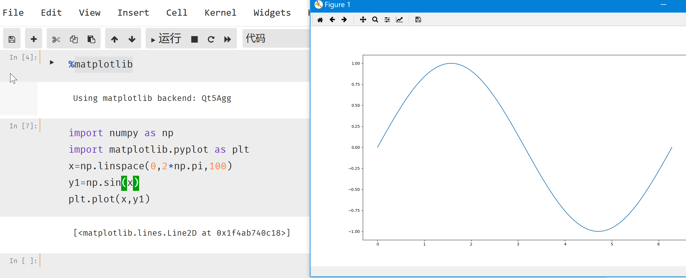</div>

使用魔法命令在第一行 `%matplotlib` 运行一下，会出现一个RStudio的窗口，你所做的改动会实时的展现出来。


通过画一个最基本的图形看看使用pyplot的流程使用MATLAB风格<br/>PS:如果你是在jupyter使用了上面的魔法命令，那就不用show<br/>
```py
import numpy as np
import matplotlib.pyplot as plt
x = np.arange(0, 2*np.pi, 0.01)//生成np数组
y = np.sin(x)//生成np数组
plt.plot(x, y)//生成plt
plt.show()//显示
```
生成一个pyplot对象plt，每一个程序文件只需要一个 `plt.show()` <br/>
:::danger 中文和负号
matplotlib统一使用utf-8编码，所有的中文要在utf-8环境下显示，开头加入注释全局使用utf-8，设置默认字体。<br/>
**from pylab import mpl <br/>
mpl.rcParams['font.sans-serif'] = ['FangSong'] # 指定默认字体<br/>
mpl.rcParams['axes.unicode_minus'] = False     # 解决保存图像时'-'显示为方块的问题<br/>**
:::

<h4>创建Figure对象</h4><br/>

这东西类似于一张画布，**`fig=plt.figure()`** or实例化 **`plt.Figure()`**（一般不这样干<br/>
参数:<br/>
fig=figure(num=None, figsize=None, dpi=None, facecolor=None, edgecolor=None, frameon=True)
- ***num***:图像编号或名称，数字为编号 ，字符串为名称
- ***figsize***:指定figure的宽和高，单位为英寸；
- ***dpi*** 参数指定绘图对象的分辨率，即每英寸多少个像素，缺省值为80
- ***facecolor***:背景颜色
- ***edgecolor***:边框颜色
- ***frameon***:是否显示边框

使用fig对象+面向对象风格画图
```py
import numpy as np
import matplotlib.pyplot as plt
x=np.linspace(0,2*np.pi,100)
y1=np.sin(x)
y2=np.cos(x)
fig=plt.figure()
ax=fig.add_axes([0.1,0.1,0.8,0.8])
ax.plot(x,y2)
ax.plot(x,y1)
fig.savefig("x.png")#直接在程序目录下保存
```

plt函数和ax对象方法:
<div align=center>

|&nbsp;&nbsp;&nbsp;&nbsp;&nbsp;&nbsp;&nbsp;&nbsp;&nbsp;&nbsp;&nbsp;&nbsp;&nbsp;&nbsp;&nbsp;&nbsp;plt函数&nbsp;&nbsp;&nbsp;&nbsp;&nbsp;&nbsp;&nbsp;&nbsp;&nbsp;&nbsp;&nbsp;&nbsp;&nbsp;&nbsp;&nbsp;&nbsp;|&nbsp;&nbsp;&nbsp;&nbsp;&nbsp;&nbsp;&nbsp;&nbsp;&nbsp;&nbsp;&nbsp;&nbsp;&nbsp;&nbsp;&nbsp;&nbsp;&nbsp;ax对象方法&nbsp;&nbsp;&nbsp;&nbsp;&nbsp;&nbsp;&nbsp;&nbsp;&nbsp;&nbsp;&nbsp;&nbsp;&nbsp;&nbsp;&nbsp;&nbsp;&nbsp;&nbsp;&nbsp;|
|:---:|:---:|
|plt.plot()|ax.plot()|
|plt.legend()|ax.legend()|
|plt.xlabel()|ax.set_xlabel()|
|plt.ylabel()|ax.set_ylabel()|
|plt.grid()|ax.grid()|
|plt.xlim()|ax.set_xlim()|
|plt.ylim()|ax.set_ylim()|
|plt.title()|ax.set_title()|

</div>

### 标题和坐标系
需要更高定制性参见matplotlib.ticker<a href='http://matplotlib.org/api/ticker_api.html'>官方文档</a>
- **`plt.title`**(u'正弦曲线', fontdict={'size':20})      
    - 设置标题
- **`plt.xlabel`**(u'弧度', fontdict={'size':16})         
    - 显示横轴名称
- **`plt.ylabel`**(u'正弦值', fontdict={'size':16})       
    - 显示纵轴名称
- **`plt.grid`**(color="gray")
    - 显示网格   
    - 网格参数列表


<div align=center>

|参数|说明|
|:----:|:----|
|axis|默认为'both'，可以设置为'x'or'y',让你的网格线垂直于X轴还是Y轴|    
|color|接受16进制颜色值或指定颜色|
|linestyle|线型参考 *线型表* |
|linewidth|表格线宽度，接受整数|

***线型表***

|&nbsp;&nbsp;&nbsp;&nbsp;&nbsp;&nbsp;&nbsp;&nbsp;solid&nbsp;&nbsp;&nbsp;&nbsp;&nbsp;&nbsp;&nbsp;&nbsp;|&nbsp;&nbsp;&nbsp;&nbsp;&nbsp;&nbsp;&nbsp;&nbsp;dashed&nbsp;&nbsp;&nbsp;&nbsp;&nbsp;&nbsp;&nbsp;&nbsp;|&nbsp;&nbsp;&nbsp;&nbsp;&nbsp;&nbsp;&nbsp;&nbsp;dashdot&nbsp;&nbsp;&nbsp;&nbsp;&nbsp;&nbsp;&nbsp;&nbsp;|&nbsp;&nbsp;&nbsp;&nbsp;&nbsp;&nbsp;&nbsp;&nbsp;dotted&nbsp;&nbsp;&nbsp;&nbsp;&nbsp;&nbsp;&nbsp;&nbsp;|
|:----:|:----:|:---:|:---:|
|-|--|-.|:|
|实线|小段虚线|点段虚线|点虚线|

</div>

- **`plt.xlim`**((2,10))       
    - 为这个坐标系设置范围元组
    - 有返回值一个元组范围
    - ylim同理
- **`plt.xticks`**(np.linspace(0,5,11)))       
    - 为这个坐标系设置刻度
    - 会自己分配间距等等
    - 不一定位数越高越精确，找合适的


```py
fig=plt.figure()
ax=fig.add_axes([0.1,0.1,0.8,0.8])
x=np.arange(0.0,5.0,0.2)
y=np.exp(-x) *np.cos(2*np.pi*x)
ax.grid(color='gray')#灰色的网格线
ax.plot(x,y)
ax.set_xlabel("it is x")#设置x轴的标注
ax.set_xlim(-2,10)#设置了x轴范围
#ax.set_ylim(-2,10)
```

<div align=center ></div> 

<br/>

刻度是由短线和短线附近的文本组成的，这些对象都有对应的设置器。

- locator 对象，描述刻度“刻线”，当执行ax.yaxis.set_major_locator（plt.NullLocator()）之后，刻线不在在了，即使有“标示”也没有意义了，正所谓“皮之不存，毛将薄附”。
- formater 对象描述刻度的“标示”，所以ax.xaxis.set_major_formatertplt.NullFomater()）之后X轴没有了标示，只有刻线了----刻线可以单独存在，类似于刻度尺，在刻度尺上不是每条刻线都有标示。    

### 绘制子图

插曲 ***显示图片*** <br/>
代码我放这里了，我也没搞懂原理：

```py
from sklearn.datasets import fetch_olivetti_faces
faces=fetch_olivetti_faces().images
fig,ax=plt.subplots(5,5,figsize=(5,5))
fig.subplots_adjust(hspace=0,wspace=0)
for i in range(5):
    for j in range(5):
        ax[i,j].xaxis.set_major_locator(plt.NullLocator())
        ax[i,j].yaxis.set_major_locator(plt.NullLocator())
        ax[i,j].imshow(faces[10*i+j],cmap="bone")
        
```
<div align=center ></div>


- **`fig,ax=plt.subplots(2,1,sharex='col',sharey='row')`**
    - 0轴方向为2，1轴方向为1生成2x1个坐标系分区
    - 返回值有两个，一个是Figure和Axes容器，容器是一个序列对象，里面有好多ax坐标系
    - 可以直接取出对象画图ax[0],plot(np.linspace(0,2*np.pi,10),np.sin(np.linspace(0,2 *np.pi,10)))
<div align=center >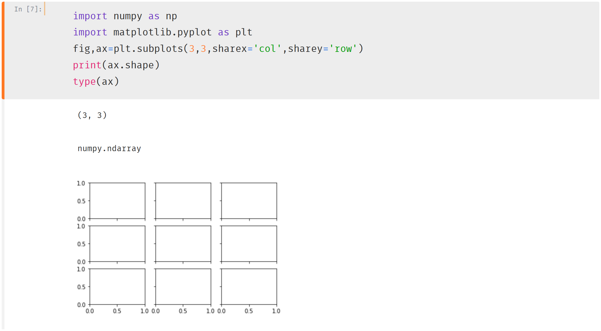</div>
<br/>

- **`fig.subplots_adjust(left=None,bottom=None,right=None,wspace=None,hspace=None)`**
    - wspace,hspace是分区之间空隙宽和高
```py
#-*-coding:utf-8-*-
#SettingCode here
__author__ = "a_little_rubbish"
__date__ = "2019-04-11 13:27"

#import your model here
import matplotlib.pyplot as plt
import numpy as np

from matplotlib.ticker import MultipleLocator,FormatStrFormatter

t=np.linspace(0,100,100)
s=9.8*np.power(t,2)/2
fig,ax=plt.subplots(figsize=(8,4))
ax.plot(t,s)

ax.set_ylabel("displacement")
ax.set_xlim(0,100)
ax.set_xlabel('time')

xmajor_locator =MultipleLocator(20)#①
xmajor_formatter=FormatStrFormatter('%1.1f')#②
xminor_locator=MultipleLocator(5)

ymajor_locator=MultipleLocator(10000)
ymajor_formatter=FormatStrFormatter('%1.1f')
yminor_locator=MultipleLocator(5000)

ax.xaxis.set_major_locator(xmajor_locator)#③
ax.xaxis.set_major_formatter(xmajor_formatter)#④

ax.yaxis.set_major_locator(ymajor_locator)
ax.yaxis.set_major_formatter(ymajor_formatter)

ax.xaxis.set_minor_locator(xminor_locator)#⑤
ax.yaxis.set_minor_locator(yminor_locator)

ax.grid(True,which='major')
ax.grid(True,which='minor')

for i in ax.xaxis.get_major_ticks():#⑥
    i.label1.set_fontsize(16)
plt.show()
fig.savefig('xx.jpg')#保存图片
```
<div align=center >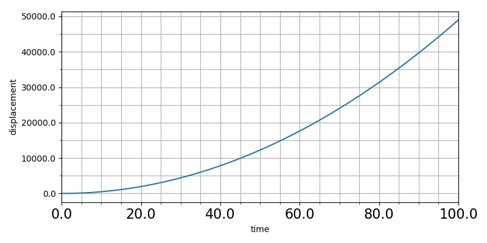</div>
<br/>

程序的解释：<br/>
刻度轴是有主次之分的，`from matplotlib.ticker import MultipleLocator，FormatStrFormatter` 所引入的 `MultipleLocator` 类就是用于设置刻度的倍数的  
例如①中的含义就是X轴的“主刻线”是20的倍数，即对于程序中，X轴上每20是一个“主刻线”。  

`FormatStrFormatter`用于设置“标示”的显示格式，例如②中规定了“主刻度”的“标示”的显示格式为小数点后要有1位小数。<br/>
①和②所建立的对象分别作为参数用于③和④。`ax.xaxis`得到的是X轴Axes对象，它具有以下两个方法：`set_major_locator()`设置“主刻线”；`set_major_formater()`设置相应的“标示”。
⑤中的`set_major_locator()`设置“次刻线”，因为“次刻线”不需要标示，所以就没有使用`set_major_formatter()`函数，不过也可以尝试使用。<br/>用同样的方法可以设置Y轴的刻度。
最后，⑥通过循环`ax.xaxis.get_major_ticks()`得到x轴的主刻度，然后在⑦中对每个主刻度的“标示”字号进行设置，比默认字号大一
<br/><div align="right"><small>------跟老齐学数据分析</small></div>
<br/>

- **`plt.subplot(x,y,z....)`**
    - 等价于fig.add_subplot()
    - 获得分区的某一个子图给plt
    - 接下来可以设置plt.text(0.2*x*,0.5*y*,*str*('xxx'),fontsize=18,withdash=False,ha='center',with)文字
<div align=center >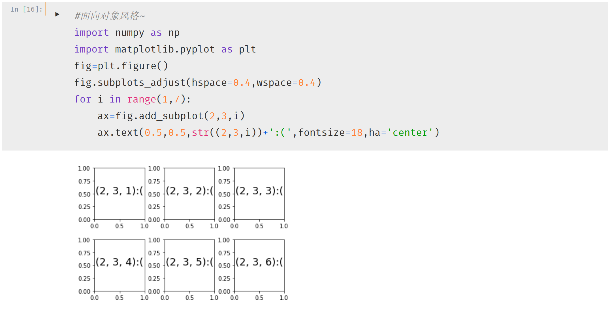</div>
<div align=center >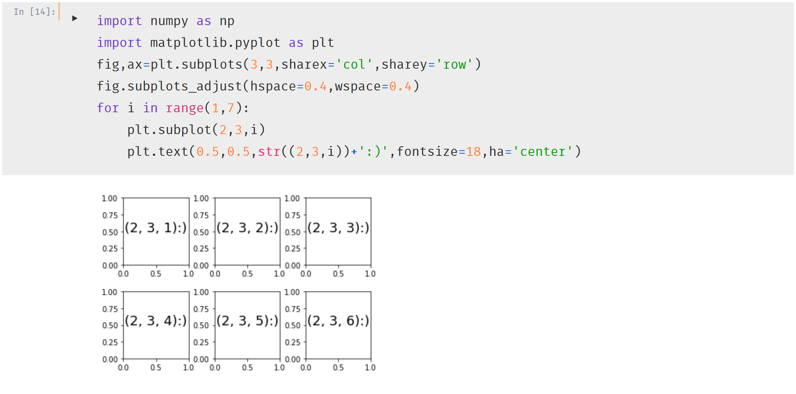</div>

<br/>


***画一个小坐标系***<br/>
`fig.add_axes([left,bottom,width,height]` left,bottom表示距离画布左侧和底部的距离，width,height表示子图的宽高。这四个值都是取0-1，并表示百分比。                                          ·
```py
import numpy as np 
import matplotlib.pyplot as plt 
fig=plt.figure()
ax1=fig.add_axes([0.1,0.1,0.8,0.8])
ax1=fig.add_axes([0.6,0.5,0.2,0.3])
```
<div align=center >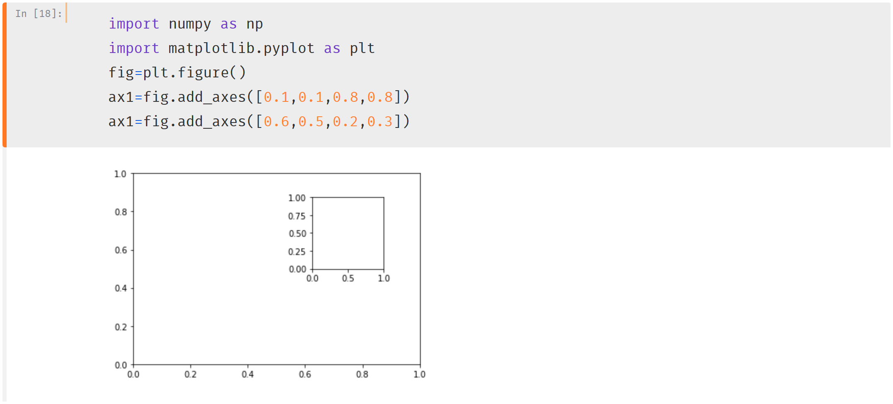</div>

<br/>

ax.shape可以查看当前的对象容器的序列，通过下标拿到Axes对象可以做一些设置。不使用多个画布分区的时候，可以在同一张画布上有多个坐标系
<br/>
***布局***
- g=**`plt.GridSpec(3,3,hspace=0.3,wspace=0.3)`**
    - 划分了3-3等格,间距为0.3，0.3
    - 使用plt.subplot(g[n:m])划分区域，见代码

```py
import numpy as np 
import matplotlib.pyplot as plt 
fig=plt.figure()
g=plt.GridSpec(3,3,hspace=0.4,wspace=0.4)
#布局规定了间隔不需要fig.subplots_adjust(hspace=0.4,wspace=0.4) 
plt.subplot(g[0,0])
plt.subplot(g[:2,1:])
plt.subplot(g[1:,0])
plt.subplot(g[2,1:])
```
<div align=center >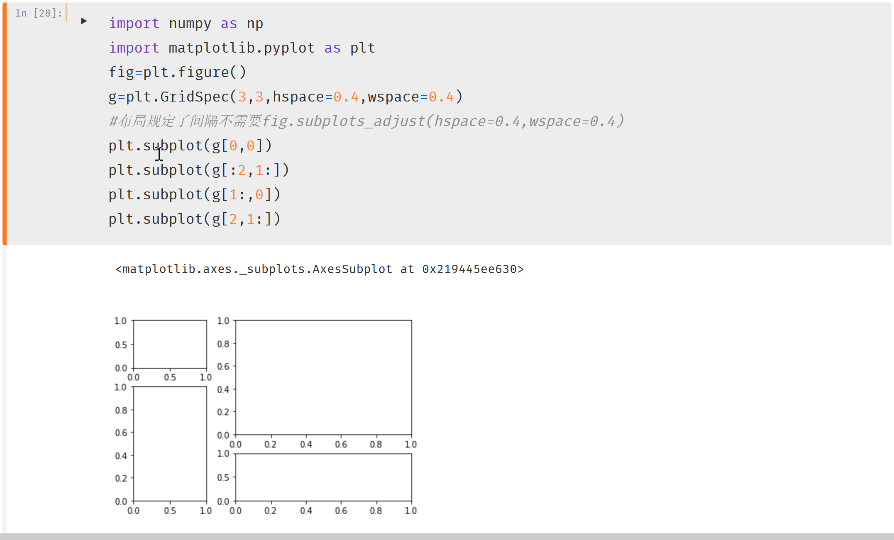</div>

<br/>

### 绘图
**`plt.plot()`** or **`ax.plot()`** 函数完成
- 颜色，由 **`color='#A52A2A'`** 参数控制
    - 1.x版本和2.x(使用的)有改动，2.x变为category10调色板+hex16进制颜色值字符串控制。
    - 默认自己填充色彩
- 线型，由 **`linestyle='dashdot'`** 控制
    - 参考线型表，默认为实线
- 标注点，由 **`marker='o'`** 控制
    - 可选o圆形，D菱形，h六边形
    - **`markersize=整数int`**，标记大小
    - **`markerfacecolor=''`** 标记颜色
    - **`markerevery=[1,2,3]`** 在1，2，3处进行标记
- 线粗细，由 **`linewidth=整数int`** 控制
- 标签 **`label='起个名吧'`**
    - 给曲线一个名字，一般配合legend图例使用    
```py
#-*-coding:utf-8-*-
#SettingCode here
__author__ = "a_little_rubbish"
__date__ = "2019-04-11 15:06"

#import your model here
import matplotlib.pyplot as plt
import matplotlib.colors as colors
import matplotlib.cm as cmx
import numpy as np
#your class&function here

curves=[np.random.random(20) for i in range(10)]#随机矩阵
values=range(10)#随机整数

fig=plt.figure()#产生画布
ax=fig.add_subplot(111)#添加了一个子图？？大小参数是怎么回事？？只有一个
jet=cm=plt.get_cmap("jet")#获得颜色表
cnorm=colors.Normalize(vmax=values[-1],vmin=0)#也是设置颜色
scalar_map=cmx.ScalarMappable(norm=cnorm,cmap=jet)#画布颜色映射

lines=[]#线数组
for i in range(len(curves)):#矩阵长度
    line=curves[i]#拿到矩阵
    color_val=scalar_map.to_rgba(values[i])#利用颜色表取出颜色
    color_text=('color:(%4.2f,%4.2f,%4.2f)'%(color_val[0],color_val[1],color_val[2]))#颜色框上的文本
    ret_line,=ax.plot(line,color=color_val,label=color_text)#画上图
    lines.append(ret_line)#添加到线数组中去

handles,labels=ax.get_legend_handles_labels()#设置图例
ax.legend(handles,labels,loc='upper right')#放置图例
plt.plot()
plt.show()
```
<div align=center >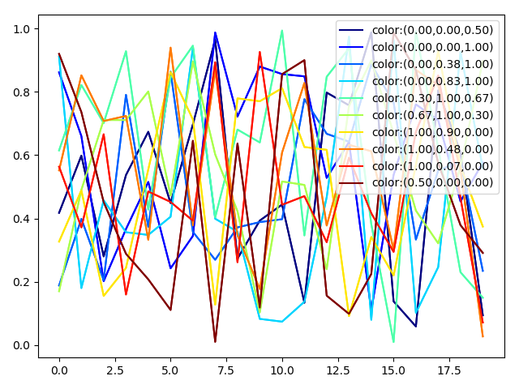</div>

截图2019-04-11_15-53-41.png
```py
import numpy as np 
import matplotlib.pyplot as plt 
fig=plt.figure()
x=np.random.random(10)#np.random的用法
plt.plot(x,2*x,linestyle=':',marker='o',markersize=9,markerfacecolor='b',markevery=[2,4,6])
x
```
<div align=center >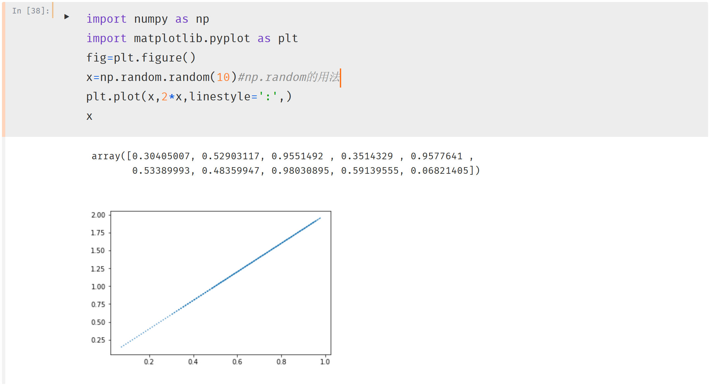</div>
np生成的是正态分布的，中间的点密集？？？标记了下标2，4，6个做标点

### 图例
就右上角的小标志那个东西。<br/>

**`plt.legend(loc='upper right')`** 右上角一个小图例。

- **`loc=""`** 位置
    - 参照下表,可直接而用编号代替
- **`handle=(line1,line2)`** 给line1和line2画图例
- **`bbox_to_anchor=(x0,y0,width,height)`** 把小盒子固定在任意位置
    - x0,y0是盒子左下角相对于坐标轴左下角的位置0~1的浮点数
    - width,height是盒子宽高，也是0~1的浮点数
- **`frameon=`**
- **`fontsize=`**
- **`ncol=`**
- **`framealpha=`**
- **`shadow=`**
- **`fancybox=`**
- **`borderpad=`**

:::danger
搜一搜这些参数
:::
<div align='center'>

|名称&nbsp;&nbsp;&nbsp;&nbsp;&nbsp;&nbsp;&nbsp;&nbsp;&nbsp;&nbsp;&nbsp;&nbsp;&nbsp;&nbsp;&nbsp;&nbsp;&nbsp;&nbsp;|编号&nbsp;&nbsp;&nbsp;&nbsp;&nbsp;&nbsp;&nbsp;&nbsp;&nbsp;&nbsp;&nbsp;&nbsp;&nbsp;&nbsp;&nbsp;&nbsp;&nbsp;&nbsp;|名称&nbsp;&nbsp;&nbsp;&nbsp;&nbsp;&nbsp;&nbsp;&nbsp;&nbsp;&nbsp;&nbsp;&nbsp;&nbsp;&nbsp;&nbsp;&nbsp;&nbsp;&nbsp;|编号&nbsp;&nbsp;&nbsp;&nbsp;&nbsp;&nbsp;&nbsp;&nbsp;&nbsp;&nbsp;&nbsp;&nbsp;&nbsp;&nbsp;&nbsp;&nbsp;&nbsp;&nbsp;|
|:---|:---|:---|:---|
|best |0|center left|6|
|upper right |1|center right|7|
|upper left |2|lower center|8|
|lower left |3|upper center |9|
|lower right |4|center|10|
|right|5|||

</div>

```py
import numpy as np 
import matplotlib.pyplot as plt 
fig=plt.figure()
a=np.arange(0,3,.02)
b=np.arange(0,3,.02)
c=np.exp(a)#怎么用来着
d=c[::-1]
plt.plot(a,c,'k--',label="Model")
plt.plot(a,d,'r:',label="Data")
plt.plot(a,c+d,'b-',label="Total")
plt.legend(loc='upper right')
```

<div align=center >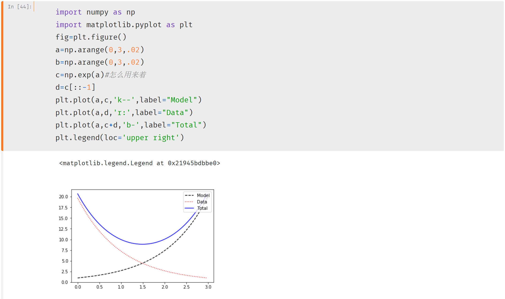</div>

:::warning
plt.plot()返回的是一个列表，注意line1，2，3的返回方式。
:::

有前面的%matplotlib的时候直接省略下面几句，写的时候要注意添加上

:::tip
import numpy as np   
import matplotlib.pyplot as plt   
import pandas as pd  
fig=plt.figure()  
:::

### 散点图
只有一些散点，暂时没有规律的数据
```py
#-*-coding:utf-8-*-
#SettingCode here
__author__ = "a_little_rubbish"
__date__ = "2019-04-11 16:14"

#import your model here
import numpy as np
import matplotlib.pyplot as plt
fig=plt.figure()
rng=np.random.RandomState(0)#伪随机数发生器
x=rng.randn(100)#得到符合高斯分布的100个数组成的数组
y=rng.randn(100)
colors=rng.randn(100)
sizes=1000*rng.randn(100)
plt.scatter(x,y,c=colors,s=sizes,alpha=0.3)#透明度颜色
plt.colorbar()#显示颜色条
plt.show()
```
<div align=center >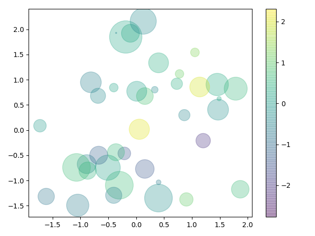</div>

参数表：
- plt.scatter()
    - x,y两个数组，表示点坐标
    - s=None点大小默认我也不知道
    - marker=None标记，参考标记表
    - cmap=None
    - norm=None
    - vmin=None
    - vmax=None
    - alpha=None透明度0-1
    - linewidths=None边缘线宽度
    - verts=None
    - edgecolors=None边缘颜色
    - hold=None
    - data=None
<br/><div align="right"><small>------matplotlib文档</small></div>  

scatter会根据点的大小颜色对每个点进行渲染，各个点不相同，plot不会：(
### 柱形图
普通柱形图
```py
import numpy as np 
import matplotlib.pyplot as plt 
import pandas as pd
fig=plt.figure()

data=[2,10,6,8,7]
position=[i for i in range (1,6)]
plt.bar(x=position,height=data)#这个bar
plt.bar(x=position,height=data,width=0.4,bottom=[3,0,5,0,1])#上面的注释掉再试试这个bar
plt.grid(True)
plt.show()
```
基本参数：
- **x** 每根柱子中间所在的坐标位置 *[num]*
- **height** 每根柱子的高度 *[int]*
- **width** 柱子宽度*int*
- **bottom** 柱子底部与坐标轴的距离，默认None等于0 *int*
- **color** 颜色可以多种颜色。*str*
- **edgecolor**柱边缘颜色*str*
- **linestyle**边缘线线型-*线型表*
- **linewidth**边缘线宽度*int*
- **hatch**填充中间的内部图形*str*
- **tick_label**刻度标识，默认数字 *[num/str]*

<div align=center >

<table border="0">
  <tr>
    <th>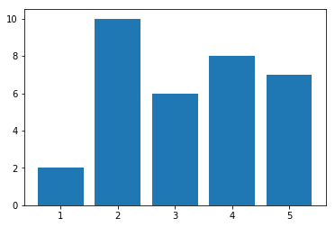</th>
    <th>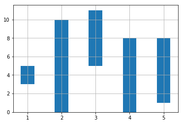</th>
  </tr>

</table>

</div>

```py
import numpy as np 
import matplotlib.pyplot as plt 
import pandas as pd
fig=plt.figure()
data=[2,10,6,8,7]
position=[i for i in range (1,6)]
labels=[i for i in "abcde"]
plt.bar(x=position,height=data,width=0.4,bottom=[3,0,5,0,1],
        color='r',edgecolor='#ff7f00',linestyle='--',
       linewidth=2,hatch='x',tick_label=labels)
plt.grid(True)
plt.show()
```
啊奇丑无比的图
<div align=center >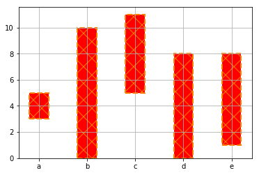</div>

**堆叠柱状图和簇状**  
ab两组同维数据，把b设置为

```py
import numpy as np 
import matplotlib.pyplot as plt 
import pandas as pd
fig=plt.figure()
a=[2,10,6,8,7]
b=[3,3,4,9,1]
position=[i for i in range (1,6)]
labels=[i for i in "abcde"]
plt.bar(position,a,label='a',color='b')
plt.bar(position,b,label='b',color='g',bottom=a)#注意这个bottom
plt.legend(loc='upper right')
```

<div align=center >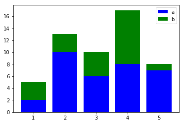</div>
思路就是控制他俩的宽度和摆放位置，注意颜色不要太难看

```py
position=np.arange(1,6)
a=np.random.random(5)
b=np.random.random(5)

totalWidth=0.8
n=2
width=totalWidth/n#把宽度分成两半
position=position-(totalWidth-width)/n#
print('width:',width,'position:',position,'totalWidth-width:',totalWidth-width)
plt.bar(position,a,label='a',color='#39abd2',width=width)
plt.bar(position+width,b,label='b',color='#0a84ff',width=width)#注意宽度

```

颜色好看点了
<div align=center >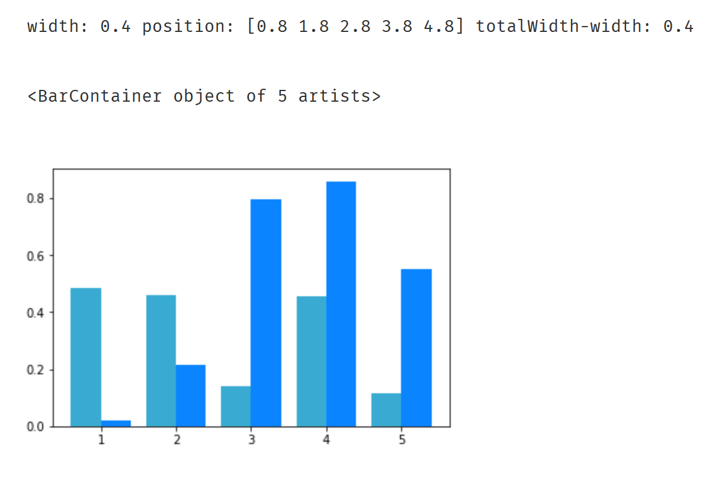</div>

柱状图差不多了

### 条形图
就是柱状图横过来
```py
position=np.arange(1,6)
a=np.random.random(5)
plt.barh(position,a)
```
<div align=center >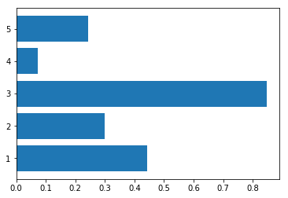</div>

参数和上面的一模一样，拿过来用就是了。    
不太一样的是正负柱状图：


```py
position=np.arange(1,6)
a=np.random.random(5)
b=np.random.random(5)

plt.barh(position,a,label='a',color='#ff481f')
plt.barh(position,-b,label='b',color='#05c7da')#注意这里是-b
```
<div align=center >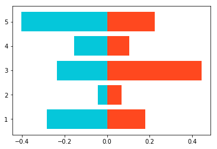</div>


### 箱线图
一种很有用的图。鉴于笔者懒，就不写那么多了，自己看图吧(~￣▽￣)~
```py
fig,ax=plt.subplots(1,2)
data=[1,5,9,6]
ax[0].boxplot([data])#注意这个形式
ax[0].grid()
ax[1].boxplot([data],showmeans=True)#显示均值
ax[0].grid()
```
可以设置`vert=True`竖过来显示  
异常点显示为`sym='r*'`  
`meanline=False`均值线，但一般中位数常用线段表示，让他默认false就挺好的  
简单箱线图，啥都能显示，牛逼不（？？？
<div align=center >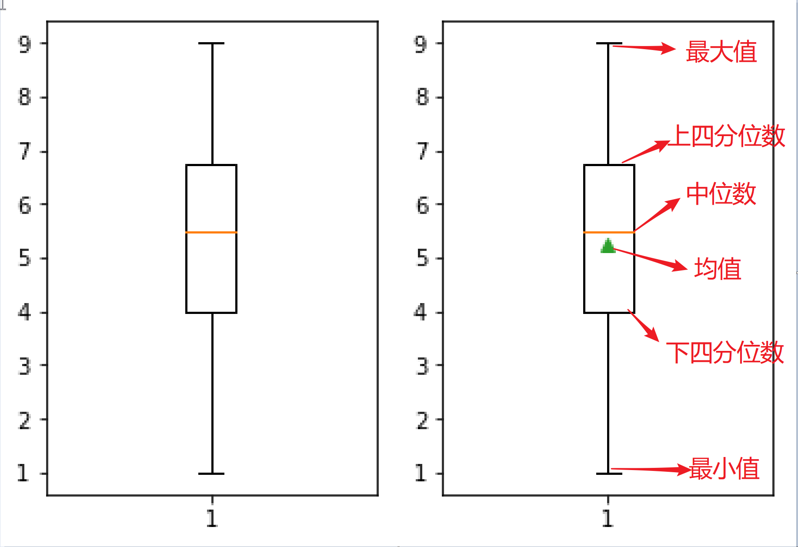</div>

pandas其实也能直接画，不过我会了这个一定不会去学那个的。  
装饰挺麻烦的:  
```py
#-*-coding:utf-8-*-
#SettingCode here
__author__ = "a_little_rubbish"
__date__ = "2019-04-12 15:45"

#import your model here
import numpy as np
import matplotlib.pyplot as plt
import pandas as pd
fig=plt.figure(1,figsize=(9,6))

np.random.seed(123)
d1=np.random.normal(100,10,200)
d2=np.random.normal(80,30,200)
d3=np.random.normal(90,20,200)
d4=np.random.normal(70,25,200)
data=[d1,d2,d3,d4]

ax=fig.add_subplot(111)#fig.add_subplot(1, 1, 1)
bp=ax.boxplot(data,patch_artist=True)

for b in bp['boxes']:
    b.set(color='#07718c',linewidth=2)
    b.set(facecolor='#2c6ee5')

for w in bp['whiskers']:
    w.set(color='#07718c',linewidth=6)

for c in bp['caps']:
    c.set(color='#a34ce2', linewidth=2)

for m in bp['medians']:
    m.set(color='#dbac3f', linewidth=2)

for f in bp['fliers']:
    f.set(color='#2c6ce5', alpha=0.2,marker='^')
plt.show()
```
<div align=center >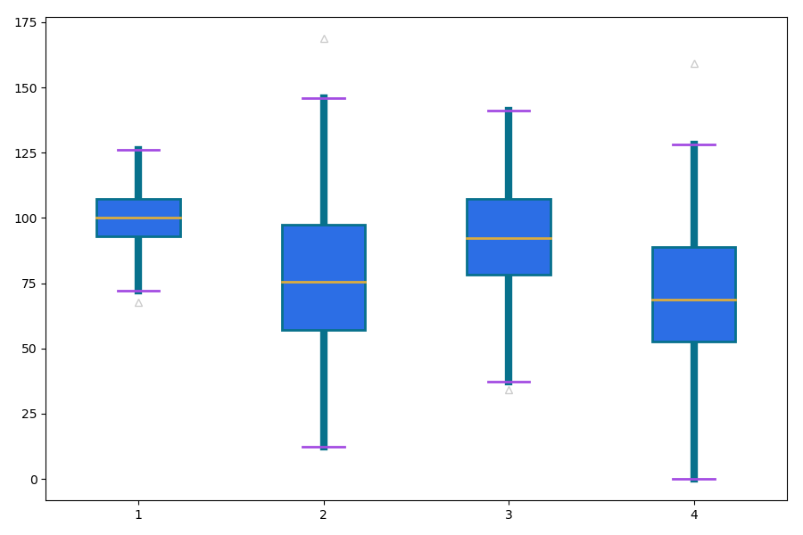</div>


### 饼图
饼图其实是很重要的一种统计图。参数如下：
`plt.pie`
 - **x** 一维的数据源  
 - **explode** =None扇面偏离，和x规模一致的数据，在图上显示出来和其他扇面的距离  
 - **labels** =None标识和x规模一致的字符串数组  
 - **colors** =None  16进制颜色
 - **autopc** t=None  按照规定格式显示百分比例如'%1.1f%%'
 - **pctdistance** =0.6  
 - **shadow** =False  阴影
 - **labeldistance** =1.1  标识的距离
 - **startangle** =None  第一个扇形开始的角度
 - **radius** =None 半径大小
 - **counterclock** =True  
 - **wedgeprops** =None  
 - **textprops** =None  
 - **center** =(0,0)  
 - **frame** =False  
 - **rotatelabels** =False  
 - **hold** =None  
 - **data** =None
 
 ```py
 import numpy as np 
import matplotlib.pyplot as plt 
import pandas as pd
fig=plt.figure()

x=[i for i in range(2,10,2)]
print(len(x))
fig,ax=plt.subplots()
labels=['A','B','C',"D"]
colors=[i for i in 'rgby']
explode=[0,0.1,0,0]
plt.pie(x,explode=explode,colors=colors,autopct='%1.1f%%',
        shadow=True,startangle=90,radius=1.2)
ax.set(aspect='equal',title='Pie')#注意set的用法,左边有set右边无
```
<div align=center >

<table border="0">
  <tr>
    <th>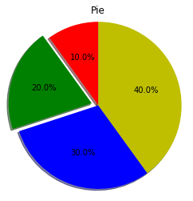</th>
    <th>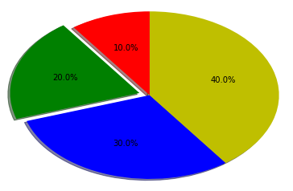</th>
  </tr>

</table>

</div>


### 直方图
柱形图一般是每个柱子单独渲染，然而直方图是一块渲染，因为直方图的数据的部分时候会符合正态分布。  
直方图是一种统计报告图，由一个个的长条形组成，但是直方图用长条形的面积表示频数，所以长条形的高度表示频数组距，宽度表示组距，其长度和宽度均有意义。当宽度相同时，一般就用长条形长度表示频数。直方图一般用来描述等距数据，柱状图一般用来描述名称（类别）数据或顺序数据。直观上，直方图各个长条形是衔接在一起的，表示数据间的数学关系；条形图各长条形之间留有空隙，区分不同的类。

`plt.hist`
 - **x**  
 - **bins**=None  这个参数指定柱子的个数,也就是总共有几条条状图
 - **range**=None  =（x,y）筛选数据范围，默认是最小到最大的取值范围
 - **density**=None  设置为True是频率图，默认是频数图
 - **normed**=None  已被density替代
 - **weights**=None  
 - **cumulative**=False 设置为True会把前面的值都累加起来 
 - **bottom**=None  可以像柱状图一样叠加
 - **histtype**='bar'  柱主子类型bar, barstacked, step, stepfilled
 - **align**='mid'  对齐方式，一般都是居中
 - **orientation**='vertical' 水平或垂直方向显示
 - **rwidth**=None  柱子与柱子之间的距离，默认是0
 - **log**=False  
 - **color**=None  直方图16进制颜色
 - **edgecolor** 直方图边框颜色 
 - **label**=None  标签
 - **stacked**=False  
 - **hold**=None  
 - **data**=None  

*左图：*
```py
# -*- coding:utf-8 -*-
import numpy as np
import matplotlib.mlab as mlab
import matplotlib.pyplot as plt

# 谁便生成一堆数据
mu = 100  # 均值
sigma = 15  # 标准差
x = mu + sigma * np.random.randn(10000)

num_bins = 50
# the histogram of the data
n, bins, patches = plt.hist(x, num_bins, density=1, color='blue', alpha=0.5)


# 添加正态分布曲线（这个很好看
y = mlab.normpdf(bins, mu, sigma)
plt.plot(bins, y, 'r--')


plt.xlabel('Smarts')
plt.ylabel('Probability')
plt.title(r'Histogram of IQ: $\mu=100$, $\sigma=15$')

# Tweak spacing to prevent clipping of ylabel
plt.subplots_adjust(left=0.15)
plt.show()
```
注意添加曲线的那一步  
*右图*

```py
import matplotlib.pyplot as plt
#概率分布直方图  
#正态分布  
mean = 100 #均值为100  
sigma = 1  #标准差为1
x=mean+sigma*np.random.randn(10000)  
fig,(ax0,ax1) = plt.subplots(nrows=2,figsize=(9,6))  #产生俩画布
ax0.hist(x,100,density=1,color='yellowgreen',alpha=0.75)  #第二个参数是柱子宽一些还是窄一些，越大越窄越密  
##pdf概率分布图，一万个数落在某个区间内的数有多少个  
ax0.set_title('pdf')  
ax1.hist(x,20,density=1,color='pink',alpha=0.75,cumulative=True,rwidth=0.8)  
#cdf累计概率函数，cumulative累计。比如需要统计小于5的数的概率  
ax1.set_title("cdf")  
fig.subplots_adjust(hspace=0.4)  
plt.show()
```

<table border="0">
  <tr>
    <th>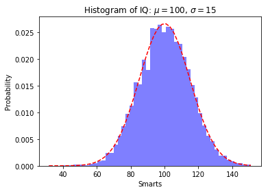</th>
    <th>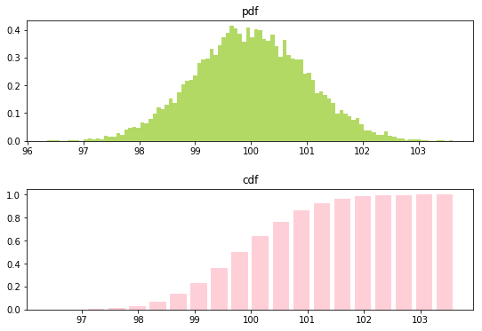</th>
  </tr>
</table>

### 三维曲线图
三维目前还不常用，用到去查ax.plot3D？
三维坐标还蛮好看的，接收到ax对象之后画图之前`from mpl_toolkits import mplot3d`，设置`ax=plt.axes(projection='3d')`
<div align=center >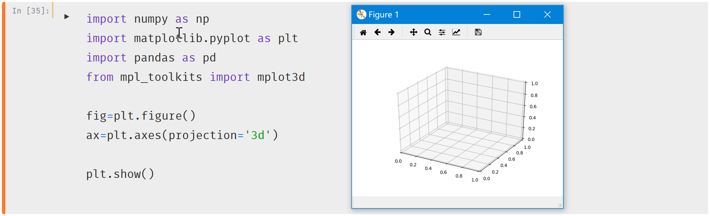</div>

曲线和散点图分别用`ax.plot3D`和`ax.scatter3D()`    

```py
import numpy as np 
import matplotlib.pyplot as plt 
import pandas as pd 
from mpl_toolkits import mplot3d

fig=plt.figure()
ax=plt.axes(projection='3d')
xl=np.linspace(0,5,1000)#linespace咋用来着
yl=np.sin(xl)#s普通的sin cos啥效果
zl=np.cos(xl)
ax.plot3D(xl,yl,zl,color='b')

xp=15*np.random.random(100)
yp=np.sin(xp)+0.1*np.random.random(100)
zp=np.cos(xp)+0.1*np.random.random(100)
ax.scatter3D(xp,yp,zp,c=xp,cmap="Greens")#后面的俩参数是啥
plt.show()
```


<div align=center >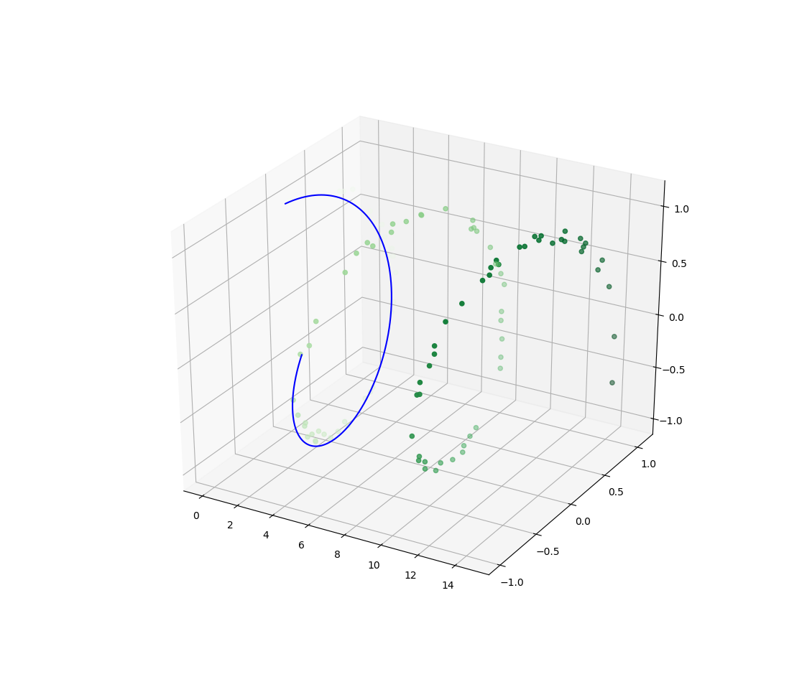</div>

### 三维等高线图

卧槽好他妈炫酷Σ(っ °Д °;)っ

```py
import numpy as np 
import matplotlib.pyplot as plt 
import pandas as pd 
from mpl_toolkits import mplot3d

x=np.linspace(-6,6,30)
y=np.linspace(-6,6,30)
X,Y=np.meshgrid(x,y)
Z=np.sin(np.sqrt(X**2+Y**2))

fig=plt.figure()
ax=plt.axes(projection='3d')
ax.contour3D(X,Y,Z,50,cmap='binary')#哪个50是啥，后面cmap肯定是管颜色的
ax.set_xlabel('x')
ax.set_ylabel('y')
ax.set_zlabel('z')
ax.view_init(60,35)
```
<div align=center >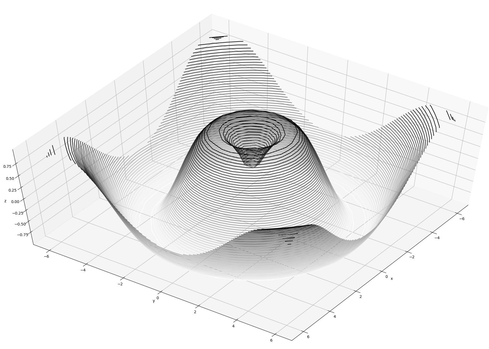</div>

后面还有莫比乌斯环结构网三角形，太偏门了，先把这些用好了再说.用到去查文档


其他很多图等用到再去查：
- 绘制平行于X轴的直线—pltaxhline()
- 绘制平行于Y轴的直线—plt.axvline()
- 绘制平行于X轴的区间带plt.axhspan()
- 绘制平行于Y轴的区间带—plt.axvspan()
- 绘制梯状图—plt.step()
- 绘制小提琴图—plt.violinplot()
- 绘制误差图—plt.errorbar()
- 绘制填充图——plt.fill_between()
<br/><div align="right"><small>------跟老齐学数据分析</small></div>
## 数据领域的Github---plotly
<a href='https://plot.ly/'>链接</a>这个网站专门做图表可视化的。进入注册登录傻子都会我就不写了。进入setting
点击APIkeys->Regenerate Keys。然后你就得到了这个k和你的用户名
<div align=center ></div>

然后`pip install plotly`  

在jupyter/py程序中  
```py
import plotly
plotly.tools.set_credentials_file(username='xxx',api_key='xxxxxxxxxxx')

#画一个例子
import plotly.plotly as py
datas=np.random.rand(1000)
plt.hist(datas)
fig=plt.gcf()
plot_url=py.plot_mpl(fig,filename='my-chart')
```
运行就会蹦出一个网页
<div align=center >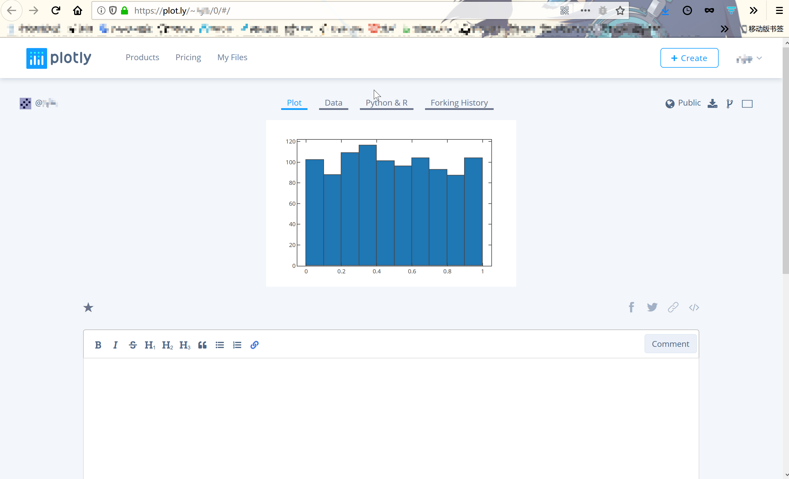</div>

这样你就可以和全世界分享你做的图勒。放个<a href='https://plot.ly/~Ajie/0/#/'>我做的</a>


## seaborn
说实话我觉得matplotlib挺丑的（别打我( ﹁ ﹁ )可能是我画的丑。seaborn就好看了许多   
`import seaborn as sns`现在的matplotlib还属主流，seaborn稍微一看几个图，了解基本的规律即可，不会就去查文档
```py
    import pandas as pd # Pandas
    import numpy as np # Numpy
    import matplotlib.pyplot as plt # Matplotlibrary
    import seaborn as sns # Seaborn Library
    %matplotlib inline
    sns.set()
```
jupyter头上输入这个相当于每个块都输入了这个，而且定义的变量可以混用了     
看一下数据集
```py
tips = sns.load_dataset("tips")#内置的数据集
type(tips)#pandas.core.frame.DataFrame这货是个pandas
tips.head(4)#默认查看前五条，记住这个方法
```
<div align=center >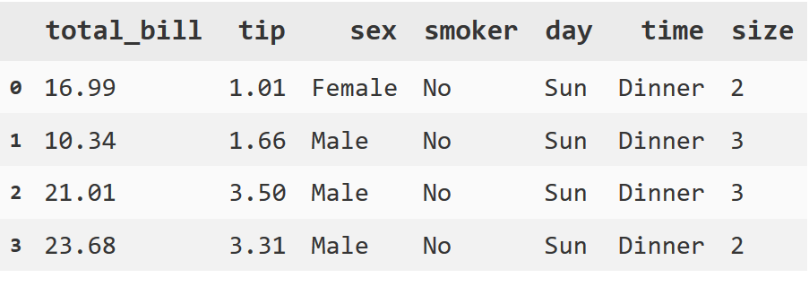</div>

### 样式控制
seaborn的样式控制是个变化较大的地方，集中了起来而不是分散的样式  
第一组是设置绘图的外观风格的，第二组主要将绘图的各种元素按比例缩放的，以至可以嵌入到不同的背景环境中。

操控这些参数的接口主要有两对方法：
- 控制主题：
    - sns.axes_style()
    - sns.set_style('darkgrid')
- 缩放绘图：
    - sns.plotting_context()
    - sns.set_context()

这两个的第一个方法都会返回一组字典参数，而第二个方法会设置matplotlib的默认参数。  
内置五种seaborn的风格：**darkgrid**, **whitegrid**, **dark**, **white**, **ticks**  
可以自定义主题`sns.axes_style()`
```json
{'axes.facecolor': '#EAEAF2',
 'axes.edgecolor': 'white',
 'axes.grid': True,
 'axes.axisbelow': True,
 'axes.labelcolor': '.15',
 'figure.facecolor': (1, 1, 1, 0),
 'grid.color': 'white',
 'grid.linestyle': '-',
 'text.color': '.15',
 'xtick.color': '.15',
 'ytick.color': '.15',
 'xtick.direction': 'out',
 'ytick.direction': 'out',
 'lines.solid_capstyle': 'round',
 'patch.edgecolor': 'w',
 'image.cmap': 'rocket',
 'font.family': ['sans-serif'],
 'font.sans-serif': ['Arial',
  'DejaVu Sans',
  'Liberation Sans',
  'Bitstream Vera Sans',
  'sans-serif'],
 'patch.force_edgecolor': True,
 'xtick.bottom': False,
 'xtick.top': False,
 'ytick.left': False,
 'ytick.right': False,
 'axes.spines.left': True,
 'axes.spines.bottom': True,
 'axes.spines.right': True,
 'axes.spines.top': True}
 ```
 
` sns.set_style("darkgrid", {"axes.facecolor": ".9"})`像这样就自定义了一些参数
绘图之前设置一下即可  
`sns.despine()`可以移除上面和右面的坐标线  
- left，right， bottom，top 让其=True移除左右上下的线
- trim=False 设置True之后限制已有的坐标范围？？
- offset=int 设置坐标的偏移

 

### 柱状图
参数基本和matplotlib的plot差不多
```py
sns.distplot(tips["total_bill"], bins=16, color="purple")
```
<div align=center >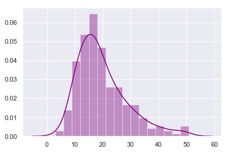</div>


### 联合分布图
联合分布图 （Jointplot）采用两个变量并一起创建直方图和散点图。
```py
sns.jointplot(x = tips["total_bill"], y = tips["tip"],  color="purple")
sns.jointplot(x = "total_bill", y = tips"tip",  data=tips,color="purple",kind ="hex")
```

效果是相等的上面两句，样式第二个选择了hex（`scatter` | `reg` | `resid` | `kde` | `hex`），注意DateFrame的运用，参数和plot里面控制样式的参数差不多，主要是数据传入

<div align=center >

<table border="0">
  <tr>
    <th>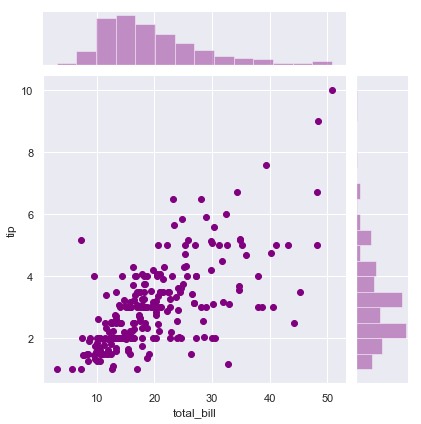</th>
    <th>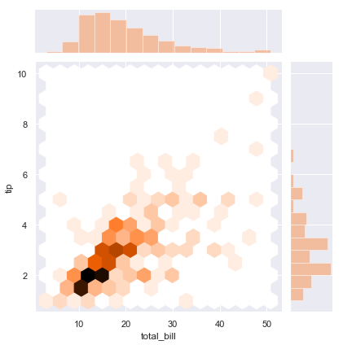</th>
  </tr>

</table>

</div>

### 矩阵对比图
```py
sns.pairplot(data=tips,hue='sex')
```
传入的是一个dataframe，指定一个数据字段，画出属性分布，对比，直方分布等等，贼全面。

<div align=center >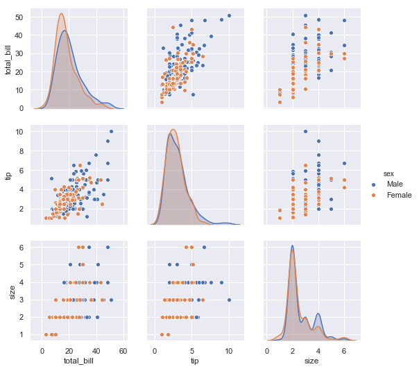</div>


着重看一下参数：
data
- **hue**=None按照哪个属性分割
- **hue_order**=None排序方式，用到再说
- **palette**=None控制颜色的东西例如“Set2”颜色系列
- **vars**=None[需要参与进去的属性列表，可以自己控制让一些属性不参与]
- **x_vars**=None和上面差不多，一般不用管
- **y_vars**=None和上面差不多，一般不用管
- **kind**='scatter'图类型`scatter`or `reg`
- **diag_kind**='auto'
- **markers**=None标记，可以是matplotlib标记中的一种，也可以是个数组
- **height**=2.5高度
- **aspect**=1
- **dropna**=True
- **plot_kws**=None
- **diag_kws**=None
- **grid_kws**=None
- **size**=None
### 柱状图
```py
sns.barplot(x = "day", y = "total_bill", data =tips)
```
参数还是一样的，但是默认样式已经变了，好看了许多
<div align=center >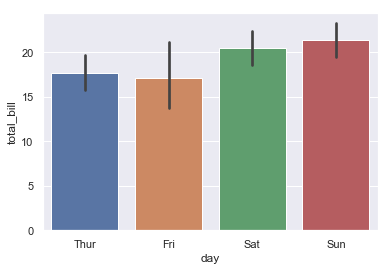</div>

### 小提琴图

```py
sns.violinplot(x = "day", y = "total_bill", data = tips)
```

和箱线图差不多
<div align=center >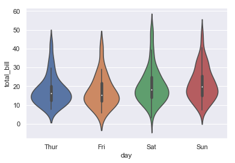</div>

如果x轴是分类的并且y轴是连续的，则应创建箱线图或小提琴图
### 箱线图
```py
sns.boxplot(x = "day", y = "total_bill", data=tips)
```
注意hue参数
```py
sns.boxplot(x = "day", y = "total_bill", data=tips, hue = "smoker")
```
<div align=center >

<table border="0">
  <tr>
    <th>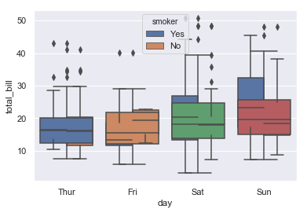</th>
    <th>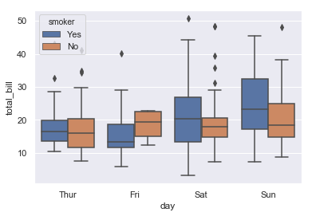</th>
  </tr>

</table>

</div>

### 线性回归图
```py
sns.lmplot(x = "total_bill", y = "tip", data = tips, hue="day")
```
这个图会显示变量之间的线性回归关系。
<div align=center >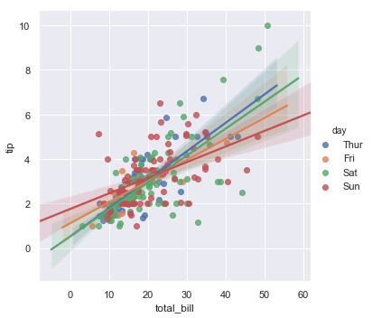</div>

:::tip
seaborn封装了matpoltlib，参数都差不多，jupyter里面调一下help?啥都有不会的现查也一点不费劲
:::
## Scipy
这是干嘛用的┑(￣Д ￣)┍  
好像是个科学计算库，还挺高级的  
哦哦看完前面的再说吧    

## 参考资料

- <a href='http://www.runoob.com/numpy/numpy-array-attributes.html'>菜鸟numpy</a>
- python数据处理三剑客
- <a href='https://mp.weixin.qq.com/s/38W7uKfhYzRdzcdB8Lld5Q'>seaborn</a>
- <a href='https://book.douban.com/subject/26743627/'>跟老齐学数据分析</a>
- numpy，pandas，matplotlib，scipy文档
- <a href='https://zhuanlan.zhihu.com/p/36994775'>数据可视化Seaborn从零开始学习教程</a>
<Valine></Valine>
