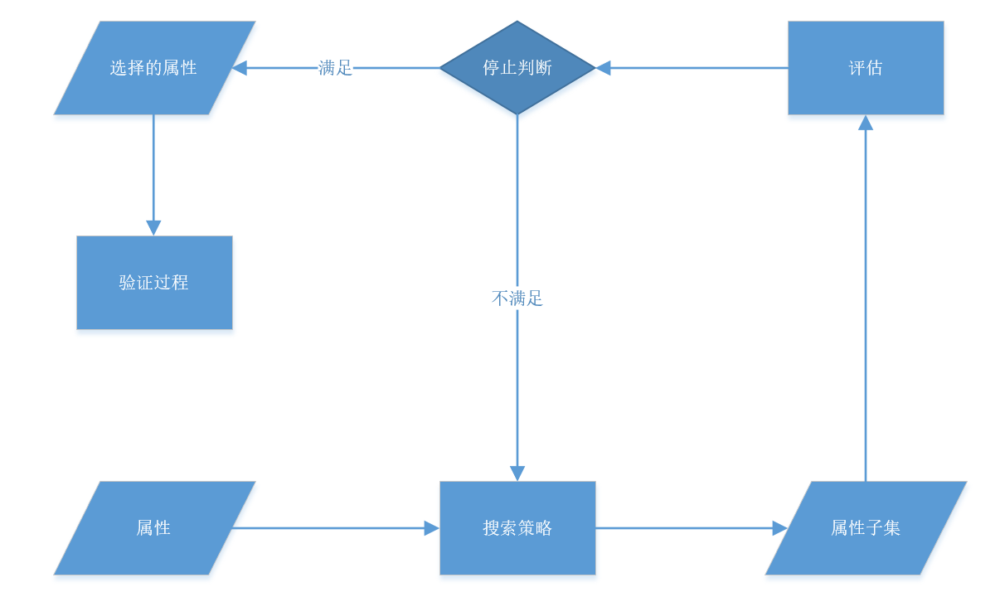
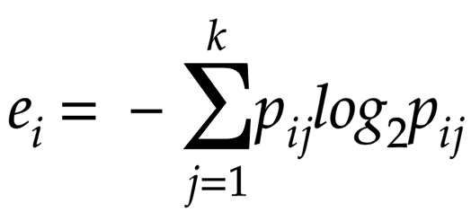
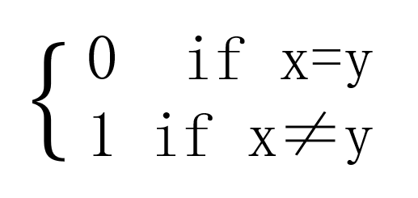
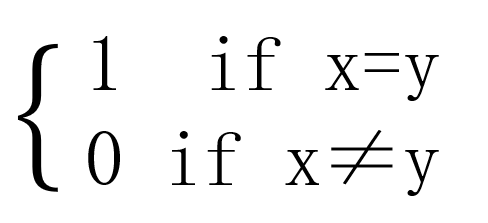
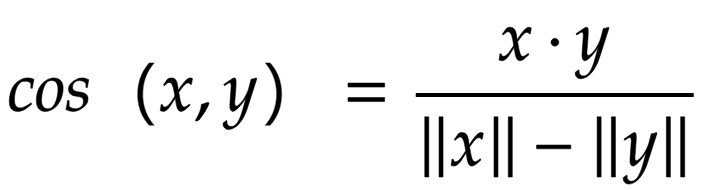
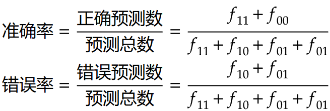
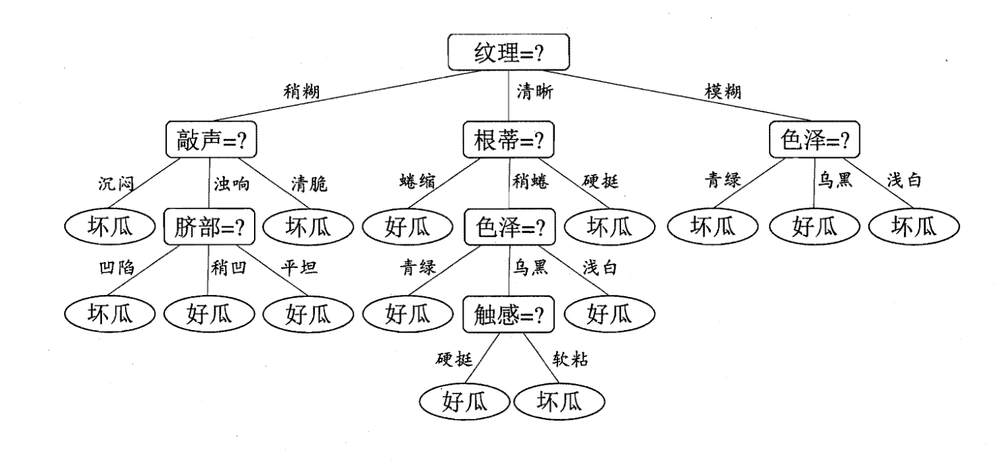
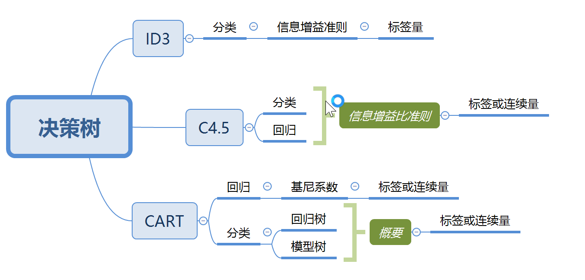

:::tip 数据完整和是否重要
爬虫做了这么久了,拿数据基本都能解决了，不过也出现了问题。拿下的数据有效吗，可靠吗，产生的噪声对分析有影响吗。
正好这学期开了数据挖掘。跟着老师好好学一学。
:::
<!-- more -->

<br/>

<div align=center><h1>数据挖掘笔记</h1></div>
<br/>
<div align=center><h1>第二章</h1></div>


## 数据类型
数据集就是数据对象(记录，点，向量等等。。)的集合。数据对象用一组`刻画对象的基本特性的属性`<br/>
--*变量 特征 字段 维*<br/>
对象具有`属性`描述对象的特征特性，明确定义属性需要使用`测量标度`将属性与数值和符号相关联(属性并非数字和符号，为了表示属性的特征我们使用标度)
<br/>属性具有`属性类型(测量标度类型)`，属性类型告诉我们测量值哪些性质与属性基本一致。
<br/>
一种指定属性类型的简单有效方法是*确定对应属性基本性质的数值性质*对于数值型给出下面四种

|属性类型|描述|例子|操作|
|---:|:---:|:---:|:----:|
|`标称`<br/>分类的 定性的|标称属性的值仅仅只是不同的名字，即标称值只提供足提供足够的信息以区分对象|邮政编码、雇员ID号，眼球颜色、性别|众数 熵 列联相关 卡方检验|
|`序数`<br/>分类的 定性的|序数属性的值提供足够的信息确定对象的序（<，>）|矿石硬度[好，较好，最好]、成绩、街道号码|中值、百分位、秩相关、游程检验、符号检验|
|`区间`<br/>数值的 定量的|对于区间属性，值之间的差是有意义的，即存在测量单位（+,-）|日历日期、摄氏或华氏温度|均值、标准差、皮尔逊相关、t和F检验|
|`比率`<br/>数值的 定量的|对于比率变量，差和比率都是有意义的（*，/）|绝对温度、货币量、计数、年龄、质量、长度、电流|几何平均、调和平均、百分比变差|

:::warning
定量属性可以是连续值或整数值
:::

|属性类型|有意义的变换|注释|
|---:|:---:|:----|
|`标称`<br/>分类的 定性的|任何一对一变换，例如值的一个排列|如果所有雇员的ID号都重新赋值，出现任何不同|
|`序数`<br/>分类的 定性的|值的保序变换<br/>即新值=f（旧值）<br/>其中f是单调函数|包括好、较好、最好的属性可以完价地用值{1.2，3}或用[0.5，1，10}表示|
|`区间`<br/>数值的 定量的|新值=a*旧值+b<br/>其中a、b是常数|华氏和摄氏温度的零度的位置不同度的大小（即单位长度）也不同|
|`比率`<br/>数值的 定量的|新值=a*旧值|长度可以用米或者尺衡量|

## 属性描述
区分属性的一种方法:根据可能取值的个数判断
<br/>
- `离散属性`
     - 有无限个值可以取，可以是*分类的*也可以是*数值的*
     - `二元属性`只可以取真假TrueFalse
- `连续属性`
  - 取实数值的属性如温度高度
  - 连续属性通常用浮点变量表示，实践中实数值只能用有限的精度 测量或表示
- `非对称属性`
  - 出现非0值属性才是<strong>重要的</strong>只有非0值才重要的二元属性被称为`非对称二元属性`
## 数据集
记录数据，基于图形的数据，有序的数据(不止这三种)<br/>
重要特性
- `维度`
  - 集中数据对象具有的属性数目，过高(多)会形成`维灾难`，数据分析重要动机之一即`维规约`(减少维度)
- `稀疏性`
  - <strong>重要的</strong>的数据占多少，有时候大部分都是不重要的，有特定针对稀疏的算法
- `分辨率`
  - 不同分辨率下得到不同的结果肉眼看平整or显微镜看不平整
  - 数据的`模式`依赖于分辨率，分辨率太高模式看不出或掩埋在`噪声`里，太低模式不出现

### 记录数据
许多数据挖掘都假定数据集为*记录(数据对象)*的汇集，每个记录包含固定的*(属性)数据字段*。对于大部分情况，记录或数据字段之间没有明显的联系
，并且每个对象(记录)具有相同的属性集。

- `事务数据`或购物篮数据
  - 事务数据是特殊的记录数据每个记录涉及一系列的项例如购物篮数据-杂货店的关系。
  - 事务数据是项的集合的集族，也能视为记录的集合，其中记录的字段是非对称的属性，经常是二元的，离散或连续的。
- `数据矩阵`
  - 数据集族中所有数据对象都具有相同的数据属性集。则数据对象可以看作多维空间的点m*n的矩阵即`数据矩阵`or`模式矩阵`
- `稀疏数据矩阵`
  - 是数据矩阵的一种特殊情况，其属性类型相同且非对称，事务数据是仅含0-1元素的稀疏数据矩阵的例子
  - `文档数据` 忽略词的次序,每个词都是向量的一个`分量(属性`)，值是分量出现的次数`文档-词矩阵`
### 基于图形的数据
图形捕获数据对象之间的联系，或数据本身用图像表示
- 带有对象之间联系的数据
    - `图像之间的联系`带有重要信息，一般把数据对象映射为图的`结点`，节点（对象之间的`联系`一般用方向权重等表示）
- 具有图形对象的数据
    - 若`对象具有结构`(对象本身是由包含联系的子对象组成)通常用图形

### 有序的数据
涉及事件或空间的有序数据
- `时序数据`(时间数据)
    - 记录的扩充每个记录包含着一个与之相关的时间，帮助我们分析不同时期数据的特征
- `序列数据`
    - 序列数据通常是一个数据集合是各个实体的序列只考虑各项的位置而不考虑时间（例:DNA）
- `时间序列数据`
    - 特殊的时序数据,m每个记录是一个时间序列(一段时间以来的测量序列)着重考虑时间自相关(在时间上靠近的对象在其他方面具有相似性)
- `空间数据`
    - 具有空间属性(位置区域等)有空间自相关性(物理上靠近的对象在其他方面具有相似性)典形例子是科学和工程数据集，其数据自二维或三位网格上规则或不规则分布的点的测量或模型输出
- `非变量数据`
    - 在统计时很多属性是相互联系影响的，不能分开来考虑，形成了非变量数据？
## 数据质量
数据收集时可能未有明确目的，可以纠正数据质量或者使用容忍低质量的算法.
### 测量误差和数据收集错误
理解概念:对于连续属性测量值与实际的差值为测量误差，遗漏数据对象与属性值或不当包含其他数据对象是收集错误(这两种可能系统地也可能随机出现)

- `噪声`是测量误差的随机部分(参考Au处理的声音)，被扭曲或加入了谬误对象，通常包含与时间空间序列，设计`鲁棒算法`在噪声下产生可接受的结果
- `错误`是更确定性现象的结果，照片上出现的条纹，确定性的失真称为`伪像`
- `精度`是同一个量的重复测量值之间的接近程度，经常用值集合的<a href="https://baike.baidu.com/item/%E6%A0%87%E5%87%86%E5%B7%AE/1415772?fr=aladdin">标准差</a>表示
- `偏移`是测量值与被测量之间的系统变差,用值集合均值与测量值之间的差度量，只有通过外部手段能测量到的对象偏倚能确定
- `准确率`被测量的测量值与实际值之间的接近程度
    - 依赖于精度和偏倚(两个一般化的概念so没有准确的公式)一个重要方面是`有效数字`。
- `离群点` 在某种意义上具有不同于大部分的数据对象的特征的数据对象or对于该数据对象的典型值的异常值(注意区别噪声和离群点)
- `遗漏`就是收集不全
    - 直接删除
    - 估计遗漏值 连续的-近邻平均属性值，分类的-近邻最高频属性值。
    - 设置默认值忽略
- `不一致的值`。奇怪的错误例如人的身高是负数等等，可直接纠正或设置默认也可算法校验
- `重复数据`，去重（数据库自带去重，numpy，panda，set）主键重复不同对象or相同对象
:::warning
注意数据的`时效性`和`相关性`以及`数据的文档`，注意`抽样偏倚`:样本包含的不同对象与他们在总体中出现的情况不成比例，例如调查只是反应了响应了的人的意建
:::
## 数据预处理
聚集，抽样，维规约，特征子集选择，特征创建，离散化二元化 都是使记录减少。变量变换。这些可以分为选择分析所需的数据对象属性或者创建/改变属性。降低成本提高质量
### 聚集
聚集是将两个或多个对象合并成单个对象(如将各地的商店销售情况聚集为单日销售情况)。在创建聚集事务时，定量属性(如价格)通常通过求和或求平均值进行聚集。定性属性可忽略或者汇总成一个<br/>
聚集是删除属性的过程，或是压缩特定属性 不同值个数 的过程(365天压缩为12个月)保持统计意义上不变，规模可能变化，缺点是失去了一些有趣的细节: )
- 为什么要聚合？
    - 减少处理所消耗的时间和内存算力等资源可以使用开销较大的数据挖掘算法
    - 可以改变分辨率，聚集范围转换标度
    - 对象或属性群的行为比单个个体更加稳定

### 抽样
有时候某个数据及分析的时候消耗过大，我们抽一些具有代表性的子集(压缩数据量)来进行分析。
<br/>若样本是具有代表性的则使用样本与使用整个数据集效果几乎一样。当样本近似的具有与原数据集相同的(我们感兴趣的)性质，则样本是具有代表性的
<br/>
- 简单随机抽样(选取任何一个概率都相同)
    - <a href="https://baike.baidu.com/item/%E6%9C%89%E6%94%BE%E5%9B%9E%E6%8A%BD%E6%A0%B7/22587648?fr=aladdin" >无放回抽样</a>
    - <a href="https://baike.baidu.com/item/%E4%B8%8D%E6%94%BE%E5%9B%9E%E6%8A%BD%E6%A0%B7">有放回抽样</a>当数据量不大的时候两个差不多，有放回简单一些
    - <a href="https://baike.baidu.com/item/%E5%88%86%E5%B1%82%E6%8A%BD%E6%A0%B7%E6%B3%95?fromtitle=%E5%88%86%E5%B1%82%E6%8A%BD%E6%A0%B7&fromid=6487241">分层抽样</a>(用于数据类型差别大，种类多)
:::tip
抽样必定会带来信息损失，所以要确定好样本数量。见《数据挖掘导论》人民邮电 p30例子
:::
- 渐进抽样
样本容量可能不好确定，因此要自适应或渐进抽样。先从一个小样本开始，直至样本容量足够大。虽然不需要一开始就确定容量但是需要一个合适的评估样本方法来确定容量已经足够大
例如在某一点之后增加趋势趋于稳定。
### 维规约
有些算法维度越低效果越好，维规约可以删除不相关的特征降低噪声。<br/>避免维灾难，使模型更容易理解。<br/>更容易让数据可视化<br/>降低计算消耗
<br/>定义:创建新属性将一些旧属性合并在一起降低数据集维度。通过旧属性得到新属性规约称为特征（子集）选择
- 维灾难
    - 随着维度增加数据变得稀疏，分析变得困难，聚类分类算法准确度降低质量下降。
- 规约的线性代数技术
    - 有高维投影到低维空间(特别是对于连续数据)
    - 主成分分析（PAC）一种用于连续属性的线性代数技术，找出新属性是原属性的线性组合，是相互正交的，捕获了这些属性的最大变差
    - 奇异值分解是一种线性代数技术与PAC有关也用于维规约
### 特征子集选择
注意`冗余特征`（重复包含了一个或多个属性的信息）和`不相关特征`（没什么用的特征）理想的选择方法是：将所有可能的特征子集作为感兴趣的数据挖掘算法输入，选取最好的结果子集
大部分情况下因为数量级太大不太可能这样做，所以我们需要其他策略
- `嵌入方法`
    - 例如决策树和分类器，在算法过程中，自动决定使用那些忽略那些
- `过滤方法`
    - 独立于任务之外，使用算法前手动选择一次属性
- `包装方法`
    - 把算法看作黑盒，列举很多个自己可能但不是全部
    
<h4>特征子集选择体系结构</h4><br/>
特征选择可以由四部分组成子集评估度量，控制新特征子集产生的搜索策略，停止搜索判断，验证过程<br/>
过滤方法试图预测实际数据挖掘算法在给定数据集上执行的效果如何。自己评估函数就是通常能够用于度量数据挖掘结果的评估算法
<br/>评估可能基于下面几个条件：

- 子集评估度量值是否最优或超所给定的阈值
- 一个特定大小的子集是否已经得到，大小和评估标准是否同时达到
- 使用搜索策略得到的选择是否可以改进
- 迭代次数

<div align=center></div>

<h4>特征加权</h4><br/>
越重要的属性赋予的权重越大。最后根据权值计算参与度得到结果

###  特征创建

由原来的属性创建新的属性集，以捕获信息
- `特征提取`
    - 从原始数据创建特征，识别人脸从像素集合无法识别->与人脸边缘相关的边区域像素点。数据挖掘用于新领域关键任务之一就是开发新特征和新特征提取方法
- `数据映射到新空间`
    - 使用不同视角 例：时间序列通常包含周期，单周期+噪声不多=容易检测；大量周期+大量噪声=难检测可以使用<a href=''>傅立叶变换</a>，<a href=''>小波变换</a>
- `特征构造`
    - 可能包含信息但是不适合算法，由一个or多个原特征构造新特征。注意`特征密度`    
:::tip
信息论之父克劳德·香农给出的信息熵的三个性质：<br/>

单调性:发生概率越高的事件，其携带的信息量越低；<br/>
非负性:信息熵可以看作为一种广度量，非负性是一种合理的必然；<br/>
累加性:即多随机事件同时发生存在的总不确定性的量度是可以表示为各事件不确定性的量度的和，这也是广度量的一种体现。<br/>
:::

### 离散化和二元化
有些算法特别是分类属性算法要求数据是分类属性。发现关联算法则要求是二元属性<br/>
<strong>`二元化`</strong>:将连续或离散属性变成一个或多个二元属性<br/>
一种分类属性二元化的简单技术如下：如果有m个分类值，则将每个原始值唯一地赋予区间0.m-1]中的一个整数。如果属性是有序的，则赋值必须保持序关系。(注意，即使属性原来就用整数表示，但如果这些整数不在区间[0，m-1]中，则该过程也是必需的。)然后，将这用个整数的每一个都变换成一个二进制数。由于需要n=[log 2 m]个二进位表示这些整数，因此要使用加个三元属性表示这些二进制数。
这样的变换可能导致复杂化，如无意之中建立了转换后的属性之间的联系。<br/>
<strong>`离散化`</strong>:连续属性变分类属性<br/>

用在分类或关联分析用得到的属性，效果取决于使用的算法。主要两个子任务
<br/>

1. 决定需要多少个分类值
    - 将值排序后指定n-1个分割点分成n个区间
2. 如何将连续属性的值映射到这些分类值
    - 将一个区间的所有值映射到相同的分类值
    - 例子：按照成绩划分优良中差，确定分割点以及分割点的位置问题

<strong>非监督离散化</strong><br/>
用于分类离散化方法的根本区别在于使用类信息（监督）还是不使用类信息（非监督）
<br/>不使用类信息比如等宽等深等频率等高，K均值聚类等，目测也行....？？
<br/>详见p36例2.12    <br/>
<strong>监督离散化</strong><br/>
记住目的并使用类标号(附加信息)。使用类信息就要涉及到`熵`书上给的定义
<br/>一种概念上的简单方法是以极大化区间纯度的方式确定分割点。然而，实践中这种方法可能需要人为确定区间的纯度和最小的区间大小。为了解决这一问题，一些基于统计学的方法用每个属性值来分隔区间，并通过合并类似于根据统计检验得出的相邻区间来创建较大的区间。基于熵的方法是最有前途的离散化方法之一，我们将给出一种简单的基于篇的方法。<br/>
熵是数据集不确定因素的大小首先，需要定义<a href='https://baike.baidu.com/item/%E4%BF%A1%E6%81%AF%E7%86%B5/7302318?fr=aladdin'>`熵`</a>（entropy）。设k是不同的类标号数，**mi**是某划分的第**i**个区间中值的个数，而**mij**是区间**i**中类的值的个数。第**i**个区间的`熵`**ei**由如下等式给出:<br/>

其中`pij=mij/mi`是第**i**个区间中类j的概率（值的比例）<br/>
<div align=center ></div> 
该划分的总熵`e`是每个区间熵的加权平均:<br/>
<div align=center ></div> 
其中m是值的个数，wi=mi/m是第i个区间的值比例，n为区间个数，一个区间只包含一个类的值则纯度高，熵为0，各类值出现频率相等，熵最高
1种划分连续属性的简单方法是：开始，将初始值切分成两部分，让两个结果区间产生最小熵。该技术只需要把每个值看作可能的分割点即可，因为假定区间包含有序值的集合。然后，取一个区间，通常选取具有最大熵的区间，重复此分割过程，直到区间的个数达到用户指定的个数。
<br/>分别离散化的每个属性通常只保证次最优的结果。需要有一个终止标准自动划分正确个数。
### 过多值的分类属性
- 如果是序数属性，可以使用类似于处理连续属性的技术，减少属性个数。
- 如果是标称，就要值聚集(按照特定领域知识聚集)，属性合并成组。
## 相似性和相异性的度量
许多情况下计算出相似性相异性几乎就不再使用原始数据了。<br/>
相关和欧几里得距离度量(类似于时间序列的稠密数据)，Jaccard和余弦相似性度量（适用于类似于文档的稀疏数据）
<br/>
### 定义
- `相似度`是这两个对象相似程度的数值度量，越相似相似度越高，非负，通常取(不相似) [0,1] (完全相似)
- `相异度`是这两个对象差异程度的数值度量，越相似相异度越低，常用`距离`作同义词，有时取[0,1]有时取[0,+∞]
### 变换
通过手段把相似度转换为相异度，或者反向转换。<br/>
相似相异度可能很好转换(见p39例子)，但是邻近度不好转,需要非线性变换,值之间不再具有相同的联系，邻近度度量的含义可能发生了转变。
 <br/>一般来说任何单调减函数都可以进行这两者之间变换。
<br/>
### 简单属性之间的相似度相异度
具有多属性的对象之间的相似度相异度一般用单个属性的邻近度组合来定义，所以着重看单个的。<br/>
标称属性之间没什么难的，直接进行值匹配要么有要么没有。对于具有单个序数属性的对象，必须考虑序信息，**量化**序之间的距离，这些序同城会被映射到0或1开始的连续整数。并且时常要考虑序数之间的区间比率值。
<br/>不要无脑对应，两个序数之间的距离通常不是等价的<br/>
对于区间或比率属性，两个对象之间的相异性的自然度量是他们的值之差的绝对值。区间、比率属性相似度常常转为相异度。

|属性类型|相异度|相似度|
|:---|:----:|:---:|
|标称的|<div align=center ></div>|<div align=center ></div>|
|序数的|d=│x-y│/（n-1）<br/>值映射到整数0~n-1<br/>n是值的个数|s=1-d|
|区间比率的|d=│x-y│|<div align=center ></div>|
### 数据对象之间的相异度
**距离**<br/>
在高维空间中xy两点的 **`欧氏距离(欧几里得距离)`** d:
<div align=center ></div>
n是维数，xk，yk是x，y的第k个属性值。把两对象所有的属性分别 做差 平方 累加 开根号。注意p41表2-9 `距离矩阵`
<br/>
欧氏距离的推广应用 **`闵可夫斯基距离`**
<div align=center ></div>
其中r是参数。下面是闵可夫斯基距离的三个最常见的例子:

- r=1，城市街区（也称曼哈顿、出租车、L范数）距离。一个常见的例子是汉明顿距（Hammingdisance）它是两个具有二元属性的对象(即两个二元向量)之间不同的二进制位个数
- r=2，欧儿里得距离（L2范数）。
- r=∞上确界(Lmax或L∞范数）距离。这是对象属性之间的最大距离。更正式地，L距离由下公式定义:
<div align=center ></div>
 `参数r和属性数n` 不要混淆,注意表2-10和表2-11和表2-8数据的L1，Lmax邻近度矩阵。
 <br/>欧氏距离，闵可夫斯基距离的众所周知(为什么我就不知道，叹气~
 
- 非负性。（a）对于所有x和y，d（x，y）≥0，（b）仅当x=y时d（x，y）=0。
- 对称性。对于所有x和y，d（x，y）=d（y，x）。
- 三角不等式。对手所有x，y和z，d（x,z）≤d（x，y）+d(y，z）

 如果满足了上述的三个属性则可以被称之为 **`度量`**，有时候两个属性之间不一定是度量，但这个距离也很有用p42，p43例2.14，2.15
### 数据对象之间的相似度
对于相似度三角不等式通常不成立，对称性和非负性一般成立。如果s(x,y)是数据点x和y之间的相似度，相似度通常具有以下典型性质:
- 仅当x=y时，s（x，y）=1（0<=s<=1）
- 对所有x，y，s（x，y）=s（y，x）

<h3>邻近性度量</h3><br/>

两个仅包含二元属性的对象之间的相似性度量也称为`相似系数`取0-1(完全相似)
对象x，y由n个二元属性组成<br/>
**`简单匹配系数SMC`**
<div align=center ></div>
数据过于稀疏可能会不准确，使用Jaccard<br/>

**`Jaccard系数`**
<div align=center ></div>
<br/>自己做一下p44 例2.17

**`余弦相似度`**<br/>
通常文档用向量表示，向量的每一个属性代表一个特定的词(术语)，在文章中出现的频率，分词要用不同的手段，常用词分割，空格分隔等等注意不同的文档长度和稀疏程度。
文档一般都是稀疏的且具有相对较少点非0属性值。相似性不能依赖共享的0个数。

<div align=center ></div>

:::tip
点积定义
<div> </div>
:::
自己计算一下p45例2.18, **一定要做！**

**`广义Jaccard系数`** <br/>
可用于文档数据，在二元属性的情况下可以规约为Jaccard系数。广义Jaccard系数几位EJ<br/>
<div align=center ></div>
<br/>

**`皮尔森相关`** <br/>
4.相关性
两个具有二元变量或连续变量的数据对象之间的相关性是对象属性之间线性联系的度量。<br/>（更一般属性之间的相关性计算可以类似地定义。）更准确地，两个数据对象x和y之间的皮尔森相关（Pearson's correlation）系数由下式定义：
<div align=center ></div>
上面各等式的统计学定义:
<div align=center ></div>
<div align=center ></div>
<div align=center ></div>
其中x，y的均值
<div align=center ></div>


相关性的图表示一般用 <a href='https://baike.baidu.com/item/%E6%95%A3%E5%B8%83%E5%9B%BE/11022877?fr=aladdin'>**`散布图`**</a>
<br/>


**`马氏距离`**
<br/>
属性具有 **不同的值域** 时如何处理。（这种情况通常称作“变量具有不同的 **尺度** 。”）前面，使用欧几里得距离，基于年龄和收入两个属性来度量人之间的距高。
除非这两个属性是 **标准化的**，否则两个人之间的距离将被收入所左右。
一个相关的问题是，除值域不同外，当某些属性之间还相关时，如何计算距离。当属性相关、 **具有不同的值域** （不同的 **方差** ）、并且数据分布近似于 **高斯（正态）分布** 时，欧几里德距离的拓展，Mahalanobis 距离是有用的。具体地说，两个对象（问量）x和y之间的 **`Mahalanobis`**
<div align=center ></div>
<br/>其中Σ-1数据 **协方差矩阵的逆** ，注意协方差矩阵Σ是这样的矩阵，他的第ij个元素是第i个和第j个元素的属性的协方差。即 **covariance（x，y）**
<br/>伯格曼散度先不整理了，好像没强调

### 组合属性之间的相似度相异度

**一般方法** <br/>

不同类型的时候，可以使用进行计算每个属性的相似度和相异度，使用 **导致0-1之间的相似度方法** (什么方法？？？)组合这些相似度，总相似度一般为这些相似度的平均值。不过在非 **对称属性** 效果不好，如果非对称属性上都是0就可以忽略。
<br/>奇怪的公式计算异种对象之间的相似度
- 对于第k个属性，计算相似度s（x，y），在区间[0,1]中。
- 对于第k个属性，定义一个指示变量δk，如下：
    - δk=0,如果第k个属性是非对称属性并组两个对象在该属性上的值都是0，或者如果一个对象的第k个属性具有遗漏值
    - δk=1，否则
- 使用奇怪公式计算:
<div align=center ></div>

**使用权值** <br/>
某些时候某个属性比其它属性更重要，加权（有道理~<br/>
wk和为1的时候，奇怪公式变为:
<div align=center ></div>

带权闵可夫斯基距离:
<div align=center ></div>

### 选取正确的邻近度度量

数据类型相对应
- 稠密连续的数据
    - 距离度量，欧氏距离
- 连续属性
    - 属性差值
- 稀疏数据，包含非对称属性
    - 忽略0-0匹配的相似性度量。
    - 对于一复杂对象，相似度依赖于他们共有的性质数目，而不是都没有的。
## 第三章

<div align=center><h1>第三章</h1></div>
以前学过的一些数据统计知识

### 期望均值
**均值**<br/>
均值其实是针对实验观察到的特征样本而言的。比如我们实验结果得出了x1,x2,x3…..xn这n个值，那么我们的均值计算是
<div align=center>
<br/><br/>
<I>样本均值</I>
<br/>
<br/><br/><br/>
<br/><br/>
<I>均值公式</I><br/>
</div>

**期望** <br/>
一个离散性随机变量的期望值是试验中每次可能的结果乘以其结果概率的总和，期望值像是随机试验在同样的机会下重复多次，所有那些可能状态平均的结果。与概率相关，常常与均值相等但数学含义不一样。

<div align=center>
<br/><br/>
<I>公式 期望=概率*结果 的总和</I><br/>
</div>

性质--详见<a href='https://zh.wikipedia.org/wiki/%E6%9C%9F%E6%9C%9B%E5%80%BC'>wiki</a>

### 标准差方差
**方差**<br/>
在概率论和统计学中，一个随机变量的方差描述的是它的离散程度，也就是该变量离其期望值的距离。  
公式:


性质:
- 方差不会是负的，因为次方计算为正的或为零：
- 一个常数随机变量的方差为零，且当一个数据集的方差为零时，其内所有记录皆为相同数值：
- 如果一个常数被加至一个数列中的所有变量值，此数列的方差不会改变：
- 如果所有数值被放大一个常数倍，方差会放大此常数的平方倍：

<small>-----不同类型的数据集计算方式也不同，详见<a href='https://zh.wikipedia.org/wiki/%E6%96%B9%E5%B7%AE'>wiki</a></small>

**标准差**<br/>


### 极值和极差
**极值**<br/>
**极差**<br/>
### 频率和众数
**频率**<br/>
*频数*就是在一个样本中某个数据出现的次数。  
频率是
**众数**<br/>
### 中位数和截断均值
**中位数**<br/>
**截断均值**<br/>
对于有序数据，考虑值集的百分位数更有意义.   
在一组数据所构成的样本集合中，对于其中的一个样本来说，小于这个样本的值的样本应该是整个样本集合的一个子集，  
而且我们能够计算出小于这个样本值的样本数量在整个样本集合中占到百分之多少，那么这个样本的值就是这个百分数  
所对应的百分位数   
截断均值（trimmed mean）：指定0和100之间的百分位数p，丢弃高端和低端(p/2)%的数据，然后用常规的方法计算均值，所得的结果即是截断均值。  
中位数是p = 100%时的截断均值，而标准均值是对应于p = 0%的截断均值。    
值集的弥散或散布度量。这种度量表明属性值是否散布很宽，或者是否相对集中在单个点（如均值）附近。  

:::tip
95th percentile百分点指的是所给数集中超过其95%的数，一般是统计时所采用的最高值，超过的5%的数据将被舍弃。这样可以将瞬间的毛刺（尖峰）去掉，使统计平均更具真实意义
:::
### 协方差矩阵和相关矩阵
**协方差矩阵**<br/>
**相关矩阵**<br/>
### 卡方检验和极大似然估计
**卡方检验**<br/>
**极大似然估计值**<br/>
## 第四章
<div align=center><h1>第四章</h1></div>

## 决策树
### 前置概念
分类就是通过学习得到一个目标函数f(x)可以把x属性集映射到一个预先的类标号y。目标函数也称`分类模型`，可用于`描述性建模`区分不同的对象和`预测性建模`通过属性描述未知的类标号。适用于二元或标称属性，对序数不太有效，不考虑属性之间的有序。
<br/>
`监督学习`，需要用到`训练集`（已知类标号）和`检验集`（未知类标号）。常用<a href='https://zh.wikipedia.org/zh/%E4%BA%A4%E5%8F%89%E9%A9%97%E8%AD%89'>`k折交叉检验`</a>设k=10，1-9训练，10用于检验or 1-8训练，9检验。
<br/>
`分类模型`的性能根据模型预测正确和错误的记录评估，使用`混淆矩阵`。进行分类模型的性能度量。

<div align=center>

|&nbsp;&nbsp;&nbsp;&nbsp;&nbsp;&nbsp;|&nbsp;&nbsp;&nbsp;&nbsp;&nbsp;&nbsp;|&nbsp;&nbsp;&nbsp;&nbsp;&nbsp;&nbsp;预测的类&nbsp;&nbsp;&nbsp;&nbsp;&nbsp;&nbsp;|&nbsp;&nbsp;&nbsp;&nbsp;&nbsp;&nbsp;预测的类&nbsp;&nbsp;&nbsp;&nbsp;&nbsp;&nbsp;|
|:---:|:---:|:---:|:---:|
|||类=1|类=0|
|实际的类|类=1|f11|f10|
|实际的类|类=0|f01|f00|




</div>

:::tip 题外话
分类技术（分类法），是一种根据输数据集建立分类模型的系统方法。分类法的例子包括(`决策树分类`，`基于规则的分类法`)---机器学习、神经网络(`BP`,`前反馈`)，（`支持向量机`和`朴素贝叶斯分类`法）非参数法，统计方法（`近邻学习`或`基于事例的学习`）。这些技术都使用一种学习算法（learning algorithm）确定分类模型。训练算法的主要目标就是建立具有很好的泛化能力模型，即建立能够准确地预测未知样本类标号的模型。具有良好的`可解释性`
:::
## 决策树归纳
- `根结点`（root node）没有入边，但有零条或多条出边。
- `内部结点`（internal node），有一条入边和两条或多条出边。
- `叶结点`（leaf node）或终结点(terminal node)恰有一条入边，但没有出边。
- 在决策树中，每全叶结点都赋予一个类标号。非终结点（non-terminal node）（包括根结点和内部结点）包含属性测试系，用以分开具有不同特性的记录。
<div align=center>

<I>例子(周志华-机器学习)</I>
</div>

原则上讲，对于给定的属性集，可以构造的决策树的数目达指数级(每个属性都做一次判断，顺序不同)。尽管某些决策树比其他决策树更准确，但是由于搜索空间是指数规模的，找出最佳决策树在并算上是不可行的。一般采用贪心策略找出满足准确率的次最优决策树
### Hunt算法
***递归，贪心，次最优。*** <br/>

hunt算法是一类算法的总称。它使用的是一种构建方法可以应用不同的构建标准。  
利用熵增益来构建决策是常用的一种方法。  
步骤：
1. 遍历每一个属性，计算该属性分类时的子集纯度。
2. 选择子集纯度最大的属性划分，分成两个较纯的属性集
3. 对这两个属性集**递归** 循环执行1,2
4. 最后得到的属性序列就是决策树的分类顺序。

大致思路就是这样的，接下来是代码
```py
等以后手动实现一个简单的啥活也不干的决策树原形 
```
需要思考的问题就是：如何划分较纯的子集，何时停止，拟合不足和过拟合，误差分析比较。
### 划分子集的标准
最佳划分度量一句子节点的不纯程度，不纯程度越低，类分布越倾斜。  
  （0.5，0.5）分布的节点不纯度最高，0或1最大  
二元属性就只有两个可能的输出，标称属性可能有多个输出，取决于该属性 ***取值个数***  。序数属性可以产生 ***二元或多元划分***  ，只要不违反序数属性的 ***有序*** 就行，连续属性需要根据范围进行 ***离散化***   

**`纯度度量的划分`**

纯度度量：
- 熵（Entropy）
    - 啊
- 基尼系数（Gini）    
    - 啊
- 分类错误（Classification error）    
    - 啊
看不懂去看p97 例4-3    
不同纯度度量是一致的，求得每个属性的不纯度增益（与父节集的不纯度做差），选取最大不纯度增益的属性进行划分。  
不纯的增益公式:
啊


**`标称和二元属性的划分`**  
计算<I>Gini</I>指标的加权平均，越低越好。  

**`连续属性的划分`**  
- `穷举`，每个属性N画一个，此时O(N)操作，计算复杂度O（N²）
- 可以先`排序`，消耗O（N㏒N）把两个排过序的属性`中间值`拿来做划分点
- 仅考虑具有`不同类标号`的两个`相邻`记录之间的划分


**`增益`**
熵和Gini指标等不纯性度量趋向有利于不同属性值的属性，关联值大量不同的时候：？？？
- 当选则`熵`为不纯度度量时，熵的差就是`信息增益 Δinfo ` 
```py
ID3
```
- CART采取的是限制测试条件只能是二元划分
```py
CART
```
- C4.5采用 **`增益率`** 的划分标准评估划分。修改评估划分标准，把属性测试条件产生的输出数也考虑进去

```py
C4.5
```

看一下具体的算法：
<div align=center ></div>

### 斜决策树

## 过拟合
### 过拟合和拟合不足
接下来看原因  
### 噪声导致过拟合
### 样本缺乏代表性导致过拟合
### 过拟合多重比较过程  

### 泛化误差估计
**再带入估计**  
理想的复杂度是能最低化泛化误差的模型复杂度。假设训练既可以很好的代替整体数据。  
在这个前提下决策树归纳算法简单的选择产生最低训练误差的模型作为最终模型。  
计算公式：  
**e（<I>T</I>）=错误的分类/样本数量**。  
但一般不是很好用。  
**奥卡姆剃刀**  
前面说的**模型越复杂，出现过拟合的几率就越高**，基于这一原则  
 `奥科姆剃刀`(节俭原则)定义 采用更简单的模型为一种策略---给定两个相同训练误差的模型，较简单的模型比复杂的可取。
 **悲观误差评估**  
 使用再代入方法计算训练误差的时候，添加`罚项`（penalty term）计算`泛化误差`--可以看作模型的`悲观误差估计`（pessimistic error estimate）:
 
 啊
 
`k`是决策树叶节点数，`e（T）`是决策树的总训练误差，`Nt`是训练记录`Q（ti）`是每个节点对应的罚项。  

对p112-4.2二叉树来说，0.5的罚项意味着只要至少能够改善一个训练记录的分类，结点就应当扩展，因为扩展一个结点等价于总误差增加0.5，代价比个训练错误小  
如果对于所有的结点t，`Ω（t）=1`左决策树的悲观误差估计为`eg（TL）=11/24=0458`，右边的决策树的悲观误差估计为`eg(TR)=10/24=0.417`。  
因此，右边的决策树比左边的决策树具有更好的`悲观错误率`。这样，除非能够减少一个以上训练记录的误分类则结点不应当扩展   
:::danger
这个罚项取值有范围吗，不同值含义是什么？？？
:::
**最小长度描述原则**  
`空间和传输`消耗方面进行评估，基于最`小长度原则`的信息论方法。   
A和B都是已知属性x值的给定记录集。另外，A知道每个记录却不知道这些信息。B可以通过请求A顺序传送每个记录的确切类标号而获得类标号。  
一条消息需要`O（n）`比特的信息，其中`n`是记录总数。  
另一种方法是A事先建立好一个分类模型，概括xy的关系。若模型的准确率为1，那么传输代价就是模型编码代价+被分类错误的记录的类标号。  
总代价：  
`Cost（model，data）=Cost（model）+Cost（data|model）`  
 *model*:编码模型的开销 *data*:错误分类记录的编码开销  
**估计统计上界**  
泛化误差可以用训练误差的统计修正来估计，因为泛化误倾向于比训练误差大，统计修正通常是计算训练误差的上界。  

:::danger
啥啥啥？？？ 
:::  

### 剪枝
处理`过拟合`手段。  
- 前剪枝
    - 未完全之前就设置，可以避免过拟合
    - 观察到`不纯增益`低于某个阈值就停止拓展
    - `阈值`难选，过高还是会过拟合，过低拟合不足
- 后剪枝
    - 初始按照`最大规模`生长
    - `子树替换`用新的叶结点整换子树，新结点的类标号由原子树的多数记录的类标号决定
    - `子树提升`用子树中最常使用的分支代替子树，模型不能改进就停止
一般来说后剪枝更好用，但是会浪费算力  
**代码**（使用上面的未剪枝CART决策树）  
先（预）剪枝
```py
https://blog.csdn.net/wzmsltw/article/details/51057311
``` 
后剪枝：   
```py
https://blog.csdn.net/wzmsltw/article/details/51057311
```
## 性能评估


