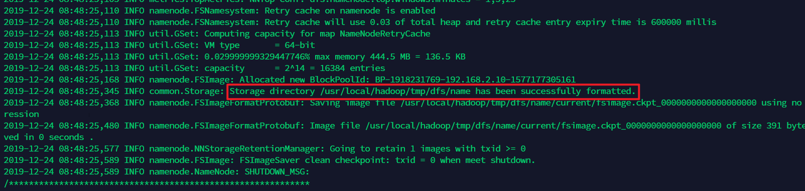
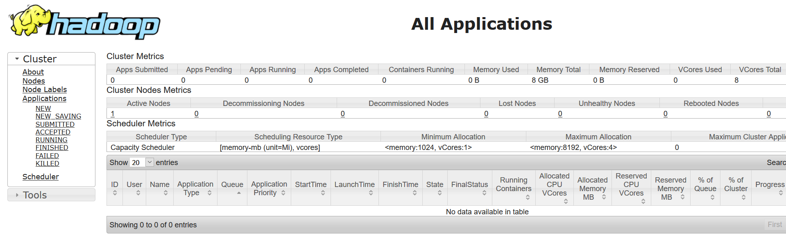
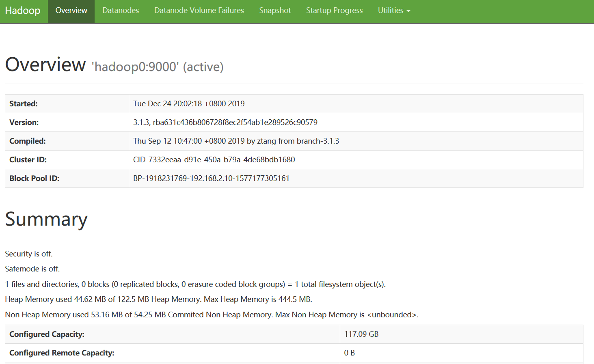
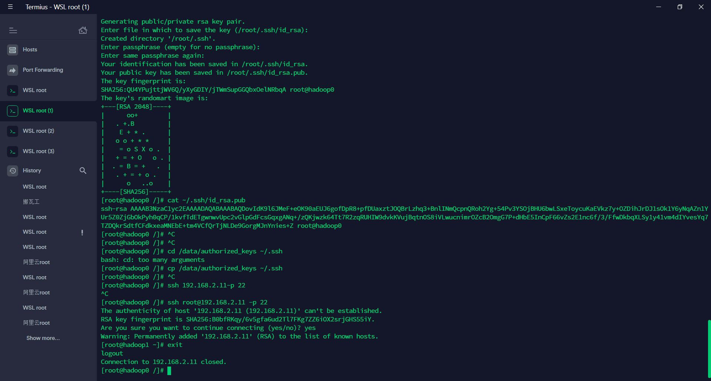

## 环境说明
- win10专业版19.3  
- docker desktop   
- WSL-Ubuntu18.04  
- jdk1.8-8u231
- hadoop-3.1.3  

:::warning
docker是windows上的,也就是在WSL中的客户端不能直接挂在WSL的目录,必须能够转化为windows下的目录
:::
如果不做更改,默认其他盘是在`/mnt`下的,但是docker挂载目录需要的是可以转化为win下可寻的目录,所以不能直接挂载/mnt/c,会挂载到一个奇怪的目录,而且不能取消  
在WSL中编辑`/etc/wsl.conf`写入并 *重启*  


```shell
[automount]
enabled = true
root = /
options = "metadata,umask=22,fmask=11"
mountFsTab = false
```
之后根目录下会有`/c /d /e`,想要挂载目录`/c/programfiles...`就可以了  
同样注意WSL下的`$PWD``$HOME`和自定义的变量都不能用,WSL的root在  
`/C/Users/ooowl/AppData/Local/Packages/CanonicalGroupLimited.Ubuntu18.04onWindows_79rhkp1fndgsc/LocalState/rootfs/root/`  
且不可读,但是可以挂载很奇怪.
### 总目标
三个机器一主两从
- hadoop0 192.168.2.10(主)
- hadoop1 192.168.2.11
- hadoop2 192.168.2.12
## 镜像准备
我用的centos7,jdk-8u231-linux-x64,Apache下载的hadoop-3.1.3
### 制作镜像
思路:我们需要的是三个装好hadoop和jdk的镜像,并且配置好了ssh
pull下来centos`docker pull centos`
```
NAME                               DESCRIPTION                                     STARS               OFFICIAL            AUTOMATED
centos                             The official build of CentOS.                   5734                [OK]           
```
搞出这么个目录来
```
 root ~>tree hadoopimgs                                                                      
hadoopimgs
├── centos-hadoop
│   ├── Dockerfile #1 ssh
│   └── hadoop-3.1.3.tar.gz
├── centos-ssh-jdk
│   ├── Dockerfile #2 jdk
│   └── jdk-8u231-linux-x64.tar.gz
└── centos-ssh-root
    └── Dockerfile #3 hadoop
```
在windows上下载两个软件然后直接cp进来  
1 ssh的Dockerfile
```
# 选择一个已有的os镜像作为基础  
FROM centos 
   
# 镜像的作者  
MAINTAINER shixun
   
# 安装openssh-server和sudo软件包，并且将sshd的UsePAM参数设置成no  
RUN yum install -y openssh-server sudo  
RUN sed -i 's/UsePAM yes/UsePAM no/g' /etc/ssh/sshd_config  
#安装openssh-clients
RUN yum  install -y openssh-clients
   
# 添加测试用户root，密码root，并且将此用户添加到sudoers里  
RUN echo "root:root" | chpasswd
RUN echo "root   ALL=(ALL)       ALL" >> /etc/sudoers  
# 下面这两句比较特殊，在centos6上必须要有，否则创建出来的容器sshd不能登录  
RUN ssh-keygen -t dsa -f /etc/ssh/ssh_host_dsa_key  
RUN ssh-keygen -t rsa -f /etc/ssh/ssh_host_rsa_key  
   
# 启动sshd服务并且暴露22端口  
RUN mkdir /var/run/sshd  
EXPOSE 22  
CMD ["/usr/sbin/sshd", "-D"]
```
在这个目录中执行`docker build  -t "centos-ssh" . `

2 jdk的Dockerfile
```
FROM centos-ssh
ADD ./jdk-8u231-linux-x64.tar.gz /usr/local/
RUN mv /usr/local/jdk1.8.0_231 /usr/local/jdk1.8
ENV JAVA_HOME /usr/local/jdk1.8
ENV PATH $JAVA_HOME/bin:$PATH
```  
在这个目录中执行`docker build  -t "centos-jdk" . `

3 hadoop的Dockerfile
```
FROM centos-jdk
ADD hadoop-3.1.3.tar.gz /usr/local
RUN mv /usr/local/hadoop-3.1.3  /usr/local/hadoop
ENV HADOOP_HOME /usr/local/hadoop
ENV PATH $HADOOP_HOME/bin:$PATH
```
在这个目录中执行`docker build  -t "centos-hadoop" . `
   
一定要按顺序执行不能乱序因为后面的镜像需要前面的设置  
然后`docker images`
```
REPOSITORY                 TAG                 IMAGE ID            CREATED             SIZE
centos-hadoop              latest              0775d9e8e35f        25 hours ago        2.79GB
centos-jdk                 latest              1fb53b406bea        25 hours ago        1.1GB
centos-ssh                 latest              636c9d7f103e        25 hours ago        297MB
centos                     latest              0f3e07c0138f        2 months ago        220MB
```
### 镜像互通
首先我们捋一下思路:我们需要建立三个镜像,并且能够互相访问,有固定的ip这样hadoop可以访问  
  
大部分人用的都是pipework建立bridge,但是WSL好像不能用,所以我们选择docker的网络  
首先创建一个网络覆盖192.168.2.10网段,默认bridge模式可以内外访问,名称就是hadoop就好  
`docker network ls`查看网络,`docker network create --subnet 192.168.2.0/24 hadoop`
然后我们创建1个镜像然后将配置好的镜像提交一个新镜像,直接创建两个一模一样的,先创建下面这样的目录,映射到里面传输数据用(文件是乱七八糟创建的,看看挂载是否成功)
```
root>~$tree hadoopdata

hadoopdata
├── authorized_keys
├── master0
│   ├── a.txt
│   ├── as
│   └── b.txt
├── slave1
│   └── daf
└── slave2
    └── sadsadsa
```

WEB界面中监控hdfs:50070,50075   
WEB界面中监控任务执行状况:8088  
访问HDFS:9000  
<br/>
每个主机都开放ssh,22映射出来
<br/>


*命令*  
hadoop0
```
docker run -v /C/Users/ooowl/AppData/Local/Packages/CanonicalGroupLimited.Ubuntu18.04onWindows_79rhkp1fndgsc/LocalState/rootfs/root/hadoopdata:/data 
--name hadoop0 --hostname hadoop0 
--net hadoop --ip 192.168.2.10 -d -p 20022:22 -p 50070:50070 -p 8088:8088 -p 9000:9000  
centos-hadoop
```
hadoop1
```
docker run -v /C/Users/ooowl/AppData/Local/Packages/CanonicalGroupLimited.Ubuntu18.04onWindows_79rhkp1fndgsc/LocalState/rootfs/root/hadoopdata/:/data 
--name hadoop1 --hostname hadoop1 
--net hadoop --ip 192.168.2.11 -d -P -p 20023:22 -p 50071:50070 -p 8089:8088 -p 9001:9000 
centos-hadoop
```
hadoop2
```
docker run -v /C/Users/ooowl/AppData/Local/Packages/CanonicalGroupLimited.Ubuntu18.04onWindows_79rhkp1fndgsc/LocalState/rootfs/root/hadoopdata:/data 
--name hadoop2 --hostname hadoop2 
--net hadoop --ip 192.168.2.12 -d -P -p 20024:22 -p 50072:50070 -p 8090:8088 -p 9002:9000 
centos-hadoop
```

注意hostname设置好,相当于给本机预设了DNS,能用名称查询到(为了好看我加了换行记得去掉

:::tip
我是在WSL上跑的,所以需要映射的目录是从win下能访问到的根目录,直接`$HOME`和`$PWD`都不行
:::


这样配置免密登录就完成了,而且暴露了外网20022,其他机器外网也可以连接  

## 配置hadoop
### 伪集群配置

<h3>修改配置文件</h3>

hadoop的目录在`/usr/local/hadoop/`,进入  
之后进入`/usr/local/hadoop/etc/hadoop`  
[1] `vim hadoop-env.sh`,指定运行用户hadoophome等等,如果加进去无效,就加到`~/.bashrc`里面
```
export JAVA_HOME=/usr/local/jdk1.8
export HDFS_NAMENODE_USER="root"
export HDFS_DATANODE_USER="root"
export HDFS_SECONDARYNAMENODE_USER="root"
export YARN_RESOURCEMANAGER_USER="root"
export YARN_NODEMANAGER_USER="root"
export HADOOP_INSTALL=/usr/local/hadoop
export PATH=$PATH:$HADOOP_INSTALL/bin
export PATH=$PATH:$HADOOP_INSTALL/sbin
export HADOOP_MAPRED_HOME=$HADOOP_INSTALL
export HADOOP_COMMON_HOME=$HADOOP_INSTALL
export HADOOP_HDFS_HOME=$HADOOP_INSTALL
export YARN_HOME=$HADOOP_INSTALL
```
不添加会报错
```
ERROR: Attempting to launch hdfs namenode as root
ERROR: but there is no HDFS_NAMENODE_USER defined. Aborting launch.
Starting datanodes
ERROR: Attempting to launch hdfs datanode as root
ERROR: but there is no HDFS_DATANODE_USER defined. Aborting launch.
Starting secondary namenodes [localhost.localdomain]
ERROR: Attempting to launch hdfs secondarynamenode as root
ERROR: but there is no HDFS_SECONDARYNAMENODE_USER defined. Aborting launch.
```
[2] vim core-site.xml
```
<configuration>
        <property>
                <name>fs.defaultFS</name>
                <value>hdfs://hadoop0:9000</value>
        </property>
        <property>
                <name>hadoop.tmp.dir</name>
                <value>/usr/local/hadoop/tmp</value>
        </property>
         <property>
                 <name>fs.trash.interval</name>
                 <value>1440</value>
        </property>
</configuration>
```

[3] `vim hdfs-site.xml`
```
<configuration>
    <property>
        <name>dfs.replication</name>
        <value>1</value>
    </property>
    <property>
        <name>dfs.permissions</name>
        <value>false</value>
    </property>
    <property> 
        <name>dfs.http.address</name>
        <value>0.0.0.0:50070</value>
    </property>
</configuration>
```

[4] `vim yarn-site.xml`
```
<configuration>
        <property>
                <name>yarn.nodemanager.aux-services</name>
                <value>mapreduce_shuffle</value>
        </property>
        <property> 
                <name>yarn.log-aggregation-enable</name> 
                <value>true</value> 
        </property>
</configuration>
```

[5] vim mapred-site.xml
```
<configuration>
    <property>
        <name>mapreduce.framework.name</name>
        <value>yarn</value>
    </property>
    <property>
        <name>yarn.app.mapreduce.am.env</name>
        <value>HADOOP_MAPRED_HOME=$HADOOP_HOME</value>
    </property>
    <property>
        <name>mapreduce.map.env</name>
        <value>HADOOP_MAPRED_HOME=$HADOOP_HOME</value>
    </property>
    <property>
        <name>mapreduce.reduce.env</name>
        <value>HADOOP_MAPRED_HOME=$HADOOP_HOME</value>
    </property>
</configuration>
```


我知道很麻烦但是里面没东西也不用找,复制进去就行了😀  
 
之后进入`cd /usr/local/hadoop`,初始化`bin/hdfs namenode -format`
:::tip
格式化操作不能重复执行。如果一定要重复格式化，带参数-force即可
:::

出现这个就应该成功了  
<div align=center ></div>
<details>
  <summary><B><I style="cursor:pointer; color: #0e5870">点击查看日志</I></B></summary>
```
WARNING: /usr/local/hadoop/logs does not exist. Creating.
2019-12-24 08:48:24,278 INFO namenode.NameNode: STARTUP_MSG: 
/************************************************************
STARTUP_MSG: Starting NameNode
STARTUP_MSG:   host = hadoop0/192.168.2.10
STARTUP_MSG:   args = [-format]
STARTUP_MSG:   version = 3.1.3
STARTUP_MSG:   classpath = /usr/local/hadoop/etc/hadoop:/usr/local/hadoop/share/hadoop/common/lib/jersey-core-1.19.jar:/usr/local/hadoop/share/hadoop/common/lib/commons-lang-2.6.jar:/usr/local/hadoop/share/hadoop/common/lib/guava-27.0-jre.jar:/usr/local/hadoop/share/hadoop/common/lib/jaxb-impl-2.2.3-1.jar:/usr/local/hadoop/share/hadoop/common/lib/jetty-http-9.3.24.v20180605.jar:/usr/local/hadoop/share/hadoop/common/lib/kerb-simplekdc-1.0.1.jar:/usr/local/hadoop/share/hadoop/common/lib/kerb-client-1.0.1.jar:/usr/local/hadoop/share/hadoop/common/lib/commons-cli-1.2.jar:/usr/local/hadoop/share/hadoop/common/lib/jackson-databind-2.7.8.jar:/usr/local/hadoop/share/hadoop/common/lib/jersey-servlet-1.19.jar:/usr/local/hadoop/share/hadoop/common/lib/httpclient-4.5.2.jar:/usr/local/hadoop/share/hadoop/common/lib/jackson-core-asl-1.9.13.jar:/usr/local/hadoop/share/hadoop/common/lib/kerby-config-1.0.1.jar:/usr/local/hadoop/share/hadoop/common/lib/jsch-0.1.54.jar:/usr/local/hadoop/share/hadoop/common/lib/httpcore-4.4.4.jar:/usr/local/hadoop/share/hadoop/common/lib/kerb-crypto-1.0.1.jar:/usr/local/hadoop/share/hadoop/common/lib/hadoop-annotations-3.1.3.jar:/usr/local/hadoop/share/hadoop/common/lib/curator-client-2.13.0.jar:/usr/local/hadoop/share/hadoop/common/lib/commons-net-3.6.jar:/usr/local/hadoop/share/hadoop/common/lib/paranamer-2.3.jar:/usr/local/hadoop/share/hadoop/common/lib/curator-recipes-2.13.0.jar:/usr/local/hadoop/share/hadoop/common/lib/jetty-xml-9.3.24.v20180605.jar:/usr/local/hadoop/share/hadoop/common/lib/kerb-util-1.0.1.jar:/usr/local/hadoop/share/hadoop/common/lib/re2j-1.1.jar:/usr/local/hadoop/share/hadoop/common/lib/netty-3.10.5.Final.jar:/usr/local/hadoop/share/hadoop/common/lib/kerby-pkix-1.0.1.jar:/usr/local/hadoop/share/hadoop/common/lib/commons-collections-3.2.2.jar:/usr/local/hadoop/share/hadoop/common/lib/commons-configuration2-2.1.1.jar:/usr/local/hadoop/share/hadoop/common/lib/metrics-core-3.2.4.jar:/usr/local/hadoop/share/hadoop/common/lib/zookeeper-3.4.13.jar:/usr/local/hadoop/share/hadoop/common/lib/commons-math3-3.1.1.jar:/usr/local/hadoop/share/hadoop/common/lib/jetty-server-9.3.24.v20180605.jar:/usr/local/hadoop/share/hadoop/common/lib/listenablefuture-9999.0-empty-to-avoid-conflict-with-guava.jar:/usr/local/hadoop/share/hadoop/common/lib/commons-codec-1.11.jar:/usr/local/hadoop/share/hadoop/common/lib/nimbus-jose-jwt-4.41.1.jar:/usr/local/hadoop/share/hadoop/common/lib/jersey-json-1.19.jar:/usr/local/hadoop/share/hadoop/common/lib/jackson-xc-1.9.13.jar:/usr/local/hadoop/share/hadoop/common/lib/kerby-util-1.0.1.jar:/usr/local/hadoop/share/hadoop/common/lib/commons-compress-1.18.jar:/usr/local/hadoop/share/hadoop/common/lib/jetty-servlet-9.3.24.v20180605.jar:/usr/local/hadoop/share/hadoop/common/lib/jackson-jaxrs-1.9.13.jar:/usr/local/hadoop/share/hadoop/common/lib/gson-2.2.4.jar:/usr/local/hadoop/share/hadoop/common/lib/jaxb-api-2.2.11.jar:/usr/local/hadoop/share/hadoop/common/lib/commons-lang3-3.4.jar:/usr/local/hadoop/share/hadoop/common/lib/jersey-server-1.19.jar:/usr/local/hadoop/share/hadoop/common/lib/jackson-core-2.7.8.jar:/usr/local/hadoop/share/hadoop/common/lib/failureaccess-1.0.jar:/usr/local/hadoop/share/hadoop/common/lib/kerby-asn1-1.0.1.jar:/usr/local/hadoop/share/hadoop/common/lib/jsr311-api-1.1.1.jar:/usr/local/hadoop/share/hadoop/common/lib/htrace-core4-4.1.0-incubating.jar:/usr/local/hadoop/share/hadoop/common/lib/hadoop-auth-3.1.3.jar:/usr/local/hadoop/share/hadoop/common/lib/animal-sniffer-annotations-1.17.jar:/usr/local/hadoop/share/hadoop/common/lib/curator-framework-2.13.0.jar:/usr/local/hadoop/share/hadoop/common/lib/json-smart-2.3.jar:/usr/local/hadoop/share/hadoop/common/lib/audience-annotations-0.5.0.jar:/usr/local/hadoop/share/hadoop/common/lib/jetty-io-9.3.24.v20180605.jar:/usr/local/hadoop/share/hadoop/common/lib/kerby-xdr-1.0.1.jar:/usr/local/hadoop/share/hadoop/common/lib/woodstox-core-5.0.3.jar:/usr/local/hadoop/share/hadoop/common/lib/jetty-webapp-9.3.24.v20180605.jar:/usr/local/hadoop/share/hadoop/common/lib/jackson-mapper-asl-1.9.13.jar:/usr/local/hadoop/share/hadoop/common/lib/kerb-server-1.0.1.jar:/usr/local/hadoop/share/hadoop/common/lib/kerb-common-1.0.1.jar:/usr/local/hadoop/share/hadoop/common/lib/jcip-annotations-1.0-1.jar:/usr/local/hadoop/share/hadoop/common/lib/log4j-1.2.17.jar:/usr/local/hadoop/share/hadoop/common/lib/kerb-admin-1.0.1.jar:/usr/local/hadoop/share/hadoop/common/lib/javax.servlet-api-3.1.0.jar:/usr/local/hadoop/share/hadoop/common/lib/jetty-security-9.3.24.v20180605.jar:/usr/local/hadoop/share/hadoop/common/lib/jettison-1.1.jar:/usr/local/hadoop/share/hadoop/common/lib/commons-logging-1.1.3.jar:/usr/local/hadoop/share/hadoop/common/lib/jsp-api-2.1.jar:/usr/local/hadoop/share/hadoop/common/lib/jackson-annotations-2.7.8.jar:/usr/local/hadoop/share/hadoop/common/lib/checker-qual-2.5.2.jar:/usr/local/hadoop/share/hadoop/common/lib/token-provider-1.0.1.jar:/usr/local/hadoop/share/hadoop/common/lib/error_prone_annotations-2.2.0.jar:/usr/local/hadoop/share/hadoop/common/lib/asm-5.0.4.jar:/usr/local/hadoop/share/hadoop/common/lib/stax2-api-3.1.4.jar:/usr/local/hadoop/share/hadoop/common/lib/protobuf-java-2.5.0.jar:/usr/local/hadoop/share/hadoop/common/lib/slf4j-api-1.7.25.jar:/usr/local/hadoop/share/hadoop/common/lib/jsr305-3.0.0.jar:/usr/local/hadoop/share/hadoop/common/lib/j2objc-annotations-1.1.jar:/usr/local/hadoop/share/hadoop/common/lib/jetty-util-9.3.24.v20180605.jar:/usr/local/hadoop/share/hadoop/common/lib/snappy-java-1.0.5.jar:/usr/local/hadoop/share/hadoop/common/lib/kerb-core-1.0.1.jar:/usr/local/hadoop/share/hadoop/common/lib/avro-1.7.7.jar:/usr/local/hadoop/share/hadoop/common/lib/kerb-identity-1.0.1.jar:/usr/local/hadoop/share/hadoop/common/lib/accessors-smart-1.2.jar:/usr/local/hadoop/share/hadoop/common/lib/commons-beanutils-1.9.3.jar:/usr/local/hadoop/share/hadoop/common/lib/jul-to-slf4j-1.7.25.jar:/usr/local/hadoop/share/hadoop/common/lib/commons-io-2.5.jar:/usr/local/hadoop/share/hadoop/common/lib/slf4j-log4j12-1.7.25.jar:/usr/local/hadoop/share/hadoop/common/hadoop-nfs-3.1.3.jar:/usr/local/hadoop/share/hadoop/common/hadoop-common-3.1.3.jar:/usr/local/hadoop/share/hadoop/common/hadoop-kms-3.1.3.jar:/usr/local/hadoop/share/hadoop/common/hadoop-common-3.1.3-tests.jar:/usr/local/hadoop/share/hadoop/hdfs:/usr/local/hadoop/share/hadoop/hdfs/lib/jersey-core-1.19.jar:/usr/local/hadoop/share/hadoop/hdfs/lib/commons-lang-2.6.jar:/usr/local/hadoop/share/hadoop/hdfs/lib/guava-27.0-jre.jar:/usr/local/hadoop/share/hadoop/hdfs/lib/jaxb-impl-2.2.3-1.jar:/usr/local/hadoop/share/hadoop/hdfs/lib/jetty-http-9.3.24.v20180605.jar:/usr/local/hadoop/share/hadoop/hdfs/lib/kerb-simplekdc-1.0.1.jar:/usr/local/hadoop/share/hadoop/hdfs/lib/kerb-client-1.0.1.jar:/usr/local/hadoop/share/hadoop/hdfs/lib/commons-cli-1.2.jar:/usr/local/hadoop/share/hadoop/hdfs/lib/jackson-databind-2.7.8.jar:/usr/local/hadoop/share/hadoop/hdfs/lib/jersey-servlet-1.19.jar:/usr/local/hadoop/share/hadoop/hdfs/lib/httpclient-4.5.2.jar:/usr/local/hadoop/share/hadoop/hdfs/lib/jackson-core-asl-1.9.13.jar:/usr/local/hadoop/share/hadoop/hdfs/lib/kerby-config-1.0.1.jar:/usr/local/hadoop/share/hadoop/hdfs/lib/jsch-0.1.54.jar:/usr/local/hadoop/share/hadoop/hdfs/lib/httpcore-4.4.4.jar:/usr/local/hadoop/share/hadoop/hdfs/lib/kerb-crypto-1.0.1.jar:/usr/local/hadoop/share/hadoop/hdfs/lib/hadoop-annotations-3.1.3.jar:/usr/local/hadoop/share/hadoop/hdfs/lib/curator-client-2.13.0.jar:/usr/local/hadoop/share/hadoop/hdfs/lib/leveldbjni-all-1.8.jar:/usr/local/hadoop/share/hadoop/hdfs/lib/okhttp-2.7.5.jar:/usr/local/hadoop/share/hadoop/hdfs/lib/commons-net-3.6.jar:/usr/local/hadoop/share/hadoop/hdfs/lib/paranamer-2.3.jar:/usr/local/hadoop/share/hadoop/hdfs/lib/curator-recipes-2.13.0.jar:/usr/local/hadoop/share/hadoop/hdfs/lib/jetty-xml-9.3.24.v20180605.jar:/usr/local/hadoop/share/hadoop/hdfs/lib/kerb-util-1.0.1.jar:/usr/local/hadoop/share/hadoop/hdfs/lib/re2j-1.1.jar:/usr/local/hadoop/share/hadoop/hdfs/lib/netty-3.10.5.Final.jar:/usr/local/hadoop/share/hadoop/hdfs/lib/okio-1.6.0.jar:/usr/local/hadoop/share/hadoop/hdfs/lib/kerby-pkix-1.0.1.jar:/usr/local/hadoop/share/hadoop/hdfs/lib/commons-collections-3.2.2.jar:/usr/local/hadoop/share/hadoop/hdfs/lib/commons-configuration2-2.1.1.jar:/usr/local/hadoop/share/hadoop/hdfs/lib/zookeeper-3.4.13.jar:/usr/local/hadoop/share/hadoop/hdfs/lib/commons-math3-3.1.1.jar:/usr/local/hadoop/share/hadoop/hdfs/lib/jetty-server-9.3.24.v20180605.jar:/usr/local/hadoop/share/hadoop/hdfs/lib/listenablefuture-9999.0-empty-to-avoid-conflict-with-guava.jar:/usr/local/hadoop/share/hadoop/hdfs/lib/commons-codec-1.11.jar:/usr/local/hadoop/share/hadoop/hdfs/lib/nimbus-jose-jwt-4.41.1.jar:/usr/local/hadoop/share/hadoop/hdfs/lib/jersey-json-1.19.jar:/usr/local/hadoop/share/hadoop/hdfs/lib/jackson-xc-1.9.13.jar:/usr/local/hadoop/share/hadoop/hdfs/lib/kerby-util-1.0.1.jar:/usr/local/hadoop/share/hadoop/hdfs/lib/commons-compress-1.18.jar:/usr/local/hadoop/share/hadoop/hdfs/lib/jetty-servlet-9.3.24.v20180605.jar:/usr/local/hadoop/share/hadoop/hdfs/lib/jackson-jaxrs-1.9.13.jar:/usr/local/hadoop/share/hadoop/hdfs/lib/gson-2.2.4.jar:/usr/local/hadoop/share/hadoop/hdfs/lib/jaxb-api-2.2.11.jar:/usr/local/hadoop/share/hadoop/hdfs/lib/commons-lang3-3.4.jar:/usr/local/hadoop/share/hadoop/hdfs/lib/jersey-server-1.19.jar:/usr/local/hadoop/share/hadoop/hdfs/lib/jackson-core-2.7.8.jar:/usr/local/hadoop/share/hadoop/hdfs/lib/failureaccess-1.0.jar:/usr/local/hadoop/share/hadoop/hdfs/lib/kerby-asn1-1.0.1.jar:/usr/local/hadoop/share/hadoop/hdfs/lib/jsr311-api-1.1.1.jar:/usr/local/hadoop/share/hadoop/hdfs/lib/htrace-core4-4.1.0-incubating.jar:/usr/local/hadoop/share/hadoop/hdfs/lib/hadoop-auth-3.1.3.jar:/usr/local/hadoop/share/hadoop/hdfs/lib/animal-sniffer-annotations-1.17.jar:/usr/local/hadoop/share/hadoop/hdfs/lib/curator-framework-2.13.0.jar:/usr/local/hadoop/share/hadoop/hdfs/lib/json-smart-2.3.jar:/usr/local/hadoop/share/hadoop/hdfs/lib/audience-annotations-0.5.0.jar:/usr/local/hadoop/share/hadoop/hdfs/lib/jetty-io-9.3.24.v20180605.jar:/usr/local/hadoop/share/hadoop/hdfs/lib/kerby-xdr-1.0.1.jar:/usr/local/hadoop/share/hadoop/hdfs/lib/commons-daemon-1.0.13.jar:/usr/local/hadoop/share/hadoop/hdfs/lib/woodstox-core-5.0.3.jar:/usr/local/hadoop/share/hadoop/hdfs/lib/jetty-webapp-9.3.24.v20180605.jar:/usr/local/hadoop/share/hadoop/hdfs/lib/jackson-mapper-asl-1.9.13.jar:/usr/local/hadoop/share/hadoop/hdfs/lib/kerb-server-1.0.1.jar:/usr/local/hadoop/share/hadoop/hdfs/lib/kerb-common-1.0.1.jar:/usr/local/hadoop/share/hadoop/hdfs/lib/jcip-annotations-1.0-1.jar:/usr/local/hadoop/share/hadoop/hdfs/lib/log4j-1.2.17.jar:/usr/local/hadoop/share/hadoop/hdfs/lib/kerb-admin-1.0.1.jar:/usr/local/hadoop/share/hadoop/hdfs/lib/javax.servlet-api-3.1.0.jar:/usr/local/hadoop/share/hadoop/hdfs/lib/jetty-security-9.3.24.v20180605.jar:/usr/local/hadoop/share/hadoop/hdfs/lib/jettison-1.1.jar:/usr/local/hadoop/share/hadoop/hdfs/lib/commons-logging-1.1.3.jar:/usr/local/hadoop/share/hadoop/hdfs/lib/jackson-annotations-2.7.8.jar:/usr/local/hadoop/share/hadoop/hdfs/lib/checker-qual-2.5.2.jar:/usr/local/hadoop/share/hadoop/hdfs/lib/token-provider-1.0.1.jar:/usr/local/hadoop/share/hadoop/hdfs/lib/error_prone_annotations-2.2.0.jar:/usr/local/hadoop/share/hadoop/hdfs/lib/asm-5.0.4.jar:/usr/local/hadoop/share/hadoop/hdfs/lib/jetty-util-ajax-9.3.24.v20180605.jar:/usr/local/hadoop/share/hadoop/hdfs/lib/stax2-api-3.1.4.jar:/usr/local/hadoop/share/hadoop/hdfs/lib/protobuf-java-2.5.0.jar:/usr/local/hadoop/share/hadoop/hdfs/lib/json-simple-1.1.1.jar:/usr/local/hadoop/share/hadoop/hdfs/lib/jsr305-3.0.0.jar:/usr/local/hadoop/share/hadoop/hdfs/lib/j2objc-annotations-1.1.jar:/usr/local/hadoop/share/hadoop/hdfs/lib/jetty-util-9.3.24.v20180605.jar:/usr/local/hadoop/share/hadoop/hdfs/lib/netty-all-4.0.52.Final.jar:/usr/local/hadoop/share/hadoop/hdfs/lib/snappy-java-1.0.5.jar:/usr/local/hadoop/share/hadoop/hdfs/lib/kerb-core-1.0.1.jar:/usr/local/hadoop/share/hadoop/hdfs/lib/avro-1.7.7.jar:/usr/local/hadoop/share/hadoop/hdfs/lib/kerb-identity-1.0.1.jar:/usr/local/hadoop/share/hadoop/hdfs/lib/accessors-smart-1.2.jar:/usr/local/hadoop/share/hadoop/hdfs/lib/commons-beanutils-1.9.3.jar:/usr/local/hadoop/share/hadoop/hdfs/lib/commons-io-2.5.jar:/usr/local/hadoop/share/hadoop/hdfs/hadoop-hdfs-rbf-3.1.3-tests.jar:/usr/local/hadoop/share/hadoop/hdfs/hadoop-hdfs-3.1.3.jar:/usr/local/hadoop/share/hadoop/hdfs/hadoop-hdfs-httpfs-3.1.3.jar:/usr/local/hadoop/share/hadoop/hdfs/hadoop-hdfs-native-client-3.1.3.jar:/usr/local/hadoop/share/hadoop/hdfs/hadoop-hdfs-rbf-3.1.3.jar:/usr/local/hadoop/share/hadoop/hdfs/hadoop-hdfs-nfs-3.1.3.jar:/usr/local/hadoop/share/hadoop/hdfs/hadoop-hdfs-client-3.1.3-tests.jar:/usr/local/hadoop/share/hadoop/hdfs/hadoop-hdfs-client-3.1.3.jar:/usr/local/hadoop/share/hadoop/hdfs/hadoop-hdfs-3.1.3-tests.jar:/usr/local/hadoop/share/hadoop/hdfs/hadoop-hdfs-native-client-3.1.3-tests.jar:/usr/local/hadoop/share/hadoop/mapreduce/lib/hamcrest-core-1.3.jar:/usr/local/hadoop/share/hadoop/mapreduce/lib/junit-4.11.jar:/usr/local/hadoop/share/hadoop/mapreduce/hadoop-mapreduce-examples-3.1.3.jar:/usr/local/hadoop/share/hadoop/mapreduce/hadoop-mapreduce-client-jobclient-3.1.3-tests.jar:/usr/local/hadoop/share/hadoop/mapreduce/hadoop-mapreduce-client-nativetask-3.1.3.jar:/usr/local/hadoop/share/hadoop/mapreduce/hadoop-mapreduce-client-uploader-3.1.3.jar:/usr/local/hadoop/share/hadoop/mapreduce/hadoop-mapreduce-client-shuffle-3.1.3.jar:/usr/local/hadoop/share/hadoop/mapreduce/hadoop-mapreduce-client-core-3.1.3.jar:/usr/local/hadoop/share/hadoop/mapreduce/hadoop-mapreduce-client-jobclient-3.1.3.jar:/usr/local/hadoop/share/hadoop/mapreduce/hadoop-mapreduce-client-common-3.1.3.jar:/usr/local/hadoop/share/hadoop/mapreduce/hadoop-mapreduce-client-app-3.1.3.jar:/usr/local/hadoop/share/hadoop/mapreduce/hadoop-mapreduce-client-hs-plugins-3.1.3.jar:/usr/local/hadoop/share/hadoop/mapreduce/hadoop-mapreduce-client-hs-3.1.3.jar:/usr/local/hadoop/share/hadoop/yarn:/usr/local/hadoop/share/hadoop/yarn/lib/objenesis-1.0.jar:/usr/local/hadoop/share/hadoop/yarn/lib/fst-2.50.jar:/usr/local/hadoop/share/hadoop/yarn/lib/geronimo-jcache_1.0_spec-1.0-alpha-1.jar:/usr/local/hadoop/share/hadoop/yarn/lib/HikariCP-java7-2.4.12.jar:/usr/local/hadoop/share/hadoop/yarn/lib/guice-4.0.jar:/usr/local/hadoop/share/hadoop/yarn/lib/ehcache-3.3.1.jar:/usr/local/hadoop/share/hadoop/yarn/lib/metrics-core-3.2.4.jar:/usr/local/hadoop/share/hadoop/yarn/lib/json-io-2.5.1.jar:/usr/local/hadoop/share/hadoop/yarn/lib/jackson-jaxrs-json-provider-2.7.8.jar:/usr/local/hadoop/share/hadoop/yarn/lib/jackson-jaxrs-base-2.7.8.jar:/usr/local/hadoop/share/hadoop/yarn/lib/aopalliance-1.0.jar:/usr/local/hadoop/share/hadoop/yarn/lib/guice-servlet-4.0.jar:/usr/local/hadoop/share/hadoop/yarn/lib/swagger-annotations-1.5.4.jar:/usr/local/hadoop/share/hadoop/yarn/lib/mssql-jdbc-6.2.1.jre7.jar:/usr/local/hadoop/share/hadoop/yarn/lib/dnsjava-2.1.7.jar:/usr/local/hadoop/share/hadoop/yarn/lib/javax.inject-1.jar:/usr/local/hadoop/share/hadoop/yarn/lib/snakeyaml-1.16.jar:/usr/local/hadoop/share/hadoop/yarn/lib/jackson-module-jaxb-annotations-2.7.8.jar:/usr/local/hadoop/share/hadoop/yarn/lib/jersey-client-1.19.jar:/usr/local/hadoop/share/hadoop/yarn/lib/java-util-1.9.0.jar:/usr/local/hadoop/share/hadoop/yarn/lib/jersey-guice-1.19.jar:/usr/local/hadoop/share/hadoop/yarn/hadoop-yarn-server-web-proxy-3.1.3.jar:/usr/local/hadoop/share/hadoop/yarn/hadoop-yarn-applications-distributedshell-3.1.3.jar:/usr/local/hadoop/share/hadoop/yarn/hadoop-yarn-server-common-3.1.3.jar:/usr/local/hadoop/share/hadoop/yarn/hadoop-yarn-services-core-3.1.3.jar:/usr/local/hadoop/share/hadoop/yarn/hadoop-yarn-api-3.1.3.jar:/usr/local/hadoop/share/hadoop/yarn/hadoop-yarn-server-applicationhistoryservice-3.1.3.jar:/usr/local/hadoop/share/hadoop/yarn/hadoop-yarn-services-api-3.1.3.jar:/usr/local/hadoop/share/hadoop/yarn/hadoop-yarn-server-sharedcachemanager-3.1.3.jar:/usr/local/hadoop/share/hadoop/yarn/hadoop-yarn-client-3.1.3.jar:/usr/local/hadoop/share/hadoop/yarn/hadoop-yarn-server-router-3.1.3.jar:/usr/local/hadoop/share/hadoop/yarn/hadoop-yarn-applications-unmanaged-am-launcher-3.1.3.jar:/usr/local/hadoop/share/hadoop/yarn/hadoop-yarn-server-resourcemanager-3.1.3.jar:/usr/local/hadoop/share/hadoop/yarn/hadoop-yarn-server-timeline-pluginstorage-3.1.3.jar:/usr/local/hadoop/share/hadoop/yarn/hadoop-yarn-registry-3.1.3.jar:/usr/local/hadoop/share/hadoop/yarn/hadoop-yarn-server-tests-3.1.3.jar:/usr/local/hadoop/share/hadoop/yarn/hadoop-yarn-server-nodemanager-3.1.3.jar:/usr/local/hadoop/share/hadoop/yarn/hadoop-yarn-common-3.1.3.jar
STARTUP_MSG:   build = https://gitbox.apache.org/repos/asf/hadoop.git -r ba631c436b806728f8ec2f54ab1e289526c90579; compiled by 'ztang' on 2019-09-12T02:47Z
STARTUP_MSG:   java = 1.8.0_231
************************************************************/
2019-12-24 08:48:24,285 INFO namenode.NameNode: registered UNIX signal handlers for [TERM, HUP, INT]
2019-12-24 08:48:24,375 INFO namenode.NameNode: createNameNode [-format]
Formatting using clusterid: CID-7332eeaa-d91e-450a-b79a-4de68bdb1680
2019-12-24 08:48:24,844 INFO namenode.FSEditLog: Edit logging is async:true
2019-12-24 08:48:24,856 INFO namenode.FSNamesystem: KeyProvider: null
2019-12-24 08:48:24,857 INFO namenode.FSNamesystem: fsLock is fair: true
2019-12-24 08:48:24,857 INFO namenode.FSNamesystem: Detailed lock hold time metrics enabled: false
2019-12-24 08:48:24,862 INFO namenode.FSNamesystem: fsOwner             = root (auth:SIMPLE)
2019-12-24 08:48:24,862 INFO namenode.FSNamesystem: supergroup          = supergroup
2019-12-24 08:48:24,862 INFO namenode.FSNamesystem: isPermissionEnabled = false
2019-12-24 08:48:24,862 INFO namenode.FSNamesystem: HA Enabled: false
2019-12-24 08:48:24,925 INFO common.Util: dfs.datanode.fileio.profiling.sampling.percentage set to 0. Disabling file IO profiling
2019-12-24 08:48:24,934 INFO blockmanagement.DatanodeManager: dfs.block.invalidate.limit: configured=1000, counted=60, effected=1000
2019-12-24 08:48:24,937 INFO blockmanagement.DatanodeManager: dfs.namenode.datanode.registration.ip-hostname-check=true
2019-12-24 08:48:24,942 INFO blockmanagement.BlockManager: dfs.namenode.startup.delay.block.deletion.sec is set to 000:00:00:00.000
2019-12-24 08:48:24,942 INFO blockmanagement.BlockManager: The block deletion will start around 2019 Dec 24 08:48:24
2019-12-24 08:48:24,943 INFO util.GSet: Computing capacity for map BlocksMap
2019-12-24 08:48:24,943 INFO util.GSet: VM type       = 64-bit
2019-12-24 08:48:24,945 INFO util.GSet: 2.0% max memory 444.5 MB = 8.9 MB
2019-12-24 08:48:24,945 INFO util.GSet: capacity      = 2^20 = 1048576 entries
2019-12-24 08:48:24,954 INFO blockmanagement.BlockManager: dfs.block.access.token.enable = false
2019-12-24 08:48:24,971 INFO Configuration.deprecation: No unit for dfs.namenode.safemode.extension(30000) assuming MILLISECONDS
2019-12-24 08:48:24,971 INFO blockmanagement.BlockManagerSafeMode: dfs.namenode.safemode.threshold-pct = 0.9990000128746033
2019-12-24 08:48:24,971 INFO blockmanagement.BlockManagerSafeMode: dfs.namenode.safemode.min.datanodes = 0
2019-12-24 08:48:24,972 INFO blockmanagement.BlockManagerSafeMode: dfs.namenode.safemode.extension = 30000
2019-12-24 08:48:24,974 INFO blockmanagement.BlockManager: defaultReplication         = 1
2019-12-24 08:48:24,974 INFO blockmanagement.BlockManager: maxReplication             = 512
2019-12-24 08:48:24,974 INFO blockmanagement.BlockManager: minReplication             = 1
2019-12-24 08:48:24,974 INFO blockmanagement.BlockManager: maxReplicationStreams      = 2
2019-12-24 08:48:24,974 INFO blockmanagement.BlockManager: redundancyRecheckInterval  = 3000ms
2019-12-24 08:48:24,974 INFO blockmanagement.BlockManager: encryptDataTransfer        = false
2019-12-24 08:48:24,974 INFO blockmanagement.BlockManager: maxNumBlocksToLog          = 1000
2019-12-24 08:48:25,033 INFO namenode.FSDirectory: GLOBAL serial map: bits=24 maxEntries=16777215
2019-12-24 08:48:25,084 INFO util.GSet: Computing capacity for map INodeMap
2019-12-24 08:48:25,084 INFO util.GSet: VM type       = 64-bit
2019-12-24 08:48:25,085 INFO util.GSet: 1.0% max memory 444.5 MB = 4.4 MB
2019-12-24 08:48:25,085 INFO util.GSet: capacity      = 2^19 = 524288 entries
2019-12-24 08:48:25,087 INFO namenode.FSDirectory: ACLs enabled? false
2019-12-24 08:48:25,087 INFO namenode.FSDirectory: POSIX ACL inheritance enabled? true
2019-12-24 08:48:25,087 INFO namenode.FSDirectory: XAttrs enabled? true
2019-12-24 08:48:25,087 INFO namenode.NameNode: Caching file names occurring more than 10 times
2019-12-24 08:48:25,092 INFO snapshot.SnapshotManager: Loaded config captureOpenFiles: false, skipCaptureAccessTimeOnlyChange: false, snapshotDiffAllowSnapRootDescendant: true, maxSnapshotLimit: 65536
2019-12-24 08:48:25,093 INFO snapshot.SnapshotManager: SkipList is disabled
2019-12-24 08:48:25,097 INFO util.GSet: Computing capacity for map cachedBlocks
2019-12-24 08:48:25,097 INFO util.GSet: VM type       = 64-bit
2019-12-24 08:48:25,097 INFO util.GSet: 0.25% max memory 444.5 MB = 1.1 MB
2019-12-24 08:48:25,098 INFO util.GSet: capacity      = 2^17 = 131072 entries
2019-12-24 08:48:25,105 INFO metrics.TopMetrics: NNTop conf: dfs.namenode.top.window.num.buckets = 10
2019-12-24 08:48:25,105 INFO metrics.TopMetrics: NNTop conf: dfs.namenode.top.num.users = 10
2019-12-24 08:48:25,105 INFO metrics.TopMetrics: NNTop conf: dfs.namenode.top.windows.minutes = 1,5,25
2019-12-24 08:48:25,110 INFO namenode.FSNamesystem: Retry cache on namenode is enabled
2019-12-24 08:48:25,110 INFO namenode.FSNamesystem: Retry cache will use 0.03 of total heap and retry cache entry expiry time is 600000 millis
2019-12-24 08:48:25,113 INFO util.GSet: Computing capacity for map NameNodeRetryCache
2019-12-24 08:48:25,113 INFO util.GSet: VM type       = 64-bit
2019-12-24 08:48:25,113 INFO util.GSet: 0.029999999329447746% max memory 444.5 MB = 136.5 KB
2019-12-24 08:48:25,113 INFO util.GSet: capacity      = 2^14 = 16384 entries
2019-12-24 08:48:25,168 INFO namenode.FSImage: Allocated new BlockPoolId: BP-1918231769-192.168.2.10-1577177305161
2019-12-24 08:48:25,345 INFO common.Storage: Storage directory /usr/local/hadoop/tmp/dfs/name has been successfully formatted.
2019-12-24 08:48:25,368 INFO namenode.FSImageFormatProtobuf: Saving image file /usr/local/hadoop/tmp/dfs/name/current/fsimage.ckpt_0000000000000000000 using no compression
2019-12-24 08:48:25,480 INFO namenode.FSImageFormatProtobuf: Image file /usr/local/hadoop/tmp/dfs/name/current/fsimage.ckpt_0000000000000000000 of size 391 bytes saved in 0 seconds .
2019-12-24 08:48:25,577 INFO namenode.NNStorageRetentionManager: Going to retain 1 images with txid >= 0
2019-12-24 08:48:25,589 INFO namenode.FSImage: FSImageSaver clean checkpoint: txid = 0 when meet shutdown.
2019-12-24 08:48:25,589 INFO namenode.NameNode: SHUTDOWN_MSG: 
/************************************************************
SHUTDOWN_MSG: Shutting down NameNode at hadoop0/192.168.2.10
************************************************************/
```
</details>


最后执行`sbin/start-all.sh`

执行`jps`看到下面的几个进程就成功了
```
[root@hadoop0 hadoop]# jps
1504 NodeManager
1094 SecondaryNameNode
1831 Jps
873 DataNode
1353 ResourceManager
699 NameNode
```
停止的时候执行`sbin/stop-all.sh`  
windows外访问`127.0.0.1:50070`,`127.0.0.1:8088`  
<div align=center ></div>
<div align=center ></div>


### 集群配置
[1] 指定nodemanager的地址，修改文件`yarn-site.xml`
```
  <property>
    <description>The hostname of the RM.</description>
    <name>yarn.resourcemanager.hostname</name>
    <value>hadoop0</value>
  </property>
```
[2] 修改`/usr/local/hadoop/etc/hadoop/works`
```
localhost #不加这个hadoop0就不会被用作DataNode
hadoop1
hadoop2
```
<br/>

停止镜像`docker stop hadoop0`  
提交新镜像`docker commit -a "ooowl" -m "ConfiguredHadoop" Hadoop0的id centos-hadoop-confd`  
`docker images `
```
REPOSITORY                 TAG                 IMAGE ID            CREATED             SIZE
centos-hadoop-confd        latest              f4d641b36c39        4 minutes ago       2.86GB
centos-hadoop              latest              0775d9e8e35f        32 hours ago        2.79GB
centos-jdk                 latest              1fb53b406bea        32 hours ago        1.1GB
centos-ssh                 latest              636c9d7f103e        32 hours ago        297MB
mongo                      latest              a0e2e64ac939        5 days ago          364MB
redis                      latest              dcf9ec9265e0        4 weeks ago         98.2MB
mysql                      5.7                 1e4405fe1ea9        4 weeks ago         437MB
nginx                      latest              231d40e811cd        4 weeks ago         126MB
centos                     latest              0f3e07c0138f        2 months ago        220MB
docker4w/nsenter-dockerd   latest              2f1c802f322f        14 months ago       187kB
```

### 创建从节点
*命令*  
hadoop1
```
docker run -v /C/Users/ooowl/AppData/Local/Packages/CanonicalGroupLimited.Ubuntu18.04onWindows_79rhkp1fndgsc/LocalState/rootfs/root/hadoopdata/:/data 
--name hadoop1 --hostname hadoop1 
--net hadoop --ip 192.168.2.11 -d -P -p 20023:22 -p 50071:50070 -p 8089:8088 -p 9001:9000 
centos-hadoop-confd
```
hadoop2
```
docker run -v /C/Users/ooowl/AppData/Local/Packages/CanonicalGroupLimited.Ubuntu18.04onWindows_79rhkp1fndgsc/LocalState/rootfs/root/hadoopdata:/data 
--name hadoop2 --hostname hadoop2 
--net hadoop --ip 192.168.2.12 -d -P -p 20024:22 -p 50072:50070 -p 8090:8088 -p 9002:9000 
centos-hadoop-confd
```

### 免密登录
1 现在我们有了三个处在同一子网下的完全一样的镜像,我们下面要做的是配置ssh和免密登录  <br/>  

2 `docker exec -it hadoop0  bin/bash`进入  <br/>  

3 `ping 192.168.2.11 -c 4`ping另外两个ip和百度,能通就行了  <br/>  

4 安装vim和which`yum install vim which`   <br/>  

5 编辑`/etc/ssh/sshd_config`,保证
RSAAuthentication和PubkeyAuthentication,PermitRootLogin是yes没有就添加,Port 22  <br/>  

6 `ssh-keygen -t rsa`一路回车,`cat ~/.ssh/id_rsa.pub `拿到公钥  <br/>  

7 在docker镜像外面hadoopdata下创建`authorized_keys`,添加进去  <br/>  

8 在三个镜像重复一遍操作,之后最好能添加宿主机的公钥,不加也行.  
最后三个镜像中执行`cp /data/authorized_keys ~/.ssh`  
之后测试一下ssh`ssh root@192.168.2.11 -p22 `每个镜像都试试.

<div align=center ></div>

### 启动集群
进入hadoop0`docker exec -it hadoop0 /bin/bash`  
进入`/usr/local/hadoop/`,`sbin/start-all.sh`  
分别在三个容器里运行`jps`
hadoop0
```
228 NameNode
1048 NodeManager
890 ResourceManager
378 DataNode
573 SecondaryNameNode
1247 Jps
```
hadoop1 hadoop2
```
164 NodeManager
309 Jps
58 DataNode
```
就成功了
### 验证一下
在50070应该是这样
8088应该是这样
在hadoop0的~中跑个wordcount试试
```
vi a.txt
hello you
hello me
```
上传a.txt到hdfs上
```
hdfs dfs -put a.txt /
```
执行wordcount程序
```

```

## 引用参考
https://blog.csdn.net/xu470438000/article/details/50512442
<Valine></Valine>
