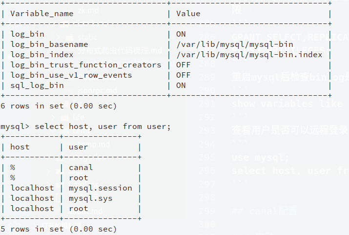
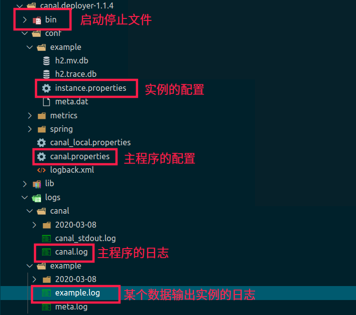
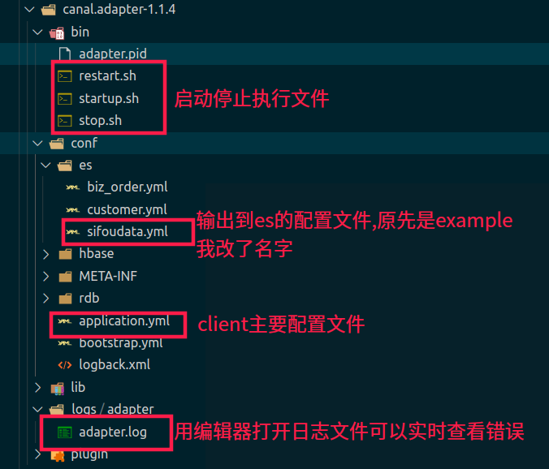
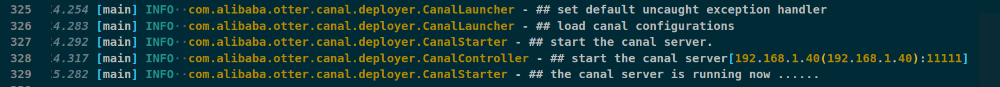
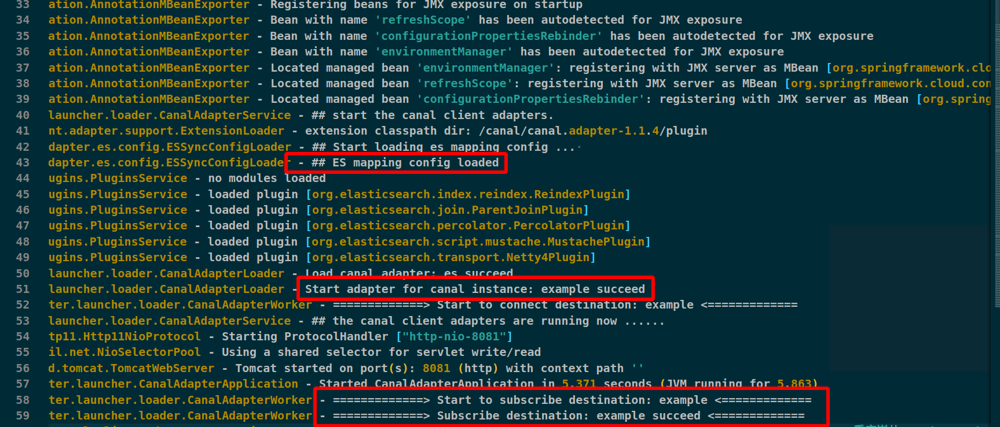
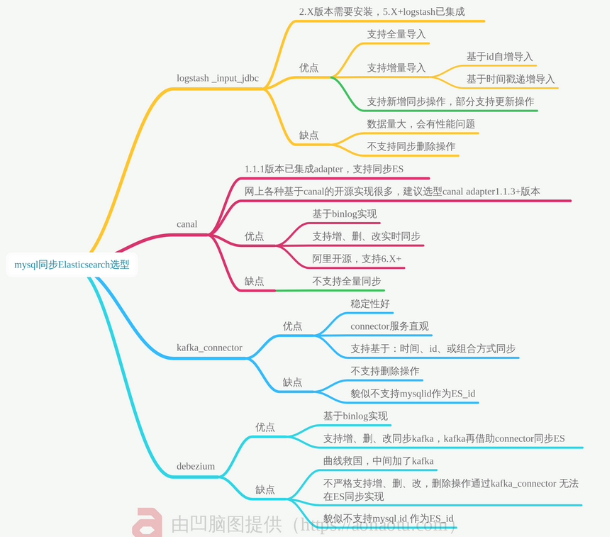

::: tip 主要的方面
canal的用法,将mysql增量同步到ES  
mysql的binlog订阅机制,主从同步的原理  
:::
<!-- more -->

## README
这篇文章是毕业设计改良搜索引擎的一部分，主要解决的问题是mysql和es的同步问题。我的数据库是直接用django item生成的，如果你自己搭建的话，需要先把表建好，字段和类型规定好。  
我用的版本是canal:1.1.4,mysql:5.7,ELK:6.7截至目前。server端支持8+，但是client客户端支持到不知道多少，保险起见我用的mysql5.7(因为用8失败了,用户一直无法登陆上去)，我是用docker直接搭建的ELK，为了方便后期部署也把mysql也放进了这个网络里  
canal需要jdk1.8,在docker里面安装

## ES搭建
用的这个repo,docker-compose可以直接搭建  
`https://github.com/deviantony/docker-elk.git`  
下载好之后有几个地方需要改
1. **所有的密码为changeme的地方改为你自己想要的密码**
2. 修改分配的内存大小,建议ES给2g,logstash给1G
```yml
elasticsearch:
    ...
    environment:
      ES_JAVA_OPTS: "-Xmx2g -Xms2g"
      ...
logstash:
    ...
    environment:
      LS_JAVA_OPTS: "-Xmx1g -Xms1g"

```

::: warning 注意
因为es容器内部是以elasticsearch用户启动进程的，所以在做持久化数据目录挂载的时候，需要将目录权限进行设置，否则会因为没有访问权限而启动失败。elasticsearch的uid是1000，可以建一个uid为1000的用户，然后将目录所有者赋予该用户。  
你要是懒就直接755
:::

3. 禁用付费功能
```yml
#　elasticsearch/config/elasticsearch.yml
  xpack.license.self_generated.type: basic
```
4. 第一层目录下的`.env`中决定版本
5. 修改network分配固定ip


```yml
...
    networks:
      elk: #容器网络上这样配置就可以固定内网ip了
        ipv4_address: 192.168.1.70
...
...
networks:
  elk:
    driver: bridge
    ipam: # 这一行往下是新加的 
      config:
        - subnet: 192.168.1.0/24
```
6. 删掉无用的文件 `.github` `.travis` `.gitattributes` `.travis.yml` `LICENSE` `README.md` `docker-stack.yml`


<details>
  <summary><B><I style="cursor:pointer; color: #0e5870">这里贴出我的 docker-compose.yml</I></B></summary>

```yml

version: '3.2'

services:
  elasticsearch:
    build:
      context: elasticsearch/
      args:
        ELK_VERSION: $ELK_VERSION
    container_name: KGelasticsearch
    volumes:
      - type: bind
        source: ./elasticsearch/config/elasticsearch.yml
        target: /usr/share/elasticsearch/config/elasticsearch.yml
        read_only: true
      - type: volume
        source: elasticsearch
        target: /usr/share/elasticsearch/data
    ports:
      - "9200:9200"
      - "9300:9300"
    environment:
      ES_JAVA_OPTS: "-Xmx2g -Xms2g" # 分配内存
      ELASTIC_PASSWORD: "chamgeme" # 改下ES密码
      # Use single node discovery in order to disable production mode and avoid bootstrap checks
      # see https://www.elastic.co/guide/en/elasticsearch/reference/current/bootstrap-checks.html
      discovery.type: single-node
    networks:
      elk:
        ipv4_address: 192.168.1.10 # 分配ip

  logstash:
    build:
      context: logstash/
      args:
        ELK_VERSION: $ELK_VERSION
    container_name: KGlogstash
    volumes:
      - type: bind
        source: ./logstash/config/logstash.yml
        target: /usr/share/logstash/config/logstash.yml
        read_only: true
      - type: bind
        source: ./logstash/pipeline
        target: /usr/share/logstash/pipeline
        read_only: true
    ports:
      - "5000:5000/tcp"
      - "5000:5000/udp"
      - "9600:9600"
    environment:
      LS_JAVA_OPTS: "-Xmx1g -Xms1g"
    networks:
      elk:
        ipv4_address: 192.168.1.20 # 分配ip
    depends_on:
      - elasticsearch

  kibana:
    build:
      context: kibana/
      args:
        ELK_VERSION: $ELK_VERSION
    container_name: KGkibana
    volumes:
      - type: bind
        source: ./kibana/config/kibana.yml
        target: /usr/share/kibana/config/kibana.yml
        read_only: true
    ports:
      - "5601:5601"
    networks:
      elk:
        ipv4_address: 192.168.1.30 # 分配ip
    depends_on:
      - elasticsearch

  mysql:
    image: mysql:5.7
    container_name: KGsql
    privileged: true
    volumes:
      - /home/ooowl/Documents/DBdata/mysql57/my.cnf:/etc/mysql/my.cnf 
      - /home/ooowl/Documents/DBdata/mysql57/conf.d:/etc/mysql/conf.d 
      - /home/ooowl/Documents/DBdata/mysql57/data:/var/lib/mysql 
      - /home/ooowl/Documents/DBdata/mysql57/logs:/var/log/mysql 
      - /home/ooowl/Documents/DBdata/docker-elk/canal:/canal # 重要:这个目录用来放canal
    ports:
      - "3306:3306"
      - "11112:11112"
    networks:
      elk:
        ipv4_address: 192.168.1.40 # 分配ip
    environment:
      MYSQL_ROOT_PASSWORD: 'changeme'
      MYSQL_USER: 'canal' # 这个参数可以提前创建一个除root外的用户
      MYSQL_PASSWORD: 'canal' # 这个额外用户的密码,一会连接要用到
    command:
      --character-set-server=utf8mb4
      --collation-server=utf8mb4_general_ci
      --explicit_defaults_for_timestamp=true
      --lower_case_table_names=1
      --max_allowed_packet=128M


  redis:
    image: redis
    container_name: KGredis
    privileged: true
    command: redis-server /etc/redis/redis.conf
    volumes:
      - /home/ooowl/Documents/DBdata/redisdata/redis.conf:/etc/redis/redis.conf 
      - /home/ooowl/Documents/DBdata/redisdata/data:/data
      - /home/ooowl/Documents/DBdata/redisdata/logs:/var/log/redis 
    ports:
      - "6379:6379"
    networks:
      elk:
        ipv4_address: 192.168.1.50 # 分配ip

  nginx:
    image: nginx
    container_name: KGnginx
    privileged: true
    volumes:
      - /home/ooowl/Documents/DBdata/nginx/conf:/etc/nginx/conf.d 
      - /home/ooowl/Documents/DBdata/nginx/nginx.conf:/etc/nginx/nginx.conf 
      - /home/ooowl/Documents/DBdata/nginx/html:/usr/share/nginx/html 
      - /home/ooowl/Documents/DBdata/nginx/logs:/var/log/nginx 
      - /home/ooowl/Documents/DBdata/docker-elk/proj:/proj # 以后放项目用
    ports:
      - "80:80"
      - "443:443"
      - "81:81"
    networks:
      elk:
        ipv4_address: 192.168.1.60 # 分配ip

  neo4j:
    image: neo4j
    container_name: KGneo4j
    privileged: true
    volumes:
      - /home/ooowl/Documents/DBdata/neo4j/data:/data 
      - /home/ooowl/Documents/DBdata/neo4j/import:/import 
      - /home/ooowl/Documents/DBdata/neo4j/logs:/logs 
      - /home/ooowl/Documents/DBdata/neo4j/conf:/conf 
      - /home/ooowl/Documents/DBdata/neo4j/plugins:/plugins 
    ports:
      - "7474:7474"
      - "7687:7687"
    networks:
      elk:
        ipv4_address: 192.168.1.70 # 分配ip


networks:
  elk:
    driver: bridge
    ipam: # 分配网络
      config:
        - subnet: 192.168.1.0/24 
volumes: # 默认的数据卷,存放es的数据
  elasticsearch:

```

</details>

最后在docker-compose.yml的目录运行`docker-compose up -d`  
强烈建议安装portainer,好操作一些,如果出错了查看日志`docker logs container_id`
访问各个端口9200,5601,3306,80之类的看看正常吗
## mysql配置

先进入mysql
`docker exec -it 容器name或id /bin/bash`  
进去之后先ping一下看看网络通不通(ping命令需要安装)
### 修改源
你可以在里面直接vim编辑但是需要先下载vim,我用canal那个文件夹,直接在外面写好源放进去,复制过去就可以了  
不细说了,linux基础网上一搜一大把  
更新源的时候会报错因为缺少公钥,先运行两个命令

```shell
apt-key adv --keyserver keyserver.ubuntu.com --recv-keys 3B4FE6ACC0B21F32 && apt-key adv --keyserver keyserver.ubuntu.com --recv-keys 40976EAF437D05B5
cp /etc/apt/sources.list /etc/apt/sources.list.backup && rm /etc/apt/sources.list && cp /canal/sources.list /etc/apt/
apt-get -y update && apt-get -y upgrade
```
直接安装jdk会报错,因为默认少个文件夹手动建立一个

```shell
mkdir -p /usr/share/man/man1
apt-get -y install vim net-tools inetutils-ping openjdk-8-jdk procps 
```
输入java和javac试试行不行
### 开启binlog
修改mysql的配置文件,在docker里面`/etc/mysql/conf.d/docker.cnf`,也可以直接在外面更新
```
# 在[mysqld]下面加入
log-bin=mysql-bin
binlog-format=ROW
server-id=1
```

我先前在创建docker的时候创建过了,就不在创建了.  
授予用户权限和并允许远程登录,因为canal的原理是假装自己是个slave,然后从master那里拿数据再去干别的,所以要给这个用户slave的权限  

```
GRANT SELECT,REPLICATION SLAVE,REPLICATION CLIENT ON *.* TO 'canal'@'%';
FLUSH PRIVILEGES;
```

重启mysql后检查binlog是否正常启动

```
show variables like '%log_bin%';
```
查看用户是否可以远程登录

```
use mysql;
select host, user from user;
```

<div align=center ></div>

mysql就配置完毕了
## canal配置
我是直接把外面一个目录映射到里面去，然后在外面改的配置里面重启软件就可以生效，然后把server,client都放到里面，调试好就可以运行了,你只要保证这玩意能访问ES和mysql就可以  
这里[下载](https://github.com/alibaba/canal/releases),adapter和deployer

<div align=center >

<table border="0">
  <tr>
    <th></th>
    <th></th>
  </tr>

</table>

</div>

### 启动server
进入server的文件夹,bin是执行的目录,conf是配置,我们主要改conf  
1. 主程序的配置不要动,修改实例的配置`instance.properties`
```yml
...
canal.instance.master.address=127.0.0.1:3306 #保证能从这个访问到mysql就可以
...
# canal.instance.tsdb.enable=true #注释掉这个测试数据库
...
canal.instance.dbUsername=canal # 那个用户名
canal.instance.dbPassword=canal #那个密码
...
canal.instance.filter.regex=kg.save_app_saveddata 
# 用正则匹配的库和表,.*//..*意思时是有库所有表,我这里的配置意思的kg库下的save_app_saveddata表,多表同步没搞
...
```
查看那俩日志,出现这样的就对了,不对就照着日志改


**example.log**
```log
2020-03-09 05:06:15.075 [main] WARN  c.a.o.canal.parse.inbound.mysql.dbsync.LogEventConvert - --> init table black filter : 
2020-03-09 05:06:15.206 [destination = example , address = /127.0.0.1:3306 , EventParser] WARN  c.a.o.c.p.inbound.mysql.rds.RdsBinlogEventParserProxy - ---> begin to find start position, it will be long time for reset or first position
2020-03-09 05:06:15.223 [main] INFO  c.a.otter.canal.instance.core.AbstractCanalInstance - start successful....
2020-03-09 05:06:15.235 [destination = example , address = /127.0.0.1:3306 , EventParser] WARN  c.a.o.c.p.inbound.mysql.rds.RdsBinlogEventParserProxy - prepare to find start position just last position
 {"identity":{"slaveId":-1,"sourceAddress":{"address":"localhost","port":3306}},"postion":{"gtid":"","included":false,"journalName":"mysql-bin.000001","position":1184440,"serverId":1,"timestamp":1583729914000}}
2020-03-09 05:06:15.572 [destination = example , address = /127.0.0.1:3306 , EventParser] WARN  c.a.o.c.p.inbound.mysql.rds.RdsBinlogEventParserProxy - ---> find start position successfully, EntryPosition[included=false,journalName=mysql-bin.000001,position=1184440,serverId=1,gtid=,timestamp=1583729914000] cost : 359ms , the next step is binlog dump
```

**canal.log**

<div align=center ></div>

### 启动client
进入client的文件夹,bin是执行的目录,conf是配置,我们主要改conf  
1. 修改`application.yml`  
```yaml
server:
  port: 8081
spring:
  jackson:
    date-format: yyyy-MM-dd HH:mm:ss
    time-zone: GMT+8
    default-property-inclusion: non_null

canal.conf:
  mode: tcp # kafka rocketMQ
  canalServerHost: 192.168.1.40:11111 # 数据库ip,如果你没改过那就是11111端口
#  zookeeperHosts: slave1:2181
#  mqServers: 127.0.0.1:9092 #or rocketmq
#  flatMessage: true
  batchSize: 500
  syncBatchSize: 1000
  retries: 0
  timeout:
  accessKey:
  secretKey:
  srcDataSources:
    defaultDS:
      url: jdbc:mysql://192.168.1.40:3306/kg?useUnicode=true #数据库uel
      username: canal # 那个新的用户名
      password: canal # 那个新的密码
  canalAdapters:
  - instance: example # 就是你server的地址
    groups:
      - groupId: g1
        outerAdapters:
          - name: es
            hosts: 192.168.1.10:9300 # 你的es地址
            properties:
              cluster.name: docker-cluster # 你的es名称,访问9200会有,如果不对会报错
 
```

2. 修改`example.yml`  
实例文件会自动读取,改名也不要紧,他会自动读取所有的yml  
```yaml
dataSourceKey: defaultDS #从 主文件那个数据源读取
destination: example # 对应server的实例的名字
groupId: g1 # 默认就行
esMapping:
  _index: sifoudata # 要插入的索引名称
  _type: _doc
  _id: _id # 这个id就是es的唯一id,如果你想要主键充当id,应该在sql下写明,比如我
  upsert: true
  sql: "select a.id as _id, a.types, a.author_name, a.author_id, a.author_link, a.tags, a.likes, a.favorite, a.release_time, a.article_link, a.title, a.content from save_app_saveddata a"
  commitBatch: 30 

# 对应创建索引的json
# {
#   "mappings": {
#     "_doc": {
#         "properties": {
#           "types": {
#             "type": "keyword"
#           },
#           "author_name": {
#             "type": "keyword"
#           },
#           "author_id": {
#             "type": "keyword"
#           },
#           "author_link": {
#             "type": "keyword"
#           },
#           "tags": {
#             "type": "keyword"
#           },
#           "likes": {
#             "type": "integer"
#           },
#           "favorite": {
#             "type": "integer"
#           },
#           "release_time": {
#             "type": "keyword"
#           },
#           "article_link": {
#             "type": "keyword"
#           },
#           "title": {
#             "type": "text"
#           },
#           "content": {
#             "type": "text"
#           }
#         }
#     }
#   }
# }
```
::: danger
先在ES中创建索引,sql表清空
:::
3. 输出日志表示你成功了 
**adapter.log**

<div align=center ></div>

## 遇到的坑

版本不用我多说,错了不兼容的直接连不上
### 用户名密码错误
```
org.h2.jdbc.JdbcSQLException: Wrong user name or password [28000-196]
```
解决办法:删除`canal.deployer-1.1.4/conf/example/h2.mv.db`重新运行
### 更新机制
基于 row 模式的 binlog 会不会记录变更前、变更后的值呢？

- INSERT:只有变更后的值。
- UPDATE:包含了变更前、变更后的值。
- DELETE:变更前的值
### 选型
<div align=center ></div>

## 引用参考
- [https://www.bilibili.com/video/av82844749](https://www.bilibili.com/video/av82844749)
- [https://segmentfault.com/a/1190000019066098](https://segmentfault.com/a/1190000019066098)
- [https://github.com/alibaba/canal/wiki/Sync-ES](https://github.com/alibaba/canal/wiki/Sync-ES)
- [https://juejin.im/post/5d0dfec56fb9a07ed064bb6f#heading-3](https://juejin.im/post/5d0dfec56fb9a07ed064bb6f#heading-3)
- [https://blog.csdn.net/laoyang360/article/details/88600799#commentBox](https://blog.csdn.net/laoyang360/article/details/88600799#commentBox)
<Valine></Valine>