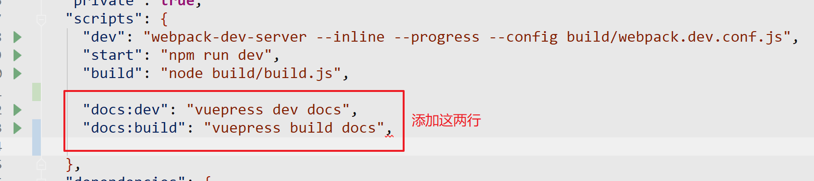
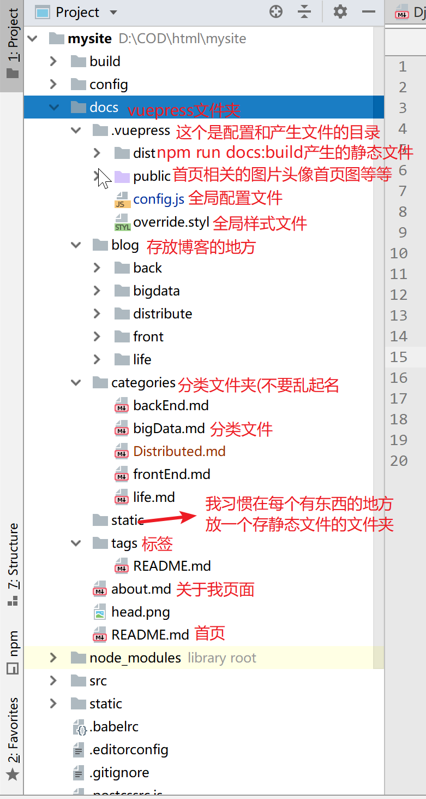

# 这个博客的建设

## vuepress
的解析(个人用到的,可能不全
### 安装
1. 在已有的vue项目中`npm install -D vuepress`--save-dev啥的自己装好，这一不应该都没问题
2. 然后再自己项目下新建一个`docs`文件夹(名字不要乱改，vuepress会读取
3. 官网说的给`package.json`添加
      {
        "scripts": {
          "docs:dev": "vuepress dev docs",
          "docs:build": "vuepress build docs"
        }
      }


      <div align=center>
      </div>
      </br>

4. 在`docs`下新建一个`README.md`,新文件里写上helloworld就好了
5. webstorm里配置一下npm，跑一下，就可以看到helloworld了

现在你能写hellowrld的markdown了，这样外挂在你的项目上就可以为你的项目提供技术支持和广告什么的很方便
### 我用到的vuepress
把官网上的demo扒下来，改文字，改图片，把actionLink改成/about.md
<br/>
在md文件的开头可以配置东西，具体去看vuepress文档
:::danger
开头的选项例如<br/>
title: 这个博客是如何搭建起来的<br/>
冒号后面一定要有空格！不然报错
:::

## 使用主题
vuepress-theme-reco主题的使用
### 目录结构
先给下目录(照着建好就行，以后一直这么用了
这个主题很好用作者<a href='https://me.csdn.net/recoluan'>@午后南杂</a>帮了我很多地方
<div align=center >
</div>
</br>

`npm install vuepress-theme-reco -dev--save`安上
安装完主题之后就可以用了，<a href='https://blog.csdn.net/recoluan/article/details/82962947'>作者的博客</a>里也有说
<br/>
:::danger
categories: frontEnd<br/>
配置这个的时候他读取的是这个文件夹下这个文件的名字而不是文件里的title<br/>
可以直接使用评论系统
:::
### 贴配置
贴一下配置文件
```js


module.exports = {
  theme: 'reco',
  port:9999,
  title: '会走路的三百块',
  description: '年轻人的博客',
  base:'/',
  themeConfig: {

    nav: [
      { text: '分类', items: [
        { text: '后端', link: '/categories/backEnd' },
          { text: '前端', link: '/categories/frontEnd' },
          { text: '大数据', link: '/categories/bigData' },
          { text: '分布式', link: '/categories/Distributed' },
          { text: '日记', link: '/categories/life' }
          ] },
      { text: 'Tags', link: '/tags/' },
      { text: 'about me', link: '/about' },
      { text: '简书', link: 'https://www.jianshu.com/u/04777e91e2ef' },
      { text: 'GitHub', link: 'https://github.com/Castleeee' },

    ],
    valineConfig: {
      appId: 'xxxxxxxxx',// your appId
      appKey: 'xxxxxxxx', // your appKey
    },
    sidebar:'auto',
    logo: '/head.png',
    lastUpdated:'Last Updated',
  },

head: [
    ['link', { rel: 'icon', href: '/logo.ico',type:"image/x-icon" }]
  ],
  searchMaxSuggestions:5
};

官方提供了自定义页面的组件，但如果说想使用很多自定义页面，还不如自己搭建一个vue来的划算

```
<Valine></Valine>