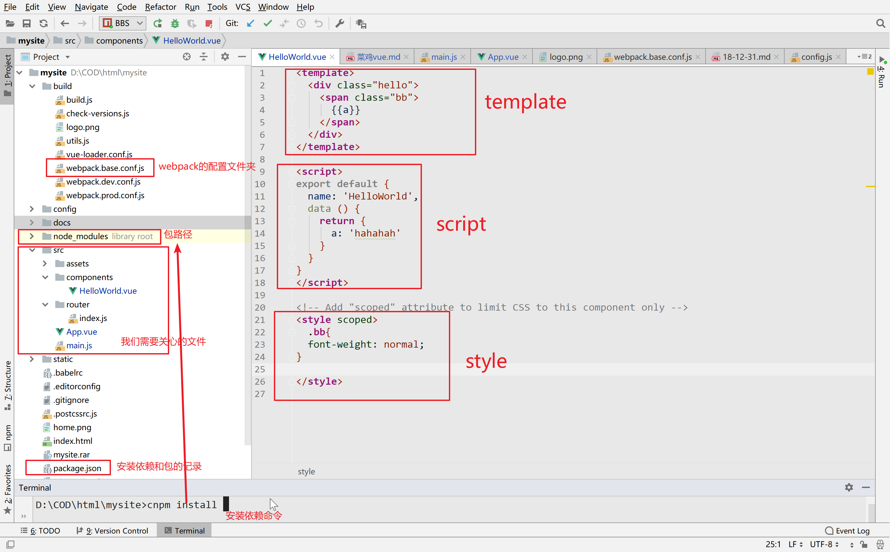
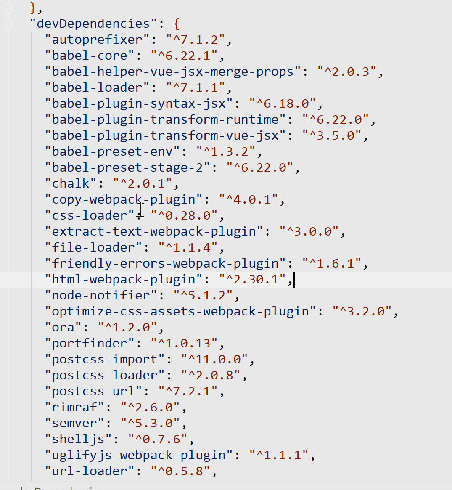

:::tip 一个正在学vue的菜鸡
从头开始啃
:::
<!-- more -->
## vue环境

### 配置环境
Webstorm<br/>
node # 配置path用命令测试node --version成功说明node已经配置成了<br/>
cnpm<a href='https://npm.taobao.org/'>淘宝镜像源</a><br/>
### 常用命令
cnpm install packagename 0.0.1#安装一个第三方的包<br/>
cnpm install#首先cd进project的目录然后直接安装需要的所有依赖<br/>
cnpm outdated#列出所有的过时模块<br/>
cnpm update#升级所有模块<br/>
cnpm  run dev #独立运行前端项目<br/>
cnpm -g cnpm 升级cnpm<br/>
### 安装vue脚手架
- npm install -g @vue/cli&nbsp;&nbsp;&nbsp;&nbsp;//全局安装 vue/cli3<br/>
- vue create hello-world  项目名，最后三个选项选no不启用严格模式<br/>
- cnpm install<br/>
- cnpm run serve<br/>
### 开始使用VUE webpack训练习得基本结构<br/>
cd 进目录文件夹，cnpm init 创建了一个node项目生成package.json<br/>
cnpm i vue vue-router webpack<br/>
cnpm i vue-template-compiler css-loader<br/>

现在已经安装完VUE了配置一下我们的webstorm解释器中选择npm项目 run dev<br/>

## webpack+vue各个文件夹作用
### webpack

#### webpack.base.conf.js
  这是用来解析依赖的，下面的module:{rules:会根据不同的后缀名自己解析，你也可以自定义，最后面可以自定义插件plugin
 <br/>
#### package.json
这是用来记录一些依赖和包版本等等，一般搭建好环境之后就不需要再动了<br/>

#### node_modules
依赖的路径，最常见的就是依赖错误删除掉这个文件夹重新cnpm install一下<br/>
### vue下文件夹的作用
src就是我们要进行编写vue的地方
- assets文件夹是用来存放一些静态文件图片之类的<br/>
- components文件夹是存放被引用的vue组件的地方，你也可以删掉自己新建自定义之类的<br/>
- router下存放的是index.js这个是vue的路由视图，后面我会学到<br/>
- APP.vue跟组件在main.js里面会建立vue实例对象，渲染App.vue和进行执行其他的你自定义动做，通常来说这些动作会对全局产生影响<br/>
- 和src同级的index.html里就是main.js渲染的地方,里面有一个root节点，也就是vue进行mount的节点。
- 一个vue文件由template(也就是一种奇特的html),script(就是js)由vue提供mvvm和其他的库,style定义css


:::warning 注意<br/>
在template下有且仅有一个div(可以带样式),然后所有的布局定义都是这个div的子div<br/>
style加入了scope属性只对本组件生效，虽然方便但据说后面又坑先不要加
:::
## vue实例
这是一个实例，直接vue实例化就行，注意里面的参数<br/>
这个vue实例是动态更新的，在你更i性能a之后他也会更新
```js
var data={a:1};
var vm= new Vue({
  el:'#app',
  data:function () {
    return data

  }

});
console.log(data.a,vm.a);
data.a=3;
console.log(data.a,vm.a);
Object.freeze(data);//冻不住???
data.a=5;
console.log(data.a,vm.a);

```
### 这是vue的生命周期钩子


```js
var data={a:1};
var vm= new Vue({
  el:'#app',
  data:function () {
    return data

  },
beforeCreate:function(){
  data.a=777;
  console.log(data.a,this.a);
}
});
```
:::danger 不要使用=>
官网上说不要使用=>会有奇怪错误  
上面写得有点乱，稍微有点前端基础了之后直接去看vue搭建helloworld新建一个脚手架来玩，转向vuecli3  
下面看看组件再说
:::

<h4>实例和标签属性去看文档吧都找得到</h4>

## 组件

<Valine></Valine>